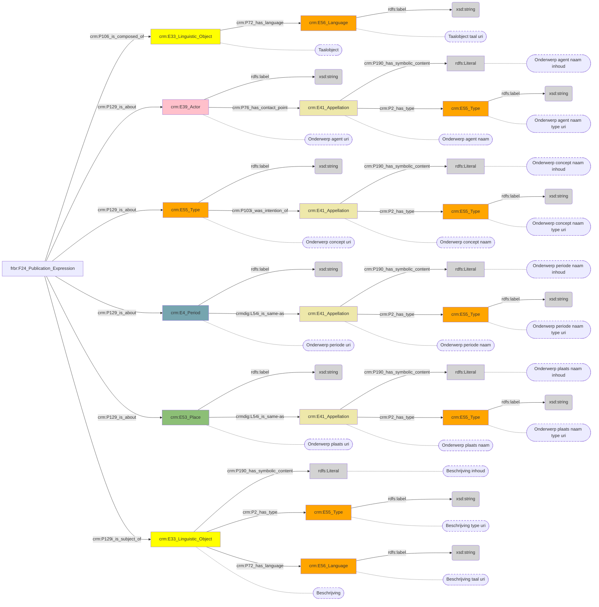

```mermaid
graph LR
4407606c-4bc5-11ee-974d-00163e71351b["crm:E41_Appellation"]-->|"crm:P190_has_symbolic_content"|44076436-4bc5-11ee-974d-00163e71351b(rdfs:Literal)
44076576-4bc5-11ee-974d-00163e71351b["crm:E55_Type"]-->|"rdfs:label"|4407667a-4bc5-11ee-974d-00163e71351b(xsd:string)
6c8322b0-4bc5-11ee-b0c4-00163e71351b["crm:E41_Appellation"]-->|"crm:P190_has_symbolic_content"|6c832602-4bc5-11ee-b0c4-00163e71351b(rdfs:Literal)
6c83272e-4bc5-11ee-b0c4-00163e71351b["crm:E55_Type"]-->|"rdfs:label"|6c83281e-4bc5-11ee-b0c4-00163e71351b(xsd:string)
97cd91ee-4bc5-11ee-974d-00163e71351b["crm:E41_Appellation"]-->|"crm:P190_has_symbolic_content"|97cd9752-4bc5-11ee-974d-00163e71351b(rdfs:Literal)
97cd991e-4bc5-11ee-974d-00163e71351b["crm:E55_Type"]-->|"rdfs:label"|97cd9aa4-4bc5-11ee-974d-00163e71351b(xsd:string)
bd6a9244-4bc5-11ee-b0c4-00163e71351b["crm:E41_Appellation"]-->|"crm:P190_has_symbolic_content"|bd6a9780-4bc5-11ee-b0c4-00163e71351b(rdfs:Literal)
bd6a9942-4bc5-11ee-b0c4-00163e71351b["crm:E55_Type"]-->|"rdfs:label"|bd6a9ab4-4bc5-11ee-b0c4-00163e71351b(xsd:string)
c90b86ee-5160-11ee-a9ac-00163e71351b["crm:E56_Language"]-->|"rdfs:label"|fd568fb6-5160-11ee-a9ac-00163e71351b(xsd:string)
f4349c74-04f9-11ee-9497-96a6d2455259["crm:E39_Actor"]-->|"rdfs:label"|f434b7b8-04f9-11ee-9497-96a6d2455259(xsd:string)
f434a390-04f9-11ee-9497-96a6d2455259["crm:E55_Type"]-->|"rdfs:label"|f434c0e6-04f9-11ee-9497-96a6d2455259(xsd:string)
f434a8ea-04f9-11ee-9497-96a6d2455259["crm:E4_Period"]-->|"rdfs:label"|f434c672-04f9-11ee-9497-96a6d2455259(xsd:string)
f434aa8e-04f9-11ee-9497-96a6d2455259["crm:E53_Place"]-->|"rdfs:label"|f434cd16-04f9-11ee-9497-96a6d2455259(xsd:string)
f434ae4e-04f9-11ee-9497-96a6d2455259["crm:E33_Linguistic_Object"]-->|"crm:P190_has_symbolic_content"|f434d0b8-04f9-11ee-9497-96a6d2455259(rdfs:Literal)
f434d144-04f9-11ee-9497-96a6d2455259["crm:E55_Type"]-->|"rdfs:label"|f434d0fe-04f9-11ee-9497-96a6d2455259(xsd:string)
f434d1d0-04f9-11ee-9497-96a6d2455259["crm:E56_Language"]-->|"rdfs:label"|f434d18a-04f9-11ee-9497-96a6d2455259(xsd:string)
4407606c-4bc5-11ee-974d-00163e71351b["crm:E41_Appellation"]-->|"crm:P2_has_type"|44076576-4bc5-11ee-974d-00163e71351b["crm:E55_Type"]
6c8322b0-4bc5-11ee-b0c4-00163e71351b["crm:E41_Appellation"]-->|"crm:P2_has_type"|6c83272e-4bc5-11ee-b0c4-00163e71351b["crm:E55_Type"]
814b53fc-5160-11ee-bc5c-00163e71351b["crm:E33_Linguistic_Object"]-->|"crm:P72_has_language"|c90b86ee-5160-11ee-a9ac-00163e71351b["crm:E56_Language"]
97cd91ee-4bc5-11ee-974d-00163e71351b["crm:E41_Appellation"]-->|"crm:P2_has_type"|97cd991e-4bc5-11ee-974d-00163e71351b["crm:E55_Type"]
bd6a9244-4bc5-11ee-b0c4-00163e71351b["crm:E41_Appellation"]-->|"crm:P2_has_type"|bd6a9942-4bc5-11ee-b0c4-00163e71351b["crm:E55_Type"]
f4349c74-04f9-11ee-9497-96a6d2455259["crm:E39_Actor"]-->|"crm:P76_has_contact_point"|4407606c-4bc5-11ee-974d-00163e71351b["crm:E41_Appellation"]
f434a390-04f9-11ee-9497-96a6d2455259["crm:E55_Type"]-->|"crm:P103i_was_intention_of"|6c8322b0-4bc5-11ee-b0c4-00163e71351b["crm:E41_Appellation"]
f434a8ea-04f9-11ee-9497-96a6d2455259["crm:E4_Period"]-->|"crmdig:L54i_is_same-as"|97cd91ee-4bc5-11ee-974d-00163e71351b["crm:E41_Appellation"]
f434aa8e-04f9-11ee-9497-96a6d2455259["crm:E53_Place"]-->|"crmdig:L54i_is_same-as"|bd6a9244-4bc5-11ee-b0c4-00163e71351b["crm:E41_Appellation"]
f434ae4e-04f9-11ee-9497-96a6d2455259["crm:E33_Linguistic_Object"]-->|"crm:P2_has_type"|f434d144-04f9-11ee-9497-96a6d2455259["crm:E55_Type"]
f434ae4e-04f9-11ee-9497-96a6d2455259["crm:E33_Linguistic_Object"]-->|"crm:P72_has_language"|f434d1d0-04f9-11ee-9497-96a6d2455259["crm:E56_Language"]
f434b650-04f9-11ee-9497-96a6d2455259["frbr:F24_Publication_Expression"]-->|"crm:P106_is_composed_of"|814b53fc-5160-11ee-bc5c-00163e71351b["crm:E33_Linguistic_Object"]
f434b650-04f9-11ee-9497-96a6d2455259["frbr:F24_Publication_Expression"]-->|"crm:P129_is_about"|f4349c74-04f9-11ee-9497-96a6d2455259["crm:E39_Actor"]
f434b650-04f9-11ee-9497-96a6d2455259["frbr:F24_Publication_Expression"]-->|"crm:P129_is_about"|f434a390-04f9-11ee-9497-96a6d2455259["crm:E55_Type"]
f434b650-04f9-11ee-9497-96a6d2455259["frbr:F24_Publication_Expression"]-->|"crm:P129_is_about"|f434a8ea-04f9-11ee-9497-96a6d2455259["crm:E4_Period"]
f434b650-04f9-11ee-9497-96a6d2455259["frbr:F24_Publication_Expression"]-->|"crm:P129_is_about"|f434aa8e-04f9-11ee-9497-96a6d2455259["crm:E53_Place"]
f434b650-04f9-11ee-9497-96a6d2455259["frbr:F24_Publication_Expression"]-->|"crm:P129i_is_subject_of"|f434ae4e-04f9-11ee-9497-96a6d2455259["crm:E33_Linguistic_Object"]
style 44076436-4bc5-11ee-974d-00163e71351b_s stroke-dasharray: 5
style 44076576-4bc5-11ee-974d-00163e71351b_s stroke-dasharray: 5
style 6c832602-4bc5-11ee-b0c4-00163e71351b_s stroke-dasharray: 5
style 6c83272e-4bc5-11ee-b0c4-00163e71351b_s stroke-dasharray: 5
style c90b86ee-5160-11ee-a9ac-00163e71351b_s stroke-dasharray: 5
style 97cd9752-4bc5-11ee-974d-00163e71351b_s stroke-dasharray: 5
style 97cd991e-4bc5-11ee-974d-00163e71351b_s stroke-dasharray: 5
style bd6a9780-4bc5-11ee-b0c4-00163e71351b_s stroke-dasharray: 5
style bd6a9942-4bc5-11ee-b0c4-00163e71351b_s stroke-dasharray: 5
style 4407606c-4bc5-11ee-974d-00163e71351b_s stroke-dasharray: 5
style 6c8322b0-4bc5-11ee-b0c4-00163e71351b_s stroke-dasharray: 5
style 97cd91ee-4bc5-11ee-974d-00163e71351b_s stroke-dasharray: 5
style bd6a9244-4bc5-11ee-b0c4-00163e71351b_s stroke-dasharray: 5
style f434d0b8-04f9-11ee-9497-96a6d2455259_s stroke-dasharray: 5
style f434d144-04f9-11ee-9497-96a6d2455259_s stroke-dasharray: 5
style f434d1d0-04f9-11ee-9497-96a6d2455259_s stroke-dasharray: 5
style 814b53fc-5160-11ee-bc5c-00163e71351b_s stroke-dasharray: 5
style f4349c74-04f9-11ee-9497-96a6d2455259_s stroke-dasharray: 5
style f434a390-04f9-11ee-9497-96a6d2455259_s stroke-dasharray: 5
style f434a8ea-04f9-11ee-9497-96a6d2455259_s stroke-dasharray: 5
style f434aa8e-04f9-11ee-9497-96a6d2455259_s stroke-dasharray: 5
style f434ae4e-04f9-11ee-9497-96a6d2455259_s stroke-dasharray: 5
44076436-4bc5-11ee-974d-00163e71351b["rdfs:Literal"]-.-44076436-4bc5-11ee-974d-00163e71351b_s(["Onderwerp agent naam inhoud"])
44076576-4bc5-11ee-974d-00163e71351b["crm:E55_Type"]-.-44076576-4bc5-11ee-974d-00163e71351b_s(["Onderwerp agent naam type uri"])
6c832602-4bc5-11ee-b0c4-00163e71351b["rdfs:Literal"]-.-6c832602-4bc5-11ee-b0c4-00163e71351b_s(["Onderwerp concept naam inhoud"])
6c83272e-4bc5-11ee-b0c4-00163e71351b["crm:E55_Type"]-.-6c83272e-4bc5-11ee-b0c4-00163e71351b_s(["Onderwerp concept naam type uri"])
c90b86ee-5160-11ee-a9ac-00163e71351b["crm:E56_Language"]-.-c90b86ee-5160-11ee-a9ac-00163e71351b_s(["Taalobject taal uri"])
97cd9752-4bc5-11ee-974d-00163e71351b["rdfs:Literal"]-.-97cd9752-4bc5-11ee-974d-00163e71351b_s(["Onderwerp periode naam inhoud"])
97cd991e-4bc5-11ee-974d-00163e71351b["crm:E55_Type"]-.-97cd991e-4bc5-11ee-974d-00163e71351b_s(["Onderwerp periode naam type uri"])
bd6a9780-4bc5-11ee-b0c4-00163e71351b["rdfs:Literal"]-.-bd6a9780-4bc5-11ee-b0c4-00163e71351b_s(["Onderwerp plaats naam inhoud"])
bd6a9942-4bc5-11ee-b0c4-00163e71351b["crm:E55_Type"]-.-bd6a9942-4bc5-11ee-b0c4-00163e71351b_s(["Onderwerp plaats naam type uri"])
4407606c-4bc5-11ee-974d-00163e71351b["crm:E41_Appellation"]-.-4407606c-4bc5-11ee-974d-00163e71351b_s(["Onderwerp agent naam"])
6c8322b0-4bc5-11ee-b0c4-00163e71351b["crm:E41_Appellation"]-.-6c8322b0-4bc5-11ee-b0c4-00163e71351b_s(["Onderwerp concept naam"])
97cd91ee-4bc5-11ee-974d-00163e71351b["crm:E41_Appellation"]-.-97cd91ee-4bc5-11ee-974d-00163e71351b_s(["Onderwerp periode naam"])
bd6a9244-4bc5-11ee-b0c4-00163e71351b["crm:E41_Appellation"]-.-bd6a9244-4bc5-11ee-b0c4-00163e71351b_s(["Onderwerp plaats naam"])
f434d0b8-04f9-11ee-9497-96a6d2455259["rdfs:Literal"]-.-f434d0b8-04f9-11ee-9497-96a6d2455259_s(["Beschrijving inhoud"])
f434d144-04f9-11ee-9497-96a6d2455259["crm:E55_Type"]-.-f434d144-04f9-11ee-9497-96a6d2455259_s(["Beschrijving type uri"])
f434d1d0-04f9-11ee-9497-96a6d2455259["crm:E56_Language"]-.-f434d1d0-04f9-11ee-9497-96a6d2455259_s(["Beschrijving taal uri"])
814b53fc-5160-11ee-bc5c-00163e71351b["crm:E33_Linguistic_Object"]-.-814b53fc-5160-11ee-bc5c-00163e71351b_s(["Taalobject"])
f4349c74-04f9-11ee-9497-96a6d2455259["crm:E39_Actor"]-.-f4349c74-04f9-11ee-9497-96a6d2455259_s(["Onderwerp agent uri"])
f434a390-04f9-11ee-9497-96a6d2455259["crm:E55_Type"]-.-f434a390-04f9-11ee-9497-96a6d2455259_s(["Onderwerp concept uri"])
f434a8ea-04f9-11ee-9497-96a6d2455259["crm:E4_Period"]-.-f434a8ea-04f9-11ee-9497-96a6d2455259_s(["Onderwerp periode uri"])
f434aa8e-04f9-11ee-9497-96a6d2455259["crm:E53_Place"]-.-f434aa8e-04f9-11ee-9497-96a6d2455259_s(["Onderwerp plaats uri"])
f434ae4e-04f9-11ee-9497-96a6d2455259["crm:E33_Linguistic_Object"]-.-f434ae4e-04f9-11ee-9497-96a6d2455259_s(["Beschrijving"])
style 4407606c-4bc5-11ee-974d-00163e71351b fill:#EEE8AA
style 44076436-4bc5-11ee-974d-00163e71351b fill:#D3D3D3
style 44076576-4bc5-11ee-974d-00163e71351b fill:#ffa500
style 4407667a-4bc5-11ee-974d-00163e71351b fill:#D3D3D3
style 6c8322b0-4bc5-11ee-b0c4-00163e71351b fill:#EEE8AA
style 6c832602-4bc5-11ee-b0c4-00163e71351b fill:#D3D3D3
style 6c83272e-4bc5-11ee-b0c4-00163e71351b fill:#ffa500
style 6c83281e-4bc5-11ee-b0c4-00163e71351b fill:#D3D3D3
style 814b53fc-5160-11ee-bc5c-00163e71351b fill:#ffff00
style 97cd91ee-4bc5-11ee-974d-00163e71351b fill:#EEE8AA
style 97cd9752-4bc5-11ee-974d-00163e71351b fill:#D3D3D3
style 97cd991e-4bc5-11ee-974d-00163e71351b fill:#ffa500
style 97cd9aa4-4bc5-11ee-974d-00163e71351b fill:#D3D3D3
style bd6a9244-4bc5-11ee-b0c4-00163e71351b fill:#EEE8AA
style bd6a9780-4bc5-11ee-b0c4-00163e71351b fill:#D3D3D3
style bd6a9942-4bc5-11ee-b0c4-00163e71351b fill:#ffa500
style bd6a9ab4-4bc5-11ee-b0c4-00163e71351b fill:#D3D3D3
style c90b86ee-5160-11ee-a9ac-00163e71351b fill:#ffa500
style f4349c74-04f9-11ee-9497-96a6d2455259 fill:#ffc0cb
style f434a390-04f9-11ee-9497-96a6d2455259 fill:#ffa500
style f434a8ea-04f9-11ee-9497-96a6d2455259 fill:#76A5AF
style f434aa8e-04f9-11ee-9497-96a6d2455259 fill:#8CBF76
style f434ae4e-04f9-11ee-9497-96a6d2455259 fill:#ffff00
style f434b7b8-04f9-11ee-9497-96a6d2455259 fill:#D3D3D3
style f434c0e6-04f9-11ee-9497-96a6d2455259 fill:#D3D3D3
style f434c672-04f9-11ee-9497-96a6d2455259 fill:#D3D3D3
style f434cd16-04f9-11ee-9497-96a6d2455259 fill:#D3D3D3
style f434d0b8-04f9-11ee-9497-96a6d2455259 fill:#D3D3D3
style f434d0fe-04f9-11ee-9497-96a6d2455259 fill:#D3D3D3
style f434d144-04f9-11ee-9497-96a6d2455259 fill:#ffa500
style f434d18a-04f9-11ee-9497-96a6d2455259 fill:#D3D3D3
style f434d1d0-04f9-11ee-9497-96a6d2455259 fill:#ffa500
style fd568fb6-5160-11ee-a9ac-00163e71351b fill:#D3D3D3
```
