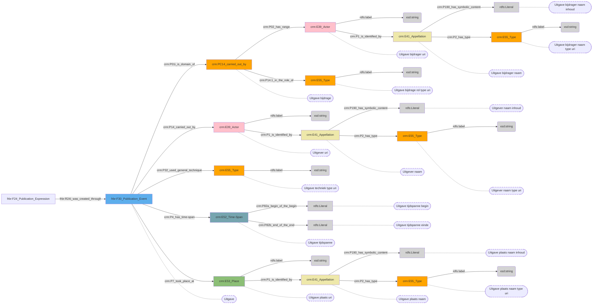

```mermaid
graph LR
8d23ca72-424e-11ee-b0c4-00163e71351b["crm:E41_Appellation"]-->|"crm:P190_has_symbolic_content"|8d23ce14-424e-11ee-b0c4-00163e71351b(rdfs:Literal)
8d23cf40-424e-11ee-b0c4-00163e71351b["crm:E55_Type"]-->|"rdfs:label"|8d23d03a-424e-11ee-b0c4-00163e71351b(xsd:string)
b3d2c494-424d-11ee-974d-00163e71351b["crm:E41_Appellation"]-->|"crm:P190_has_symbolic_content"|b3d2ccbe-424d-11ee-974d-00163e71351b(rdfs:Literal)
b3d2cf84-424d-11ee-974d-00163e71351b["crm:E55_Type"]-->|"rdfs:label"|b3d2d1dc-424d-11ee-974d-00163e71351b(xsd:string)
d77d0958-424e-11ee-b0c4-00163e71351b["crm:E41_Appellation"]-->|"crm:P190_has_symbolic_content"|d77d0d22-424e-11ee-b0c4-00163e71351b(rdfs:Literal)
d77d0e58-424e-11ee-b0c4-00163e71351b["crm:E55_Type"]-->|"rdfs:label"|d77d0f5c-424e-11ee-b0c4-00163e71351b(xsd:string)
f434affc-04f9-11ee-9497-96a6d2455259["crm:E52_Time-Span"]-->|"crm:P82a_begin_of_the_begin"|f434b2ae-04f9-11ee-9497-96a6d2455259(rdfs:Literal)
f434affc-04f9-11ee-9497-96a6d2455259["crm:E52_Time-Span"]-->|"crm:P82b_end_of_the_end"|f434b538-04f9-11ee-9497-96a6d2455259(rdfs:Literal)
f434b2f4-04f9-11ee-9497-96a6d2455259["crm:E55_Type"]-->|"rdfs:label"|f434c55a-04f9-11ee-9497-96a6d2455259(xsd:string)
f434b57e-04f9-11ee-9497-96a6d2455259["crm:E53_Place"]-->|"rdfs:label"|f434b68c-04f9-11ee-9497-96a6d2455259(xsd:string)
f434b5c4-04f9-11ee-9497-96a6d2455259["crm:E39_Actor"]-->|"rdfs:label"|f434ba38-04f9-11ee-9497-96a6d2455259(xsd:string)
f434bac4-04f9-11ee-9497-96a6d2455259["crm:E39_Actor"]-->|"rdfs:label"|f434c514-04f9-11ee-9497-96a6d2455259(xsd:string)
f434cf0a-04f9-11ee-9497-96a6d2455259["crm:E55_Type"]-->|"rdfs:label"|f434d216-04f9-11ee-9497-96a6d2455259(xsd:string)
8d23ca72-424e-11ee-b0c4-00163e71351b["crm:E41_Appellation"]-->|"crm:P2_has_type"|8d23cf40-424e-11ee-b0c4-00163e71351b["crm:E55_Type"]
b3d2c494-424d-11ee-974d-00163e71351b["crm:E41_Appellation"]-->|"crm:P2_has_type"|b3d2cf84-424d-11ee-974d-00163e71351b["crm:E55_Type"]
d77d0958-424e-11ee-b0c4-00163e71351b["crm:E41_Appellation"]-->|"crm:P2_has_type"|d77d0e58-424e-11ee-b0c4-00163e71351b["crm:E55_Type"]
f434a6e2-04f9-11ee-9497-96a6d2455259["frbr:F30_Publication_Event"]-->|"crm:P01i_is_domain_of"|f434b060-04f9-11ee-9497-96a6d2455259["crm:PC14_carried_out_by"]
f434a6e2-04f9-11ee-9497-96a6d2455259["frbr:F30_Publication_Event"]-->|"crm:P14_carried_out_by"|f434bac4-04f9-11ee-9497-96a6d2455259["crm:E39_Actor"]
f434a6e2-04f9-11ee-9497-96a6d2455259["frbr:F30_Publication_Event"]-->|"crm:P32_used_general_technique"|f434cf0a-04f9-11ee-9497-96a6d2455259["crm:E55_Type"]
f434a6e2-04f9-11ee-9497-96a6d2455259["frbr:F30_Publication_Event"]-->|"crm:P4_has_time-span"|f434affc-04f9-11ee-9497-96a6d2455259["crm:E52_Time-Span"]
f434a6e2-04f9-11ee-9497-96a6d2455259["frbr:F30_Publication_Event"]-->|"crm:P7_took_place_at"|f434b57e-04f9-11ee-9497-96a6d2455259["crm:E53_Place"]
f434b060-04f9-11ee-9497-96a6d2455259["crm:PC14_carried_out_by"]-->|"crm:P02_has_range"|f434b5c4-04f9-11ee-9497-96a6d2455259["crm:E39_Actor"]
f434b060-04f9-11ee-9497-96a6d2455259["crm:PC14_carried_out_by"]-->|"crm:P14.1_in_the_role_of"|f434b2f4-04f9-11ee-9497-96a6d2455259["crm:E55_Type"]
f434b57e-04f9-11ee-9497-96a6d2455259["crm:E53_Place"]-->|"crm:P1_is_identified_by"|8d23ca72-424e-11ee-b0c4-00163e71351b["crm:E41_Appellation"]
f434b5c4-04f9-11ee-9497-96a6d2455259["crm:E39_Actor"]-->|"crm:P1_is_identified_by"|d77d0958-424e-11ee-b0c4-00163e71351b["crm:E41_Appellation"]
f434b650-04f9-11ee-9497-96a6d2455259["frbr:F24_Publication_Expression"]-->|"frbr:R24i_was_created_through"|f434a6e2-04f9-11ee-9497-96a6d2455259["frbr:F30_Publication_Event"]
f434bac4-04f9-11ee-9497-96a6d2455259["crm:E39_Actor"]-->|"crm:P1_is_identified_by"|b3d2c494-424d-11ee-974d-00163e71351b["crm:E41_Appellation"]
style 8d23ce14-424e-11ee-b0c4-00163e71351b_s stroke-dasharray: 5
style 8d23cf40-424e-11ee-b0c4-00163e71351b_s stroke-dasharray: 5
style b3d2ccbe-424d-11ee-974d-00163e71351b_s stroke-dasharray: 5
style b3d2cf84-424d-11ee-974d-00163e71351b_s stroke-dasharray: 5
style d77d0d22-424e-11ee-b0c4-00163e71351b_s stroke-dasharray: 5
style d77d0e58-424e-11ee-b0c4-00163e71351b_s stroke-dasharray: 5
style f434b060-04f9-11ee-9497-96a6d2455259_s stroke-dasharray: 5
style f434bac4-04f9-11ee-9497-96a6d2455259_s stroke-dasharray: 5
style f434cf0a-04f9-11ee-9497-96a6d2455259_s stroke-dasharray: 5
style f434affc-04f9-11ee-9497-96a6d2455259_s stroke-dasharray: 5
style f434b57e-04f9-11ee-9497-96a6d2455259_s stroke-dasharray: 5
style f434b2ae-04f9-11ee-9497-96a6d2455259_s stroke-dasharray: 5
style f434b538-04f9-11ee-9497-96a6d2455259_s stroke-dasharray: 5
style f434b5c4-04f9-11ee-9497-96a6d2455259_s stroke-dasharray: 5
style f434b2f4-04f9-11ee-9497-96a6d2455259_s stroke-dasharray: 5
style 8d23ca72-424e-11ee-b0c4-00163e71351b_s stroke-dasharray: 5
style d77d0958-424e-11ee-b0c4-00163e71351b_s stroke-dasharray: 5
style f434a6e2-04f9-11ee-9497-96a6d2455259_s stroke-dasharray: 5
style b3d2c494-424d-11ee-974d-00163e71351b_s stroke-dasharray: 5
8d23ce14-424e-11ee-b0c4-00163e71351b["rdfs:Literal"]-.-8d23ce14-424e-11ee-b0c4-00163e71351b_s(["Uitgave plaats naam inhoud"])
8d23cf40-424e-11ee-b0c4-00163e71351b["crm:E55_Type"]-.-8d23cf40-424e-11ee-b0c4-00163e71351b_s(["Uitgave plaats naam type uri"])
b3d2ccbe-424d-11ee-974d-00163e71351b["rdfs:Literal"]-.-b3d2ccbe-424d-11ee-974d-00163e71351b_s(["Uitgever naam inhoud"])
b3d2cf84-424d-11ee-974d-00163e71351b["crm:E55_Type"]-.-b3d2cf84-424d-11ee-974d-00163e71351b_s(["Uitgever naam type uri"])
d77d0d22-424e-11ee-b0c4-00163e71351b["rdfs:Literal"]-.-d77d0d22-424e-11ee-b0c4-00163e71351b_s(["Uitgave bijdrager naam inhoud"])
d77d0e58-424e-11ee-b0c4-00163e71351b["crm:E55_Type"]-.-d77d0e58-424e-11ee-b0c4-00163e71351b_s(["Uitgave bijdrager naam type uri"])
f434b060-04f9-11ee-9497-96a6d2455259["crm:PC14_carried_out_by"]-.-f434b060-04f9-11ee-9497-96a6d2455259_s(["Uitgave bijdrage"])
f434bac4-04f9-11ee-9497-96a6d2455259["crm:E39_Actor"]-.-f434bac4-04f9-11ee-9497-96a6d2455259_s(["Uitgever uri"])
f434cf0a-04f9-11ee-9497-96a6d2455259["crm:E55_Type"]-.-f434cf0a-04f9-11ee-9497-96a6d2455259_s(["Uitgave techniek type uri"])
f434affc-04f9-11ee-9497-96a6d2455259["crm:E52_Time-Span"]-.-f434affc-04f9-11ee-9497-96a6d2455259_s(["Uitgave tijdspanne"])
f434b57e-04f9-11ee-9497-96a6d2455259["crm:E53_Place"]-.-f434b57e-04f9-11ee-9497-96a6d2455259_s(["Uitgave plaats uri"])
f434b2ae-04f9-11ee-9497-96a6d2455259["rdfs:Literal"]-.-f434b2ae-04f9-11ee-9497-96a6d2455259_s(["Uitgave tijdspanne begin"])
f434b538-04f9-11ee-9497-96a6d2455259["rdfs:Literal"]-.-f434b538-04f9-11ee-9497-96a6d2455259_s(["Uitgave tijdspanne einde"])
f434b5c4-04f9-11ee-9497-96a6d2455259["crm:E39_Actor"]-.-f434b5c4-04f9-11ee-9497-96a6d2455259_s(["Uitgave bijdrager uri"])
f434b2f4-04f9-11ee-9497-96a6d2455259["crm:E55_Type"]-.-f434b2f4-04f9-11ee-9497-96a6d2455259_s(["Uitgave bijdrage rol type uri"])
8d23ca72-424e-11ee-b0c4-00163e71351b["crm:E41_Appellation"]-.-8d23ca72-424e-11ee-b0c4-00163e71351b_s(["Uitgave plaats naam"])
d77d0958-424e-11ee-b0c4-00163e71351b["crm:E41_Appellation"]-.-d77d0958-424e-11ee-b0c4-00163e71351b_s(["Uitgave bijdrager naam"])
f434a6e2-04f9-11ee-9497-96a6d2455259["frbr:F30_Publication_Event"]-.-f434a6e2-04f9-11ee-9497-96a6d2455259_s(["Uitgave"])
b3d2c494-424d-11ee-974d-00163e71351b["crm:E41_Appellation"]-.-b3d2c494-424d-11ee-974d-00163e71351b_s(["Uitgever naam"])
style 8d23ca72-424e-11ee-b0c4-00163e71351b fill:#EEE8AA
style 8d23ce14-424e-11ee-b0c4-00163e71351b fill:#D3D3D3
style 8d23cf40-424e-11ee-b0c4-00163e71351b fill:#ffa500
style 8d23d03a-424e-11ee-b0c4-00163e71351b fill:#D3D3D3
style b3d2c494-424d-11ee-974d-00163e71351b fill:#EEE8AA
style b3d2ccbe-424d-11ee-974d-00163e71351b fill:#D3D3D3
style b3d2cf84-424d-11ee-974d-00163e71351b fill:#ffa500
style b3d2d1dc-424d-11ee-974d-00163e71351b fill:#D3D3D3
style d77d0958-424e-11ee-b0c4-00163e71351b fill:#EEE8AA
style d77d0d22-424e-11ee-b0c4-00163e71351b fill:#D3D3D3
style d77d0e58-424e-11ee-b0c4-00163e71351b fill:#ffa500
style d77d0f5c-424e-11ee-b0c4-00163e71351b fill:#D3D3D3
style f434a6e2-04f9-11ee-9497-96a6d2455259 fill:#5DAEEC
style f434affc-04f9-11ee-9497-96a6d2455259 fill:#76A5AF
style f434b060-04f9-11ee-9497-96a6d2455259 fill:#ffa500
style f434b2ae-04f9-11ee-9497-96a6d2455259 fill:#D3D3D3
style f434b2f4-04f9-11ee-9497-96a6d2455259 fill:#ffa500
style f434b538-04f9-11ee-9497-96a6d2455259 fill:#D3D3D3
style f434b57e-04f9-11ee-9497-96a6d2455259 fill:#8CBF76
style f434b5c4-04f9-11ee-9497-96a6d2455259 fill:#ffc0cb
style f434b68c-04f9-11ee-9497-96a6d2455259 fill:#D3D3D3
style f434ba38-04f9-11ee-9497-96a6d2455259 fill:#D3D3D3
style f434bac4-04f9-11ee-9497-96a6d2455259 fill:#ffc0cb
style f434c514-04f9-11ee-9497-96a6d2455259 fill:#D3D3D3
style f434c55a-04f9-11ee-9497-96a6d2455259 fill:#D3D3D3
style f434cf0a-04f9-11ee-9497-96a6d2455259 fill:#ffa500
style f434d216-04f9-11ee-9497-96a6d2455259 fill:#D3D3D3
```
