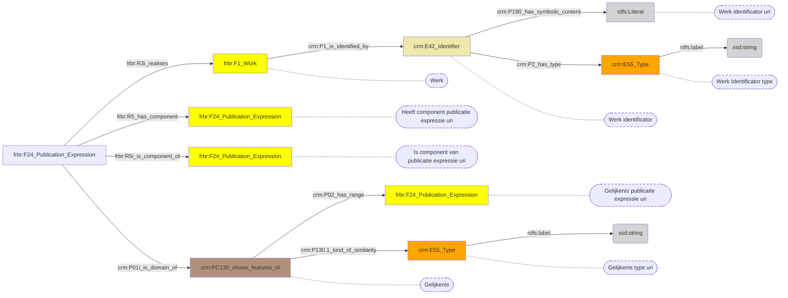

```mermaid
graph LR
109f3b58-4578-11ee-974d-00163e71351b["crm:E55_Type"]-->|"rdfs:label"|638d4caa-4bcd-11ee-bc5c-00163e71351b(xsd:string)
f434b722-04f9-11ee-9497-96a6d2455259["crm:E42_Identifier"]-->|"crm:P190_has_symbolic_content"|f434ba7e-04f9-11ee-9497-96a6d2455259(rdfs:Literal)
f434c050-04f9-11ee-9497-96a6d2455259["crm:E55_Type"]-->|"rdfs:label"|f434ca0a-04f9-11ee-9497-96a6d2455259(xsd:string)
d5d22846-4577-11ee-a9ac-00163e71351b["crm:PC130_shows_features_of"]-->|"crm:P02_has_range"|f118c11e-4577-11ee-a9ac-00163e71351b["frbr:F24_Publication_Expression"]
d5d22846-4577-11ee-a9ac-00163e71351b["crm:PC130_shows_features_of"]-->|"crm:P130.1_kind_of_similarity"|109f3b58-4578-11ee-974d-00163e71351b["crm:E55_Type"]
f4349760-04f9-11ee-9497-96a6d2455259["frbr:F1_Work"]-->|"crm:P1_is_identified_by"|f434b722-04f9-11ee-9497-96a6d2455259["crm:E42_Identifier"]
f434b650-04f9-11ee-9497-96a6d2455259["frbr:F24_Publication_Expression"]-->|"frbr:R3i_realises"|f4349760-04f9-11ee-9497-96a6d2455259["frbr:F1_Work"]
f434b650-04f9-11ee-9497-96a6d2455259["frbr:F24_Publication_Expression"]-->|"frbr:R5_has_component"|f434a534-04f9-11ee-9497-96a6d2455259["frbr:F24_Publication_Expression"]
f434b650-04f9-11ee-9497-96a6d2455259["frbr:F24_Publication_Expression"]-->|"frbr:R5i_is_component_of"|f4348e1e-04f9-11ee-9497-96a6d2455259["frbr:F24_Publication_Expression"]
f434b650-04f9-11ee-9497-96a6d2455259["frbr:F24_Publication_Expression"]-->|"crm:P01i_is_domain_of"|d5d22846-4577-11ee-a9ac-00163e71351b["crm:PC130_shows_features_of"]
f434b722-04f9-11ee-9497-96a6d2455259["crm:E42_Identifier"]-->|"crm:P2_has_type"|f434c050-04f9-11ee-9497-96a6d2455259["crm:E55_Type"]
style f118c11e-4577-11ee-a9ac-00163e71351b_s stroke-dasharray: 5
style 109f3b58-4578-11ee-974d-00163e71351b_s stroke-dasharray: 5
style f434b722-04f9-11ee-9497-96a6d2455259_s stroke-dasharray: 5
style f4349760-04f9-11ee-9497-96a6d2455259_s stroke-dasharray: 5
style f434a534-04f9-11ee-9497-96a6d2455259_s stroke-dasharray: 5
style f4348e1e-04f9-11ee-9497-96a6d2455259_s stroke-dasharray: 5
style d5d22846-4577-11ee-a9ac-00163e71351b_s stroke-dasharray: 5
style f434ba7e-04f9-11ee-9497-96a6d2455259_s stroke-dasharray: 5
style f434c050-04f9-11ee-9497-96a6d2455259_s stroke-dasharray: 5
f118c11e-4577-11ee-a9ac-00163e71351b["frbr:F24_Publication_Expression"]-.-f118c11e-4577-11ee-a9ac-00163e71351b_s(["Gelijkenis publicatie expressie uri"])
109f3b58-4578-11ee-974d-00163e71351b["crm:E55_Type"]-.-109f3b58-4578-11ee-974d-00163e71351b_s(["Gelijkenis type uri"])
f434b722-04f9-11ee-9497-96a6d2455259["crm:E42_Identifier"]-.-f434b722-04f9-11ee-9497-96a6d2455259_s(["Werk identificator"])
f4349760-04f9-11ee-9497-96a6d2455259["frbr:F1_Work"]-.-f4349760-04f9-11ee-9497-96a6d2455259_s(["Werk"])
f434a534-04f9-11ee-9497-96a6d2455259["frbr:F24_Publication_Expression"]-.-f434a534-04f9-11ee-9497-96a6d2455259_s(["Heeft component publicatie expressie uri"])
f4348e1e-04f9-11ee-9497-96a6d2455259["frbr:F24_Publication_Expression"]-.-f4348e1e-04f9-11ee-9497-96a6d2455259_s(["Is component van publicatie expressie uri"])
d5d22846-4577-11ee-a9ac-00163e71351b["crm:PC130_shows_features_of"]-.-d5d22846-4577-11ee-a9ac-00163e71351b_s(["Gelijkenis"])
f434ba7e-04f9-11ee-9497-96a6d2455259["rdfs:Literal"]-.-f434ba7e-04f9-11ee-9497-96a6d2455259_s(["Werk identificator uri"])
f434c050-04f9-11ee-9497-96a6d2455259["crm:E55_Type"]-.-f434c050-04f9-11ee-9497-96a6d2455259_s(["Werk Identificator type"])
style 109f3b58-4578-11ee-974d-00163e71351b fill:#ffa500
style 638d4caa-4bcd-11ee-bc5c-00163e71351b fill:#D3D3D3
style d5d22846-4577-11ee-a9ac-00163e71351b fill:#B0927A
style f118c11e-4577-11ee-a9ac-00163e71351b fill:#ffff00
style f4348e1e-04f9-11ee-9497-96a6d2455259 fill:#ffff00
style f4349760-04f9-11ee-9497-96a6d2455259 fill:#ffff00
style f434a534-04f9-11ee-9497-96a6d2455259 fill:#ffff00
style f434b722-04f9-11ee-9497-96a6d2455259 fill:#EEE8AA
style f434ba7e-04f9-11ee-9497-96a6d2455259 fill:#D3D3D3
style f434c050-04f9-11ee-9497-96a6d2455259 fill:#ffa500
style f434ca0a-04f9-11ee-9497-96a6d2455259 fill:#D3D3D3
```
