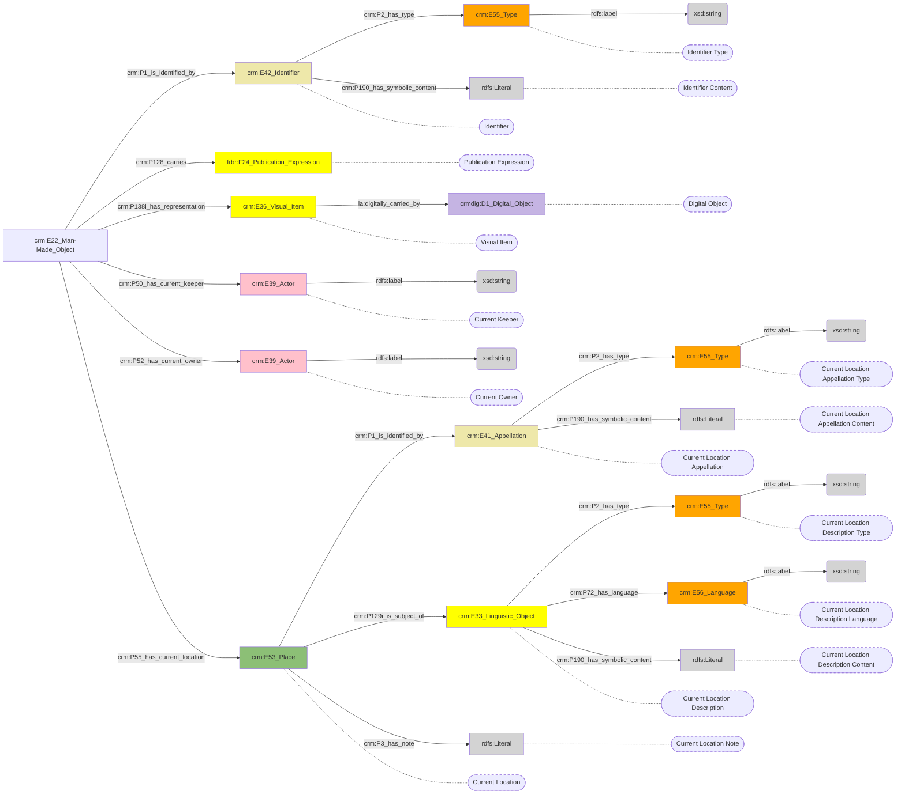

```mermaid
graph LR
099f196c-df80-11ed-9232-00163e71351b["crm:E22_Man-Made_Object"]-->|"crm:P1_is_identified_by"|31fafa48-df80-11ed-9064-00163e71351b["crm:E42_Identifier"]
099f196c-df80-11ed-9232-00163e71351b["crm:E22_Man-Made_Object"]-->|"crm:P128_carries"|0e6665b8-e435-11ed-9655-00163e71351b["frbr:F24_Publication_Expression"]
099f196c-df80-11ed-9232-00163e71351b["crm:E22_Man-Made_Object"]-->|"crm:P138i_has_representation"|643c66b8-df80-11ed-9655-00163e71351b["crm:E36_Visual_Item"]
099f196c-df80-11ed-9232-00163e71351b["crm:E22_Man-Made_Object"]-->|"crm:P50_has_current_keeper"|4cf1af0e-df80-11ed-9655-00163e71351b["crm:E39_Actor"]
099f196c-df80-11ed-9232-00163e71351b["crm:E22_Man-Made_Object"]-->|"crm:P52_has_current_owner"|512ffd00-df80-11ed-9064-00163e71351b["crm:E39_Actor"]
099f196c-df80-11ed-9232-00163e71351b["crm:E22_Man-Made_Object"]-->|"crm:P55_has_current_location"|3d7e5e70-ed7f-11ed-9064-00163e71351b["crm:E53_Place"]
0c435b50-4bbf-11ee-a9ac-00163e71351b["crm:E41_Appellation"]-->|"crm:P2_has_type"|0c4360a0-4bbf-11ee-a9ac-00163e71351b["crm:E55_Type"]
31fafa48-df80-11ed-9064-00163e71351b["crm:E42_Identifier"]-->|"crm:P2_has_type"|31fb00ec-df80-11ed-9064-00163e71351b["crm:E55_Type"]
3d7e5e70-ed7f-11ed-9064-00163e71351b["crm:E53_Place"]-->|"crm:P1_is_identified_by"|0c435b50-4bbf-11ee-a9ac-00163e71351b["crm:E41_Appellation"]
3d7e5e70-ed7f-11ed-9064-00163e71351b["crm:E53_Place"]-->|"crm:P129i_is_subject_of"|652f9800-4bbf-11ee-b0c4-00163e71351b["crm:E33_Linguistic_Object"]
643c66b8-df80-11ed-9655-00163e71351b["crm:E36_Visual_Item"]-->|"la:digitally_carried_by"|643c6a00-df80-11ed-9655-00163e71351b["crmdig:D1_Digital_Object"]
652f9800-4bbf-11ee-b0c4-00163e71351b["crm:E33_Linguistic_Object"]-->|"crm:P2_has_type"|652f9dc8-4bbf-11ee-b0c4-00163e71351b["crm:E55_Type"]
652f9800-4bbf-11ee-b0c4-00163e71351b["crm:E33_Linguistic_Object"]-->|"crm:P72_has_language"|652f9f9e-4bbf-11ee-b0c4-00163e71351b["crm:E56_Language"]
0c435b50-4bbf-11ee-a9ac-00163e71351b["crm:E41_Appellation"]-->|"crm:P190_has_symbolic_content"|0c435f60-4bbf-11ee-a9ac-00163e71351b(rdfs:Literal)
0c4360a0-4bbf-11ee-a9ac-00163e71351b["crm:E55_Type"]-->|"rdfs:label"|0c43619a-4bbf-11ee-a9ac-00163e71351b(xsd:string)
31fafa48-df80-11ed-9064-00163e71351b["crm:E42_Identifier"]-->|"crm:P190_has_symbolic_content"|31faff2a-df80-11ed-9064-00163e71351b(rdfs:Literal)
31fb00ec-df80-11ed-9064-00163e71351b["crm:E55_Type"]-->|"rdfs:label"|31fb051a-df80-11ed-9064-00163e71351b(xsd:string)
3d7e5e70-ed7f-11ed-9064-00163e71351b["crm:E53_Place"]-->|"crm:P3_has_note"|3d7e632a-ed7f-11ed-9064-00163e71351b(rdfs:Literal)
4cf1af0e-df80-11ed-9655-00163e71351b["crm:E39_Actor"]-->|"rdfs:label"|4cf1b3a0-df80-11ed-9655-00163e71351b(xsd:string)
512ffd00-df80-11ed-9064-00163e71351b["crm:E39_Actor"]-->|"rdfs:label"|513001c4-df80-11ed-9064-00163e71351b(xsd:string)
652f9800-4bbf-11ee-b0c4-00163e71351b["crm:E33_Linguistic_Object"]-->|"crm:P190_has_symbolic_content"|652f9b98-4bbf-11ee-b0c4-00163e71351b(rdfs:Literal)
652f9dc8-4bbf-11ee-b0c4-00163e71351b["crm:E55_Type"]-->|"rdfs:label"|652f9cce-4bbf-11ee-b0c4-00163e71351b(xsd:string)
652f9f9e-4bbf-11ee-b0c4-00163e71351b["crm:E56_Language"]-->|"rdfs:label"|652f9eb8-4bbf-11ee-b0c4-00163e71351b(xsd:string)
31fafa48-df80-11ed-9064-00163e71351b["crm:E42_Identifier"]-.-31fafa48-df80-11ed-9064-00163e71351b_s(["Identifier"])
0e6665b8-e435-11ed-9655-00163e71351b["frbr:F24_Publication_Expression"]-.-0e6665b8-e435-11ed-9655-00163e71351b_s(["Publication Expression"])
643c66b8-df80-11ed-9655-00163e71351b["crm:E36_Visual_Item"]-.-643c66b8-df80-11ed-9655-00163e71351b_s(["Visual Item"])
4cf1af0e-df80-11ed-9655-00163e71351b["crm:E39_Actor"]-.-4cf1af0e-df80-11ed-9655-00163e71351b_s(["Current Keeper"])
512ffd00-df80-11ed-9064-00163e71351b["crm:E39_Actor"]-.-512ffd00-df80-11ed-9064-00163e71351b_s(["Current Owner"])
3d7e5e70-ed7f-11ed-9064-00163e71351b["crm:E53_Place"]-.-3d7e5e70-ed7f-11ed-9064-00163e71351b_s(["Current Location"])
0c435f60-4bbf-11ee-a9ac-00163e71351b["rdfs:Literal"]-.-0c435f60-4bbf-11ee-a9ac-00163e71351b_s(["Current Location Appellation Content"])
0c4360a0-4bbf-11ee-a9ac-00163e71351b["crm:E55_Type"]-.-0c4360a0-4bbf-11ee-a9ac-00163e71351b_s(["Current Location Appellation Type"])
31faff2a-df80-11ed-9064-00163e71351b["rdfs:Literal"]-.-31faff2a-df80-11ed-9064-00163e71351b_s(["Identifier Content"])
31fb00ec-df80-11ed-9064-00163e71351b["crm:E55_Type"]-.-31fb00ec-df80-11ed-9064-00163e71351b_s(["Identifier Type"])
0c435b50-4bbf-11ee-a9ac-00163e71351b["crm:E41_Appellation"]-.-0c435b50-4bbf-11ee-a9ac-00163e71351b_s(["Current Location Appellation"])
652f9800-4bbf-11ee-b0c4-00163e71351b["crm:E33_Linguistic_Object"]-.-652f9800-4bbf-11ee-b0c4-00163e71351b_s(["Current Location Description"])
3d7e632a-ed7f-11ed-9064-00163e71351b["rdfs:Literal"]-.-3d7e632a-ed7f-11ed-9064-00163e71351b_s(["Current Location Note"])
643c6a00-df80-11ed-9655-00163e71351b["crmdig:D1_Digital_Object"]-.-643c6a00-df80-11ed-9655-00163e71351b_s(["Digital Object"])
652f9b98-4bbf-11ee-b0c4-00163e71351b["rdfs:Literal"]-.-652f9b98-4bbf-11ee-b0c4-00163e71351b_s(["Current Location Description Content"])
652f9dc8-4bbf-11ee-b0c4-00163e71351b["crm:E55_Type"]-.-652f9dc8-4bbf-11ee-b0c4-00163e71351b_s(["Current Location Description Type"])
652f9f9e-4bbf-11ee-b0c4-00163e71351b["crm:E56_Language"]-.-652f9f9e-4bbf-11ee-b0c4-00163e71351b_s(["Current Location Description Language"])
style 31fafa48-df80-11ed-9064-00163e71351b_s stroke-dasharray: 5
style 0e6665b8-e435-11ed-9655-00163e71351b_s stroke-dasharray: 5
style 643c66b8-df80-11ed-9655-00163e71351b_s stroke-dasharray: 5
style 4cf1af0e-df80-11ed-9655-00163e71351b_s stroke-dasharray: 5
style 512ffd00-df80-11ed-9064-00163e71351b_s stroke-dasharray: 5
style 3d7e5e70-ed7f-11ed-9064-00163e71351b_s stroke-dasharray: 5
style 0c435f60-4bbf-11ee-a9ac-00163e71351b_s stroke-dasharray: 5
style 0c4360a0-4bbf-11ee-a9ac-00163e71351b_s stroke-dasharray: 5
style 31faff2a-df80-11ed-9064-00163e71351b_s stroke-dasharray: 5
style 31fb00ec-df80-11ed-9064-00163e71351b_s stroke-dasharray: 5
style 0c435b50-4bbf-11ee-a9ac-00163e71351b_s stroke-dasharray: 5
style 652f9800-4bbf-11ee-b0c4-00163e71351b_s stroke-dasharray: 5
style 3d7e632a-ed7f-11ed-9064-00163e71351b_s stroke-dasharray: 5
style 643c6a00-df80-11ed-9655-00163e71351b_s stroke-dasharray: 5
style 652f9b98-4bbf-11ee-b0c4-00163e71351b_s stroke-dasharray: 5
style 652f9dc8-4bbf-11ee-b0c4-00163e71351b_s stroke-dasharray: 5
style 652f9f9e-4bbf-11ee-b0c4-00163e71351b_s stroke-dasharray: 5
style 0c435b50-4bbf-11ee-a9ac-00163e71351b fill:#EEE8AA
style 0c435f60-4bbf-11ee-a9ac-00163e71351b fill:#D3D3D3
style 0c4360a0-4bbf-11ee-a9ac-00163e71351b fill:#ffa500
style 0c43619a-4bbf-11ee-a9ac-00163e71351b fill:#D3D3D3
style 0e6665b8-e435-11ed-9655-00163e71351b fill:#ffff00
style 31fafa48-df80-11ed-9064-00163e71351b fill:#EEE8AA
style 31faff2a-df80-11ed-9064-00163e71351b fill:#D3D3D3
style 31fb00ec-df80-11ed-9064-00163e71351b fill:#ffa500
style 31fb051a-df80-11ed-9064-00163e71351b fill:#D3D3D3
style 3d7e5e70-ed7f-11ed-9064-00163e71351b fill:#8CBF76
style 3d7e632a-ed7f-11ed-9064-00163e71351b fill:#D3D3D3
style 4cf1af0e-df80-11ed-9655-00163e71351b fill:#ffc0cb
style 4cf1b3a0-df80-11ed-9655-00163e71351b fill:#D3D3D3
style 512ffd00-df80-11ed-9064-00163e71351b fill:#ffc0cb
style 513001c4-df80-11ed-9064-00163e71351b fill:#D3D3D3
style 643c66b8-df80-11ed-9655-00163e71351b fill:#ffff00
style 643c6a00-df80-11ed-9655-00163e71351b fill:#C5B4E3
style 652f9800-4bbf-11ee-b0c4-00163e71351b fill:#ffff00
style 652f9b98-4bbf-11ee-b0c4-00163e71351b fill:#D3D3D3
style 652f9cce-4bbf-11ee-b0c4-00163e71351b fill:#D3D3D3
style 652f9dc8-4bbf-11ee-b0c4-00163e71351b fill:#ffa500
style 652f9eb8-4bbf-11ee-b0c4-00163e71351b fill:#D3D3D3
style 652f9f9e-4bbf-11ee-b0c4-00163e71351b fill:#ffa500
```
