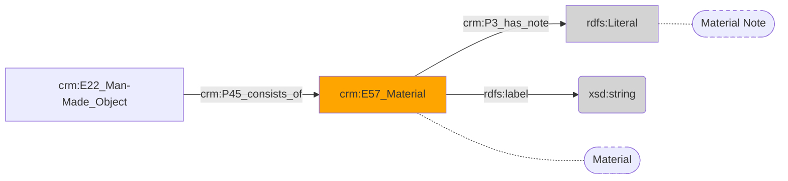

```mermaid
graph LR
099f196c-df80-11ed-9232-00163e71351b["crm:E22_Man-Made_Object"]-->|"crm:P45_consists_of"|97ac7060-4bbe-11ee-a9ac-00163e71351b["crm:E57_Material"]
97ac7060-4bbe-11ee-a9ac-00163e71351b["crm:E57_Material"]-->|"crm:P3_has_note"|97ac7420-4bbe-11ee-a9ac-00163e71351b(rdfs:Literal)
97ac7060-4bbe-11ee-a9ac-00163e71351b["crm:E57_Material"]-->|"rdfs:label"|97ac7556-4bbe-11ee-a9ac-00163e71351b(xsd:string)
97ac7060-4bbe-11ee-a9ac-00163e71351b["crm:E57_Material"]-.-97ac7060-4bbe-11ee-a9ac-00163e71351b_s(["Material"])
97ac7420-4bbe-11ee-a9ac-00163e71351b["rdfs:Literal"]-.-97ac7420-4bbe-11ee-a9ac-00163e71351b_s(["Material Note"])
style 97ac7060-4bbe-11ee-a9ac-00163e71351b_s stroke-dasharray: 5
style 97ac7420-4bbe-11ee-a9ac-00163e71351b_s stroke-dasharray: 5
style 97ac7060-4bbe-11ee-a9ac-00163e71351b fill:#ffa500
style 97ac7420-4bbe-11ee-a9ac-00163e71351b fill:#D3D3D3
style 97ac7556-4bbe-11ee-a9ac-00163e71351b fill:#D3D3D3
```
