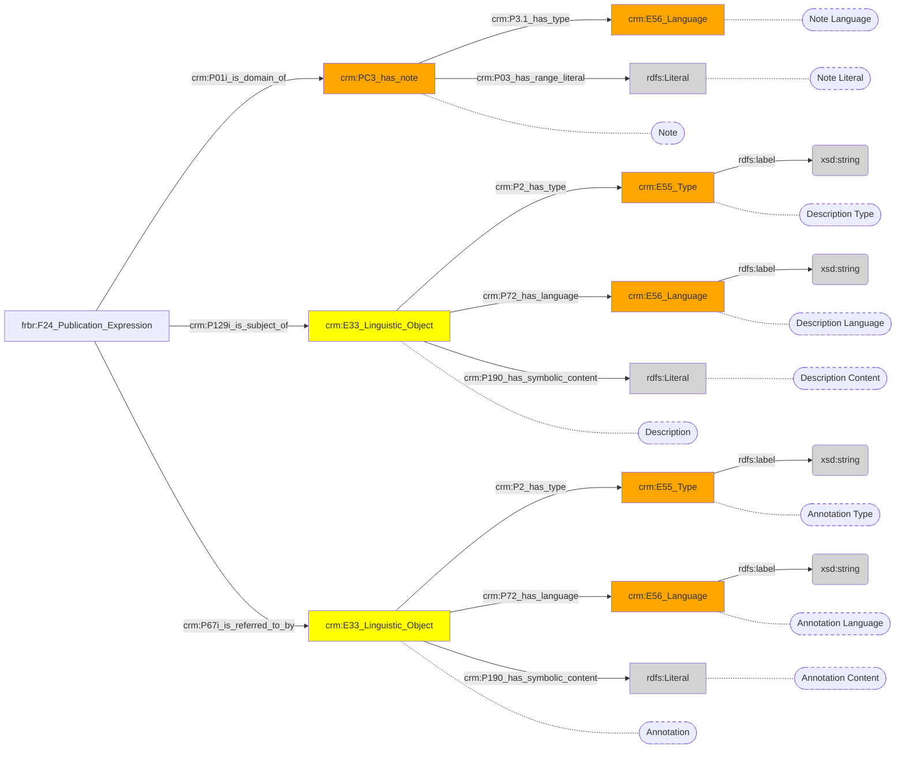

```mermaid
graph LR
dbcba886-1713-11ee-a9ac-00163e71351b["crm:PC3_has_note"]-->|"crm:P3.1_has_type"|c2889f04-1714-11ee-b0c4-00163e71351b["crm:E56_Language"]
f434ac6e-04f9-11ee-9497-96a6d2455259["crm:E33_Linguistic_Object"]-->|"crm:P2_has_type"|f434cf50-04f9-11ee-9497-96a6d2455259["crm:E55_Type"]
f434ac6e-04f9-11ee-9497-96a6d2455259["crm:E33_Linguistic_Object"]-->|"crm:P72_has_language"|f434cf96-04f9-11ee-9497-96a6d2455259["crm:E56_Language"]
f434ae4e-04f9-11ee-9497-96a6d2455259["crm:E33_Linguistic_Object"]-->|"crm:P2_has_type"|f434d144-04f9-11ee-9497-96a6d2455259["crm:E55_Type"]
f434ae4e-04f9-11ee-9497-96a6d2455259["crm:E33_Linguistic_Object"]-->|"crm:P72_has_language"|f434d1d0-04f9-11ee-9497-96a6d2455259["crm:E56_Language"]
f434b650-04f9-11ee-9497-96a6d2455259["frbr:F24_Publication_Expression"]-->|"crm:P01i_is_domain_of"|dbcba886-1713-11ee-a9ac-00163e71351b["crm:PC3_has_note"]
f434b650-04f9-11ee-9497-96a6d2455259["frbr:F24_Publication_Expression"]-->|"crm:P129i_is_subject_of"|f434ae4e-04f9-11ee-9497-96a6d2455259["crm:E33_Linguistic_Object"]
f434b650-04f9-11ee-9497-96a6d2455259["frbr:F24_Publication_Expression"]-->|"crm:P67i_is_referred_to_by"|f434ac6e-04f9-11ee-9497-96a6d2455259["crm:E33_Linguistic_Object"]
dbcba886-1713-11ee-a9ac-00163e71351b["crm:PC3_has_note"]-->|"crm:P03_has_range_literal"|a01734d0-1714-11ee-a9ac-00163e71351b(rdfs:Literal)
f434ac6e-04f9-11ee-9497-96a6d2455259["crm:E33_Linguistic_Object"]-->|"crm:P190_has_symbolic_content"|f434cfdc-04f9-11ee-9497-96a6d2455259(rdfs:Literal)
f434ae4e-04f9-11ee-9497-96a6d2455259["crm:E33_Linguistic_Object"]-->|"crm:P190_has_symbolic_content"|f434d0b8-04f9-11ee-9497-96a6d2455259(rdfs:Literal)
f434cf50-04f9-11ee-9497-96a6d2455259["crm:E55_Type"]-->|"rdfs:label"|f434d072-04f9-11ee-9497-96a6d2455259(xsd:string)
f434cf96-04f9-11ee-9497-96a6d2455259["crm:E56_Language"]-->|"rdfs:label"|f434d022-04f9-11ee-9497-96a6d2455259(xsd:string)
f434d144-04f9-11ee-9497-96a6d2455259["crm:E55_Type"]-->|"rdfs:label"|f434d0fe-04f9-11ee-9497-96a6d2455259(xsd:string)
f434d1d0-04f9-11ee-9497-96a6d2455259["crm:E56_Language"]-->|"rdfs:label"|f434d18a-04f9-11ee-9497-96a6d2455259(xsd:string)
a01734d0-1714-11ee-a9ac-00163e71351b["rdfs:Literal"]-.-a01734d0-1714-11ee-a9ac-00163e71351b_s(["Note Literal"])
c2889f04-1714-11ee-b0c4-00163e71351b["crm:E56_Language"]-.-c2889f04-1714-11ee-b0c4-00163e71351b_s(["Note Language"])
f434cfdc-04f9-11ee-9497-96a6d2455259["rdfs:Literal"]-.-f434cfdc-04f9-11ee-9497-96a6d2455259_s(["Annotation Content"])
f434cf50-04f9-11ee-9497-96a6d2455259["crm:E55_Type"]-.-f434cf50-04f9-11ee-9497-96a6d2455259_s(["Annotation Type"])
f434cf96-04f9-11ee-9497-96a6d2455259["crm:E56_Language"]-.-f434cf96-04f9-11ee-9497-96a6d2455259_s(["Annotation Language"])
f434d0b8-04f9-11ee-9497-96a6d2455259["rdfs:Literal"]-.-f434d0b8-04f9-11ee-9497-96a6d2455259_s(["Description Content"])
f434d144-04f9-11ee-9497-96a6d2455259["crm:E55_Type"]-.-f434d144-04f9-11ee-9497-96a6d2455259_s(["Description Type"])
f434d1d0-04f9-11ee-9497-96a6d2455259["crm:E56_Language"]-.-f434d1d0-04f9-11ee-9497-96a6d2455259_s(["Description Language"])
dbcba886-1713-11ee-a9ac-00163e71351b["crm:PC3_has_note"]-.-dbcba886-1713-11ee-a9ac-00163e71351b_s(["Note"])
f434ae4e-04f9-11ee-9497-96a6d2455259["crm:E33_Linguistic_Object"]-.-f434ae4e-04f9-11ee-9497-96a6d2455259_s(["Description"])
f434ac6e-04f9-11ee-9497-96a6d2455259["crm:E33_Linguistic_Object"]-.-f434ac6e-04f9-11ee-9497-96a6d2455259_s(["Annotation"])
style a01734d0-1714-11ee-a9ac-00163e71351b_s stroke-dasharray: 5
style c2889f04-1714-11ee-b0c4-00163e71351b_s stroke-dasharray: 5
style f434cfdc-04f9-11ee-9497-96a6d2455259_s stroke-dasharray: 5
style f434cf50-04f9-11ee-9497-96a6d2455259_s stroke-dasharray: 5
style f434cf96-04f9-11ee-9497-96a6d2455259_s stroke-dasharray: 5
style f434d0b8-04f9-11ee-9497-96a6d2455259_s stroke-dasharray: 5
style f434d144-04f9-11ee-9497-96a6d2455259_s stroke-dasharray: 5
style f434d1d0-04f9-11ee-9497-96a6d2455259_s stroke-dasharray: 5
style dbcba886-1713-11ee-a9ac-00163e71351b_s stroke-dasharray: 5
style f434ae4e-04f9-11ee-9497-96a6d2455259_s stroke-dasharray: 5
style f434ac6e-04f9-11ee-9497-96a6d2455259_s stroke-dasharray: 5
style a01734d0-1714-11ee-a9ac-00163e71351b fill:#D3D3D3
style c2889f04-1714-11ee-b0c4-00163e71351b fill:#ffa500
style dbcba886-1713-11ee-a9ac-00163e71351b fill:#ffa500
style f434ac6e-04f9-11ee-9497-96a6d2455259 fill:#ffff00
style f434ae4e-04f9-11ee-9497-96a6d2455259 fill:#ffff00
style f434cf50-04f9-11ee-9497-96a6d2455259 fill:#ffa500
style f434cf96-04f9-11ee-9497-96a6d2455259 fill:#ffa500
style f434cfdc-04f9-11ee-9497-96a6d2455259 fill:#D3D3D3
style f434d022-04f9-11ee-9497-96a6d2455259 fill:#D3D3D3
style f434d072-04f9-11ee-9497-96a6d2455259 fill:#D3D3D3
style f434d0b8-04f9-11ee-9497-96a6d2455259 fill:#D3D3D3
style f434d0fe-04f9-11ee-9497-96a6d2455259 fill:#D3D3D3
style f434d144-04f9-11ee-9497-96a6d2455259 fill:#ffa500
style f434d18a-04f9-11ee-9497-96a6d2455259 fill:#D3D3D3
style f434d1d0-04f9-11ee-9497-96a6d2455259 fill:#ffa500
```
