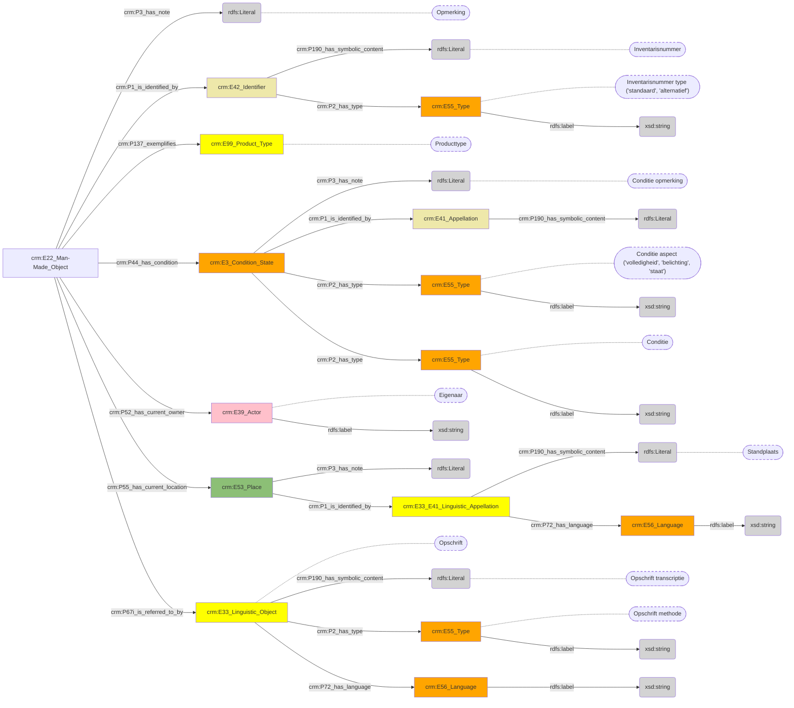

```mermaid
graph LR
style 3ba3010e-472b-11ee-974d-00163e71351b_s stroke-dasharray: 5
style 4bf13f18-472a-11ee-974d-00163e71351b_s stroke-dasharray: 5
style 4bf13ce8-472a-11ee-974d-00163e71351b_s stroke-dasharray: 5
style 5b5c4a00-472b-11ee-a9ac-00163e71351b_s stroke-dasharray: 5
style dac07a32-47d5-11ee-a9ac-00163e71351b_s stroke-dasharray: 5
style 307b2270-472b-11ee-a9ac-00163e71351b_s stroke-dasharray: 5
style 4bf1395a-472a-11ee-974d-00163e71351b_s stroke-dasharray: 5
style ae8a8e8c-4729-11ee-b0c4-00163e71351b_s stroke-dasharray: 5
style ae8a8f7c-4729-11ee-b0c4-00163e71351b_s stroke-dasharray: 5
style e531add0-47ce-11ee-b0c4-00163e71351b_s stroke-dasharray: 5
style f88a8338-472a-11ee-b0c4-00163e71351b_s stroke-dasharray: 5
style f88a855e-472a-11ee-b0c4-00163e71351b_s stroke-dasharray: 5
3ba3010e-472b-11ee-974d-00163e71351b["rdfs:Literal"]-.-3ba3010e-472b-11ee-974d-00163e71351b_s(["Standplaats"])
4bf13f18-472a-11ee-974d-00163e71351b["rdfs:Literal"]-.-4bf13f18-472a-11ee-974d-00163e71351b_s(["Opschrift transcriptie"])
4bf13ce8-472a-11ee-974d-00163e71351b["crm:E55_Type"]-.-4bf13ce8-472a-11ee-974d-00163e71351b_s(["Opschrift methode"])
5b5c4a00-472b-11ee-a9ac-00163e71351b["crm:E99_Product_Type"]-.-5b5c4a00-472b-11ee-a9ac-00163e71351b_s(["Producttype"])
dac07a32-47d5-11ee-a9ac-00163e71351b["rdfs:Literal"]-.-dac07a32-47d5-11ee-a9ac-00163e71351b_s(["Opmerking"])
307b2270-472b-11ee-a9ac-00163e71351b["crm:E39_Actor"]-.-307b2270-472b-11ee-a9ac-00163e71351b_s(["Eigenaar"])
4bf1395a-472a-11ee-974d-00163e71351b["crm:E33_Linguistic_Object"]-.-4bf1395a-472a-11ee-974d-00163e71351b_s(["Opschrift"])
ae8a8e8c-4729-11ee-b0c4-00163e71351b["rdfs:Literal"]-.-ae8a8e8c-4729-11ee-b0c4-00163e71351b_s(["Inventarisnummer"])
ae8a8f7c-4729-11ee-b0c4-00163e71351b["crm:E55_Type"]-.-ae8a8f7c-4729-11ee-b0c4-00163e71351b_s(["Inventarisnummer type ('standaard', 'alternatief')"])
e531add0-47ce-11ee-b0c4-00163e71351b["crm:E55_Type"]-.-e531add0-47ce-11ee-b0c4-00163e71351b_s(["Conditie aspect ('volledigheid', 'belichting', 'staat')"])
f88a8338-472a-11ee-b0c4-00163e71351b["crm:E55_Type"]-.-f88a8338-472a-11ee-b0c4-00163e71351b_s(["Conditie"])
f88a855e-472a-11ee-b0c4-00163e71351b["rdfs:Literal"]-.-f88a855e-472a-11ee-b0c4-00163e71351b_s(["Conditie opmerking"])
307b2270-472b-11ee-a9ac-00163e71351b["crm:E39_Actor"]-->|"rdfs:label"|307b2a18-472b-11ee-a9ac-00163e71351b(xsd:string)
3ba2ef70-472b-11ee-974d-00163e71351b["crm:E53_Place"]-->|"crm:P3_has_note"|3ba2f90c-472b-11ee-974d-00163e71351b(rdfs:Literal)
3ba2f240-472b-11ee-974d-00163e71351b["crm:E33_E41_Linguistic_Appellation"]-->|"crm:P190_has_symbolic_content"|3ba3010e-472b-11ee-974d-00163e71351b(rdfs:Literal)
3ba2fe66-472b-11ee-974d-00163e71351b["crm:E56_Language"]-->|"rdfs:label"|3ba2fd80-472b-11ee-974d-00163e71351b(xsd:string)
4bf1395a-472a-11ee-974d-00163e71351b["crm:E33_Linguistic_Object"]-->|"crm:P190_has_symbolic_content"|4bf13f18-472a-11ee-974d-00163e71351b(rdfs:Literal)
4bf13ce8-472a-11ee-974d-00163e71351b["crm:E55_Type"]-->|"rdfs:label"|4bf140da-472a-11ee-974d-00163e71351b(xsd:string)
4bf13e1e-472a-11ee-974d-00163e71351b["crm:E56_Language"]-->|"rdfs:label"|4bf13ffe-472a-11ee-974d-00163e71351b(xsd:string)
9503f17e-4729-11ee-974d-00163e71351b["crm:E22_Man-Made_Object"]-->|"crm:P3_has_note"|dac07a32-47d5-11ee-a9ac-00163e71351b(rdfs:Literal)
ae8a8982-4729-11ee-b0c4-00163e71351b["crm:E42_Identifier"]-->|"crm:P190_has_symbolic_content"|ae8a8e8c-4729-11ee-b0c4-00163e71351b(rdfs:Literal)
ae8a8f7c-4729-11ee-b0c4-00163e71351b["crm:E55_Type"]-->|"rdfs:label"|ae8a8d60-4729-11ee-b0c4-00163e71351b(xsd:string)
e531add0-47ce-11ee-b0c4-00163e71351b["crm:E55_Type"]-->|"rdfs:label"|e531b942-47ce-11ee-b0c4-00163e71351b(xsd:string)
f88a7f5a-472a-11ee-b0c4-00163e71351b["crm:E3_Condition_State"]-->|"crm:P3_has_note"|f88a855e-472a-11ee-b0c4-00163e71351b(rdfs:Literal)
f88a8338-472a-11ee-b0c4-00163e71351b["crm:E55_Type"]-->|"rdfs:label"|f88a8464-472a-11ee-b0c4-00163e71351b(xsd:string)
fad11fd2-47d2-11ee-a9ac-00163e71351b["crm:E41_Appellation"]-->|"crm:P190_has_symbolic_content"|fad1239c-47d2-11ee-a9ac-00163e71351b(rdfs:Literal)
3ba2ef70-472b-11ee-974d-00163e71351b["crm:E53_Place"]-->|"crm:P1_is_identified_by"|3ba2f240-472b-11ee-974d-00163e71351b["crm:E33_E41_Linguistic_Appellation"]
3ba2f240-472b-11ee-974d-00163e71351b["crm:E33_E41_Linguistic_Appellation"]-->|"crm:P72_has_language"|3ba2fe66-472b-11ee-974d-00163e71351b["crm:E56_Language"]
4bf1395a-472a-11ee-974d-00163e71351b["crm:E33_Linguistic_Object"]-->|"crm:P2_has_type"|4bf13ce8-472a-11ee-974d-00163e71351b["crm:E55_Type"]
4bf1395a-472a-11ee-974d-00163e71351b["crm:E33_Linguistic_Object"]-->|"crm:P72_has_language"|4bf13e1e-472a-11ee-974d-00163e71351b["crm:E56_Language"]
9503f17e-4729-11ee-974d-00163e71351b["crm:E22_Man-Made_Object"]-->|"crm:P1_is_identified_by"|ae8a8982-4729-11ee-b0c4-00163e71351b["crm:E42_Identifier"]
9503f17e-4729-11ee-974d-00163e71351b["crm:E22_Man-Made_Object"]-->|"crm:P137_exemplifies"|5b5c4a00-472b-11ee-a9ac-00163e71351b["crm:E99_Product_Type"]
9503f17e-4729-11ee-974d-00163e71351b["crm:E22_Man-Made_Object"]-->|"crm:P44_has_condition"|f88a7f5a-472a-11ee-b0c4-00163e71351b["crm:E3_Condition_State"]
9503f17e-4729-11ee-974d-00163e71351b["crm:E22_Man-Made_Object"]-->|"crm:P52_has_current_owner"|307b2270-472b-11ee-a9ac-00163e71351b["crm:E39_Actor"]
9503f17e-4729-11ee-974d-00163e71351b["crm:E22_Man-Made_Object"]-->|"crm:P55_has_current_location"|3ba2ef70-472b-11ee-974d-00163e71351b["crm:E53_Place"]
9503f17e-4729-11ee-974d-00163e71351b["crm:E22_Man-Made_Object"]-->|"crm:P67i_is_referred_to_by"|4bf1395a-472a-11ee-974d-00163e71351b["crm:E33_Linguistic_Object"]
ae8a8982-4729-11ee-b0c4-00163e71351b["crm:E42_Identifier"]-->|"crm:P2_has_type"|ae8a8f7c-4729-11ee-b0c4-00163e71351b["crm:E55_Type"]
f88a7f5a-472a-11ee-b0c4-00163e71351b["crm:E3_Condition_State"]-->|"crm:P1_is_identified_by"|fad11fd2-47d2-11ee-a9ac-00163e71351b["crm:E41_Appellation"]
f88a7f5a-472a-11ee-b0c4-00163e71351b["crm:E3_Condition_State"]-->|"crm:P2_has_type"|e531add0-47ce-11ee-b0c4-00163e71351b["crm:E55_Type"]
f88a7f5a-472a-11ee-b0c4-00163e71351b["crm:E3_Condition_State"]-->|"crm:P2_has_type"|f88a8338-472a-11ee-b0c4-00163e71351b["crm:E55_Type"]
style 307b2270-472b-11ee-a9ac-00163e71351b fill:#ffc0cb
style 307b2a18-472b-11ee-a9ac-00163e71351b fill:#D3D3D3
style 3ba2ef70-472b-11ee-974d-00163e71351b fill:#8CBF76
style 3ba2f240-472b-11ee-974d-00163e71351b fill:#ffff00
style 3ba2f90c-472b-11ee-974d-00163e71351b fill:#D3D3D3
style 3ba2fd80-472b-11ee-974d-00163e71351b fill:#D3D3D3
style 3ba2fe66-472b-11ee-974d-00163e71351b fill:#ffa500
style 3ba3010e-472b-11ee-974d-00163e71351b fill:#D3D3D3
style 4bf1395a-472a-11ee-974d-00163e71351b fill:#ffff00
style 4bf13ce8-472a-11ee-974d-00163e71351b fill:#ffa500
style 4bf13e1e-472a-11ee-974d-00163e71351b fill:#ffa500
style 4bf13f18-472a-11ee-974d-00163e71351b fill:#D3D3D3
style 4bf13ffe-472a-11ee-974d-00163e71351b fill:#D3D3D3
style 4bf140da-472a-11ee-974d-00163e71351b fill:#D3D3D3
style 5b5c4a00-472b-11ee-a9ac-00163e71351b fill:#ffff00
style ae8a8982-4729-11ee-b0c4-00163e71351b fill:#EEE8AA
style ae8a8d60-4729-11ee-b0c4-00163e71351b fill:#D3D3D3
style ae8a8e8c-4729-11ee-b0c4-00163e71351b fill:#D3D3D3
style ae8a8f7c-4729-11ee-b0c4-00163e71351b fill:#ffa500
style dac07a32-47d5-11ee-a9ac-00163e71351b fill:#D3D3D3
style e531add0-47ce-11ee-b0c4-00163e71351b fill:#ffa500
style e531b942-47ce-11ee-b0c4-00163e71351b fill:#D3D3D3
style f88a7f5a-472a-11ee-b0c4-00163e71351b fill:#ffa500
style f88a8338-472a-11ee-b0c4-00163e71351b fill:#ffa500
style f88a8464-472a-11ee-b0c4-00163e71351b fill:#D3D3D3
style f88a855e-472a-11ee-b0c4-00163e71351b fill:#D3D3D3
style fad11fd2-47d2-11ee-a9ac-00163e71351b fill:#EEE8AA
style fad1239c-47d2-11ee-a9ac-00163e71351b fill:#D3D3D3
```
