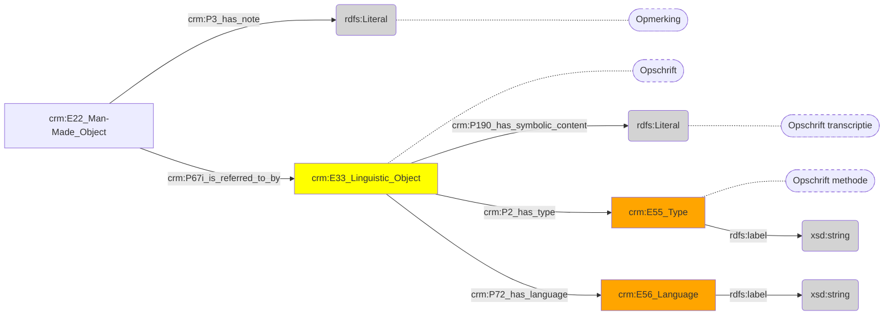

```mermaid
graph LR
4bf13f18-472a-11ee-974d-00163e71351b["rdfs:Literal"]-.-4bf13f18-472a-11ee-974d-00163e71351b_s(["Opschrift transcriptie"])
4bf13ce8-472a-11ee-974d-00163e71351b["crm:E55_Type"]-.-4bf13ce8-472a-11ee-974d-00163e71351b_s(["Opschrift methode"])
dac07a32-47d5-11ee-a9ac-00163e71351b["rdfs:Literal"]-.-dac07a32-47d5-11ee-a9ac-00163e71351b_s(["Opmerking"])
4bf1395a-472a-11ee-974d-00163e71351b["crm:E33_Linguistic_Object"]-.-4bf1395a-472a-11ee-974d-00163e71351b_s(["Opschrift"])
4bf1395a-472a-11ee-974d-00163e71351b["crm:E33_Linguistic_Object"]-->|"crm:P190_has_symbolic_content"|4bf13f18-472a-11ee-974d-00163e71351b(rdfs:Literal)
4bf13ce8-472a-11ee-974d-00163e71351b["crm:E55_Type"]-->|"rdfs:label"|4bf140da-472a-11ee-974d-00163e71351b(xsd:string)
4bf13e1e-472a-11ee-974d-00163e71351b["crm:E56_Language"]-->|"rdfs:label"|4bf13ffe-472a-11ee-974d-00163e71351b(xsd:string)
9503f17e-4729-11ee-974d-00163e71351b["crm:E22_Man-Made_Object"]-->|"crm:P3_has_note"|dac07a32-47d5-11ee-a9ac-00163e71351b(rdfs:Literal)
style 4bf1395a-472a-11ee-974d-00163e71351b fill:#ffff00
style 4bf13ce8-472a-11ee-974d-00163e71351b fill:#ffa500
style 4bf13e1e-472a-11ee-974d-00163e71351b fill:#ffa500
style 4bf13f18-472a-11ee-974d-00163e71351b fill:#D3D3D3
style 4bf13ffe-472a-11ee-974d-00163e71351b fill:#D3D3D3
style 4bf140da-472a-11ee-974d-00163e71351b fill:#D3D3D3
style dac07a32-47d5-11ee-a9ac-00163e71351b fill:#D3D3D3
style 4bf13f18-472a-11ee-974d-00163e71351b_s stroke-dasharray: 5
style 4bf13ce8-472a-11ee-974d-00163e71351b_s stroke-dasharray: 5
style dac07a32-47d5-11ee-a9ac-00163e71351b_s stroke-dasharray: 5
style 4bf1395a-472a-11ee-974d-00163e71351b_s stroke-dasharray: 5
4bf1395a-472a-11ee-974d-00163e71351b["crm:E33_Linguistic_Object"]-->|"crm:P2_has_type"|4bf13ce8-472a-11ee-974d-00163e71351b["crm:E55_Type"]
4bf1395a-472a-11ee-974d-00163e71351b["crm:E33_Linguistic_Object"]-->|"crm:P72_has_language"|4bf13e1e-472a-11ee-974d-00163e71351b["crm:E56_Language"]
9503f17e-4729-11ee-974d-00163e71351b["crm:E22_Man-Made_Object"]-->|"crm:P67i_is_referred_to_by"|4bf1395a-472a-11ee-974d-00163e71351b["crm:E33_Linguistic_Object"]
```
