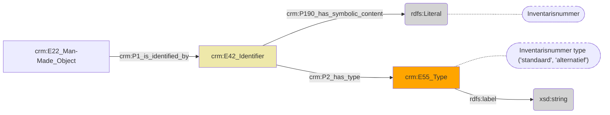

```mermaid
graph LR
ae8a8e8c-4729-11ee-b0c4-00163e71351b["rdfs:Literal"]-.-ae8a8e8c-4729-11ee-b0c4-00163e71351b_s(["Inventarisnummer"])
ae8a8f7c-4729-11ee-b0c4-00163e71351b["crm:E55_Type"]-.-ae8a8f7c-4729-11ee-b0c4-00163e71351b_s(["Inventarisnummer type ('standaard', 'alternatief')"])
ae8a8982-4729-11ee-b0c4-00163e71351b["crm:E42_Identifier"]-->|"crm:P190_has_symbolic_content"|ae8a8e8c-4729-11ee-b0c4-00163e71351b(rdfs:Literal)
ae8a8f7c-4729-11ee-b0c4-00163e71351b["crm:E55_Type"]-->|"rdfs:label"|ae8a8d60-4729-11ee-b0c4-00163e71351b(xsd:string)
style ae8a8982-4729-11ee-b0c4-00163e71351b fill:#EEE8AA
style ae8a8d60-4729-11ee-b0c4-00163e71351b fill:#D3D3D3
style ae8a8e8c-4729-11ee-b0c4-00163e71351b fill:#D3D3D3
style ae8a8f7c-4729-11ee-b0c4-00163e71351b fill:#ffa500
style ae8a8e8c-4729-11ee-b0c4-00163e71351b_s stroke-dasharray: 5
style ae8a8f7c-4729-11ee-b0c4-00163e71351b_s stroke-dasharray: 5
9503f17e-4729-11ee-974d-00163e71351b["crm:E22_Man-Made_Object"]-->|"crm:P1_is_identified_by"|ae8a8982-4729-11ee-b0c4-00163e71351b["crm:E42_Identifier"]
ae8a8982-4729-11ee-b0c4-00163e71351b["crm:E42_Identifier"]-->|"crm:P2_has_type"|ae8a8f7c-4729-11ee-b0c4-00163e71351b["crm:E55_Type"]
```
