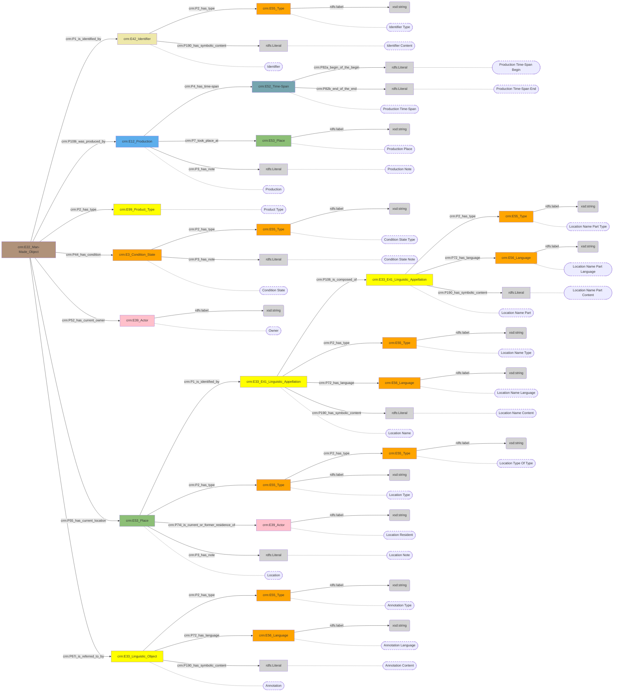

```mermaid
graph LR
3ba2eb24-472b-11ee-974d-00163e71351b["crm:E55_Type"]-->|"crm:P2_has_type"|3ba2f81c-472b-11ee-974d-00163e71351b["crm:E55_Type"]
3ba2ef70-472b-11ee-974d-00163e71351b["crm:E53_Place"]-->|"crm:P1_is_identified_by"|3ba2f240-472b-11ee-974d-00163e71351b["crm:E33_E41_Linguistic_Appellation"]
3ba2ef70-472b-11ee-974d-00163e71351b["crm:E53_Place"]-->|"crm:P2_has_type"|3ba2eb24-472b-11ee-974d-00163e71351b["crm:E55_Type"]
3ba2ef70-472b-11ee-974d-00163e71351b["crm:E53_Place"]-->|"crm:P74i_is_current_or_former_residence_of"|3ba2f9e8-472b-11ee-974d-00163e71351b["crm:E39_Actor"]
3ba2f240-472b-11ee-974d-00163e71351b["crm:E33_E41_Linguistic_Appellation"]-->|"crm:P106_is_composed_of"|3ba301f4-472b-11ee-974d-00163e71351b["crm:E33_E41_Linguistic_Appellation"]
3ba2f240-472b-11ee-974d-00163e71351b["crm:E33_E41_Linguistic_Appellation"]-->|"crm:P2_has_type"|3ba2fc9a-472b-11ee-974d-00163e71351b["crm:E55_Type"]
3ba2f240-472b-11ee-974d-00163e71351b["crm:E33_E41_Linguistic_Appellation"]-->|"crm:P72_has_language"|3ba2fe66-472b-11ee-974d-00163e71351b["crm:E56_Language"]
3ba301f4-472b-11ee-974d-00163e71351b["crm:E33_E41_Linguistic_Appellation"]-->|"crm:P2_has_type"|3ba2f63c-472b-11ee-974d-00163e71351b["crm:E55_Type"]
3ba301f4-472b-11ee-974d-00163e71351b["crm:E33_E41_Linguistic_Appellation"]-->|"crm:P72_has_language"|3ba303ac-472b-11ee-974d-00163e71351b["crm:E56_Language"]
4bf1395a-472a-11ee-974d-00163e71351b["crm:E33_Linguistic_Object"]-->|"crm:P2_has_type"|4bf13ce8-472a-11ee-974d-00163e71351b["crm:E55_Type"]
4bf1395a-472a-11ee-974d-00163e71351b["crm:E33_Linguistic_Object"]-->|"crm:P72_has_language"|4bf13e1e-472a-11ee-974d-00163e71351b["crm:E56_Language"]
9503f17e-4729-11ee-974d-00163e71351b["crm:E22_Man-Made_Object"]-->|"crm:P1_is_identified_by"|ae8a8982-4729-11ee-b0c4-00163e71351b["crm:E42_Identifier"]
9503f17e-4729-11ee-974d-00163e71351b["crm:E22_Man-Made_Object"]-->|"crm:P108i_was_produced_by"|ed7206ca-4729-11ee-a9ac-00163e71351b["crm:E12_Production"]
9503f17e-4729-11ee-974d-00163e71351b["crm:E22_Man-Made_Object"]-->|"crm:P2_has_type"|5b5c4a00-472b-11ee-a9ac-00163e71351b["crm:E99_Product_Type"]
9503f17e-4729-11ee-974d-00163e71351b["crm:E22_Man-Made_Object"]-->|"crm:P44_has_condition"|f88a7f5a-472a-11ee-b0c4-00163e71351b["crm:E3_Condition_State"]
9503f17e-4729-11ee-974d-00163e71351b["crm:E22_Man-Made_Object"]-->|"crm:P52_has_current_owner"|307b2270-472b-11ee-a9ac-00163e71351b["crm:E39_Actor"]
9503f17e-4729-11ee-974d-00163e71351b["crm:E22_Man-Made_Object"]-->|"crm:P55_has_current_location"|3ba2ef70-472b-11ee-974d-00163e71351b["crm:E53_Place"]
9503f17e-4729-11ee-974d-00163e71351b["crm:E22_Man-Made_Object"]-->|"crm:P67i_is_referred_to_by"|4bf1395a-472a-11ee-974d-00163e71351b["crm:E33_Linguistic_Object"]
ae8a8982-4729-11ee-b0c4-00163e71351b["crm:E42_Identifier"]-->|"crm:P2_has_type"|ae8a8f7c-4729-11ee-b0c4-00163e71351b["crm:E55_Type"]
ed7206ca-4729-11ee-a9ac-00163e71351b["crm:E12_Production"]-->|"crm:P4_has_time-span"|ed720aa8-4729-11ee-a9ac-00163e71351b["crm:E52_Time-Span"]
ed7206ca-4729-11ee-a9ac-00163e71351b["crm:E12_Production"]-->|"crm:P7_took_place_at"|ed721084-4729-11ee-a9ac-00163e71351b["crm:E53_Place"]
f88a7f5a-472a-11ee-b0c4-00163e71351b["crm:E3_Condition_State"]-->|"crm:P2_has_type"|f88a8338-472a-11ee-b0c4-00163e71351b["crm:E55_Type"]
style 3ba2f81c-472b-11ee-974d-00163e71351b_s stroke-dasharray: 5
style 3ba2f240-472b-11ee-974d-00163e71351b_s stroke-dasharray: 5
style 3ba2eb24-472b-11ee-974d-00163e71351b_s stroke-dasharray: 5
style 3ba2f90c-472b-11ee-974d-00163e71351b_s stroke-dasharray: 5
style 3ba2f9e8-472b-11ee-974d-00163e71351b_s stroke-dasharray: 5
style 3ba301f4-472b-11ee-974d-00163e71351b_s stroke-dasharray: 5
style 3ba3010e-472b-11ee-974d-00163e71351b_s stroke-dasharray: 5
style 3ba2fc9a-472b-11ee-974d-00163e71351b_s stroke-dasharray: 5
style 3ba2fe66-472b-11ee-974d-00163e71351b_s stroke-dasharray: 5
style 3ba302d0-472b-11ee-974d-00163e71351b_s stroke-dasharray: 5
style 3ba2f63c-472b-11ee-974d-00163e71351b_s stroke-dasharray: 5
style 3ba303ac-472b-11ee-974d-00163e71351b_s stroke-dasharray: 5
style 4bf13f18-472a-11ee-974d-00163e71351b_s stroke-dasharray: 5
style 4bf13ce8-472a-11ee-974d-00163e71351b_s stroke-dasharray: 5
style 4bf13e1e-472a-11ee-974d-00163e71351b_s stroke-dasharray: 5
style ae8a8982-4729-11ee-b0c4-00163e71351b_s stroke-dasharray: 5
style ed7206ca-4729-11ee-a9ac-00163e71351b_s stroke-dasharray: 5
style 5b5c4a00-472b-11ee-a9ac-00163e71351b_s stroke-dasharray: 5
style f88a7f5a-472a-11ee-b0c4-00163e71351b_s stroke-dasharray: 5
style 307b2270-472b-11ee-a9ac-00163e71351b_s stroke-dasharray: 5
style 3ba2ef70-472b-11ee-974d-00163e71351b_s stroke-dasharray: 5
style 4bf1395a-472a-11ee-974d-00163e71351b_s stroke-dasharray: 5
style ae8a8e8c-4729-11ee-b0c4-00163e71351b_s stroke-dasharray: 5
style ae8a8f7c-4729-11ee-b0c4-00163e71351b_s stroke-dasharray: 5
style ed7217a0-4729-11ee-a9ac-00163e71351b_s stroke-dasharray: 5
style ed720aa8-4729-11ee-a9ac-00163e71351b_s stroke-dasharray: 5
style ed721084-4729-11ee-a9ac-00163e71351b_s stroke-dasharray: 5
style ed7216ba-4729-11ee-a9ac-00163e71351b_s stroke-dasharray: 5
style ed720f9e-4729-11ee-a9ac-00163e71351b_s stroke-dasharray: 5
style f88a8338-472a-11ee-b0c4-00163e71351b_s stroke-dasharray: 5
style f88a855e-472a-11ee-b0c4-00163e71351b_s stroke-dasharray: 5
307b2270-472b-11ee-a9ac-00163e71351b["crm:E39_Actor"]-->|"rdfs:label"|307b2a18-472b-11ee-a9ac-00163e71351b(xsd:string)
3ba2eb24-472b-11ee-974d-00163e71351b["crm:E55_Type"]-->|"rdfs:label"|3ba2f736-472b-11ee-974d-00163e71351b(xsd:string)
3ba2ef70-472b-11ee-974d-00163e71351b["crm:E53_Place"]-->|"crm:P3_has_note"|3ba2f90c-472b-11ee-974d-00163e71351b(rdfs:Literal)
3ba2f240-472b-11ee-974d-00163e71351b["crm:E33_E41_Linguistic_Appellation"]-->|"crm:P190_has_symbolic_content"|3ba3010e-472b-11ee-974d-00163e71351b(rdfs:Literal)
3ba2f63c-472b-11ee-974d-00163e71351b["crm:E55_Type"]-->|"rdfs:label"|3ba30032-472b-11ee-974d-00163e71351b(xsd:string)
3ba2f81c-472b-11ee-974d-00163e71351b["crm:E55_Type"]-->|"rdfs:label"|3ba2face-472b-11ee-974d-00163e71351b(xsd:string)
3ba2f9e8-472b-11ee-974d-00163e71351b["crm:E39_Actor"]-->|"rdfs:label"|3ba2fbaa-472b-11ee-974d-00163e71351b(xsd:string)
3ba2fc9a-472b-11ee-974d-00163e71351b["crm:E55_Type"]-->|"rdfs:label"|3ba2ff56-472b-11ee-974d-00163e71351b(xsd:string)
3ba2fe66-472b-11ee-974d-00163e71351b["crm:E56_Language"]-->|"rdfs:label"|3ba2fd80-472b-11ee-974d-00163e71351b(xsd:string)
3ba301f4-472b-11ee-974d-00163e71351b["crm:E33_E41_Linguistic_Appellation"]-->|"crm:P190_has_symbolic_content"|3ba302d0-472b-11ee-974d-00163e71351b(rdfs:Literal)
3ba303ac-472b-11ee-974d-00163e71351b["crm:E56_Language"]-->|"rdfs:label"|3ba2f4fc-472b-11ee-974d-00163e71351b(xsd:string)
4bf1395a-472a-11ee-974d-00163e71351b["crm:E33_Linguistic_Object"]-->|"crm:P190_has_symbolic_content"|4bf13f18-472a-11ee-974d-00163e71351b(rdfs:Literal)
4bf13ce8-472a-11ee-974d-00163e71351b["crm:E55_Type"]-->|"rdfs:label"|4bf140da-472a-11ee-974d-00163e71351b(xsd:string)
4bf13e1e-472a-11ee-974d-00163e71351b["crm:E56_Language"]-->|"rdfs:label"|4bf13ffe-472a-11ee-974d-00163e71351b(xsd:string)
ae8a8982-4729-11ee-b0c4-00163e71351b["crm:E42_Identifier"]-->|"crm:P190_has_symbolic_content"|ae8a8e8c-4729-11ee-b0c4-00163e71351b(rdfs:Literal)
ae8a8f7c-4729-11ee-b0c4-00163e71351b["crm:E55_Type"]-->|"rdfs:label"|ae8a8d60-4729-11ee-b0c4-00163e71351b(xsd:string)
ed7206ca-4729-11ee-a9ac-00163e71351b["crm:E12_Production"]-->|"crm:P3_has_note"|ed7217a0-4729-11ee-a9ac-00163e71351b(rdfs:Literal)
ed720aa8-4729-11ee-a9ac-00163e71351b["crm:E52_Time-Span"]-->|"crm:P82a_begin_of_the_begin"|ed7216ba-4729-11ee-a9ac-00163e71351b(rdfs:Literal)
ed720aa8-4729-11ee-a9ac-00163e71351b["crm:E52_Time-Span"]-->|"crm:P82b_end_of_the_end"|ed720f9e-4729-11ee-a9ac-00163e71351b(rdfs:Literal)
ed721084-4729-11ee-a9ac-00163e71351b["crm:E53_Place"]-->|"rdfs:label"|ed7215ca-4729-11ee-a9ac-00163e71351b(xsd:string)
f88a7f5a-472a-11ee-b0c4-00163e71351b["crm:E3_Condition_State"]-->|"crm:P3_has_note"|f88a855e-472a-11ee-b0c4-00163e71351b(rdfs:Literal)
f88a8338-472a-11ee-b0c4-00163e71351b["crm:E55_Type"]-->|"rdfs:label"|f88a8464-472a-11ee-b0c4-00163e71351b(xsd:string)
3ba2f81c-472b-11ee-974d-00163e71351b["crm:E55_Type"]-.-3ba2f81c-472b-11ee-974d-00163e71351b_s(["Location Type Of Type"])
3ba2f240-472b-11ee-974d-00163e71351b["crm:E33_E41_Linguistic_Appellation"]-.-3ba2f240-472b-11ee-974d-00163e71351b_s(["Location Name"])
3ba2eb24-472b-11ee-974d-00163e71351b["crm:E55_Type"]-.-3ba2eb24-472b-11ee-974d-00163e71351b_s(["Location Type"])
3ba2f90c-472b-11ee-974d-00163e71351b["rdfs:Literal"]-.-3ba2f90c-472b-11ee-974d-00163e71351b_s(["Location Note"])
3ba2f9e8-472b-11ee-974d-00163e71351b["crm:E39_Actor"]-.-3ba2f9e8-472b-11ee-974d-00163e71351b_s(["Location Resident"])
3ba301f4-472b-11ee-974d-00163e71351b["crm:E33_E41_Linguistic_Appellation"]-.-3ba301f4-472b-11ee-974d-00163e71351b_s(["Location Name Part"])
3ba3010e-472b-11ee-974d-00163e71351b["rdfs:Literal"]-.-3ba3010e-472b-11ee-974d-00163e71351b_s(["Location Name Content"])
3ba2fc9a-472b-11ee-974d-00163e71351b["crm:E55_Type"]-.-3ba2fc9a-472b-11ee-974d-00163e71351b_s(["Location Name Type"])
3ba2fe66-472b-11ee-974d-00163e71351b["crm:E56_Language"]-.-3ba2fe66-472b-11ee-974d-00163e71351b_s(["Location Name Language"])
3ba302d0-472b-11ee-974d-00163e71351b["rdfs:Literal"]-.-3ba302d0-472b-11ee-974d-00163e71351b_s(["Location Name Part Content"])
3ba2f63c-472b-11ee-974d-00163e71351b["crm:E55_Type"]-.-3ba2f63c-472b-11ee-974d-00163e71351b_s(["Location Name Part Type"])
3ba303ac-472b-11ee-974d-00163e71351b["crm:E56_Language"]-.-3ba303ac-472b-11ee-974d-00163e71351b_s(["Location Name Part Language"])
4bf13f18-472a-11ee-974d-00163e71351b["rdfs:Literal"]-.-4bf13f18-472a-11ee-974d-00163e71351b_s(["Annotation Content"])
4bf13ce8-472a-11ee-974d-00163e71351b["crm:E55_Type"]-.-4bf13ce8-472a-11ee-974d-00163e71351b_s(["Annotation Type"])
4bf13e1e-472a-11ee-974d-00163e71351b["crm:E56_Language"]-.-4bf13e1e-472a-11ee-974d-00163e71351b_s(["Annotation Language"])
ae8a8982-4729-11ee-b0c4-00163e71351b["crm:E42_Identifier"]-.-ae8a8982-4729-11ee-b0c4-00163e71351b_s(["Identifier"])
ed7206ca-4729-11ee-a9ac-00163e71351b["crm:E12_Production"]-.-ed7206ca-4729-11ee-a9ac-00163e71351b_s(["Production"])
5b5c4a00-472b-11ee-a9ac-00163e71351b["crm:E99_Product_Type"]-.-5b5c4a00-472b-11ee-a9ac-00163e71351b_s(["Product Type"])
f88a7f5a-472a-11ee-b0c4-00163e71351b["crm:E3_Condition_State"]-.-f88a7f5a-472a-11ee-b0c4-00163e71351b_s(["Condition State"])
307b2270-472b-11ee-a9ac-00163e71351b["crm:E39_Actor"]-.-307b2270-472b-11ee-a9ac-00163e71351b_s(["Owner"])
3ba2ef70-472b-11ee-974d-00163e71351b["crm:E53_Place"]-.-3ba2ef70-472b-11ee-974d-00163e71351b_s(["Location"])
4bf1395a-472a-11ee-974d-00163e71351b["crm:E33_Linguistic_Object"]-.-4bf1395a-472a-11ee-974d-00163e71351b_s(["Annotation"])
ae8a8e8c-4729-11ee-b0c4-00163e71351b["rdfs:Literal"]-.-ae8a8e8c-4729-11ee-b0c4-00163e71351b_s(["Identifier Content"])
ae8a8f7c-4729-11ee-b0c4-00163e71351b["crm:E55_Type"]-.-ae8a8f7c-4729-11ee-b0c4-00163e71351b_s(["Identifier Type"])
ed7217a0-4729-11ee-a9ac-00163e71351b["rdfs:Literal"]-.-ed7217a0-4729-11ee-a9ac-00163e71351b_s(["Production Note"])
ed720aa8-4729-11ee-a9ac-00163e71351b["crm:E52_Time-Span"]-.-ed720aa8-4729-11ee-a9ac-00163e71351b_s(["Production Time-Span"])
ed721084-4729-11ee-a9ac-00163e71351b["crm:E53_Place"]-.-ed721084-4729-11ee-a9ac-00163e71351b_s(["Production Place"])
ed7216ba-4729-11ee-a9ac-00163e71351b["rdfs:Literal"]-.-ed7216ba-4729-11ee-a9ac-00163e71351b_s(["Production Time-Span Begin"])
ed720f9e-4729-11ee-a9ac-00163e71351b["rdfs:Literal"]-.-ed720f9e-4729-11ee-a9ac-00163e71351b_s(["Production Time-Span End"])
f88a8338-472a-11ee-b0c4-00163e71351b["crm:E55_Type"]-.-f88a8338-472a-11ee-b0c4-00163e71351b_s(["Condition State Type"])
f88a855e-472a-11ee-b0c4-00163e71351b["rdfs:Literal"]-.-f88a855e-472a-11ee-b0c4-00163e71351b_s(["Condition State Note"])
style 307b2270-472b-11ee-a9ac-00163e71351b fill:#ffc0cb
style 307b2a18-472b-11ee-a9ac-00163e71351b fill:#D3D3D3
style 3ba2eb24-472b-11ee-974d-00163e71351b fill:#ffa500
style 3ba2ef70-472b-11ee-974d-00163e71351b fill:#8CBF76
style 3ba2f240-472b-11ee-974d-00163e71351b fill:#ffff00
style 3ba2f4fc-472b-11ee-974d-00163e71351b fill:#D3D3D3
style 3ba2f63c-472b-11ee-974d-00163e71351b fill:#ffa500
style 3ba2f736-472b-11ee-974d-00163e71351b fill:#D3D3D3
style 3ba2f81c-472b-11ee-974d-00163e71351b fill:#ffa500
style 3ba2f90c-472b-11ee-974d-00163e71351b fill:#D3D3D3
style 3ba2f9e8-472b-11ee-974d-00163e71351b fill:#ffc0cb
style 3ba2face-472b-11ee-974d-00163e71351b fill:#D3D3D3
style 3ba2fbaa-472b-11ee-974d-00163e71351b fill:#D3D3D3
style 3ba2fc9a-472b-11ee-974d-00163e71351b fill:#ffa500
style 3ba2fd80-472b-11ee-974d-00163e71351b fill:#D3D3D3
style 3ba2fe66-472b-11ee-974d-00163e71351b fill:#ffa500
style 3ba2ff56-472b-11ee-974d-00163e71351b fill:#D3D3D3
style 3ba30032-472b-11ee-974d-00163e71351b fill:#D3D3D3
style 3ba3010e-472b-11ee-974d-00163e71351b fill:#D3D3D3
style 3ba301f4-472b-11ee-974d-00163e71351b fill:#ffff00
style 3ba302d0-472b-11ee-974d-00163e71351b fill:#D3D3D3
style 3ba303ac-472b-11ee-974d-00163e71351b fill:#ffa500
style 4bf1395a-472a-11ee-974d-00163e71351b fill:#ffff00
style 4bf13ce8-472a-11ee-974d-00163e71351b fill:#ffa500
style 4bf13e1e-472a-11ee-974d-00163e71351b fill:#ffa500
style 4bf13f18-472a-11ee-974d-00163e71351b fill:#D3D3D3
style 4bf13ffe-472a-11ee-974d-00163e71351b fill:#D3D3D3
style 4bf140da-472a-11ee-974d-00163e71351b fill:#D3D3D3
style 5b5c4a00-472b-11ee-a9ac-00163e71351b fill:#ffff00
style 9503f17e-4729-11ee-974d-00163e71351b fill:#B0927A
style ae8a8982-4729-11ee-b0c4-00163e71351b fill:#EEE8AA
style ae8a8d60-4729-11ee-b0c4-00163e71351b fill:#D3D3D3
style ae8a8e8c-4729-11ee-b0c4-00163e71351b fill:#D3D3D3
style ae8a8f7c-4729-11ee-b0c4-00163e71351b fill:#ffa500
style ed7206ca-4729-11ee-a9ac-00163e71351b fill:#5DAEEC
style ed720aa8-4729-11ee-a9ac-00163e71351b fill:#76A5AF
style ed720f9e-4729-11ee-a9ac-00163e71351b fill:#D3D3D3
style ed721084-4729-11ee-a9ac-00163e71351b fill:#8CBF76
style ed7215ca-4729-11ee-a9ac-00163e71351b fill:#D3D3D3
style ed7216ba-4729-11ee-a9ac-00163e71351b fill:#D3D3D3
style ed7217a0-4729-11ee-a9ac-00163e71351b fill:#D3D3D3
style f88a7f5a-472a-11ee-b0c4-00163e71351b fill:#ffa500
style f88a8338-472a-11ee-b0c4-00163e71351b fill:#ffa500
style f88a8464-472a-11ee-b0c4-00163e71351b fill:#D3D3D3
style f88a855e-472a-11ee-b0c4-00163e71351b fill:#D3D3D3
```
