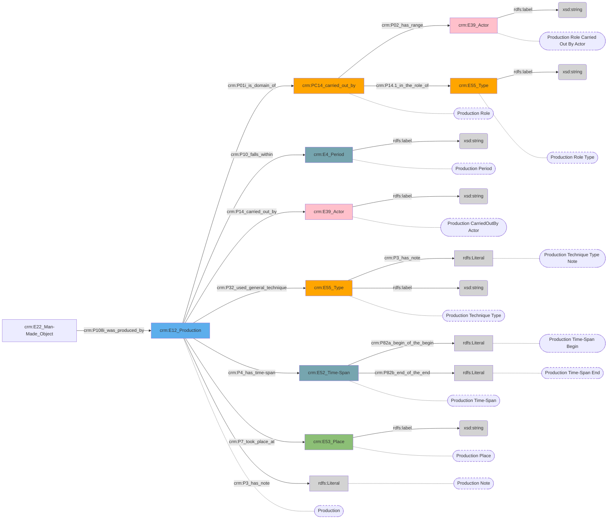

```mermaid
graph LR
73fcc5b4-eda1-11ed-9064-00163e71351b["crm:E12_Production"]-->|"crm:P01i_is_domain_of"|73fcd284-eda1-11ed-9064-00163e71351b["crm:PC14_carried_out_by"]
73fcc5b4-eda1-11ed-9064-00163e71351b["crm:E12_Production"]-->|"crm:P10_falls_within"|756a8e1e-4584-11ee-bc5c-00163e71351b["crm:E4_Period"]
73fcc5b4-eda1-11ed-9064-00163e71351b["crm:E12_Production"]-->|"crm:P14_carried_out_by"|73fccc8a-eda1-11ed-9064-00163e71351b["crm:E39_Actor"]
73fcc5b4-eda1-11ed-9064-00163e71351b["crm:E12_Production"]-->|"crm:P32_used_general_technique"|73fccf1e-eda1-11ed-9064-00163e71351b["crm:E55_Type"]
73fcc5b4-eda1-11ed-9064-00163e71351b["crm:E12_Production"]-->|"crm:P4_has_time-span"|73fcc992-eda1-11ed-9064-00163e71351b["crm:E52_Time-Span"]
73fcc5b4-eda1-11ed-9064-00163e71351b["crm:E12_Production"]-->|"crm:P7_took_place_at"|73fcd4fa-eda1-11ed-9064-00163e71351b["crm:E53_Place"]
73fcd284-eda1-11ed-9064-00163e71351b["crm:PC14_carried_out_by"]-->|"crm:P02_has_range"|73fccd66-eda1-11ed-9064-00163e71351b["crm:E39_Actor"]
73fcd284-eda1-11ed-9064-00163e71351b["crm:PC14_carried_out_by"]-->|"crm:P14.1_in_the_role_of"|73fcce42-eda1-11ed-9064-00163e71351b["crm:E55_Type"]
fa95cea2-dd27-11ed-9655-00163e71351b["crm:E22_Man-Made_Object"]-->|"crm:P108i_was_produced_by"|73fcc5b4-eda1-11ed-9064-00163e71351b["crm:E12_Production"]
73fcc5b4-eda1-11ed-9064-00163e71351b["crm:E12_Production"]-->|"crm:P3_has_note"|7d7e51a6-1002-11ee-b0c4-00163e71351b(rdfs:Literal)
73fcc992-eda1-11ed-9064-00163e71351b["crm:E52_Time-Span"]-->|"crm:P82a_begin_of_the_begin"|73fcd41e-eda1-11ed-9064-00163e71351b(rdfs:Literal)
73fcc992-eda1-11ed-9064-00163e71351b["crm:E52_Time-Span"]-->|"crm:P82b_end_of_the_end"|73fcd19e-eda1-11ed-9064-00163e71351b(rdfs:Literal)
73fccc8a-eda1-11ed-9064-00163e71351b["crm:E39_Actor"]-->|"rdfs:label"|73fccba4-eda1-11ed-9064-00163e71351b(xsd:string)
73fccd66-eda1-11ed-9064-00163e71351b["crm:E39_Actor"]-->|"rdfs:label"|73fccffa-eda1-11ed-9064-00163e71351b(xsd:string)
73fcce42-eda1-11ed-9064-00163e71351b["crm:E55_Type"]-->|"rdfs:label"|73fccabe-eda1-11ed-9064-00163e71351b(xsd:string)
73fccf1e-eda1-11ed-9064-00163e71351b["crm:E55_Type"]-->|"crm:P3_has_note"|aaaea982-1002-11ee-974d-00163e71351b(rdfs:Literal)
73fccf1e-eda1-11ed-9064-00163e71351b["crm:E55_Type"]-->|"rdfs:label"|73fcd0d6-eda1-11ed-9064-00163e71351b(xsd:string)
73fcd4fa-eda1-11ed-9064-00163e71351b["crm:E53_Place"]-->|"rdfs:label"|73fcd356-eda1-11ed-9064-00163e71351b(xsd:string)
756a8e1e-4584-11ee-bc5c-00163e71351b["crm:E4_Period"]-->|"rdfs:label"|dfaf0476-4584-11ee-b0c4-00163e71351b(xsd:string)
style 73fcd284-eda1-11ed-9064-00163e71351b_s stroke-dasharray: 5
style 756a8e1e-4584-11ee-bc5c-00163e71351b_s stroke-dasharray: 5
style 73fccc8a-eda1-11ed-9064-00163e71351b_s stroke-dasharray: 5
style 7d7e51a6-1002-11ee-b0c4-00163e71351b_s stroke-dasharray: 5
style 73fccf1e-eda1-11ed-9064-00163e71351b_s stroke-dasharray: 5
style 73fcc992-eda1-11ed-9064-00163e71351b_s stroke-dasharray: 5
style 73fcd4fa-eda1-11ed-9064-00163e71351b_s stroke-dasharray: 5
style 73fcd41e-eda1-11ed-9064-00163e71351b_s stroke-dasharray: 5
style 73fcd19e-eda1-11ed-9064-00163e71351b_s stroke-dasharray: 5
style aaaea982-1002-11ee-974d-00163e71351b_s stroke-dasharray: 5
style 73fccd66-eda1-11ed-9064-00163e71351b_s stroke-dasharray: 5
style 73fcce42-eda1-11ed-9064-00163e71351b_s stroke-dasharray: 5
style 73fcc5b4-eda1-11ed-9064-00163e71351b_s stroke-dasharray: 5
73fcd284-eda1-11ed-9064-00163e71351b["crm:PC14_carried_out_by"]-.-73fcd284-eda1-11ed-9064-00163e71351b_s(["Production Role"])
756a8e1e-4584-11ee-bc5c-00163e71351b["crm:E4_Period"]-.-756a8e1e-4584-11ee-bc5c-00163e71351b_s(["Production Period"])
73fccc8a-eda1-11ed-9064-00163e71351b["crm:E39_Actor"]-.-73fccc8a-eda1-11ed-9064-00163e71351b_s(["Production CarriedOutBy Actor"])
7d7e51a6-1002-11ee-b0c4-00163e71351b["rdfs:Literal"]-.-7d7e51a6-1002-11ee-b0c4-00163e71351b_s(["Production Note"])
73fccf1e-eda1-11ed-9064-00163e71351b["crm:E55_Type"]-.-73fccf1e-eda1-11ed-9064-00163e71351b_s(["Production Technique Type"])
73fcc992-eda1-11ed-9064-00163e71351b["crm:E52_Time-Span"]-.-73fcc992-eda1-11ed-9064-00163e71351b_s(["Production Time-Span"])
73fcd4fa-eda1-11ed-9064-00163e71351b["crm:E53_Place"]-.-73fcd4fa-eda1-11ed-9064-00163e71351b_s(["Production Place"])
73fcd41e-eda1-11ed-9064-00163e71351b["rdfs:Literal"]-.-73fcd41e-eda1-11ed-9064-00163e71351b_s(["Production Time-Span Begin"])
73fcd19e-eda1-11ed-9064-00163e71351b["rdfs:Literal"]-.-73fcd19e-eda1-11ed-9064-00163e71351b_s(["Production Time-Span End"])
aaaea982-1002-11ee-974d-00163e71351b["rdfs:Literal"]-.-aaaea982-1002-11ee-974d-00163e71351b_s(["Production Technique Type Note"])
73fccd66-eda1-11ed-9064-00163e71351b["crm:E39_Actor"]-.-73fccd66-eda1-11ed-9064-00163e71351b_s(["Production Role Carried Out By Actor"])
73fcce42-eda1-11ed-9064-00163e71351b["crm:E55_Type"]-.-73fcce42-eda1-11ed-9064-00163e71351b_s(["Production Role Type"])
73fcc5b4-eda1-11ed-9064-00163e71351b["crm:E12_Production"]-.-73fcc5b4-eda1-11ed-9064-00163e71351b_s(["Production"])
style 73fcc5b4-eda1-11ed-9064-00163e71351b fill:#5DAEEC
style 73fcc992-eda1-11ed-9064-00163e71351b fill:#76A5AF
style 73fccabe-eda1-11ed-9064-00163e71351b fill:#D3D3D3
style 73fccba4-eda1-11ed-9064-00163e71351b fill:#D3D3D3
style 73fccc8a-eda1-11ed-9064-00163e71351b fill:#ffc0cb
style 73fccd66-eda1-11ed-9064-00163e71351b fill:#ffc0cb
style 73fcce42-eda1-11ed-9064-00163e71351b fill:#ffa500
style 73fccf1e-eda1-11ed-9064-00163e71351b fill:#ffa500
style 73fccffa-eda1-11ed-9064-00163e71351b fill:#D3D3D3
style 73fcd0d6-eda1-11ed-9064-00163e71351b fill:#D3D3D3
style 73fcd19e-eda1-11ed-9064-00163e71351b fill:#D3D3D3
style 73fcd284-eda1-11ed-9064-00163e71351b fill:#ffa500
style 73fcd356-eda1-11ed-9064-00163e71351b fill:#D3D3D3
style 73fcd41e-eda1-11ed-9064-00163e71351b fill:#D3D3D3
style 73fcd4fa-eda1-11ed-9064-00163e71351b fill:#8CBF76
style 756a8e1e-4584-11ee-bc5c-00163e71351b fill:#76A5AF
style 7d7e51a6-1002-11ee-b0c4-00163e71351b fill:#D3D3D3
style aaaea982-1002-11ee-974d-00163e71351b fill:#D3D3D3
style dfaf0476-4584-11ee-b0c4-00163e71351b fill:#D3D3D3
```
