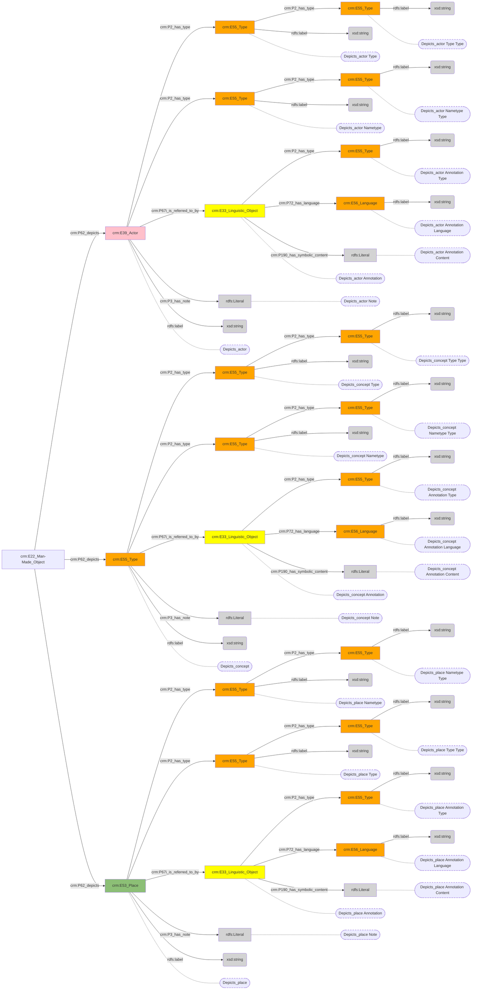

```mermaid
graph LR
5abe06e6-4669-11ee-b0c4-00163e71351b["crm:E39_Actor"]-->|"crm:P2_has_type"|5abe0e02-4669-11ee-b0c4-00163e71351b["crm:E55_Type"]
5abe06e6-4669-11ee-b0c4-00163e71351b["crm:E39_Actor"]-->|"crm:P2_has_type"|5abe1442-4669-11ee-b0c4-00163e71351b["crm:E55_Type"]
5abe06e6-4669-11ee-b0c4-00163e71351b["crm:E39_Actor"]-->|"crm:P67i_is_referred_to_by"|5abe115e-4669-11ee-b0c4-00163e71351b["crm:E33_Linguistic_Object"]
5abe0e02-4669-11ee-b0c4-00163e71351b["crm:E55_Type"]-->|"crm:P2_has_type"|5abe1b0e-4669-11ee-b0c4-00163e71351b["crm:E55_Type"]
5abe115e-4669-11ee-b0c4-00163e71351b["crm:E33_Linguistic_Object"]-->|"crm:P2_has_type"|5abe1712-4669-11ee-b0c4-00163e71351b["crm:E55_Type"]
5abe115e-4669-11ee-b0c4-00163e71351b["crm:E33_Linguistic_Object"]-->|"crm:P72_has_language"|5abe1e9c-4669-11ee-b0c4-00163e71351b["crm:E56_Language"]
5abe1442-4669-11ee-b0c4-00163e71351b["crm:E55_Type"]-->|"crm:P2_has_type"|5abe205e-4669-11ee-b0c4-00163e71351b["crm:E55_Type"]
8be1f7f6-466d-11ee-bc5c-00163e71351b["crm:E55_Type"]-->|"crm:P2_has_type"|8be1ffa8-466d-11ee-bc5c-00163e71351b["crm:E55_Type"]
8be1f7f6-466d-11ee-bc5c-00163e71351b["crm:E55_Type"]-->|"crm:P2_has_type"|8be202c8-466d-11ee-bc5c-00163e71351b["crm:E55_Type"]
8be1f7f6-466d-11ee-bc5c-00163e71351b["crm:E55_Type"]-->|"crm:P67i_is_referred_to_by"|8be205de-466d-11ee-bc5c-00163e71351b["crm:E33_Linguistic_Object"]
8be1ffa8-466d-11ee-bc5c-00163e71351b["crm:E55_Type"]-->|"crm:P2_has_type"|8be20b38-466d-11ee-bc5c-00163e71351b["crm:E55_Type"]
8be202c8-466d-11ee-bc5c-00163e71351b["crm:E55_Type"]-->|"crm:P2_has_type"|8be21452-466d-11ee-bc5c-00163e71351b["crm:E55_Type"]
8be205de-466d-11ee-bc5c-00163e71351b["crm:E33_Linguistic_Object"]-->|"crm:P2_has_type"|8be20d36-466d-11ee-bc5c-00163e71351b["crm:E55_Type"]
8be205de-466d-11ee-bc5c-00163e71351b["crm:E33_Linguistic_Object"]-->|"crm:P72_has_language"|8be20e1c-466d-11ee-bc5c-00163e71351b["crm:E56_Language"]
fa95cea2-dd27-11ed-9655-00163e71351b["crm:E22_Man-Made_Object"]-->|"crm:P62_depicts"|5abe06e6-4669-11ee-b0c4-00163e71351b["crm:E39_Actor"]
fa95cea2-dd27-11ed-9655-00163e71351b["crm:E22_Man-Made_Object"]-->|"crm:P62_depicts"|8be1f7f6-466d-11ee-bc5c-00163e71351b["crm:E55_Type"]
fa95cea2-dd27-11ed-9655-00163e71351b["crm:E22_Man-Made_Object"]-->|"crm:P62_depicts"|fe1780e2-4664-11ee-974d-00163e71351b["crm:E53_Place"]
fe1776e2-4664-11ee-974d-00163e71351b["crm:E33_Linguistic_Object"]-->|"crm:P2_has_type"|fe178bf0-4664-11ee-974d-00163e71351b["crm:E55_Type"]
fe1776e2-4664-11ee-974d-00163e71351b["crm:E33_Linguistic_Object"]-->|"crm:P72_has_language"|fe178dc6-4664-11ee-974d-00163e71351b["crm:E56_Language"]
fe177af2-4664-11ee-974d-00163e71351b["crm:E55_Type"]-->|"crm:P2_has_type"|fe178eb6-4664-11ee-974d-00163e71351b["crm:E55_Type"]
fe177df4-4664-11ee-974d-00163e71351b["crm:E55_Type"]-->|"crm:P2_has_type"|fe179190-4664-11ee-974d-00163e71351b["crm:E55_Type"]
fe1780e2-4664-11ee-974d-00163e71351b["crm:E53_Place"]-->|"crm:P2_has_type"|fe177af2-4664-11ee-974d-00163e71351b["crm:E55_Type"]
fe1780e2-4664-11ee-974d-00163e71351b["crm:E53_Place"]-->|"crm:P2_has_type"|fe177df4-4664-11ee-974d-00163e71351b["crm:E55_Type"]
fe1780e2-4664-11ee-974d-00163e71351b["crm:E53_Place"]-->|"crm:P67i_is_referred_to_by"|fe1776e2-4664-11ee-974d-00163e71351b["crm:E33_Linguistic_Object"]
5abe06e6-4669-11ee-b0c4-00163e71351b["crm:E39_Actor"]-->|"crm:P3_has_note"|5abe0af6-4669-11ee-b0c4-00163e71351b(rdfs:Literal)
5abe06e6-4669-11ee-b0c4-00163e71351b["crm:E39_Actor"]-->|"rdfs:label"|5abe1cd0-4669-11ee-b0c4-00163e71351b(xsd:string)
5abe0e02-4669-11ee-b0c4-00163e71351b["crm:E55_Type"]-->|"rdfs:label"|5abe1a28-4669-11ee-b0c4-00163e71351b(xsd:string)
5abe115e-4669-11ee-b0c4-00163e71351b["crm:E33_Linguistic_Object"]-->|"crm:P190_has_symbolic_content"|5abe1db6-4669-11ee-b0c4-00163e71351b(rdfs:Literal)
5abe1442-4669-11ee-b0c4-00163e71351b["crm:E55_Type"]-->|"rdfs:label"|5abe1f78-4669-11ee-b0c4-00163e71351b(xsd:string)
5abe1712-4669-11ee-b0c4-00163e71351b["crm:E55_Type"]-->|"rdfs:label"|5abe1938-4669-11ee-b0c4-00163e71351b(xsd:string)
5abe1b0e-4669-11ee-b0c4-00163e71351b["crm:E55_Type"]-->|"rdfs:label"|5abe1bea-4669-11ee-b0c4-00163e71351b(xsd:string)
5abe1e9c-4669-11ee-b0c4-00163e71351b["crm:E56_Language"]-->|"rdfs:label"|5abe183e-4669-11ee-b0c4-00163e71351b(xsd:string)
5abe205e-4669-11ee-b0c4-00163e71351b["crm:E55_Type"]-->|"rdfs:label"|5abe214e-4669-11ee-b0c4-00163e71351b(xsd:string)
8be1f7f6-466d-11ee-bc5c-00163e71351b["crm:E55_Type"]-->|"crm:P3_has_note"|8be1fc74-466d-11ee-bc5c-00163e71351b(rdfs:Literal)
8be1f7f6-466d-11ee-bc5c-00163e71351b["crm:E55_Type"]-->|"rdfs:label"|8be208ea-466d-11ee-bc5c-00163e71351b(xsd:string)
8be1ffa8-466d-11ee-bc5c-00163e71351b["crm:E55_Type"]-->|"rdfs:label"|8be20a34-466d-11ee-bc5c-00163e71351b(xsd:string)
8be202c8-466d-11ee-bc5c-00163e71351b["crm:E55_Type"]-->|"rdfs:label"|8be21010-466d-11ee-bc5c-00163e71351b(xsd:string)
8be205de-466d-11ee-bc5c-00163e71351b["crm:E33_Linguistic_Object"]-->|"crm:P190_has_symbolic_content"|8be21358-466d-11ee-bc5c-00163e71351b(rdfs:Literal)
8be20b38-466d-11ee-bc5c-00163e71351b["crm:E55_Type"]-->|"rdfs:label"|8be21240-466d-11ee-bc5c-00163e71351b(xsd:string)
8be20d36-466d-11ee-bc5c-00163e71351b["crm:E55_Type"]-->|"rdfs:label"|8be20c3c-466d-11ee-bc5c-00163e71351b(xsd:string)
8be20e1c-466d-11ee-bc5c-00163e71351b["crm:E56_Language"]-->|"rdfs:label"|8be20f20-466d-11ee-bc5c-00163e71351b(xsd:string)
8be21452-466d-11ee-bc5c-00163e71351b["crm:E55_Type"]-->|"rdfs:label"|8be21100-466d-11ee-bc5c-00163e71351b(xsd:string)
fe1776e2-4664-11ee-974d-00163e71351b["crm:E33_Linguistic_Object"]-->|"crm:P190_has_symbolic_content"|fe1789ac-4664-11ee-974d-00163e71351b(rdfs:Literal)
fe177af2-4664-11ee-974d-00163e71351b["crm:E55_Type"]-->|"rdfs:label"|fe178fa6-4664-11ee-974d-00163e71351b(xsd:string)
fe177df4-4664-11ee-974d-00163e71351b["crm:E55_Type"]-->|"rdfs:label"|fe17908c-4664-11ee-974d-00163e71351b(xsd:string)
fe1780e2-4664-11ee-974d-00163e71351b["crm:E53_Place"]-->|"crm:P3_has_note"|fe1783c6-4664-11ee-974d-00163e71351b(rdfs:Literal)
fe1780e2-4664-11ee-974d-00163e71351b["crm:E53_Place"]-->|"rdfs:label"|fe1794e2-4664-11ee-974d-00163e71351b(xsd:string)
fe178bf0-4664-11ee-974d-00163e71351b["crm:E55_Type"]-->|"rdfs:label"|fe178ce0-4664-11ee-974d-00163e71351b(xsd:string)
fe178dc6-4664-11ee-974d-00163e71351b["crm:E56_Language"]-->|"rdfs:label"|fe178af6-4664-11ee-974d-00163e71351b(xsd:string)
fe178eb6-4664-11ee-974d-00163e71351b["crm:E55_Type"]-->|"rdfs:label"|fe1792e4-4664-11ee-974d-00163e71351b(xsd:string)
fe179190-4664-11ee-974d-00163e71351b["crm:E55_Type"]-->|"rdfs:label"|fe1793e8-4664-11ee-974d-00163e71351b(xsd:string)
5abe0e02-4669-11ee-b0c4-00163e71351b["crm:E55_Type"]-.-5abe0e02-4669-11ee-b0c4-00163e71351b_s(["Depicts_actor Type"])
5abe1442-4669-11ee-b0c4-00163e71351b["crm:E55_Type"]-.-5abe1442-4669-11ee-b0c4-00163e71351b_s(["Depicts_actor Nametype"])
5abe0af6-4669-11ee-b0c4-00163e71351b["rdfs:Literal"]-.-5abe0af6-4669-11ee-b0c4-00163e71351b_s(["Depicts_actor Note"])
5abe115e-4669-11ee-b0c4-00163e71351b["crm:E33_Linguistic_Object"]-.-5abe115e-4669-11ee-b0c4-00163e71351b_s(["Depicts_actor Annotation"])
5abe1b0e-4669-11ee-b0c4-00163e71351b["crm:E55_Type"]-.-5abe1b0e-4669-11ee-b0c4-00163e71351b_s(["Depicts_actor Type Type"])
5abe1db6-4669-11ee-b0c4-00163e71351b["rdfs:Literal"]-.-5abe1db6-4669-11ee-b0c4-00163e71351b_s(["Depicts_actor Annotation Content"])
5abe1712-4669-11ee-b0c4-00163e71351b["crm:E55_Type"]-.-5abe1712-4669-11ee-b0c4-00163e71351b_s(["Depicts_actor Annotation Type"])
5abe1e9c-4669-11ee-b0c4-00163e71351b["crm:E56_Language"]-.-5abe1e9c-4669-11ee-b0c4-00163e71351b_s(["Depicts_actor Annotation Language"])
5abe205e-4669-11ee-b0c4-00163e71351b["crm:E55_Type"]-.-5abe205e-4669-11ee-b0c4-00163e71351b_s(["Depicts_actor Nametype Type"])
8be1ffa8-466d-11ee-bc5c-00163e71351b["crm:E55_Type"]-.-8be1ffa8-466d-11ee-bc5c-00163e71351b_s(["Depicts_concept Type"])
8be202c8-466d-11ee-bc5c-00163e71351b["crm:E55_Type"]-.-8be202c8-466d-11ee-bc5c-00163e71351b_s(["Depicts_concept Nametype"])
8be1fc74-466d-11ee-bc5c-00163e71351b["rdfs:Literal"]-.-8be1fc74-466d-11ee-bc5c-00163e71351b_s(["Depicts_concept Note"])
8be205de-466d-11ee-bc5c-00163e71351b["crm:E33_Linguistic_Object"]-.-8be205de-466d-11ee-bc5c-00163e71351b_s(["Depicts_concept Annotation"])
8be20b38-466d-11ee-bc5c-00163e71351b["crm:E55_Type"]-.-8be20b38-466d-11ee-bc5c-00163e71351b_s(["Depicts_concept Type Type"])
8be21452-466d-11ee-bc5c-00163e71351b["crm:E55_Type"]-.-8be21452-466d-11ee-bc5c-00163e71351b_s(["Depicts_concept Nametype Type"])
8be21358-466d-11ee-bc5c-00163e71351b["rdfs:Literal"]-.-8be21358-466d-11ee-bc5c-00163e71351b_s(["Depicts_concept Annotation Content"])
8be20d36-466d-11ee-bc5c-00163e71351b["crm:E55_Type"]-.-8be20d36-466d-11ee-bc5c-00163e71351b_s(["Depicts_concept Annotation Type"])
8be20e1c-466d-11ee-bc5c-00163e71351b["crm:E56_Language"]-.-8be20e1c-466d-11ee-bc5c-00163e71351b_s(["Depicts_concept Annotation Language"])
5abe06e6-4669-11ee-b0c4-00163e71351b["crm:E39_Actor"]-.-5abe06e6-4669-11ee-b0c4-00163e71351b_s(["Depicts_actor"])
8be1f7f6-466d-11ee-bc5c-00163e71351b["crm:E55_Type"]-.-8be1f7f6-466d-11ee-bc5c-00163e71351b_s(["Depicts_concept"])
fe1780e2-4664-11ee-974d-00163e71351b["crm:E53_Place"]-.-fe1780e2-4664-11ee-974d-00163e71351b_s(["Depicts_place"])
fe1789ac-4664-11ee-974d-00163e71351b["rdfs:Literal"]-.-fe1789ac-4664-11ee-974d-00163e71351b_s(["Depicts_place Annotation Content"])
fe178bf0-4664-11ee-974d-00163e71351b["crm:E55_Type"]-.-fe178bf0-4664-11ee-974d-00163e71351b_s(["Depicts_place Annotation Type"])
fe178dc6-4664-11ee-974d-00163e71351b["crm:E56_Language"]-.-fe178dc6-4664-11ee-974d-00163e71351b_s(["Depicts_place Annotation Language"])
fe178eb6-4664-11ee-974d-00163e71351b["crm:E55_Type"]-.-fe178eb6-4664-11ee-974d-00163e71351b_s(["Depicts_place Nametype Type"])
fe179190-4664-11ee-974d-00163e71351b["crm:E55_Type"]-.-fe179190-4664-11ee-974d-00163e71351b_s(["Depicts_place Type Type"])
fe177af2-4664-11ee-974d-00163e71351b["crm:E55_Type"]-.-fe177af2-4664-11ee-974d-00163e71351b_s(["Depicts_place Nametype"])
fe177df4-4664-11ee-974d-00163e71351b["crm:E55_Type"]-.-fe177df4-4664-11ee-974d-00163e71351b_s(["Depicts_place Type"])
fe1783c6-4664-11ee-974d-00163e71351b["rdfs:Literal"]-.-fe1783c6-4664-11ee-974d-00163e71351b_s(["Depicts_place Note"])
fe1776e2-4664-11ee-974d-00163e71351b["crm:E33_Linguistic_Object"]-.-fe1776e2-4664-11ee-974d-00163e71351b_s(["Depicts_place Annotation"])
style 5abe0e02-4669-11ee-b0c4-00163e71351b_s stroke-dasharray: 5
style 5abe1442-4669-11ee-b0c4-00163e71351b_s stroke-dasharray: 5
style 5abe0af6-4669-11ee-b0c4-00163e71351b_s stroke-dasharray: 5
style 5abe115e-4669-11ee-b0c4-00163e71351b_s stroke-dasharray: 5
style 5abe1b0e-4669-11ee-b0c4-00163e71351b_s stroke-dasharray: 5
style 5abe1db6-4669-11ee-b0c4-00163e71351b_s stroke-dasharray: 5
style 5abe1712-4669-11ee-b0c4-00163e71351b_s stroke-dasharray: 5
style 5abe1e9c-4669-11ee-b0c4-00163e71351b_s stroke-dasharray: 5
style 5abe205e-4669-11ee-b0c4-00163e71351b_s stroke-dasharray: 5
style 8be1ffa8-466d-11ee-bc5c-00163e71351b_s stroke-dasharray: 5
style 8be202c8-466d-11ee-bc5c-00163e71351b_s stroke-dasharray: 5
style 8be1fc74-466d-11ee-bc5c-00163e71351b_s stroke-dasharray: 5
style 8be205de-466d-11ee-bc5c-00163e71351b_s stroke-dasharray: 5
style 8be20b38-466d-11ee-bc5c-00163e71351b_s stroke-dasharray: 5
style 8be21452-466d-11ee-bc5c-00163e71351b_s stroke-dasharray: 5
style 8be21358-466d-11ee-bc5c-00163e71351b_s stroke-dasharray: 5
style 8be20d36-466d-11ee-bc5c-00163e71351b_s stroke-dasharray: 5
style 8be20e1c-466d-11ee-bc5c-00163e71351b_s stroke-dasharray: 5
style 5abe06e6-4669-11ee-b0c4-00163e71351b_s stroke-dasharray: 5
style 8be1f7f6-466d-11ee-bc5c-00163e71351b_s stroke-dasharray: 5
style fe1780e2-4664-11ee-974d-00163e71351b_s stroke-dasharray: 5
style fe1789ac-4664-11ee-974d-00163e71351b_s stroke-dasharray: 5
style fe178bf0-4664-11ee-974d-00163e71351b_s stroke-dasharray: 5
style fe178dc6-4664-11ee-974d-00163e71351b_s stroke-dasharray: 5
style fe178eb6-4664-11ee-974d-00163e71351b_s stroke-dasharray: 5
style fe179190-4664-11ee-974d-00163e71351b_s stroke-dasharray: 5
style fe177af2-4664-11ee-974d-00163e71351b_s stroke-dasharray: 5
style fe177df4-4664-11ee-974d-00163e71351b_s stroke-dasharray: 5
style fe1783c6-4664-11ee-974d-00163e71351b_s stroke-dasharray: 5
style fe1776e2-4664-11ee-974d-00163e71351b_s stroke-dasharray: 5
style 5abe06e6-4669-11ee-b0c4-00163e71351b fill:#ffc0cb
style 5abe0af6-4669-11ee-b0c4-00163e71351b fill:#D3D3D3
style 5abe0e02-4669-11ee-b0c4-00163e71351b fill:#ffa500
style 5abe115e-4669-11ee-b0c4-00163e71351b fill:#ffff00
style 5abe1442-4669-11ee-b0c4-00163e71351b fill:#ffa500
style 5abe1712-4669-11ee-b0c4-00163e71351b fill:#ffa500
style 5abe183e-4669-11ee-b0c4-00163e71351b fill:#D3D3D3
style 5abe1938-4669-11ee-b0c4-00163e71351b fill:#D3D3D3
style 5abe1a28-4669-11ee-b0c4-00163e71351b fill:#D3D3D3
style 5abe1b0e-4669-11ee-b0c4-00163e71351b fill:#ffa500
style 5abe1bea-4669-11ee-b0c4-00163e71351b fill:#D3D3D3
style 5abe1cd0-4669-11ee-b0c4-00163e71351b fill:#D3D3D3
style 5abe1db6-4669-11ee-b0c4-00163e71351b fill:#D3D3D3
style 5abe1e9c-4669-11ee-b0c4-00163e71351b fill:#ffa500
style 5abe1f78-4669-11ee-b0c4-00163e71351b fill:#D3D3D3
style 5abe205e-4669-11ee-b0c4-00163e71351b fill:#ffa500
style 5abe214e-4669-11ee-b0c4-00163e71351b fill:#D3D3D3
style 8be1f7f6-466d-11ee-bc5c-00163e71351b fill:#ffa500
style 8be1fc74-466d-11ee-bc5c-00163e71351b fill:#D3D3D3
style 8be1ffa8-466d-11ee-bc5c-00163e71351b fill:#ffa500
style 8be202c8-466d-11ee-bc5c-00163e71351b fill:#ffa500
style 8be205de-466d-11ee-bc5c-00163e71351b fill:#ffff00
style 8be208ea-466d-11ee-bc5c-00163e71351b fill:#D3D3D3
style 8be20a34-466d-11ee-bc5c-00163e71351b fill:#D3D3D3
style 8be20b38-466d-11ee-bc5c-00163e71351b fill:#ffa500
style 8be20c3c-466d-11ee-bc5c-00163e71351b fill:#D3D3D3
style 8be20d36-466d-11ee-bc5c-00163e71351b fill:#ffa500
style 8be20e1c-466d-11ee-bc5c-00163e71351b fill:#ffa500
style 8be20f20-466d-11ee-bc5c-00163e71351b fill:#D3D3D3
style 8be21010-466d-11ee-bc5c-00163e71351b fill:#D3D3D3
style 8be21100-466d-11ee-bc5c-00163e71351b fill:#D3D3D3
style 8be21240-466d-11ee-bc5c-00163e71351b fill:#D3D3D3
style 8be21358-466d-11ee-bc5c-00163e71351b fill:#D3D3D3
style 8be21452-466d-11ee-bc5c-00163e71351b fill:#ffa500
style fe1776e2-4664-11ee-974d-00163e71351b fill:#ffff00
style fe177af2-4664-11ee-974d-00163e71351b fill:#ffa500
style fe177df4-4664-11ee-974d-00163e71351b fill:#ffa500
style fe1780e2-4664-11ee-974d-00163e71351b fill:#8CBF76
style fe1783c6-4664-11ee-974d-00163e71351b fill:#D3D3D3
style fe1789ac-4664-11ee-974d-00163e71351b fill:#D3D3D3
style fe178af6-4664-11ee-974d-00163e71351b fill:#D3D3D3
style fe178bf0-4664-11ee-974d-00163e71351b fill:#ffa500
style fe178ce0-4664-11ee-974d-00163e71351b fill:#D3D3D3
style fe178dc6-4664-11ee-974d-00163e71351b fill:#ffa500
style fe178eb6-4664-11ee-974d-00163e71351b fill:#ffa500
style fe178fa6-4664-11ee-974d-00163e71351b fill:#D3D3D3
style fe17908c-4664-11ee-974d-00163e71351b fill:#D3D3D3
style fe179190-4664-11ee-974d-00163e71351b fill:#ffa500
style fe1792e4-4664-11ee-974d-00163e71351b fill:#D3D3D3
style fe1793e8-4664-11ee-974d-00163e71351b fill:#D3D3D3
style fe1794e2-4664-11ee-974d-00163e71351b fill:#D3D3D3
```
