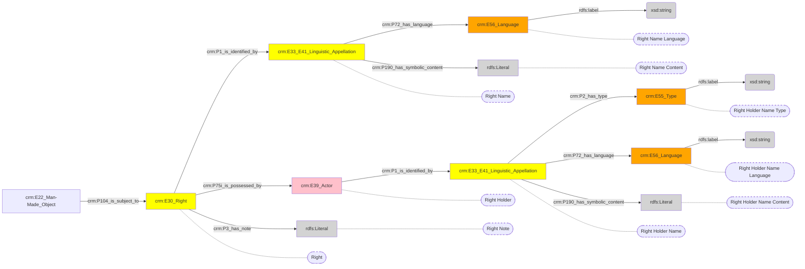

```mermaid
graph LR
bd7ef52c-eda1-11ed-9232-00163e71351b["crm:E30_Right"]-->|"crm:P1_is_identified_by"|bd7f00da-eda1-11ed-9232-00163e71351b["crm:E33_E41_Linguistic_Appellation"]
bd7ef52c-eda1-11ed-9232-00163e71351b["crm:E30_Right"]-->|"crm:P75i_is_possessed_by"|bd7efe46-eda1-11ed-9232-00163e71351b["crm:E39_Actor"]
bd7efe46-eda1-11ed-9232-00163e71351b["crm:E39_Actor"]-->|"crm:P1_is_identified_by"|bd7f071a-eda1-11ed-9232-00163e71351b["crm:E33_E41_Linguistic_Appellation"]
bd7f00da-eda1-11ed-9232-00163e71351b["crm:E33_E41_Linguistic_Appellation"]-->|"crm:P72_has_language"|bd7f0364-eda1-11ed-9232-00163e71351b["crm:E56_Language"]
bd7f071a-eda1-11ed-9232-00163e71351b["crm:E33_E41_Linguistic_Appellation"]-->|"crm:P2_has_type"|bd7ef9d2-eda1-11ed-9232-00163e71351b["crm:E55_Type"]
bd7f071a-eda1-11ed-9232-00163e71351b["crm:E33_E41_Linguistic_Appellation"]-->|"crm:P72_has_language"|bd7f0864-eda1-11ed-9232-00163e71351b["crm:E56_Language"]
fa95cea2-dd27-11ed-9655-00163e71351b["crm:E22_Man-Made_Object"]-->|"crm:P104_is_subject_to"|bd7ef52c-eda1-11ed-9232-00163e71351b["crm:E30_Right"]
bd7ef52c-eda1-11ed-9232-00163e71351b["crm:E30_Right"]-->|"crm:P3_has_note"|bd7f05da-eda1-11ed-9232-00163e71351b(rdfs:Literal)
bd7ef9d2-eda1-11ed-9232-00163e71351b["crm:E55_Type"]-->|"rdfs:label"|bd7efcf2-eda1-11ed-9232-00163e71351b(xsd:string)
bd7f00da-eda1-11ed-9232-00163e71351b["crm:E33_E41_Linguistic_Appellation"]-->|"crm:P190_has_symbolic_content"|bd7f0224-eda1-11ed-9232-00163e71351b(rdfs:Literal)
bd7f0364-eda1-11ed-9232-00163e71351b["crm:E56_Language"]-->|"rdfs:label"|bd7f049a-eda1-11ed-9232-00163e71351b(xsd:string)
bd7f071a-eda1-11ed-9232-00163e71351b["crm:E33_E41_Linguistic_Appellation"]-->|"crm:P190_has_symbolic_content"|bd7efb6c-eda1-11ed-9232-00163e71351b(rdfs:Literal)
bd7f0864-eda1-11ed-9232-00163e71351b["crm:E56_Language"]-->|"rdfs:label"|bd7eff86-eda1-11ed-9232-00163e71351b(xsd:string)
bd7f00da-eda1-11ed-9232-00163e71351b["crm:E33_E41_Linguistic_Appellation"]-.-bd7f00da-eda1-11ed-9232-00163e71351b_s(["Right Name"])
bd7f05da-eda1-11ed-9232-00163e71351b["rdfs:Literal"]-.-bd7f05da-eda1-11ed-9232-00163e71351b_s(["Right Note"])
bd7efe46-eda1-11ed-9232-00163e71351b["crm:E39_Actor"]-.-bd7efe46-eda1-11ed-9232-00163e71351b_s(["Right Holder"])
bd7f071a-eda1-11ed-9232-00163e71351b["crm:E33_E41_Linguistic_Appellation"]-.-bd7f071a-eda1-11ed-9232-00163e71351b_s(["Right Holder Name"])
bd7f0224-eda1-11ed-9232-00163e71351b["rdfs:Literal"]-.-bd7f0224-eda1-11ed-9232-00163e71351b_s(["Right Name Content"])
bd7f0364-eda1-11ed-9232-00163e71351b["crm:E56_Language"]-.-bd7f0364-eda1-11ed-9232-00163e71351b_s(["Right Name Language"])
bd7efb6c-eda1-11ed-9232-00163e71351b["rdfs:Literal"]-.-bd7efb6c-eda1-11ed-9232-00163e71351b_s(["Right Holder Name Content"])
bd7ef9d2-eda1-11ed-9232-00163e71351b["crm:E55_Type"]-.-bd7ef9d2-eda1-11ed-9232-00163e71351b_s(["Right Holder Name Type"])
bd7f0864-eda1-11ed-9232-00163e71351b["crm:E56_Language"]-.-bd7f0864-eda1-11ed-9232-00163e71351b_s(["Right Holder Name Language"])
bd7ef52c-eda1-11ed-9232-00163e71351b["crm:E30_Right"]-.-bd7ef52c-eda1-11ed-9232-00163e71351b_s(["Right"])
style bd7f00da-eda1-11ed-9232-00163e71351b_s stroke-dasharray: 5
style bd7f05da-eda1-11ed-9232-00163e71351b_s stroke-dasharray: 5
style bd7efe46-eda1-11ed-9232-00163e71351b_s stroke-dasharray: 5
style bd7f071a-eda1-11ed-9232-00163e71351b_s stroke-dasharray: 5
style bd7f0224-eda1-11ed-9232-00163e71351b_s stroke-dasharray: 5
style bd7f0364-eda1-11ed-9232-00163e71351b_s stroke-dasharray: 5
style bd7efb6c-eda1-11ed-9232-00163e71351b_s stroke-dasharray: 5
style bd7ef9d2-eda1-11ed-9232-00163e71351b_s stroke-dasharray: 5
style bd7f0864-eda1-11ed-9232-00163e71351b_s stroke-dasharray: 5
style bd7ef52c-eda1-11ed-9232-00163e71351b_s stroke-dasharray: 5
style bd7ef52c-eda1-11ed-9232-00163e71351b fill:#ffff00
style bd7ef9d2-eda1-11ed-9232-00163e71351b fill:#ffa500
style bd7efb6c-eda1-11ed-9232-00163e71351b fill:#D3D3D3
style bd7efcf2-eda1-11ed-9232-00163e71351b fill:#D3D3D3
style bd7efe46-eda1-11ed-9232-00163e71351b fill:#ffc0cb
style bd7eff86-eda1-11ed-9232-00163e71351b fill:#D3D3D3
style bd7f00da-eda1-11ed-9232-00163e71351b fill:#ffff00
style bd7f0224-eda1-11ed-9232-00163e71351b fill:#D3D3D3
style bd7f0364-eda1-11ed-9232-00163e71351b fill:#ffa500
style bd7f049a-eda1-11ed-9232-00163e71351b fill:#D3D3D3
style bd7f05da-eda1-11ed-9232-00163e71351b fill:#D3D3D3
style bd7f071a-eda1-11ed-9232-00163e71351b fill:#ffff00
style bd7f0864-eda1-11ed-9232-00163e71351b fill:#ffa500
```
