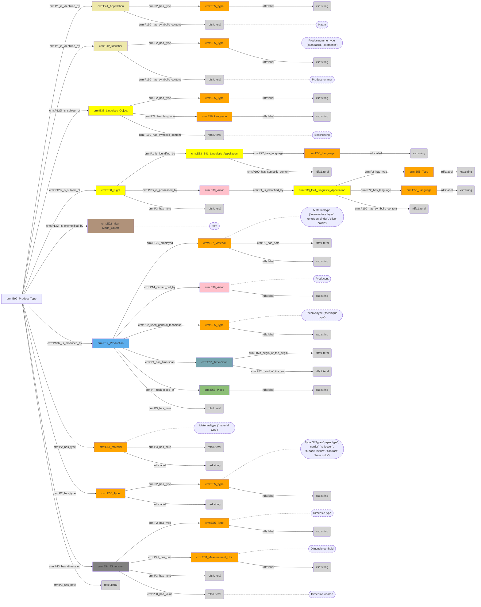

```mermaid
graph LR
style 51056852-4726-11ee-974d-00163e71351b_s stroke-dasharray: 5
style 38941328-471b-11ee-a9ac-00163e71351b_s stroke-dasharray: 5
style 3894194a-471b-11ee-a9ac-00163e71351b_s stroke-dasharray: 5
style 76abbe5a-471f-11ee-bc5c-00163e71351b_s stroke-dasharray: 5
style 9475fd4e-4727-11ee-b0c4-00163e71351b_s stroke-dasharray: 5
style 7167cb4c-4728-11ee-a9ac-00163e71351b_s stroke-dasharray: 5
style 908c60d2-4728-11ee-974d-00163e71351b_s stroke-dasharray: 5
style a880579c-471a-11ee-a9ac-00163e71351b_s stroke-dasharray: 5
style a88059e0-471a-11ee-a9ac-00163e71351b_s stroke-dasharray: 5
style a88058e6-471a-11ee-a9ac-00163e71351b_s stroke-dasharray: 5
style af7177de-471f-11ee-bc5c-00163e71351b_s stroke-dasharray: 5
style b015bd80-471a-11ee-974d-00163e71351b_s stroke-dasharray: 5
style b015be84-471a-11ee-974d-00163e71351b_s stroke-dasharray: 5
51056852-4726-11ee-974d-00163e71351b["crm:E57_Material"]-.-51056852-4726-11ee-974d-00163e71351b_s(["Materiaaltype ('intermediate layer', 'emulsion binder', 'silver halide')"])
38941328-471b-11ee-a9ac-00163e71351b["crm:E39_Actor"]-.-38941328-471b-11ee-a9ac-00163e71351b_s(["Producent"])
3894194a-471b-11ee-a9ac-00163e71351b["crm:E55_Type"]-.-3894194a-471b-11ee-a9ac-00163e71351b_s(["Techniektype ('technique type')"])
76abbe5a-471f-11ee-bc5c-00163e71351b["rdfs:Literal"]-.-76abbe5a-471f-11ee-bc5c-00163e71351b_s(["Naam"])
9475fd4e-4727-11ee-b0c4-00163e71351b["crm:E22_Man-Made_Object"]-.-9475fd4e-4727-11ee-b0c4-00163e71351b_s(["Item"])
7167cb4c-4728-11ee-a9ac-00163e71351b["crm:E57_Material"]-.-7167cb4c-4728-11ee-a9ac-00163e71351b_s(["Materiaaltype ('material type')"])
908c60d2-4728-11ee-974d-00163e71351b["crm:E55_Type"]-.-908c60d2-4728-11ee-974d-00163e71351b_s(["Type Of Type ('paper type', 'carrier', 'reflection', 'surface texture', 'contrast', 'base color')"])
a880579c-471a-11ee-a9ac-00163e71351b["crm:E55_Type"]-.-a880579c-471a-11ee-a9ac-00163e71351b_s(["Dimensie type"])
a88059e0-471a-11ee-a9ac-00163e71351b["rdfs:Literal"]-.-a88059e0-471a-11ee-a9ac-00163e71351b_s(["Dimensie waarde"])
a88058e6-471a-11ee-a9ac-00163e71351b["crm:E58_Measurement_Unit"]-.-a88058e6-471a-11ee-a9ac-00163e71351b_s(["Dimensie eenheid"])
af7177de-471f-11ee-bc5c-00163e71351b["rdfs:Literal"]-.-af7177de-471f-11ee-bc5c-00163e71351b_s(["Beschrijving"])
b015bd80-471a-11ee-974d-00163e71351b["rdfs:Literal"]-.-b015bd80-471a-11ee-974d-00163e71351b_s(["Productnummer"])
b015be84-471a-11ee-974d-00163e71351b["crm:E55_Type"]-.-b015be84-471a-11ee-974d-00163e71351b_s(["Productnummer type ('standaard', 'alternatief')"])
38940d7e-471b-11ee-a9ac-00163e71351b["crm:E12_Production"]-->|"crm:P126_employed"|51056852-4726-11ee-974d-00163e71351b["crm:E57_Material"]
38940d7e-471b-11ee-a9ac-00163e71351b["crm:E12_Production"]-->|"crm:P14_carried_out_by"|38941328-471b-11ee-a9ac-00163e71351b["crm:E39_Actor"]
38940d7e-471b-11ee-a9ac-00163e71351b["crm:E12_Production"]-->|"crm:P32_used_general_technique"|3894194a-471b-11ee-a9ac-00163e71351b["crm:E55_Type"]
38940d7e-471b-11ee-a9ac-00163e71351b["crm:E12_Production"]-->|"crm:P4_has_time-span"|389410f8-471b-11ee-a9ac-00163e71351b["crm:E52_Time-Span"]
38940d7e-471b-11ee-a9ac-00163e71351b["crm:E12_Production"]-->|"crm:P7_took_place_at"|988f944c-47d3-11ee-a9ac-00163e71351b["crm:E53_Place"]
76abb8f6-471f-11ee-bc5c-00163e71351b["crm:E41_Appellation"]-->|"crm:P2_has_type"|76abc026-471f-11ee-bc5c-00163e71351b["crm:E55_Type"]
7892caec-471a-11ee-a9ac-00163e71351b["crm:E99_Product_Type"]-->|"crm:P1_is_identified_by"|76abb8f6-471f-11ee-bc5c-00163e71351b["crm:E41_Appellation"]
7892caec-471a-11ee-a9ac-00163e71351b["crm:E99_Product_Type"]-->|"crm:P1_is_identified_by"|b015b84e-471a-11ee-974d-00163e71351b["crm:E42_Identifier"]
7892caec-471a-11ee-a9ac-00163e71351b["crm:E99_Product_Type"]-->|"crm:P129i_is_subject_of"|af71743c-471f-11ee-bc5c-00163e71351b["crm:E33_Linguistic_Object"]
7892caec-471a-11ee-a9ac-00163e71351b["crm:E99_Product_Type"]-->|"crm:P129i_is_subject_of"|c8d02752-471f-11ee-974d-00163e71351b["crm:E30_Right"]
7892caec-471a-11ee-a9ac-00163e71351b["crm:E99_Product_Type"]-->|"crm:P137i_is_exemplified_by"|9475fd4e-4727-11ee-b0c4-00163e71351b["crm:E22_Man-Made_Object"]
7892caec-471a-11ee-a9ac-00163e71351b["crm:E99_Product_Type"]-->|"crm:P186i_is_produced_by"|38940d7e-471b-11ee-a9ac-00163e71351b["crm:E12_Production"]
7892caec-471a-11ee-a9ac-00163e71351b["crm:E99_Product_Type"]-->|"crm:P2_has_type"|7167cb4c-4728-11ee-a9ac-00163e71351b["crm:E57_Material"]
7892caec-471a-11ee-a9ac-00163e71351b["crm:E99_Product_Type"]-->|"crm:P2_has_type"|908c5cfe-4728-11ee-974d-00163e71351b["crm:E55_Type"]
7892caec-471a-11ee-a9ac-00163e71351b["crm:E99_Product_Type"]-->|"crm:P43_has_dimension"|a8804d10-471a-11ee-a9ac-00163e71351b["crm:E54_Dimension"]
908c5cfe-4728-11ee-974d-00163e71351b["crm:E55_Type"]-->|"crm:P2_has_type"|908c60d2-4728-11ee-974d-00163e71351b["crm:E55_Type"]
a8804d10-471a-11ee-a9ac-00163e71351b["crm:E54_Dimension"]-->|"crm:P2_has_type"|a880579c-471a-11ee-a9ac-00163e71351b["crm:E55_Type"]
a8804d10-471a-11ee-a9ac-00163e71351b["crm:E54_Dimension"]-->|"crm:P91_has_unit"|a88058e6-471a-11ee-a9ac-00163e71351b["crm:E58_Measurement_Unit"]
af71743c-471f-11ee-bc5c-00163e71351b["crm:E33_Linguistic_Object"]-->|"crm:P2_has_type"|af717a0e-471f-11ee-bc5c-00163e71351b["crm:E55_Type"]
af71743c-471f-11ee-bc5c-00163e71351b["crm:E33_Linguistic_Object"]-->|"crm:P72_has_language"|af717bd0-471f-11ee-bc5c-00163e71351b["crm:E56_Language"]
b015b84e-471a-11ee-974d-00163e71351b["crm:E42_Identifier"]-->|"crm:P2_has_type"|b015be84-471a-11ee-974d-00163e71351b["crm:E55_Type"]
c8d02752-471f-11ee-974d-00163e71351b["crm:E30_Right"]-->|"crm:P1_is_identified_by"|c8d0312a-471f-11ee-974d-00163e71351b["crm:E33_E41_Linguistic_Appellation"]
c8d02752-471f-11ee-974d-00163e71351b["crm:E30_Right"]-->|"crm:P75i_is_possessed_by"|c8d02f54-471f-11ee-974d-00163e71351b["crm:E39_Actor"]
c8d02f54-471f-11ee-974d-00163e71351b["crm:E39_Actor"]-->|"crm:P1_is_identified_by"|c8d035a8-471f-11ee-974d-00163e71351b["crm:E33_E41_Linguistic_Appellation"]
c8d0312a-471f-11ee-974d-00163e71351b["crm:E33_E41_Linguistic_Appellation"]-->|"crm:P72_has_language"|c8d032f6-471f-11ee-974d-00163e71351b["crm:E56_Language"]
c8d035a8-471f-11ee-974d-00163e71351b["crm:E33_E41_Linguistic_Appellation"]-->|"crm:P2_has_type"|c8d02ba8-471f-11ee-974d-00163e71351b["crm:E55_Type"]
c8d035a8-471f-11ee-974d-00163e71351b["crm:E33_E41_Linguistic_Appellation"]-->|"crm:P72_has_language"|c8d03698-471f-11ee-974d-00163e71351b["crm:E56_Language"]
38940d7e-471b-11ee-a9ac-00163e71351b["crm:E12_Production"]-->|"crm:P3_has_note"|38941d82-471b-11ee-a9ac-00163e71351b(rdfs:Literal)
389410f8-471b-11ee-a9ac-00163e71351b["crm:E52_Time-Span"]-->|"crm:P82a_begin_of_the_begin"|38941ca6-471b-11ee-a9ac-00163e71351b(rdfs:Literal)
389410f8-471b-11ee-a9ac-00163e71351b["crm:E52_Time-Span"]-->|"crm:P82b_end_of_the_end"|389415da-471b-11ee-a9ac-00163e71351b(rdfs:Literal)
38941328-471b-11ee-a9ac-00163e71351b["crm:E39_Actor"]-->|"rdfs:label"|38941792-471b-11ee-a9ac-00163e71351b(xsd:string)
3894194a-471b-11ee-a9ac-00163e71351b["crm:E55_Type"]-->|"rdfs:label"|389414f4-471b-11ee-a9ac-00163e71351b(xsd:string)
51056852-4726-11ee-974d-00163e71351b["crm:E57_Material"]-->|"crm:P3_has_note"|51056f5a-4726-11ee-974d-00163e71351b(rdfs:Literal)
51056852-4726-11ee-974d-00163e71351b["crm:E57_Material"]-->|"rdfs:label"|51057202-4726-11ee-974d-00163e71351b(xsd:string)
7167cb4c-4728-11ee-a9ac-00163e71351b["crm:E57_Material"]-->|"crm:P3_has_note"|7167d0b0-4728-11ee-a9ac-00163e71351b(rdfs:Literal)
7167cb4c-4728-11ee-a9ac-00163e71351b["crm:E57_Material"]-->|"rdfs:label"|7167d27c-4728-11ee-a9ac-00163e71351b(xsd:string)
76abb8f6-471f-11ee-bc5c-00163e71351b["crm:E41_Appellation"]-->|"crm:P190_has_symbolic_content"|76abbe5a-471f-11ee-bc5c-00163e71351b(rdfs:Literal)
76abc026-471f-11ee-bc5c-00163e71351b["crm:E55_Type"]-->|"rdfs:label"|76abc1a2-471f-11ee-bc5c-00163e71351b(xsd:string)
7892caec-471a-11ee-a9ac-00163e71351b["crm:E99_Product_Type"]-->|"crm:P3_has_note"|800ef872-471f-11ee-b0c4-00163e71351b(rdfs:Literal)
908c5cfe-4728-11ee-974d-00163e71351b["crm:E55_Type"]-->|"rdfs:label"|908c621c-4728-11ee-974d-00163e71351b(xsd:string)
908c60d2-4728-11ee-974d-00163e71351b["crm:E55_Type"]-->|"rdfs:label"|908c6316-4728-11ee-974d-00163e71351b(xsd:string)
988f944c-47d3-11ee-a9ac-00163e71351b["crm:E53_Place"]-->|"rdfs:label"|ced6dd58-47d3-11ee-bc5c-00163e71351b(xsd:string)
a8804d10-471a-11ee-a9ac-00163e71351b["crm:E54_Dimension"]-->|"crm:P3_has_note"|a8805cb0-471a-11ee-a9ac-00163e71351b(rdfs:Literal)
a8804d10-471a-11ee-a9ac-00163e71351b["crm:E54_Dimension"]-->|"crm:P90_has_value"|a88059e0-471a-11ee-a9ac-00163e71351b(rdfs:Literal)
a880579c-471a-11ee-a9ac-00163e71351b["crm:E55_Type"]-->|"rdfs:label"|a8805ada-471a-11ee-a9ac-00163e71351b(xsd:string)
a88058e6-471a-11ee-a9ac-00163e71351b["crm:E58_Measurement_Unit"]-->|"rdfs:label"|a8805bc0-471a-11ee-a9ac-00163e71351b(xsd:string)
af71743c-471f-11ee-bc5c-00163e71351b["crm:E33_Linguistic_Object"]-->|"crm:P190_has_symbolic_content"|af7177de-471f-11ee-bc5c-00163e71351b(rdfs:Literal)
af717a0e-471f-11ee-bc5c-00163e71351b["crm:E55_Type"]-->|"rdfs:label"|af717914-471f-11ee-bc5c-00163e71351b(xsd:string)
af717bd0-471f-11ee-bc5c-00163e71351b["crm:E56_Language"]-->|"rdfs:label"|af717af4-471f-11ee-bc5c-00163e71351b(xsd:string)
b015b84e-471a-11ee-974d-00163e71351b["crm:E42_Identifier"]-->|"crm:P190_has_symbolic_content"|b015bd80-471a-11ee-974d-00163e71351b(rdfs:Literal)
b015be84-471a-11ee-974d-00163e71351b["crm:E55_Type"]-->|"rdfs:label"|b015bc40-471a-11ee-974d-00163e71351b(xsd:string)
c8d02752-471f-11ee-974d-00163e71351b["crm:E30_Right"]-->|"crm:P3_has_note"|c8d034b8-471f-11ee-974d-00163e71351b(rdfs:Literal)
c8d02ba8-471f-11ee-974d-00163e71351b["crm:E55_Type"]-->|"rdfs:label"|c8d02e64-471f-11ee-974d-00163e71351b(xsd:string)
c8d0312a-471f-11ee-974d-00163e71351b["crm:E33_E41_Linguistic_Appellation"]-->|"crm:P190_has_symbolic_content"|c8d03210-471f-11ee-974d-00163e71351b(rdfs:Literal)
c8d032f6-471f-11ee-974d-00163e71351b["crm:E56_Language"]-->|"rdfs:label"|c8d033d2-471f-11ee-974d-00163e71351b(xsd:string)
c8d035a8-471f-11ee-974d-00163e71351b["crm:E33_E41_Linguistic_Appellation"]-->|"crm:P190_has_symbolic_content"|c8d02d56-471f-11ee-974d-00163e71351b(rdfs:Literal)
c8d03698-471f-11ee-974d-00163e71351b["crm:E56_Language"]-->|"rdfs:label"|c8d0303a-471f-11ee-974d-00163e71351b(xsd:string)
style 38940d7e-471b-11ee-a9ac-00163e71351b fill:#5DAEEC
style 389410f8-471b-11ee-a9ac-00163e71351b fill:#76A5AF
style 38941328-471b-11ee-a9ac-00163e71351b fill:#ffc0cb
style 389414f4-471b-11ee-a9ac-00163e71351b fill:#D3D3D3
style 389415da-471b-11ee-a9ac-00163e71351b fill:#D3D3D3
style 38941792-471b-11ee-a9ac-00163e71351b fill:#D3D3D3
style 3894194a-471b-11ee-a9ac-00163e71351b fill:#ffa500
style 38941ca6-471b-11ee-a9ac-00163e71351b fill:#D3D3D3
style 38941d82-471b-11ee-a9ac-00163e71351b fill:#D3D3D3
style 51056852-4726-11ee-974d-00163e71351b fill:#ffa500
style 51056f5a-4726-11ee-974d-00163e71351b fill:#D3D3D3
style 51057202-4726-11ee-974d-00163e71351b fill:#D3D3D3
style 7167cb4c-4728-11ee-a9ac-00163e71351b fill:#ffa500
style 7167d0b0-4728-11ee-a9ac-00163e71351b fill:#D3D3D3
style 7167d27c-4728-11ee-a9ac-00163e71351b fill:#D3D3D3
style 76abb8f6-471f-11ee-bc5c-00163e71351b fill:#EEE8AA
style 76abbe5a-471f-11ee-bc5c-00163e71351b fill:#D3D3D3
style 76abc026-471f-11ee-bc5c-00163e71351b fill:#ffa500
style 76abc1a2-471f-11ee-bc5c-00163e71351b fill:#D3D3D3
style 800ef872-471f-11ee-b0c4-00163e71351b fill:#D3D3D3
style 908c5cfe-4728-11ee-974d-00163e71351b fill:#ffa500
style 908c60d2-4728-11ee-974d-00163e71351b fill:#ffa500
style 908c621c-4728-11ee-974d-00163e71351b fill:#D3D3D3
style 908c6316-4728-11ee-974d-00163e71351b fill:#D3D3D3
style 9475fd4e-4727-11ee-b0c4-00163e71351b fill:#B0927A
style 988f944c-47d3-11ee-a9ac-00163e71351b fill:#8CBF76
style a8804d10-471a-11ee-a9ac-00163e71351b fill:#808080
style a880579c-471a-11ee-a9ac-00163e71351b fill:#ffa500
style a88058e6-471a-11ee-a9ac-00163e71351b fill:#ffa500
style a88059e0-471a-11ee-a9ac-00163e71351b fill:#D3D3D3
style a8805ada-471a-11ee-a9ac-00163e71351b fill:#D3D3D3
style a8805bc0-471a-11ee-a9ac-00163e71351b fill:#D3D3D3
style a8805cb0-471a-11ee-a9ac-00163e71351b fill:#D3D3D3
style af71743c-471f-11ee-bc5c-00163e71351b fill:#ffff00
style af7177de-471f-11ee-bc5c-00163e71351b fill:#D3D3D3
style af717914-471f-11ee-bc5c-00163e71351b fill:#D3D3D3
style af717a0e-471f-11ee-bc5c-00163e71351b fill:#ffa500
style af717af4-471f-11ee-bc5c-00163e71351b fill:#D3D3D3
style af717bd0-471f-11ee-bc5c-00163e71351b fill:#ffa500
style b015b84e-471a-11ee-974d-00163e71351b fill:#EEE8AA
style b015bc40-471a-11ee-974d-00163e71351b fill:#D3D3D3
style b015bd80-471a-11ee-974d-00163e71351b fill:#D3D3D3
style b015be84-471a-11ee-974d-00163e71351b fill:#ffa500
style c8d02752-471f-11ee-974d-00163e71351b fill:#ffff00
style c8d02ba8-471f-11ee-974d-00163e71351b fill:#ffa500
style c8d02d56-471f-11ee-974d-00163e71351b fill:#D3D3D3
style c8d02e64-471f-11ee-974d-00163e71351b fill:#D3D3D3
style c8d02f54-471f-11ee-974d-00163e71351b fill:#ffc0cb
style c8d0303a-471f-11ee-974d-00163e71351b fill:#D3D3D3
style c8d0312a-471f-11ee-974d-00163e71351b fill:#ffff00
style c8d03210-471f-11ee-974d-00163e71351b fill:#D3D3D3
style c8d032f6-471f-11ee-974d-00163e71351b fill:#ffa500
style c8d033d2-471f-11ee-974d-00163e71351b fill:#D3D3D3
style c8d034b8-471f-11ee-974d-00163e71351b fill:#D3D3D3
style c8d035a8-471f-11ee-974d-00163e71351b fill:#ffff00
style c8d03698-471f-11ee-974d-00163e71351b fill:#ffa500
style ced6dd58-47d3-11ee-bc5c-00163e71351b fill:#D3D3D3
```
