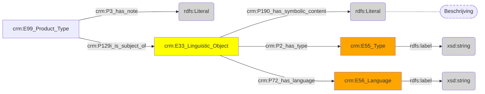

```mermaid
graph LR
af7177de-471f-11ee-bc5c-00163e71351b["rdfs:Literal"]-.-af7177de-471f-11ee-bc5c-00163e71351b_s(["Beschrijving"])
7892caec-471a-11ee-a9ac-00163e71351b["crm:E99_Product_Type"]-->|"crm:P3_has_note"|800ef872-471f-11ee-b0c4-00163e71351b(rdfs:Literal)
af71743c-471f-11ee-bc5c-00163e71351b["crm:E33_Linguistic_Object"]-->|"crm:P190_has_symbolic_content"|af7177de-471f-11ee-bc5c-00163e71351b(rdfs:Literal)
af717a0e-471f-11ee-bc5c-00163e71351b["crm:E55_Type"]-->|"rdfs:label"|af717914-471f-11ee-bc5c-00163e71351b(xsd:string)
af717bd0-471f-11ee-bc5c-00163e71351b["crm:E56_Language"]-->|"rdfs:label"|af717af4-471f-11ee-bc5c-00163e71351b(xsd:string)
style af7177de-471f-11ee-bc5c-00163e71351b_s stroke-dasharray: 5
style 800ef872-471f-11ee-b0c4-00163e71351b fill:#D3D3D3
style af71743c-471f-11ee-bc5c-00163e71351b fill:#ffff00
style af7177de-471f-11ee-bc5c-00163e71351b fill:#D3D3D3
style af717914-471f-11ee-bc5c-00163e71351b fill:#D3D3D3
style af717a0e-471f-11ee-bc5c-00163e71351b fill:#ffa500
style af717af4-471f-11ee-bc5c-00163e71351b fill:#D3D3D3
style af717bd0-471f-11ee-bc5c-00163e71351b fill:#ffa500
7892caec-471a-11ee-a9ac-00163e71351b["crm:E99_Product_Type"]-->|"crm:P129i_is_subject_of"|af71743c-471f-11ee-bc5c-00163e71351b["crm:E33_Linguistic_Object"]
af71743c-471f-11ee-bc5c-00163e71351b["crm:E33_Linguistic_Object"]-->|"crm:P2_has_type"|af717a0e-471f-11ee-bc5c-00163e71351b["crm:E55_Type"]
af71743c-471f-11ee-bc5c-00163e71351b["crm:E33_Linguistic_Object"]-->|"crm:P72_has_language"|af717bd0-471f-11ee-bc5c-00163e71351b["crm:E56_Language"]
```
