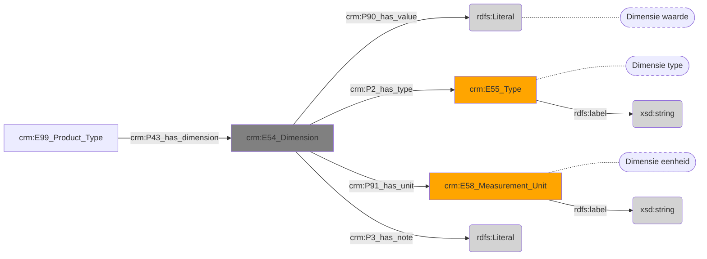

```mermaid
graph LR
a880579c-471a-11ee-a9ac-00163e71351b["crm:E55_Type"]-.-a880579c-471a-11ee-a9ac-00163e71351b_s(["Dimensie type"])
a88059e0-471a-11ee-a9ac-00163e71351b["rdfs:Literal"]-.-a88059e0-471a-11ee-a9ac-00163e71351b_s(["Dimensie waarde"])
a88058e6-471a-11ee-a9ac-00163e71351b["crm:E58_Measurement_Unit"]-.-a88058e6-471a-11ee-a9ac-00163e71351b_s(["Dimensie eenheid"])
a8804d10-471a-11ee-a9ac-00163e71351b["crm:E54_Dimension"]-->|"crm:P3_has_note"|a8805cb0-471a-11ee-a9ac-00163e71351b(rdfs:Literal)
a8804d10-471a-11ee-a9ac-00163e71351b["crm:E54_Dimension"]-->|"crm:P90_has_value"|a88059e0-471a-11ee-a9ac-00163e71351b(rdfs:Literal)
a880579c-471a-11ee-a9ac-00163e71351b["crm:E55_Type"]-->|"rdfs:label"|a8805ada-471a-11ee-a9ac-00163e71351b(xsd:string)
a88058e6-471a-11ee-a9ac-00163e71351b["crm:E58_Measurement_Unit"]-->|"rdfs:label"|a8805bc0-471a-11ee-a9ac-00163e71351b(xsd:string)
style a880579c-471a-11ee-a9ac-00163e71351b_s stroke-dasharray: 5
style a88059e0-471a-11ee-a9ac-00163e71351b_s stroke-dasharray: 5
style a88058e6-471a-11ee-a9ac-00163e71351b_s stroke-dasharray: 5
style a8804d10-471a-11ee-a9ac-00163e71351b fill:#808080
style a880579c-471a-11ee-a9ac-00163e71351b fill:#ffa500
style a88058e6-471a-11ee-a9ac-00163e71351b fill:#ffa500
style a88059e0-471a-11ee-a9ac-00163e71351b fill:#D3D3D3
style a8805ada-471a-11ee-a9ac-00163e71351b fill:#D3D3D3
style a8805bc0-471a-11ee-a9ac-00163e71351b fill:#D3D3D3
style a8805cb0-471a-11ee-a9ac-00163e71351b fill:#D3D3D3
7892caec-471a-11ee-a9ac-00163e71351b["crm:E99_Product_Type"]-->|"crm:P43_has_dimension"|a8804d10-471a-11ee-a9ac-00163e71351b["crm:E54_Dimension"]
a8804d10-471a-11ee-a9ac-00163e71351b["crm:E54_Dimension"]-->|"crm:P2_has_type"|a880579c-471a-11ee-a9ac-00163e71351b["crm:E55_Type"]
a8804d10-471a-11ee-a9ac-00163e71351b["crm:E54_Dimension"]-->|"crm:P91_has_unit"|a88058e6-471a-11ee-a9ac-00163e71351b["crm:E58_Measurement_Unit"]
```
