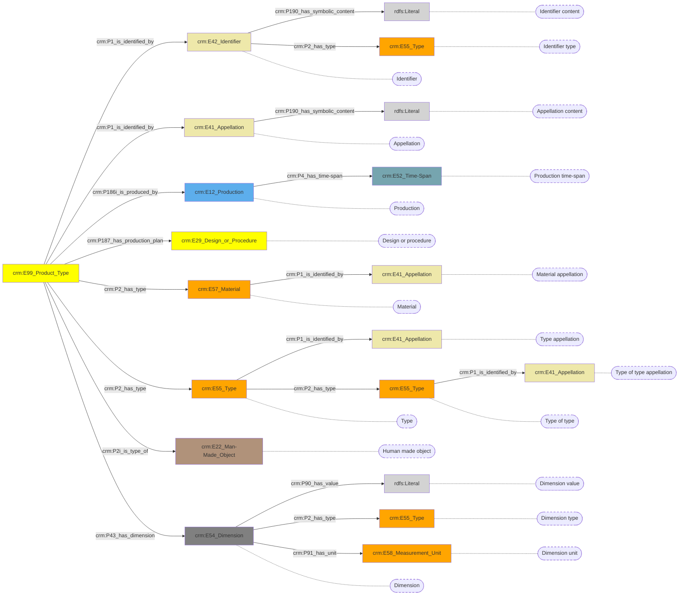

```mermaid
graph LR
b4577e08-419b-11ee-974d-00163e71351b["crm:E42_Identifier"]-->|"crm:P190_has_symbolic_content"|ba0378a4-41b7-11ee-bc5c-00163e71351b(rdfs:Literal)
b5dcd290-419c-11ee-a9ac-00163e71351b["crm:E54_Dimension"]-->|"crm:P90_has_value"|0b9fce9a-41c9-11ee-a9ac-00163e71351b(rdfs:Literal)
d18f8290-419b-11ee-bc5c-00163e71351b["crm:E41_Appellation"]-->|"crm:P190_has_symbolic_content"|1fab94c0-41b8-11ee-bc5c-00163e71351b(rdfs:Literal)
57a33caa-419c-11ee-974d-00163e71351b["crm:E12_Production"]-->|"crm:P4_has_time-span"|31a65618-41c9-11ee-974d-00163e71351b["crm:E52_Time-Span"]
614c3f46-419b-11ee-a9ac-00163e71351b["crm:E99_Product_Type"]-->|"crm:P1_is_identified_by"|b4577e08-419b-11ee-974d-00163e71351b["crm:E42_Identifier"]
614c3f46-419b-11ee-a9ac-00163e71351b["crm:E99_Product_Type"]-->|"crm:P1_is_identified_by"|d18f8290-419b-11ee-bc5c-00163e71351b["crm:E41_Appellation"]
614c3f46-419b-11ee-a9ac-00163e71351b["crm:E99_Product_Type"]-->|"crm:P186i_is_produced_by"|57a33caa-419c-11ee-974d-00163e71351b["crm:E12_Production"]
614c3f46-419b-11ee-a9ac-00163e71351b["crm:E99_Product_Type"]-->|"crm:P187_has_production_plan"|9c03a2b8-419c-11ee-b0c4-00163e71351b["crm:E29_Design_or_Procedure"]
614c3f46-419b-11ee-a9ac-00163e71351b["crm:E99_Product_Type"]-->|"crm:P2_has_type"|7f0e3880-419c-11ee-b0c4-00163e71351b["crm:E57_Material"]
614c3f46-419b-11ee-a9ac-00163e71351b["crm:E99_Product_Type"]-->|"crm:P2_has_type"|a39ff0e0-419b-11ee-974d-00163e71351b["crm:E55_Type"]
614c3f46-419b-11ee-a9ac-00163e71351b["crm:E99_Product_Type"]-->|"crm:P2i_is_type_of"|9c8a3c1e-419d-11ee-bc5c-00163e71351b["crm:E22_Man-Made_Object"]
614c3f46-419b-11ee-a9ac-00163e71351b["crm:E99_Product_Type"]-->|"crm:P43_has_dimension"|b5dcd290-419c-11ee-a9ac-00163e71351b["crm:E54_Dimension"]
7f0e3880-419c-11ee-b0c4-00163e71351b["crm:E57_Material"]-->|"crm:P1_is_identified_by"|5850afa2-41c9-11ee-bc5c-00163e71351b["crm:E41_Appellation"]
9c17b646-41c8-11ee-bc5c-00163e71351b["crm:E55_Type"]-->|"crm:P1_is_identified_by"|c801178e-41c8-11ee-b0c4-00163e71351b["crm:E41_Appellation"]
a39ff0e0-419b-11ee-974d-00163e71351b["crm:E55_Type"]-->|"crm:P1_is_identified_by"|b84c10e6-41c8-11ee-bc5c-00163e71351b["crm:E41_Appellation"]
a39ff0e0-419b-11ee-974d-00163e71351b["crm:E55_Type"]-->|"crm:P2_has_type"|9c17b646-41c8-11ee-bc5c-00163e71351b["crm:E55_Type"]
b4577e08-419b-11ee-974d-00163e71351b["crm:E42_Identifier"]-->|"crm:P2_has_type"|cf616d28-41b7-11ee-974d-00163e71351b["crm:E55_Type"]
b5dcd290-419c-11ee-a9ac-00163e71351b["crm:E54_Dimension"]-->|"crm:P2_has_type"|fd956b48-41c8-11ee-a9ac-00163e71351b["crm:E55_Type"]
b5dcd290-419c-11ee-a9ac-00163e71351b["crm:E54_Dimension"]-->|"crm:P91_has_unit"|e249019c-41c8-11ee-bc5c-00163e71351b["crm:E58_Measurement_Unit"]
style 31a65618-41c9-11ee-974d-00163e71351b_s stroke-dasharray: 5
style b4577e08-419b-11ee-974d-00163e71351b_s stroke-dasharray: 5
style d18f8290-419b-11ee-bc5c-00163e71351b_s stroke-dasharray: 5
style 57a33caa-419c-11ee-974d-00163e71351b_s stroke-dasharray: 5
style 9c03a2b8-419c-11ee-b0c4-00163e71351b_s stroke-dasharray: 5
style 7f0e3880-419c-11ee-b0c4-00163e71351b_s stroke-dasharray: 5
style a39ff0e0-419b-11ee-974d-00163e71351b_s stroke-dasharray: 5
style 9c8a3c1e-419d-11ee-bc5c-00163e71351b_s stroke-dasharray: 5
style b5dcd290-419c-11ee-a9ac-00163e71351b_s stroke-dasharray: 5
style 5850afa2-41c9-11ee-bc5c-00163e71351b_s stroke-dasharray: 5
style c801178e-41c8-11ee-b0c4-00163e71351b_s stroke-dasharray: 5
style b84c10e6-41c8-11ee-bc5c-00163e71351b_s stroke-dasharray: 5
style 9c17b646-41c8-11ee-bc5c-00163e71351b_s stroke-dasharray: 5
style ba0378a4-41b7-11ee-bc5c-00163e71351b_s stroke-dasharray: 5
style cf616d28-41b7-11ee-974d-00163e71351b_s stroke-dasharray: 5
style fd956b48-41c8-11ee-a9ac-00163e71351b_s stroke-dasharray: 5
style 0b9fce9a-41c9-11ee-a9ac-00163e71351b_s stroke-dasharray: 5
style e249019c-41c8-11ee-bc5c-00163e71351b_s stroke-dasharray: 5
style 1fab94c0-41b8-11ee-bc5c-00163e71351b_s stroke-dasharray: 5
31a65618-41c9-11ee-974d-00163e71351b["crm:E52_Time-Span"]-.-31a65618-41c9-11ee-974d-00163e71351b_s(["Production time-span"])
b4577e08-419b-11ee-974d-00163e71351b["crm:E42_Identifier"]-.-b4577e08-419b-11ee-974d-00163e71351b_s(["Identifier"])
d18f8290-419b-11ee-bc5c-00163e71351b["crm:E41_Appellation"]-.-d18f8290-419b-11ee-bc5c-00163e71351b_s(["Appellation"])
57a33caa-419c-11ee-974d-00163e71351b["crm:E12_Production"]-.-57a33caa-419c-11ee-974d-00163e71351b_s(["Production"])
9c03a2b8-419c-11ee-b0c4-00163e71351b["crm:E29_Design_or_Procedure"]-.-9c03a2b8-419c-11ee-b0c4-00163e71351b_s(["Design or procedure"])
7f0e3880-419c-11ee-b0c4-00163e71351b["crm:E57_Material"]-.-7f0e3880-419c-11ee-b0c4-00163e71351b_s(["Material"])
a39ff0e0-419b-11ee-974d-00163e71351b["crm:E55_Type"]-.-a39ff0e0-419b-11ee-974d-00163e71351b_s(["Type"])
9c8a3c1e-419d-11ee-bc5c-00163e71351b["crm:E22_Man-Made_Object"]-.-9c8a3c1e-419d-11ee-bc5c-00163e71351b_s(["Human made object"])
b5dcd290-419c-11ee-a9ac-00163e71351b["crm:E54_Dimension"]-.-b5dcd290-419c-11ee-a9ac-00163e71351b_s(["Dimension"])
5850afa2-41c9-11ee-bc5c-00163e71351b["crm:E41_Appellation"]-.-5850afa2-41c9-11ee-bc5c-00163e71351b_s(["Material appellation"])
c801178e-41c8-11ee-b0c4-00163e71351b["crm:E41_Appellation"]-.-c801178e-41c8-11ee-b0c4-00163e71351b_s(["Type of type appellation"])
b84c10e6-41c8-11ee-bc5c-00163e71351b["crm:E41_Appellation"]-.-b84c10e6-41c8-11ee-bc5c-00163e71351b_s(["Type appellation"])
9c17b646-41c8-11ee-bc5c-00163e71351b["crm:E55_Type"]-.-9c17b646-41c8-11ee-bc5c-00163e71351b_s(["Type of type"])
ba0378a4-41b7-11ee-bc5c-00163e71351b["rdfs:Literal"]-.-ba0378a4-41b7-11ee-bc5c-00163e71351b_s(["Identifier content"])
cf616d28-41b7-11ee-974d-00163e71351b["crm:E55_Type"]-.-cf616d28-41b7-11ee-974d-00163e71351b_s(["Identifier type"])
fd956b48-41c8-11ee-a9ac-00163e71351b["crm:E55_Type"]-.-fd956b48-41c8-11ee-a9ac-00163e71351b_s(["Dimension type"])
0b9fce9a-41c9-11ee-a9ac-00163e71351b["rdfs:Literal"]-.-0b9fce9a-41c9-11ee-a9ac-00163e71351b_s(["Dimension value"])
e249019c-41c8-11ee-bc5c-00163e71351b["crm:E58_Measurement_Unit"]-.-e249019c-41c8-11ee-bc5c-00163e71351b_s(["Dimension unit"])
1fab94c0-41b8-11ee-bc5c-00163e71351b["rdfs:Literal"]-.-1fab94c0-41b8-11ee-bc5c-00163e71351b_s(["Appellation content"])
style 0b9fce9a-41c9-11ee-a9ac-00163e71351b fill:#D3D3D3
style 1fab94c0-41b8-11ee-bc5c-00163e71351b fill:#D3D3D3
style 31a65618-41c9-11ee-974d-00163e71351b fill:#76A5AF
style 57a33caa-419c-11ee-974d-00163e71351b fill:#5DAEEC
style 5850afa2-41c9-11ee-bc5c-00163e71351b fill:#EEE8AA
style 614c3f46-419b-11ee-a9ac-00163e71351b fill:#ffff00
style 7f0e3880-419c-11ee-b0c4-00163e71351b fill:#ffa500
style 9c03a2b8-419c-11ee-b0c4-00163e71351b fill:#ffff00
style 9c17b646-41c8-11ee-bc5c-00163e71351b fill:#ffa500
style 9c8a3c1e-419d-11ee-bc5c-00163e71351b fill:#B0927A
style a39ff0e0-419b-11ee-974d-00163e71351b fill:#ffa500
style b4577e08-419b-11ee-974d-00163e71351b fill:#EEE8AA
style b5dcd290-419c-11ee-a9ac-00163e71351b fill:#808080
style b84c10e6-41c8-11ee-bc5c-00163e71351b fill:#EEE8AA
style ba0378a4-41b7-11ee-bc5c-00163e71351b fill:#D3D3D3
style c801178e-41c8-11ee-b0c4-00163e71351b fill:#EEE8AA
style cf616d28-41b7-11ee-974d-00163e71351b fill:#ffa500
style d18f8290-419b-11ee-bc5c-00163e71351b fill:#EEE8AA
style e249019c-41c8-11ee-bc5c-00163e71351b fill:#ffa500
style fd956b48-41c8-11ee-a9ac-00163e71351b fill:#ffa500
```
