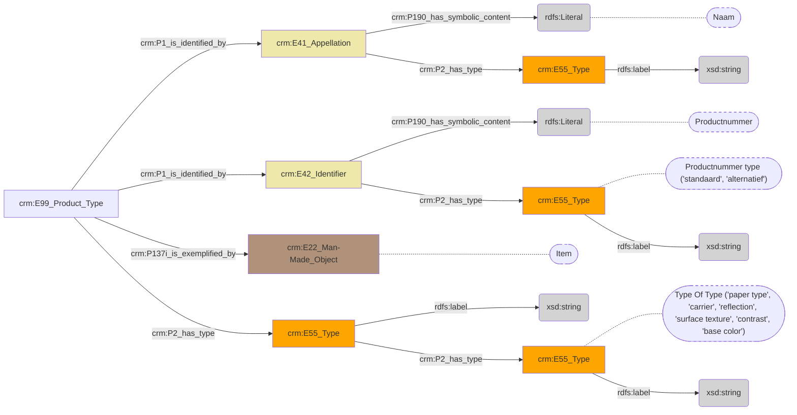

```mermaid
graph LR
76abbe5a-471f-11ee-bc5c-00163e71351b["rdfs:Literal"]-.-76abbe5a-471f-11ee-bc5c-00163e71351b_s(["Naam"])
9475fd4e-4727-11ee-b0c4-00163e71351b["crm:E22_Man-Made_Object"]-.-9475fd4e-4727-11ee-b0c4-00163e71351b_s(["Item"])
908c60d2-4728-11ee-974d-00163e71351b["crm:E55_Type"]-.-908c60d2-4728-11ee-974d-00163e71351b_s(["Type Of Type ('paper type', 'carrier', 'reflection', 'surface texture', 'contrast', 'base color')"])
b015bd80-471a-11ee-974d-00163e71351b["rdfs:Literal"]-.-b015bd80-471a-11ee-974d-00163e71351b_s(["Productnummer"])
b015be84-471a-11ee-974d-00163e71351b["crm:E55_Type"]-.-b015be84-471a-11ee-974d-00163e71351b_s(["Productnummer type ('standaard', 'alternatief')"])
76abb8f6-471f-11ee-bc5c-00163e71351b["crm:E41_Appellation"]-->|"crm:P190_has_symbolic_content"|76abbe5a-471f-11ee-bc5c-00163e71351b(rdfs:Literal)
76abc026-471f-11ee-bc5c-00163e71351b["crm:E55_Type"]-->|"rdfs:label"|76abc1a2-471f-11ee-bc5c-00163e71351b(xsd:string)
908c5cfe-4728-11ee-974d-00163e71351b["crm:E55_Type"]-->|"rdfs:label"|908c621c-4728-11ee-974d-00163e71351b(xsd:string)
908c60d2-4728-11ee-974d-00163e71351b["crm:E55_Type"]-->|"rdfs:label"|908c6316-4728-11ee-974d-00163e71351b(xsd:string)
b015b84e-471a-11ee-974d-00163e71351b["crm:E42_Identifier"]-->|"crm:P190_has_symbolic_content"|b015bd80-471a-11ee-974d-00163e71351b(rdfs:Literal)
b015be84-471a-11ee-974d-00163e71351b["crm:E55_Type"]-->|"rdfs:label"|b015bc40-471a-11ee-974d-00163e71351b(xsd:string)
style 76abb8f6-471f-11ee-bc5c-00163e71351b fill:#EEE8AA
style 76abbe5a-471f-11ee-bc5c-00163e71351b fill:#D3D3D3
style 76abc026-471f-11ee-bc5c-00163e71351b fill:#ffa500
style 76abc1a2-471f-11ee-bc5c-00163e71351b fill:#D3D3D3
style 908c5cfe-4728-11ee-974d-00163e71351b fill:#ffa500
style 908c60d2-4728-11ee-974d-00163e71351b fill:#ffa500
style 908c621c-4728-11ee-974d-00163e71351b fill:#D3D3D3
style 908c6316-4728-11ee-974d-00163e71351b fill:#D3D3D3
style 9475fd4e-4727-11ee-b0c4-00163e71351b fill:#B0927A
style b015b84e-471a-11ee-974d-00163e71351b fill:#EEE8AA
style b015bc40-471a-11ee-974d-00163e71351b fill:#D3D3D3
style b015bd80-471a-11ee-974d-00163e71351b fill:#D3D3D3
style b015be84-471a-11ee-974d-00163e71351b fill:#ffa500
style 76abbe5a-471f-11ee-bc5c-00163e71351b_s stroke-dasharray: 5
style 9475fd4e-4727-11ee-b0c4-00163e71351b_s stroke-dasharray: 5
style 908c60d2-4728-11ee-974d-00163e71351b_s stroke-dasharray: 5
style b015bd80-471a-11ee-974d-00163e71351b_s stroke-dasharray: 5
style b015be84-471a-11ee-974d-00163e71351b_s stroke-dasharray: 5
76abb8f6-471f-11ee-bc5c-00163e71351b["crm:E41_Appellation"]-->|"crm:P2_has_type"|76abc026-471f-11ee-bc5c-00163e71351b["crm:E55_Type"]
7892caec-471a-11ee-a9ac-00163e71351b["crm:E99_Product_Type"]-->|"crm:P1_is_identified_by"|76abb8f6-471f-11ee-bc5c-00163e71351b["crm:E41_Appellation"]
7892caec-471a-11ee-a9ac-00163e71351b["crm:E99_Product_Type"]-->|"crm:P1_is_identified_by"|b015b84e-471a-11ee-974d-00163e71351b["crm:E42_Identifier"]
7892caec-471a-11ee-a9ac-00163e71351b["crm:E99_Product_Type"]-->|"crm:P137i_is_exemplified_by"|9475fd4e-4727-11ee-b0c4-00163e71351b["crm:E22_Man-Made_Object"]
7892caec-471a-11ee-a9ac-00163e71351b["crm:E99_Product_Type"]-->|"crm:P2_has_type"|908c5cfe-4728-11ee-974d-00163e71351b["crm:E55_Type"]
908c5cfe-4728-11ee-974d-00163e71351b["crm:E55_Type"]-->|"crm:P2_has_type"|908c60d2-4728-11ee-974d-00163e71351b["crm:E55_Type"]
b015b84e-471a-11ee-974d-00163e71351b["crm:E42_Identifier"]-->|"crm:P2_has_type"|b015be84-471a-11ee-974d-00163e71351b["crm:E55_Type"]
```
