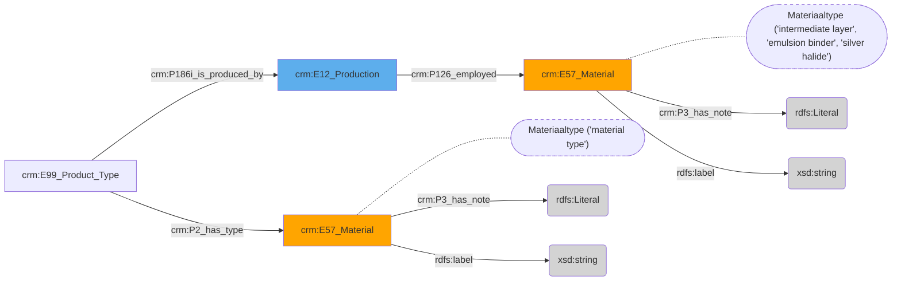

```mermaid
graph LR
51056852-4726-11ee-974d-00163e71351b["crm:E57_Material"]-.-51056852-4726-11ee-974d-00163e71351b_s(["Materiaaltype ('intermediate layer', 'emulsion binder', 'silver halide')"])
7167cb4c-4728-11ee-a9ac-00163e71351b["crm:E57_Material"]-.-7167cb4c-4728-11ee-a9ac-00163e71351b_s(["Materiaaltype ('material type')"])
51056852-4726-11ee-974d-00163e71351b["crm:E57_Material"]-->|"crm:P3_has_note"|51056f5a-4726-11ee-974d-00163e71351b(rdfs:Literal)
51056852-4726-11ee-974d-00163e71351b["crm:E57_Material"]-->|"rdfs:label"|51057202-4726-11ee-974d-00163e71351b(xsd:string)
7167cb4c-4728-11ee-a9ac-00163e71351b["crm:E57_Material"]-->|"crm:P3_has_note"|7167d0b0-4728-11ee-a9ac-00163e71351b(rdfs:Literal)
7167cb4c-4728-11ee-a9ac-00163e71351b["crm:E57_Material"]-->|"rdfs:label"|7167d27c-4728-11ee-a9ac-00163e71351b(xsd:string)
style 38940d7e-471b-11ee-a9ac-00163e71351b fill:#5DAEEC
style 51056852-4726-11ee-974d-00163e71351b fill:#ffa500
style 51056f5a-4726-11ee-974d-00163e71351b fill:#D3D3D3
style 51057202-4726-11ee-974d-00163e71351b fill:#D3D3D3
style 7167cb4c-4728-11ee-a9ac-00163e71351b fill:#ffa500
style 7167d0b0-4728-11ee-a9ac-00163e71351b fill:#D3D3D3
style 7167d27c-4728-11ee-a9ac-00163e71351b fill:#D3D3D3
style 51056852-4726-11ee-974d-00163e71351b_s stroke-dasharray: 5
style 7167cb4c-4728-11ee-a9ac-00163e71351b_s stroke-dasharray: 5
38940d7e-471b-11ee-a9ac-00163e71351b["crm:E12_Production"]-->|"crm:P126_employed"|51056852-4726-11ee-974d-00163e71351b["crm:E57_Material"]
7892caec-471a-11ee-a9ac-00163e71351b["crm:E99_Product_Type"]-->|"crm:P186i_is_produced_by"|38940d7e-471b-11ee-a9ac-00163e71351b["crm:E12_Production"]
7892caec-471a-11ee-a9ac-00163e71351b["crm:E99_Product_Type"]-->|"crm:P2_has_type"|7167cb4c-4728-11ee-a9ac-00163e71351b["crm:E57_Material"]
```
