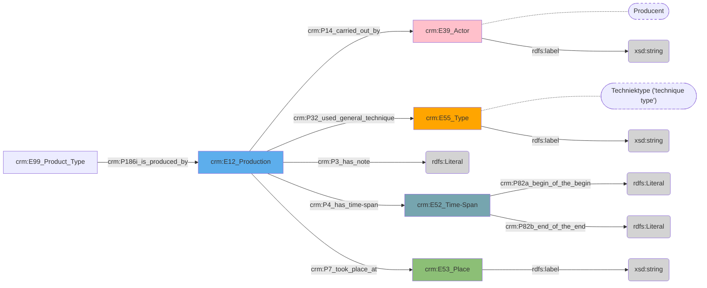

```mermaid
graph LR
38941328-471b-11ee-a9ac-00163e71351b["crm:E39_Actor"]-.-38941328-471b-11ee-a9ac-00163e71351b_s(["Producent"])
3894194a-471b-11ee-a9ac-00163e71351b["crm:E55_Type"]-.-3894194a-471b-11ee-a9ac-00163e71351b_s(["Techniektype ('technique type')"])
38940d7e-471b-11ee-a9ac-00163e71351b["crm:E12_Production"]-->|"crm:P3_has_note"|38941d82-471b-11ee-a9ac-00163e71351b(rdfs:Literal)
389410f8-471b-11ee-a9ac-00163e71351b["crm:E52_Time-Span"]-->|"crm:P82a_begin_of_the_begin"|38941ca6-471b-11ee-a9ac-00163e71351b(rdfs:Literal)
389410f8-471b-11ee-a9ac-00163e71351b["crm:E52_Time-Span"]-->|"crm:P82b_end_of_the_end"|389415da-471b-11ee-a9ac-00163e71351b(rdfs:Literal)
38941328-471b-11ee-a9ac-00163e71351b["crm:E39_Actor"]-->|"rdfs:label"|38941792-471b-11ee-a9ac-00163e71351b(xsd:string)
3894194a-471b-11ee-a9ac-00163e71351b["crm:E55_Type"]-->|"rdfs:label"|389414f4-471b-11ee-a9ac-00163e71351b(xsd:string)
988f944c-47d3-11ee-a9ac-00163e71351b["crm:E53_Place"]-->|"rdfs:label"|ced6dd58-47d3-11ee-bc5c-00163e71351b(xsd:string)
style 38940d7e-471b-11ee-a9ac-00163e71351b fill:#5DAEEC
style 389410f8-471b-11ee-a9ac-00163e71351b fill:#76A5AF
style 38941328-471b-11ee-a9ac-00163e71351b fill:#ffc0cb
style 389414f4-471b-11ee-a9ac-00163e71351b fill:#D3D3D3
style 389415da-471b-11ee-a9ac-00163e71351b fill:#D3D3D3
style 38941792-471b-11ee-a9ac-00163e71351b fill:#D3D3D3
style 3894194a-471b-11ee-a9ac-00163e71351b fill:#ffa500
style 38941ca6-471b-11ee-a9ac-00163e71351b fill:#D3D3D3
style 38941d82-471b-11ee-a9ac-00163e71351b fill:#D3D3D3
style 988f944c-47d3-11ee-a9ac-00163e71351b fill:#8CBF76
style ced6dd58-47d3-11ee-bc5c-00163e71351b fill:#D3D3D3
style 38941328-471b-11ee-a9ac-00163e71351b_s stroke-dasharray: 5
style 3894194a-471b-11ee-a9ac-00163e71351b_s stroke-dasharray: 5
38940d7e-471b-11ee-a9ac-00163e71351b["crm:E12_Production"]-->|"crm:P14_carried_out_by"|38941328-471b-11ee-a9ac-00163e71351b["crm:E39_Actor"]
38940d7e-471b-11ee-a9ac-00163e71351b["crm:E12_Production"]-->|"crm:P32_used_general_technique"|3894194a-471b-11ee-a9ac-00163e71351b["crm:E55_Type"]
38940d7e-471b-11ee-a9ac-00163e71351b["crm:E12_Production"]-->|"crm:P4_has_time-span"|389410f8-471b-11ee-a9ac-00163e71351b["crm:E52_Time-Span"]
38940d7e-471b-11ee-a9ac-00163e71351b["crm:E12_Production"]-->|"crm:P7_took_place_at"|988f944c-47d3-11ee-a9ac-00163e71351b["crm:E53_Place"]
7892caec-471a-11ee-a9ac-00163e71351b["crm:E99_Product_Type"]-->|"crm:P186i_is_produced_by"|38940d7e-471b-11ee-a9ac-00163e71351b["crm:E12_Production"]
```
