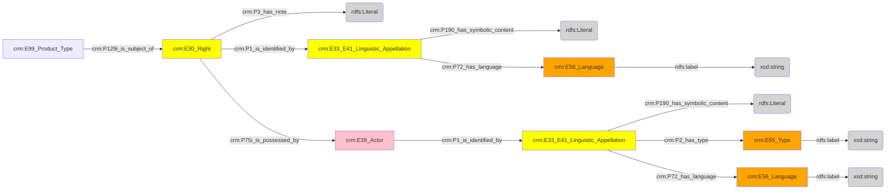

```mermaid
graph LR
c8d02752-471f-11ee-974d-00163e71351b["crm:E30_Right"]-->|"crm:P3_has_note"|c8d034b8-471f-11ee-974d-00163e71351b(rdfs:Literal)
c8d02ba8-471f-11ee-974d-00163e71351b["crm:E55_Type"]-->|"rdfs:label"|c8d02e64-471f-11ee-974d-00163e71351b(xsd:string)
c8d0312a-471f-11ee-974d-00163e71351b["crm:E33_E41_Linguistic_Appellation"]-->|"crm:P190_has_symbolic_content"|c8d03210-471f-11ee-974d-00163e71351b(rdfs:Literal)
c8d032f6-471f-11ee-974d-00163e71351b["crm:E56_Language"]-->|"rdfs:label"|c8d033d2-471f-11ee-974d-00163e71351b(xsd:string)
c8d035a8-471f-11ee-974d-00163e71351b["crm:E33_E41_Linguistic_Appellation"]-->|"crm:P190_has_symbolic_content"|c8d02d56-471f-11ee-974d-00163e71351b(rdfs:Literal)
c8d03698-471f-11ee-974d-00163e71351b["crm:E56_Language"]-->|"rdfs:label"|c8d0303a-471f-11ee-974d-00163e71351b(xsd:string)
style c8d02752-471f-11ee-974d-00163e71351b fill:#ffff00
style c8d02ba8-471f-11ee-974d-00163e71351b fill:#ffa500
style c8d02d56-471f-11ee-974d-00163e71351b fill:#D3D3D3
style c8d02e64-471f-11ee-974d-00163e71351b fill:#D3D3D3
style c8d02f54-471f-11ee-974d-00163e71351b fill:#ffc0cb
style c8d0303a-471f-11ee-974d-00163e71351b fill:#D3D3D3
style c8d0312a-471f-11ee-974d-00163e71351b fill:#ffff00
style c8d03210-471f-11ee-974d-00163e71351b fill:#D3D3D3
style c8d032f6-471f-11ee-974d-00163e71351b fill:#ffa500
style c8d033d2-471f-11ee-974d-00163e71351b fill:#D3D3D3
style c8d034b8-471f-11ee-974d-00163e71351b fill:#D3D3D3
style c8d035a8-471f-11ee-974d-00163e71351b fill:#ffff00
style c8d03698-471f-11ee-974d-00163e71351b fill:#ffa500
7892caec-471a-11ee-a9ac-00163e71351b["crm:E99_Product_Type"]-->|"crm:P129i_is_subject_of"|c8d02752-471f-11ee-974d-00163e71351b["crm:E30_Right"]
c8d02752-471f-11ee-974d-00163e71351b["crm:E30_Right"]-->|"crm:P1_is_identified_by"|c8d0312a-471f-11ee-974d-00163e71351b["crm:E33_E41_Linguistic_Appellation"]
c8d02752-471f-11ee-974d-00163e71351b["crm:E30_Right"]-->|"crm:P75i_is_possessed_by"|c8d02f54-471f-11ee-974d-00163e71351b["crm:E39_Actor"]
c8d02f54-471f-11ee-974d-00163e71351b["crm:E39_Actor"]-->|"crm:P1_is_identified_by"|c8d035a8-471f-11ee-974d-00163e71351b["crm:E33_E41_Linguistic_Appellation"]
c8d0312a-471f-11ee-974d-00163e71351b["crm:E33_E41_Linguistic_Appellation"]-->|"crm:P72_has_language"|c8d032f6-471f-11ee-974d-00163e71351b["crm:E56_Language"]
c8d035a8-471f-11ee-974d-00163e71351b["crm:E33_E41_Linguistic_Appellation"]-->|"crm:P2_has_type"|c8d02ba8-471f-11ee-974d-00163e71351b["crm:E55_Type"]
c8d035a8-471f-11ee-974d-00163e71351b["crm:E33_E41_Linguistic_Appellation"]-->|"crm:P72_has_language"|c8d03698-471f-11ee-974d-00163e71351b["crm:E56_Language"]
```
