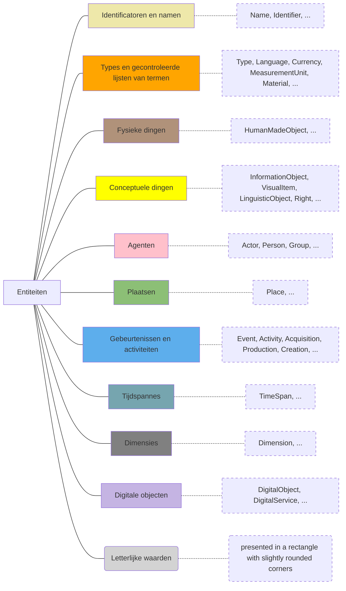

```mermaid
graph LR

00[Entiteiten]---09
00[Entiteiten]---11
00[Entiteiten]---03
00[Entiteiten]---04
00[Entiteiten]---05
00[Entiteiten]---10
00[Entiteiten]---01
00[Entiteiten]---02
00[Entiteiten]---07
00[Entiteiten]---06
00[Entiteiten]---08

01[Gebeurtenissen en activiteiten]-.-01vb[Event, Activity, Acquisition, Production, Creation, ...]
style 01 fill: #5DAEEC
style 01vb stroke-dasharray: 5
03[Fysieke dingen]-.-03vb[HumanMadeObject, ...]
style 03 fill: #B0927A
style 03vb stroke-dasharray: 5
02[Tijdspannes]-.-02vb[TimeSpan, ...]
style 02 fill: #76A5AF
style 02vb stroke-dasharray: 5
05[Agenten]-.-05vb[Actor, Person, Group, ...]
style 05 fill: #ffc0cb
style 05vb stroke-dasharray: 5
06[Digitale objecten]-.-06vb[DigitalObject, DigitalService, ...]
style 06 fill: #C5B4E3
style 06vb stroke-dasharray: 5
07[Dimensies]-.-07vb[Dimension, ...]
style 07 fill: #808080
style 07vb stroke-dasharray: 5
09[Identificatoren en namen]-.-09vb[Name, Identifier, ...]
style 09 fill: #EEE8AA
style 09vb stroke-dasharray: 5
10[Plaatsen]-.-10vb[Place, ...]
style 10 fill: #8CBF76
style 10vb stroke-dasharray: 5
11[Types en gecontroleerde lijsten van termen]-.-11vb[Type, Language, Currency, MeasurementUnit, Material, ...]
style 11 fill: #ffa500
style 11vb stroke-dasharray: 5
04[Conceptuele dingen]-.-04vb[InformationObject, VisualItem, LinguisticObject, Right, ...]
style 04 fill: #ffff00
style 04vb stroke-dasharray: 5
08(Letterlijke waarden)-.-08vb(presented in a rectangle with slightly rounded corners)
style 08 fill: #D3D3D3
style 08vb stroke-dasharray: 5
```
