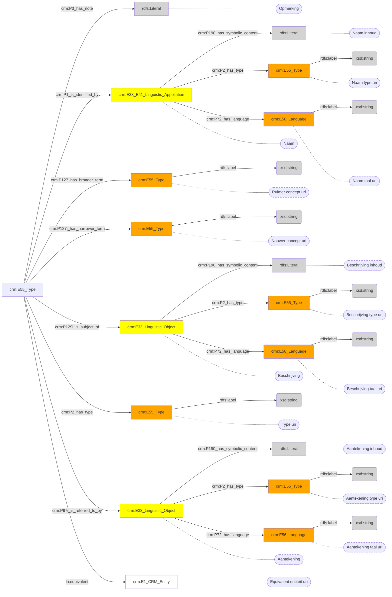

```mermaid
graph LR
184cba22-ee3b-11ed-9064-00163e71351b["crm:E33_Linguistic_Object"]-->|"crm:P190_has_symbolic_content"|184cc21a-ee3b-11ed-9064-00163e71351b(rdfs:Literal)
184cbee6-ee3b-11ed-9064-00163e71351b["crm:E55_Type"]-->|"rdfs:label"|184cc4c2-ee3b-11ed-9064-00163e71351b(xsd:string)
184cc09e-ee3b-11ed-9064-00163e71351b["crm:E56_Language"]-->|"rdfs:label"|184cc36e-ee3b-11ed-9064-00163e71351b(xsd:string)
1dbc99aa-ee3b-11ed-9064-00163e71351b["crm:E33_Linguistic_Object"]-->|"crm:P190_has_symbolic_content"|1dbc9e78-ee3b-11ed-9064-00163e71351b(rdfs:Literal)
1dbca198-ee3b-11ed-9064-00163e71351b["crm:E55_Type"]-->|"rdfs:label"|1dbca01c-ee3b-11ed-9064-00163e71351b(xsd:string)
1dbca44a-ee3b-11ed-9064-00163e71351b["crm:E56_Language"]-->|"rdfs:label"|1dbca2f6-ee3b-11ed-9064-00163e71351b(xsd:string)
5c49f282-be8c-11ed-beba-96a6d245525a["crm:E55_Type"]-->|"crm:P3_has_note"|0a3486e0-ce3d-11ed-9232-00163e71351b(rdfs:Literal)
7440d92c-ce3c-11ed-9232-00163e71351b["crm:E55_Type"]-->|"rdfs:label"|d217fb8e-ce3c-11ed-9655-00163e71351b(xsd:string)
856af5be-c7e5-11ed-af84-00163e71351b["crm:E33_E41_Linguistic_Appellation"]-->|"crm:P190_has_symbolic_content"|856afd7a-c7e5-11ed-af84-00163e71351b(rdfs:Literal)
856afa78-c7e5-11ed-af84-00163e71351b["crm:E56_Language"]-->|"rdfs:label"|c76debe0-ce3b-11ed-9064-00163e71351b(xsd:string)
856afc12-c7e5-11ed-af84-00163e71351b["crm:E55_Type"]-->|"rdfs:label"|856afece-c7e5-11ed-af84-00163e71351b(xsd:string)
94da4416-ce3c-11ed-a1e6-00163e71351b["crm:E55_Type"]-->|"rdfs:label"|c133dbd0-ce3c-11ed-9232-00163e71351b(xsd:string)
a25ea6ca-c7e5-11ed-bbe2-00163e71351b["crm:E55_Type"]-->|"rdfs:label"|a25eab52-c7e5-11ed-bbe2-00163e71351b(xsd:string)
184cba22-ee3b-11ed-9064-00163e71351b["crm:E33_Linguistic_Object"]-->|"crm:P2_has_type"|184cbee6-ee3b-11ed-9064-00163e71351b["crm:E55_Type"]
184cba22-ee3b-11ed-9064-00163e71351b["crm:E33_Linguistic_Object"]-->|"crm:P72_has_language"|184cc09e-ee3b-11ed-9064-00163e71351b["crm:E56_Language"]
1dbc99aa-ee3b-11ed-9064-00163e71351b["crm:E33_Linguistic_Object"]-->|"crm:P2_has_type"|1dbca198-ee3b-11ed-9064-00163e71351b["crm:E55_Type"]
1dbc99aa-ee3b-11ed-9064-00163e71351b["crm:E33_Linguistic_Object"]-->|"crm:P72_has_language"|1dbca44a-ee3b-11ed-9064-00163e71351b["crm:E56_Language"]
5c49f282-be8c-11ed-beba-96a6d245525a["crm:E55_Type"]-->|"crm:P1_is_identified_by"|856af5be-c7e5-11ed-af84-00163e71351b["crm:E33_E41_Linguistic_Appellation"]
5c49f282-be8c-11ed-beba-96a6d245525a["crm:E55_Type"]-->|"crm:P127_has_broader_term"|7440d92c-ce3c-11ed-9232-00163e71351b["crm:E55_Type"]
5c49f282-be8c-11ed-beba-96a6d245525a["crm:E55_Type"]-->|"crm:P127i_has_narrower_term"|94da4416-ce3c-11ed-a1e6-00163e71351b["crm:E55_Type"]
5c49f282-be8c-11ed-beba-96a6d245525a["crm:E55_Type"]-->|"crm:P129i_is_subject_of"|1dbc99aa-ee3b-11ed-9064-00163e71351b["crm:E33_Linguistic_Object"]
5c49f282-be8c-11ed-beba-96a6d245525a["crm:E55_Type"]-->|"crm:P2_has_type"|a25ea6ca-c7e5-11ed-bbe2-00163e71351b["crm:E55_Type"]
5c49f282-be8c-11ed-beba-96a6d245525a["crm:E55_Type"]-->|"crm:P67i_is_referred_to_by"|184cba22-ee3b-11ed-9064-00163e71351b["crm:E33_Linguistic_Object"]
5c49f282-be8c-11ed-beba-96a6d245525a["crm:E55_Type"]-->|"la:equivalent"|bfc145d8-c7e5-11ed-873b-00163e71351b["crm:E1_CRM_Entity"]
856af5be-c7e5-11ed-af84-00163e71351b["crm:E33_E41_Linguistic_Appellation"]-->|"crm:P2_has_type"|856afc12-c7e5-11ed-af84-00163e71351b["crm:E55_Type"]
856af5be-c7e5-11ed-af84-00163e71351b["crm:E33_E41_Linguistic_Appellation"]-->|"crm:P72_has_language"|856afa78-c7e5-11ed-af84-00163e71351b["crm:E56_Language"]
style 184cc21a-ee3b-11ed-9064-00163e71351b_s stroke-dasharray: 5
style 184cbee6-ee3b-11ed-9064-00163e71351b_s stroke-dasharray: 5
style 184cc09e-ee3b-11ed-9064-00163e71351b_s stroke-dasharray: 5
style 1dbc9e78-ee3b-11ed-9064-00163e71351b_s stroke-dasharray: 5
style 1dbca198-ee3b-11ed-9064-00163e71351b_s stroke-dasharray: 5
style 1dbca44a-ee3b-11ed-9064-00163e71351b_s stroke-dasharray: 5
style 856af5be-c7e5-11ed-af84-00163e71351b_s stroke-dasharray: 5
style 7440d92c-ce3c-11ed-9232-00163e71351b_s stroke-dasharray: 5
style 94da4416-ce3c-11ed-a1e6-00163e71351b_s stroke-dasharray: 5
style 1dbc99aa-ee3b-11ed-9064-00163e71351b_s stroke-dasharray: 5
style a25ea6ca-c7e5-11ed-bbe2-00163e71351b_s stroke-dasharray: 5
style 0a3486e0-ce3d-11ed-9232-00163e71351b_s stroke-dasharray: 5
style 184cba22-ee3b-11ed-9064-00163e71351b_s stroke-dasharray: 5
style bfc145d8-c7e5-11ed-873b-00163e71351b_s stroke-dasharray: 5
style 856afd7a-c7e5-11ed-af84-00163e71351b_s stroke-dasharray: 5
style 856afc12-c7e5-11ed-af84-00163e71351b_s stroke-dasharray: 5
style 856afa78-c7e5-11ed-af84-00163e71351b_s stroke-dasharray: 5
184cc21a-ee3b-11ed-9064-00163e71351b["rdfs:Literal"]-.-184cc21a-ee3b-11ed-9064-00163e71351b_s(["Aantekening inhoud"])
184cbee6-ee3b-11ed-9064-00163e71351b["crm:E55_Type"]-.-184cbee6-ee3b-11ed-9064-00163e71351b_s(["Aantekening type uri"])
184cc09e-ee3b-11ed-9064-00163e71351b["crm:E56_Language"]-.-184cc09e-ee3b-11ed-9064-00163e71351b_s(["Aantekening taal uri"])
1dbc9e78-ee3b-11ed-9064-00163e71351b["rdfs:Literal"]-.-1dbc9e78-ee3b-11ed-9064-00163e71351b_s(["Beschrijving inhoud"])
1dbca198-ee3b-11ed-9064-00163e71351b["crm:E55_Type"]-.-1dbca198-ee3b-11ed-9064-00163e71351b_s(["Beschrijving type uri"])
1dbca44a-ee3b-11ed-9064-00163e71351b["crm:E56_Language"]-.-1dbca44a-ee3b-11ed-9064-00163e71351b_s(["Beschrijving taal uri"])
856af5be-c7e5-11ed-af84-00163e71351b["crm:E33_E41_Linguistic_Appellation"]-.-856af5be-c7e5-11ed-af84-00163e71351b_s(["Naam"])
7440d92c-ce3c-11ed-9232-00163e71351b["crm:E55_Type"]-.-7440d92c-ce3c-11ed-9232-00163e71351b_s(["Ruimer concept uri"])
94da4416-ce3c-11ed-a1e6-00163e71351b["crm:E55_Type"]-.-94da4416-ce3c-11ed-a1e6-00163e71351b_s(["Nauwer concept uri"])
1dbc99aa-ee3b-11ed-9064-00163e71351b["crm:E33_Linguistic_Object"]-.-1dbc99aa-ee3b-11ed-9064-00163e71351b_s(["Beschrijving"])
a25ea6ca-c7e5-11ed-bbe2-00163e71351b["crm:E55_Type"]-.-a25ea6ca-c7e5-11ed-bbe2-00163e71351b_s(["Type uri"])
0a3486e0-ce3d-11ed-9232-00163e71351b["rdfs:Literal"]-.-0a3486e0-ce3d-11ed-9232-00163e71351b_s(["Opmerking"])
184cba22-ee3b-11ed-9064-00163e71351b["crm:E33_Linguistic_Object"]-.-184cba22-ee3b-11ed-9064-00163e71351b_s(["Aantekening"])
bfc145d8-c7e5-11ed-873b-00163e71351b["crm:E1_CRM_Entity"]-.-bfc145d8-c7e5-11ed-873b-00163e71351b_s(["Equivalent entiteit uri"])
856afd7a-c7e5-11ed-af84-00163e71351b["rdfs:Literal"]-.-856afd7a-c7e5-11ed-af84-00163e71351b_s(["Naam inhoud"])
856afc12-c7e5-11ed-af84-00163e71351b["crm:E55_Type"]-.-856afc12-c7e5-11ed-af84-00163e71351b_s(["Naam type uri"])
856afa78-c7e5-11ed-af84-00163e71351b["crm:E56_Language"]-.-856afa78-c7e5-11ed-af84-00163e71351b_s(["Naam taal uri"])
style 0a3486e0-ce3d-11ed-9232-00163e71351b fill:#D3D3D3
style 184cba22-ee3b-11ed-9064-00163e71351b fill:#ffff00
style 184cbee6-ee3b-11ed-9064-00163e71351b fill:#ffa500
style 184cc09e-ee3b-11ed-9064-00163e71351b fill:#ffa500
style 184cc21a-ee3b-11ed-9064-00163e71351b fill:#D3D3D3
style 184cc36e-ee3b-11ed-9064-00163e71351b fill:#D3D3D3
style 184cc4c2-ee3b-11ed-9064-00163e71351b fill:#D3D3D3
style 1dbc99aa-ee3b-11ed-9064-00163e71351b fill:#ffff00
style 1dbc9e78-ee3b-11ed-9064-00163e71351b fill:#D3D3D3
style 1dbca01c-ee3b-11ed-9064-00163e71351b fill:#D3D3D3
style 1dbca198-ee3b-11ed-9064-00163e71351b fill:#ffa500
style 1dbca2f6-ee3b-11ed-9064-00163e71351b fill:#D3D3D3
style 1dbca44a-ee3b-11ed-9064-00163e71351b fill:#ffa500
style 7440d92c-ce3c-11ed-9232-00163e71351b fill:#ffa500
style 856af5be-c7e5-11ed-af84-00163e71351b fill:#ffff00
style 856afa78-c7e5-11ed-af84-00163e71351b fill:#ffa500
style 856afc12-c7e5-11ed-af84-00163e71351b fill:#ffa500
style 856afd7a-c7e5-11ed-af84-00163e71351b fill:#D3D3D3
style 856afece-c7e5-11ed-af84-00163e71351b fill:#D3D3D3
style 94da4416-ce3c-11ed-a1e6-00163e71351b fill:#ffa500
style a25ea6ca-c7e5-11ed-bbe2-00163e71351b fill:#ffa500
style a25eab52-c7e5-11ed-bbe2-00163e71351b fill:#D3D3D3
style bfc145d8-c7e5-11ed-873b-00163e71351b fill:#ffffff
style c133dbd0-ce3c-11ed-9232-00163e71351b fill:#D3D3D3
style c76debe0-ce3b-11ed-9064-00163e71351b fill:#D3D3D3
style d217fb8e-ce3c-11ed-9655-00163e71351b fill:#D3D3D3
```
