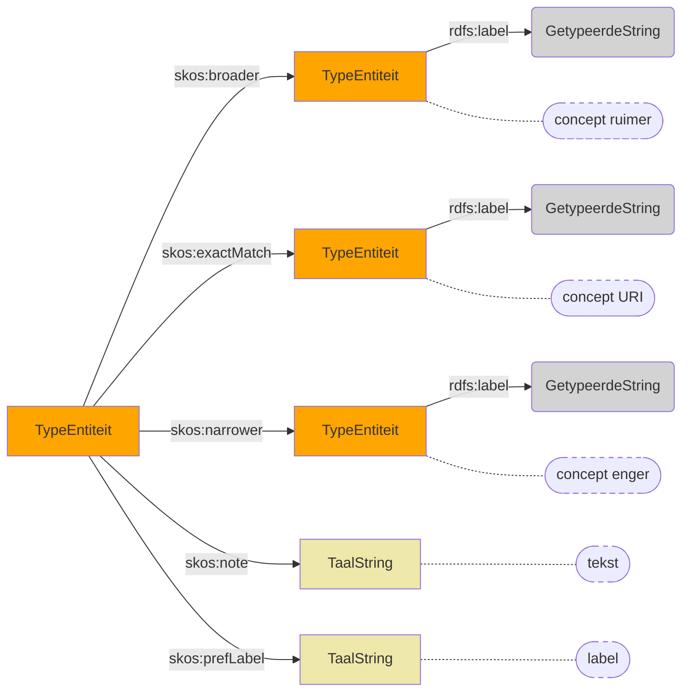

```mermaid
graph LR
169[TypeEntiteit]-->|skos:broader|174[TypeEntiteit]
169[TypeEntiteit]-->|skos:exactMatch|176[TypeEntiteit]
169[TypeEntiteit]-->|skos:narrower|170[TypeEntiteit]
169[TypeEntiteit]-->|skos:note|178(TaalString)
169[TypeEntiteit]-->|skos:prefLabel|173(TaalString)
170[TypeEntiteit]-->|rdfs:label|171(GetypeerdeString)
174[TypeEntiteit]-->|rdfs:label|175(GetypeerdeString)
176[TypeEntiteit]-->|rdfs:label|177(GetypeerdeString)
style 174_s stroke-dasharray: 5
style 176_s stroke-dasharray: 5
style 170_s stroke-dasharray: 5
style 178_s stroke-dasharray: 5
style 173_s stroke-dasharray: 5
174[TypeEntiteit]-.-174_s([concept ruimer])
176[TypeEntiteit]-.-176_s([concept URI])
170[TypeEntiteit]-.-170_s([concept enger])
178[TaalString]-.-178_s([tekst])
173[TaalString]-.-173_s([label])
style 169 fill:#ffa500
style 170 fill:#ffa500
style 171 fill:#D3D3D3
style 173 fill:#EEE8AA
style 174 fill:#ffa500
style 175 fill:#D3D3D3
style 176 fill:#ffa500
style 177 fill:#D3D3D3
style 178 fill:#EEE8AA
```
