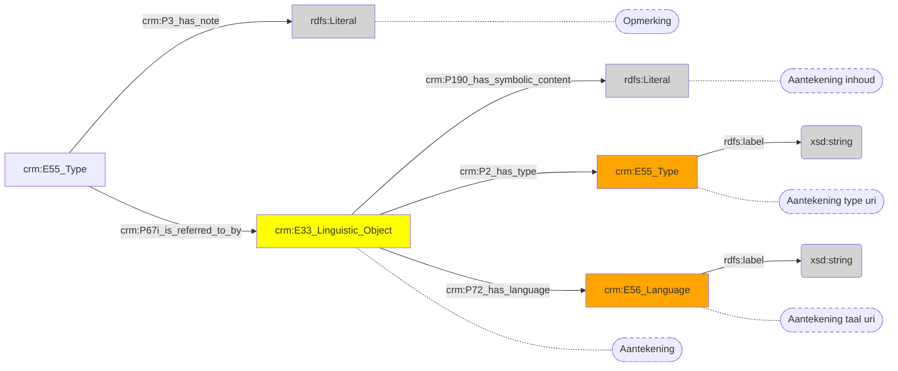

```mermaid
graph LR
184cba22-ee3b-11ed-9064-00163e71351b["crm:E33_Linguistic_Object"]-->|"crm:P190_has_symbolic_content"|184cc21a-ee3b-11ed-9064-00163e71351b(rdfs:Literal)
184cbee6-ee3b-11ed-9064-00163e71351b["crm:E55_Type"]-->|"rdfs:label"|184cc4c2-ee3b-11ed-9064-00163e71351b(xsd:string)
184cc09e-ee3b-11ed-9064-00163e71351b["crm:E56_Language"]-->|"rdfs:label"|184cc36e-ee3b-11ed-9064-00163e71351b(xsd:string)
5c49f282-be8c-11ed-beba-96a6d245525a["crm:E55_Type"]-->|"crm:P3_has_note"|0a3486e0-ce3d-11ed-9232-00163e71351b(rdfs:Literal)
184cba22-ee3b-11ed-9064-00163e71351b["crm:E33_Linguistic_Object"]-->|"crm:P2_has_type"|184cbee6-ee3b-11ed-9064-00163e71351b["crm:E55_Type"]
184cba22-ee3b-11ed-9064-00163e71351b["crm:E33_Linguistic_Object"]-->|"crm:P72_has_language"|184cc09e-ee3b-11ed-9064-00163e71351b["crm:E56_Language"]
5c49f282-be8c-11ed-beba-96a6d245525a["crm:E55_Type"]-->|"crm:P67i_is_referred_to_by"|184cba22-ee3b-11ed-9064-00163e71351b["crm:E33_Linguistic_Object"]
184cc21a-ee3b-11ed-9064-00163e71351b["rdfs:Literal"]-.-184cc21a-ee3b-11ed-9064-00163e71351b_s(["Aantekening inhoud"])
184cbee6-ee3b-11ed-9064-00163e71351b["crm:E55_Type"]-.-184cbee6-ee3b-11ed-9064-00163e71351b_s(["Aantekening type uri"])
184cc09e-ee3b-11ed-9064-00163e71351b["crm:E56_Language"]-.-184cc09e-ee3b-11ed-9064-00163e71351b_s(["Aantekening taal uri"])
0a3486e0-ce3d-11ed-9232-00163e71351b["rdfs:Literal"]-.-0a3486e0-ce3d-11ed-9232-00163e71351b_s(["Opmerking"])
184cba22-ee3b-11ed-9064-00163e71351b["crm:E33_Linguistic_Object"]-.-184cba22-ee3b-11ed-9064-00163e71351b_s(["Aantekening"])
style 184cc21a-ee3b-11ed-9064-00163e71351b_s stroke-dasharray: 5
style 184cbee6-ee3b-11ed-9064-00163e71351b_s stroke-dasharray: 5
style 184cc09e-ee3b-11ed-9064-00163e71351b_s stroke-dasharray: 5
style 0a3486e0-ce3d-11ed-9232-00163e71351b_s stroke-dasharray: 5
style 184cba22-ee3b-11ed-9064-00163e71351b_s stroke-dasharray: 5
style 0a3486e0-ce3d-11ed-9232-00163e71351b fill:#D3D3D3
style 184cba22-ee3b-11ed-9064-00163e71351b fill:#ffff00
style 184cbee6-ee3b-11ed-9064-00163e71351b fill:#ffa500
style 184cc09e-ee3b-11ed-9064-00163e71351b fill:#ffa500
style 184cc21a-ee3b-11ed-9064-00163e71351b fill:#D3D3D3
style 184cc36e-ee3b-11ed-9064-00163e71351b fill:#D3D3D3
style 184cc4c2-ee3b-11ed-9064-00163e71351b fill:#D3D3D3
```
