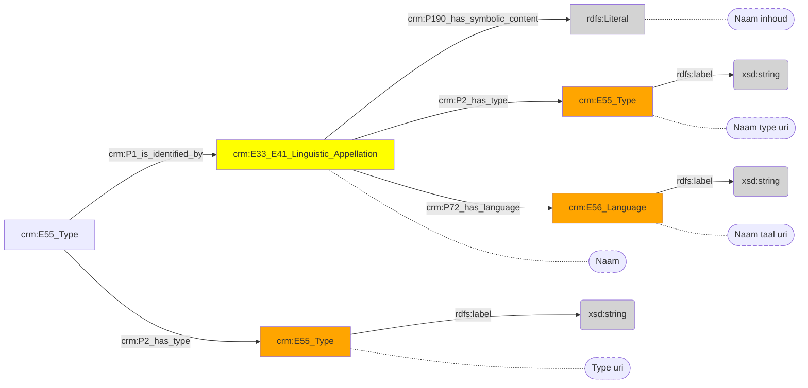

```mermaid
graph LR
856af5be-c7e5-11ed-af84-00163e71351b["crm:E33_E41_Linguistic_Appellation"]-->|"crm:P190_has_symbolic_content"|856afd7a-c7e5-11ed-af84-00163e71351b(rdfs:Literal)
856afa78-c7e5-11ed-af84-00163e71351b["crm:E56_Language"]-->|"rdfs:label"|c76debe0-ce3b-11ed-9064-00163e71351b(xsd:string)
856afc12-c7e5-11ed-af84-00163e71351b["crm:E55_Type"]-->|"rdfs:label"|856afece-c7e5-11ed-af84-00163e71351b(xsd:string)
a25ea6ca-c7e5-11ed-bbe2-00163e71351b["crm:E55_Type"]-->|"rdfs:label"|a25eab52-c7e5-11ed-bbe2-00163e71351b(xsd:string)
5c49f282-be8c-11ed-beba-96a6d245525a["crm:E55_Type"]-->|"crm:P1_is_identified_by"|856af5be-c7e5-11ed-af84-00163e71351b["crm:E33_E41_Linguistic_Appellation"]
5c49f282-be8c-11ed-beba-96a6d245525a["crm:E55_Type"]-->|"crm:P2_has_type"|a25ea6ca-c7e5-11ed-bbe2-00163e71351b["crm:E55_Type"]
856af5be-c7e5-11ed-af84-00163e71351b["crm:E33_E41_Linguistic_Appellation"]-->|"crm:P2_has_type"|856afc12-c7e5-11ed-af84-00163e71351b["crm:E55_Type"]
856af5be-c7e5-11ed-af84-00163e71351b["crm:E33_E41_Linguistic_Appellation"]-->|"crm:P72_has_language"|856afa78-c7e5-11ed-af84-00163e71351b["crm:E56_Language"]
style 856af5be-c7e5-11ed-af84-00163e71351b_s stroke-dasharray: 5
style a25ea6ca-c7e5-11ed-bbe2-00163e71351b_s stroke-dasharray: 5
style 856afd7a-c7e5-11ed-af84-00163e71351b_s stroke-dasharray: 5
style 856afc12-c7e5-11ed-af84-00163e71351b_s stroke-dasharray: 5
style 856afa78-c7e5-11ed-af84-00163e71351b_s stroke-dasharray: 5
856af5be-c7e5-11ed-af84-00163e71351b["crm:E33_E41_Linguistic_Appellation"]-.-856af5be-c7e5-11ed-af84-00163e71351b_s(["Naam"])
a25ea6ca-c7e5-11ed-bbe2-00163e71351b["crm:E55_Type"]-.-a25ea6ca-c7e5-11ed-bbe2-00163e71351b_s(["Type uri"])
856afd7a-c7e5-11ed-af84-00163e71351b["rdfs:Literal"]-.-856afd7a-c7e5-11ed-af84-00163e71351b_s(["Naam inhoud"])
856afc12-c7e5-11ed-af84-00163e71351b["crm:E55_Type"]-.-856afc12-c7e5-11ed-af84-00163e71351b_s(["Naam type uri"])
856afa78-c7e5-11ed-af84-00163e71351b["crm:E56_Language"]-.-856afa78-c7e5-11ed-af84-00163e71351b_s(["Naam taal uri"])
style 856af5be-c7e5-11ed-af84-00163e71351b fill:#ffff00
style 856afa78-c7e5-11ed-af84-00163e71351b fill:#ffa500
style 856afc12-c7e5-11ed-af84-00163e71351b fill:#ffa500
style 856afd7a-c7e5-11ed-af84-00163e71351b fill:#D3D3D3
style 856afece-c7e5-11ed-af84-00163e71351b fill:#D3D3D3
style a25ea6ca-c7e5-11ed-bbe2-00163e71351b fill:#ffa500
style a25eab52-c7e5-11ed-bbe2-00163e71351b fill:#D3D3D3
style c76debe0-ce3b-11ed-9064-00163e71351b fill:#D3D3D3
```
