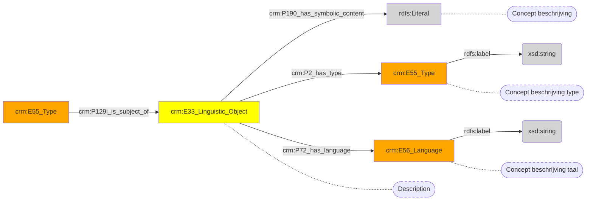

```mermaid
graph LR
1dbc99aa-ee3b-11ed-9064-00163e71351b["crm:E33_Linguistic_Object"]-->|"crm:P190_has_symbolic_content"|1dbc9e78-ee3b-11ed-9064-00163e71351b(rdfs:Literal)
1dbca198-ee3b-11ed-9064-00163e71351b["crm:E55_Type"]-->|"rdfs:label"|1dbca01c-ee3b-11ed-9064-00163e71351b(xsd:string)
1dbca44a-ee3b-11ed-9064-00163e71351b["crm:E56_Language"]-->|"rdfs:label"|1dbca2f6-ee3b-11ed-9064-00163e71351b(xsd:string)
1dbc99aa-ee3b-11ed-9064-00163e71351b["crm:E33_Linguistic_Object"]-->|"crm:P2_has_type"|1dbca198-ee3b-11ed-9064-00163e71351b["crm:E55_Type"]
1dbc99aa-ee3b-11ed-9064-00163e71351b["crm:E33_Linguistic_Object"]-->|"crm:P72_has_language"|1dbca44a-ee3b-11ed-9064-00163e71351b["crm:E56_Language"]
5c49f282-be8c-11ed-beba-96a6d245525a["crm:E55_Type"]-->|"crm:P129i_is_subject_of"|1dbc99aa-ee3b-11ed-9064-00163e71351b["crm:E33_Linguistic_Object"]
1dbc9e78-ee3b-11ed-9064-00163e71351b["rdfs:Literal"]-.-1dbc9e78-ee3b-11ed-9064-00163e71351b_s(["Concept beschrijving"])
1dbca198-ee3b-11ed-9064-00163e71351b["crm:E55_Type"]-.-1dbca198-ee3b-11ed-9064-00163e71351b_s(["Concept beschrijving type"])
1dbca44a-ee3b-11ed-9064-00163e71351b["crm:E56_Language"]-.-1dbca44a-ee3b-11ed-9064-00163e71351b_s(["Concept beschrijving taal"])
1dbc99aa-ee3b-11ed-9064-00163e71351b["crm:E33_Linguistic_Object"]-.-1dbc99aa-ee3b-11ed-9064-00163e71351b_s(["Description"])
style 1dbc9e78-ee3b-11ed-9064-00163e71351b_s stroke-dasharray: 5
style 1dbca198-ee3b-11ed-9064-00163e71351b_s stroke-dasharray: 5
style 1dbca44a-ee3b-11ed-9064-00163e71351b_s stroke-dasharray: 5
style 1dbc99aa-ee3b-11ed-9064-00163e71351b_s stroke-dasharray: 5
style 1dbc99aa-ee3b-11ed-9064-00163e71351b fill:#ffff00
style 1dbc9e78-ee3b-11ed-9064-00163e71351b fill:#D3D3D3
style 1dbca01c-ee3b-11ed-9064-00163e71351b fill:#D3D3D3
style 1dbca198-ee3b-11ed-9064-00163e71351b fill:#ffa500
style 1dbca2f6-ee3b-11ed-9064-00163e71351b fill:#D3D3D3
style 1dbca44a-ee3b-11ed-9064-00163e71351b fill:#ffa500
style 5c49f282-be8c-11ed-beba-96a6d245525a fill:#ffa500
```
