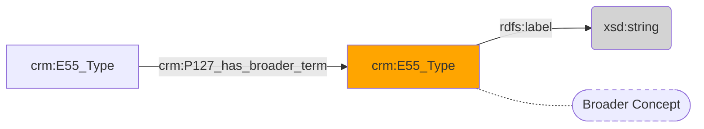

```mermaid
graph LR
5c49f282-be8c-11ed-beba-96a6d245525a["crm:E55_Type"]-->|"crm:P127_has_broader_term"|7440d92c-ce3c-11ed-9232-00163e71351b["crm:E55_Type"]
7440d92c-ce3c-11ed-9232-00163e71351b["crm:E55_Type"]-->|"rdfs:label"|d217fb8e-ce3c-11ed-9655-00163e71351b(xsd:string)
7440d92c-ce3c-11ed-9232-00163e71351b["crm:E55_Type"]-.-7440d92c-ce3c-11ed-9232-00163e71351b_s(["Broader Concept"])
style 7440d92c-ce3c-11ed-9232-00163e71351b_s stroke-dasharray: 5
style 7440d92c-ce3c-11ed-9232-00163e71351b fill:#ffa500
style d217fb8e-ce3c-11ed-9655-00163e71351b fill:#D3D3D3
```
