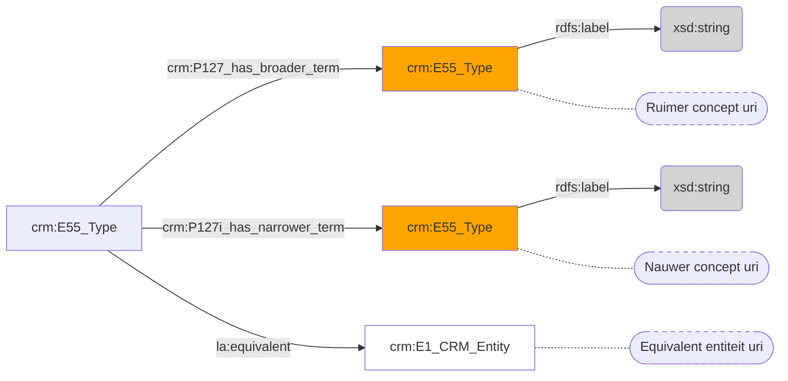

```mermaid
graph LR
7440d92c-ce3c-11ed-9232-00163e71351b["crm:E55_Type"]-->|"rdfs:label"|d217fb8e-ce3c-11ed-9655-00163e71351b(xsd:string)
94da4416-ce3c-11ed-a1e6-00163e71351b["crm:E55_Type"]-->|"rdfs:label"|c133dbd0-ce3c-11ed-9232-00163e71351b(xsd:string)
5c49f282-be8c-11ed-beba-96a6d245525a["crm:E55_Type"]-->|"crm:P127_has_broader_term"|7440d92c-ce3c-11ed-9232-00163e71351b["crm:E55_Type"]
5c49f282-be8c-11ed-beba-96a6d245525a["crm:E55_Type"]-->|"crm:P127i_has_narrower_term"|94da4416-ce3c-11ed-a1e6-00163e71351b["crm:E55_Type"]
5c49f282-be8c-11ed-beba-96a6d245525a["crm:E55_Type"]-->|"la:equivalent"|bfc145d8-c7e5-11ed-873b-00163e71351b["crm:E1_CRM_Entity"]
7440d92c-ce3c-11ed-9232-00163e71351b["crm:E55_Type"]-.-7440d92c-ce3c-11ed-9232-00163e71351b_s(["Ruimer concept uri"])
94da4416-ce3c-11ed-a1e6-00163e71351b["crm:E55_Type"]-.-94da4416-ce3c-11ed-a1e6-00163e71351b_s(["Nauwer concept uri"])
bfc145d8-c7e5-11ed-873b-00163e71351b["crm:E1_CRM_Entity"]-.-bfc145d8-c7e5-11ed-873b-00163e71351b_s(["Equivalent entiteit uri"])
style 7440d92c-ce3c-11ed-9232-00163e71351b_s stroke-dasharray: 5
style 94da4416-ce3c-11ed-a1e6-00163e71351b_s stroke-dasharray: 5
style bfc145d8-c7e5-11ed-873b-00163e71351b_s stroke-dasharray: 5
style 7440d92c-ce3c-11ed-9232-00163e71351b fill:#ffa500
style 94da4416-ce3c-11ed-a1e6-00163e71351b fill:#ffa500
style bfc145d8-c7e5-11ed-873b-00163e71351b fill:#ffffff
style c133dbd0-ce3c-11ed-9232-00163e71351b fill:#D3D3D3
style d217fb8e-ce3c-11ed-9655-00163e71351b fill:#D3D3D3
```
