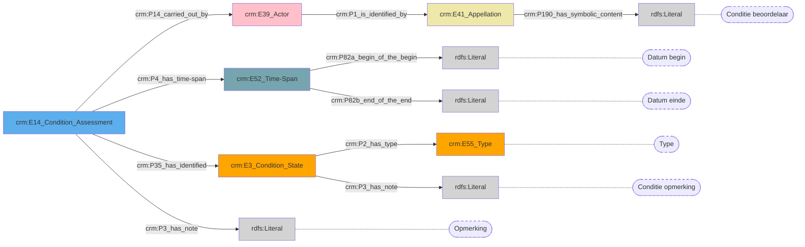

```mermaid
graph LR
style 42069382-efef-11ed-9232-00163e71351b fill:#5DAEEC
style 54d1777a-efef-11ed-9064-00163e71351b fill:#D3D3D3
style 5b73562a-efef-11ed-9655-00163e71351b fill:#76A5AF
style 5b735a9e-efef-11ed-9655-00163e71351b fill:#D3D3D3
style 5b735bd4-efef-11ed-9655-00163e71351b fill:#D3D3D3
style 64ad0aba-efef-11ed-9064-00163e71351b fill:#ffc0cb
style 64ad0f6a-efef-11ed-9064-00163e71351b fill:#D3D3D3
style 64ad1118-efef-11ed-9064-00163e71351b fill:#EEE8AA
style 6ba16686-efef-11ed-9655-00163e71351b fill:#ffa500
style 6ba16cf8-efef-11ed-9655-00163e71351b fill:#D3D3D3
style 6ba16e6a-efef-11ed-9655-00163e71351b fill:#ffa500
42069382-efef-11ed-9232-00163e71351b["crm:E14_Condition_Assessment"]-->|"crm:P3_has_note"|54d1777a-efef-11ed-9064-00163e71351b(rdfs:Literal)
5b73562a-efef-11ed-9655-00163e71351b["crm:E52_Time-Span"]-->|"crm:P82a_begin_of_the_begin"|5b735a9e-efef-11ed-9655-00163e71351b(rdfs:Literal)
5b73562a-efef-11ed-9655-00163e71351b["crm:E52_Time-Span"]-->|"crm:P82b_end_of_the_end"|5b735bd4-efef-11ed-9655-00163e71351b(rdfs:Literal)
64ad1118-efef-11ed-9064-00163e71351b["crm:E41_Appellation"]-->|"crm:P190_has_symbolic_content"|64ad0f6a-efef-11ed-9064-00163e71351b(rdfs:Literal)
6ba16686-efef-11ed-9655-00163e71351b["crm:E3_Condition_State"]-->|"crm:P3_has_note"|6ba16cf8-efef-11ed-9655-00163e71351b(rdfs:Literal)
54d1777a-efef-11ed-9064-00163e71351b["rdfs:Literal"]-.-54d1777a-efef-11ed-9064-00163e71351b_s(["Opmerking"])
5b735a9e-efef-11ed-9655-00163e71351b["rdfs:Literal"]-.-5b735a9e-efef-11ed-9655-00163e71351b_s(["Datum begin"])
5b735bd4-efef-11ed-9655-00163e71351b["rdfs:Literal"]-.-5b735bd4-efef-11ed-9655-00163e71351b_s(["Datum einde"])
64ad0f6a-efef-11ed-9064-00163e71351b["rdfs:Literal"]-.-64ad0f6a-efef-11ed-9064-00163e71351b_s(["Conditie beoordelaar"])
6ba16e6a-efef-11ed-9655-00163e71351b["crm:E55_Type"]-.-6ba16e6a-efef-11ed-9655-00163e71351b_s(["Type"])
6ba16cf8-efef-11ed-9655-00163e71351b["rdfs:Literal"]-.-6ba16cf8-efef-11ed-9655-00163e71351b_s(["Conditie opmerking"])
style 54d1777a-efef-11ed-9064-00163e71351b_s stroke-dasharray: 5
style 5b735a9e-efef-11ed-9655-00163e71351b_s stroke-dasharray: 5
style 5b735bd4-efef-11ed-9655-00163e71351b_s stroke-dasharray: 5
style 64ad0f6a-efef-11ed-9064-00163e71351b_s stroke-dasharray: 5
style 6ba16e6a-efef-11ed-9655-00163e71351b_s stroke-dasharray: 5
style 6ba16cf8-efef-11ed-9655-00163e71351b_s stroke-dasharray: 5
42069382-efef-11ed-9232-00163e71351b["crm:E14_Condition_Assessment"]-->|"crm:P14_carried_out_by"|64ad0aba-efef-11ed-9064-00163e71351b["crm:E39_Actor"]
42069382-efef-11ed-9232-00163e71351b["crm:E14_Condition_Assessment"]-->|"crm:P35_has_identified"|6ba16686-efef-11ed-9655-00163e71351b["crm:E3_Condition_State"]
42069382-efef-11ed-9232-00163e71351b["crm:E14_Condition_Assessment"]-->|"crm:P4_has_time-span"|5b73562a-efef-11ed-9655-00163e71351b["crm:E52_Time-Span"]
64ad0aba-efef-11ed-9064-00163e71351b["crm:E39_Actor"]-->|"crm:P1_is_identified_by"|64ad1118-efef-11ed-9064-00163e71351b["crm:E41_Appellation"]
6ba16686-efef-11ed-9655-00163e71351b["crm:E3_Condition_State"]-->|"crm:P2_has_type"|6ba16e6a-efef-11ed-9655-00163e71351b["crm:E55_Type"]
```
