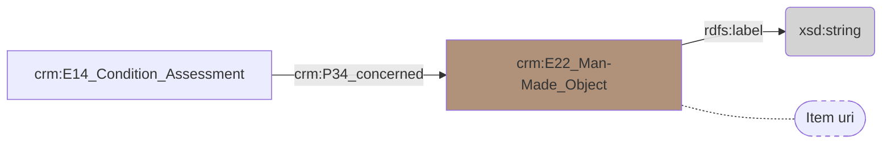

```mermaid
graph LR
71c80a42-efef-11ed-9232-00163e71351b["crm:E22_Man-Made_Object"]-->|"rdfs:label"|95efc11c-efef-11ed-a1e6-00163e71351b(xsd:string)
42069382-efef-11ed-9232-00163e71351b["crm:E14_Condition_Assessment"]-->|"crm:P34_concerned"|71c80a42-efef-11ed-9232-00163e71351b["crm:E22_Man-Made_Object"]
style 71c80a42-efef-11ed-9232-00163e71351b_s stroke-dasharray: 5
71c80a42-efef-11ed-9232-00163e71351b["crm:E22_Man-Made_Object"]-.-71c80a42-efef-11ed-9232-00163e71351b_s(["Item uri"])
style 71c80a42-efef-11ed-9232-00163e71351b fill:#B0927A
style 95efc11c-efef-11ed-a1e6-00163e71351b fill:#D3D3D3
```
