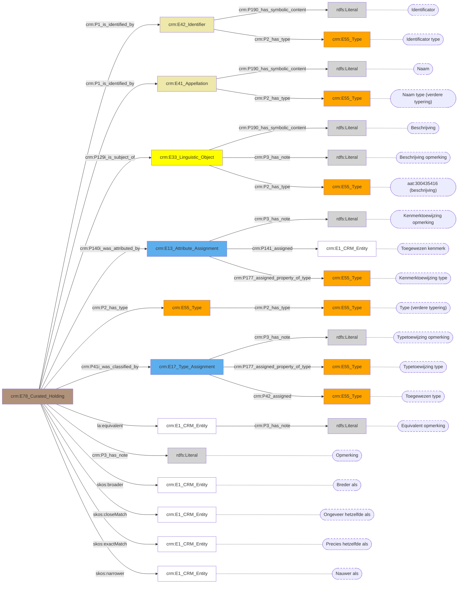

```mermaid
graph LR
style 3f58940a-18f2-11ef-b125-960002548b4f fill:#B0927A
style 5780396c-18f2-11ef-aa31-960002548b4f fill:#5DAEEC
style 57803e73-18f2-11ef-8ddb-960002548b4f fill:#ffa500
style 57803ff9-18f2-11ef-95f5-960002548b4f fill:#ffffff
style 57804136-18f2-11ef-b6c9-960002548b4f fill:#D3D3D3
style 60d718fb-18f2-11ef-8f7c-960002548b4f fill:#ffff00
style 60d71ec4-18f2-11ef-a1b6-960002548b4f fill:#D3D3D3
style 60d72295-18f2-11ef-8b21-960002548b4f fill:#D3D3D3
style 60d72546-18f2-11ef-aba6-960002548b4f fill:#ffa500
style 6f9619b0-18f2-11ef-9bc9-960002548b4f fill:#ffffff
style 6f961f05-18f2-11ef-bf4b-960002548b4f fill:#D3D3D3
style 7e9385af-18f2-11ef-8663-960002548b4f fill:#EEE8AA
style 7e938c94-18f2-11ef-a67e-960002548b4f fill:#D3D3D3
style 7e938ddd-18f2-11ef-90a3-960002548b4f fill:#ffa500
style 93cf7374-18f2-11ef-acef-960002548b4f fill:#EEE8AA
style 93cf786a-18f2-11ef-9d02-960002548b4f fill:#ffa500
style 93cf7b4f-18f2-11ef-846e-960002548b4f fill:#D3D3D3
style a22d8d79-18f2-11ef-97d7-960002548b4f fill:#D3D3D3
style ad9a611b-18f2-11ef-851b-960002548b4f fill:#ffa500
style ad9a664a-18f2-11ef-aa74-960002548b4f fill:#ffa500
style bdae225b-18f2-11ef-be30-960002548b4f fill:#5DAEEC
style bdae2751-18f2-11ef-b24e-960002548b4f fill:#ffa500
style bdae28e5-18f2-11ef-a58b-960002548b4f fill:#ffa500
style bdae2c69-18f2-11ef-9053-960002548b4f fill:#D3D3D3
style c026a0c9-1dac-11ef-b4b2-960002548b4f fill:#ffffff
style c55c0b02-1dac-11ef-94d5-960002548b4f fill:#ffffff
style cb1e3c91-1dac-11ef-bb59-960002548b4f fill:#ffffff
style d0b8bb3e-1dac-11ef-9618-960002548b4f fill:#ffffff
3f58940a-18f2-11ef-b125-960002548b4f["crm:E78_Curated_Holding"]-->|"crm:P3_has_note"|a22d8d79-18f2-11ef-97d7-960002548b4f(rdfs:Literal)
5780396c-18f2-11ef-aa31-960002548b4f["crm:E13_Attribute_Assignment"]-->|"crm:P3_has_note"|57804136-18f2-11ef-b6c9-960002548b4f(rdfs:Literal)
60d718fb-18f2-11ef-8f7c-960002548b4f["crm:E33_Linguistic_Object"]-->|"crm:P190_has_symbolic_content"|60d72295-18f2-11ef-8b21-960002548b4f(rdfs:Literal)
60d718fb-18f2-11ef-8f7c-960002548b4f["crm:E33_Linguistic_Object"]-->|"crm:P3_has_note"|60d71ec4-18f2-11ef-a1b6-960002548b4f(rdfs:Literal)
6f9619b0-18f2-11ef-9bc9-960002548b4f["crm:E1_CRM_Entity"]-->|"crm:P3_has_note"|6f961f05-18f2-11ef-bf4b-960002548b4f(rdfs:Literal)
7e9385af-18f2-11ef-8663-960002548b4f["crm:E42_Identifier"]-->|"crm:P190_has_symbolic_content"|7e938c94-18f2-11ef-a67e-960002548b4f(rdfs:Literal)
93cf7374-18f2-11ef-acef-960002548b4f["crm:E41_Appellation"]-->|"crm:P190_has_symbolic_content"|93cf7b4f-18f2-11ef-846e-960002548b4f(rdfs:Literal)
bdae225b-18f2-11ef-be30-960002548b4f["crm:E17_Type_Assignment"]-->|"crm:P3_has_note"|bdae2c69-18f2-11ef-9053-960002548b4f(rdfs:Literal)
a22d8d79-18f2-11ef-97d7-960002548b4f["rdfs:Literal"]-.-a22d8d79-18f2-11ef-97d7-960002548b4f_s(["Opmerking"])
c026a0c9-1dac-11ef-b4b2-960002548b4f["crm:E1_CRM_Entity"]-.-c026a0c9-1dac-11ef-b4b2-960002548b4f_s(["Breder als"])
c55c0b02-1dac-11ef-94d5-960002548b4f["crm:E1_CRM_Entity"]-.-c55c0b02-1dac-11ef-94d5-960002548b4f_s(["Ongeveer hetzelfde als"])
cb1e3c91-1dac-11ef-bb59-960002548b4f["crm:E1_CRM_Entity"]-.-cb1e3c91-1dac-11ef-bb59-960002548b4f_s(["Precies hetzelfde als"])
d0b8bb3e-1dac-11ef-9618-960002548b4f["crm:E1_CRM_Entity"]-.-d0b8bb3e-1dac-11ef-9618-960002548b4f_s(["Nauwer als"])
57803ff9-18f2-11ef-95f5-960002548b4f["crm:E1_CRM_Entity"]-.-57803ff9-18f2-11ef-95f5-960002548b4f_s(["Toegewezen kenmerk"])
57803e73-18f2-11ef-8ddb-960002548b4f["crm:E55_Type"]-.-57803e73-18f2-11ef-8ddb-960002548b4f_s(["Kenmerktoewijzing type"])
57804136-18f2-11ef-b6c9-960002548b4f["rdfs:Literal"]-.-57804136-18f2-11ef-b6c9-960002548b4f_s(["Kenmerktoewijzing opmerking"])
60d72295-18f2-11ef-8b21-960002548b4f["rdfs:Literal"]-.-60d72295-18f2-11ef-8b21-960002548b4f_s(["Beschrijving"])
60d72546-18f2-11ef-aba6-960002548b4f["crm:E55_Type"]-.-60d72546-18f2-11ef-aba6-960002548b4f_s(["aat:300435416 (beschrijving)"])
60d71ec4-18f2-11ef-a1b6-960002548b4f["rdfs:Literal"]-.-60d71ec4-18f2-11ef-a1b6-960002548b4f_s(["Beschrijving opmerking"])
6f961f05-18f2-11ef-bf4b-960002548b4f["rdfs:Literal"]-.-6f961f05-18f2-11ef-bf4b-960002548b4f_s(["Equivalent opmerking"])
7e938c94-18f2-11ef-a67e-960002548b4f["rdfs:Literal"]-.-7e938c94-18f2-11ef-a67e-960002548b4f_s(["Identificator"])
7e938ddd-18f2-11ef-90a3-960002548b4f["crm:E55_Type"]-.-7e938ddd-18f2-11ef-90a3-960002548b4f_s(["Identificator type"])
93cf7b4f-18f2-11ef-846e-960002548b4f["rdfs:Literal"]-.-93cf7b4f-18f2-11ef-846e-960002548b4f_s(["Naam"])
93cf786a-18f2-11ef-9d02-960002548b4f["crm:E55_Type"]-.-93cf786a-18f2-11ef-9d02-960002548b4f_s(["Naam type (verdere typering)"])
ad9a664a-18f2-11ef-aa74-960002548b4f["crm:E55_Type"]-.-ad9a664a-18f2-11ef-aa74-960002548b4f_s(["Type (verdere typering)"])
bdae2751-18f2-11ef-b24e-960002548b4f["crm:E55_Type"]-.-bdae2751-18f2-11ef-b24e-960002548b4f_s(["Typetoewijzing type"])
bdae2c69-18f2-11ef-9053-960002548b4f["rdfs:Literal"]-.-bdae2c69-18f2-11ef-9053-960002548b4f_s(["Typetoewijzing opmerking"])
bdae28e5-18f2-11ef-a58b-960002548b4f["crm:E55_Type"]-.-bdae28e5-18f2-11ef-a58b-960002548b4f_s(["Toegewezen type"])
3f58940a-18f2-11ef-b125-960002548b4f["crm:E78_Curated_Holding"]-->|"crm:P1_is_identified_by"|7e9385af-18f2-11ef-8663-960002548b4f["crm:E42_Identifier"]
3f58940a-18f2-11ef-b125-960002548b4f["crm:E78_Curated_Holding"]-->|"crm:P1_is_identified_by"|93cf7374-18f2-11ef-acef-960002548b4f["crm:E41_Appellation"]
3f58940a-18f2-11ef-b125-960002548b4f["crm:E78_Curated_Holding"]-->|"crm:P129i_is_subject_of"|60d718fb-18f2-11ef-8f7c-960002548b4f["crm:E33_Linguistic_Object"]
3f58940a-18f2-11ef-b125-960002548b4f["crm:E78_Curated_Holding"]-->|"crm:P140i_was_attributed_by"|5780396c-18f2-11ef-aa31-960002548b4f["crm:E13_Attribute_Assignment"]
3f58940a-18f2-11ef-b125-960002548b4f["crm:E78_Curated_Holding"]-->|"crm:P2_has_type"|ad9a611b-18f2-11ef-851b-960002548b4f["crm:E55_Type"]
3f58940a-18f2-11ef-b125-960002548b4f["crm:E78_Curated_Holding"]-->|"crm:P41i_was_classified_by"|bdae225b-18f2-11ef-be30-960002548b4f["crm:E17_Type_Assignment"]
3f58940a-18f2-11ef-b125-960002548b4f["crm:E78_Curated_Holding"]-->|"skos:broader"|c026a0c9-1dac-11ef-b4b2-960002548b4f["crm:E1_CRM_Entity"]
3f58940a-18f2-11ef-b125-960002548b4f["crm:E78_Curated_Holding"]-->|"skos:closeMatch"|c55c0b02-1dac-11ef-94d5-960002548b4f["crm:E1_CRM_Entity"]
3f58940a-18f2-11ef-b125-960002548b4f["crm:E78_Curated_Holding"]-->|"skos:exactMatch"|cb1e3c91-1dac-11ef-bb59-960002548b4f["crm:E1_CRM_Entity"]
3f58940a-18f2-11ef-b125-960002548b4f["crm:E78_Curated_Holding"]-->|"skos:narrower"|d0b8bb3e-1dac-11ef-9618-960002548b4f["crm:E1_CRM_Entity"]
3f58940a-18f2-11ef-b125-960002548b4f["crm:E78_Curated_Holding"]-->|"la:equivalent"|6f9619b0-18f2-11ef-9bc9-960002548b4f["crm:E1_CRM_Entity"]
5780396c-18f2-11ef-aa31-960002548b4f["crm:E13_Attribute_Assignment"]-->|"crm:P141_assigned"|57803ff9-18f2-11ef-95f5-960002548b4f["crm:E1_CRM_Entity"]
5780396c-18f2-11ef-aa31-960002548b4f["crm:E13_Attribute_Assignment"]-->|"crm:P177_assigned_property_of_type"|57803e73-18f2-11ef-8ddb-960002548b4f["crm:E55_Type"]
60d718fb-18f2-11ef-8f7c-960002548b4f["crm:E33_Linguistic_Object"]-->|"crm:P2_has_type"|60d72546-18f2-11ef-aba6-960002548b4f["crm:E55_Type"]
7e9385af-18f2-11ef-8663-960002548b4f["crm:E42_Identifier"]-->|"crm:P2_has_type"|7e938ddd-18f2-11ef-90a3-960002548b4f["crm:E55_Type"]
93cf7374-18f2-11ef-acef-960002548b4f["crm:E41_Appellation"]-->|"crm:P2_has_type"|93cf786a-18f2-11ef-9d02-960002548b4f["crm:E55_Type"]
ad9a611b-18f2-11ef-851b-960002548b4f["crm:E55_Type"]-->|"crm:P2_has_type"|ad9a664a-18f2-11ef-aa74-960002548b4f["crm:E55_Type"]
bdae225b-18f2-11ef-be30-960002548b4f["crm:E17_Type_Assignment"]-->|"crm:P177_assigned_property_of_type"|bdae2751-18f2-11ef-b24e-960002548b4f["crm:E55_Type"]
bdae225b-18f2-11ef-be30-960002548b4f["crm:E17_Type_Assignment"]-->|"crm:P42_assigned"|bdae28e5-18f2-11ef-a58b-960002548b4f["crm:E55_Type"]
style a22d8d79-18f2-11ef-97d7-960002548b4f_s stroke-dasharray: 5
style c026a0c9-1dac-11ef-b4b2-960002548b4f_s stroke-dasharray: 5
style c55c0b02-1dac-11ef-94d5-960002548b4f_s stroke-dasharray: 5
style cb1e3c91-1dac-11ef-bb59-960002548b4f_s stroke-dasharray: 5
style d0b8bb3e-1dac-11ef-9618-960002548b4f_s stroke-dasharray: 5
style 57803ff9-18f2-11ef-95f5-960002548b4f_s stroke-dasharray: 5
style 57803e73-18f2-11ef-8ddb-960002548b4f_s stroke-dasharray: 5
style 57804136-18f2-11ef-b6c9-960002548b4f_s stroke-dasharray: 5
style 60d72295-18f2-11ef-8b21-960002548b4f_s stroke-dasharray: 5
style 60d72546-18f2-11ef-aba6-960002548b4f_s stroke-dasharray: 5
style 60d71ec4-18f2-11ef-a1b6-960002548b4f_s stroke-dasharray: 5
style 6f961f05-18f2-11ef-bf4b-960002548b4f_s stroke-dasharray: 5
style 7e938c94-18f2-11ef-a67e-960002548b4f_s stroke-dasharray: 5
style 7e938ddd-18f2-11ef-90a3-960002548b4f_s stroke-dasharray: 5
style 93cf7b4f-18f2-11ef-846e-960002548b4f_s stroke-dasharray: 5
style 93cf786a-18f2-11ef-9d02-960002548b4f_s stroke-dasharray: 5
style ad9a664a-18f2-11ef-aa74-960002548b4f_s stroke-dasharray: 5
style bdae2751-18f2-11ef-b24e-960002548b4f_s stroke-dasharray: 5
style bdae2c69-18f2-11ef-9053-960002548b4f_s stroke-dasharray: 5
style bdae28e5-18f2-11ef-a58b-960002548b4f_s stroke-dasharray: 5
```
