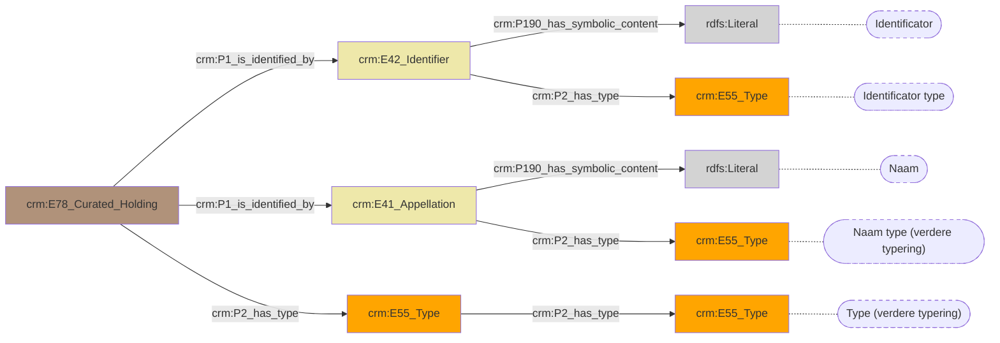

```mermaid
graph LR
style 3f58940a-18f2-11ef-b125-960002548b4f fill:#B0927A
style 7e9385af-18f2-11ef-8663-960002548b4f fill:#EEE8AA
style 7e938c94-18f2-11ef-a67e-960002548b4f fill:#D3D3D3
style 7e938ddd-18f2-11ef-90a3-960002548b4f fill:#ffa500
style 93cf7374-18f2-11ef-acef-960002548b4f fill:#EEE8AA
style 93cf786a-18f2-11ef-9d02-960002548b4f fill:#ffa500
style 93cf7b4f-18f2-11ef-846e-960002548b4f fill:#D3D3D3
style ad9a611b-18f2-11ef-851b-960002548b4f fill:#ffa500
style ad9a664a-18f2-11ef-aa74-960002548b4f fill:#ffa500
7e9385af-18f2-11ef-8663-960002548b4f["crm:E42_Identifier"]-->|"crm:P190_has_symbolic_content"|7e938c94-18f2-11ef-a67e-960002548b4f(rdfs:Literal)
93cf7374-18f2-11ef-acef-960002548b4f["crm:E41_Appellation"]-->|"crm:P190_has_symbolic_content"|93cf7b4f-18f2-11ef-846e-960002548b4f(rdfs:Literal)
style 7e938c94-18f2-11ef-a67e-960002548b4f_s stroke-dasharray: 5
style 7e938ddd-18f2-11ef-90a3-960002548b4f_s stroke-dasharray: 5
style 93cf7b4f-18f2-11ef-846e-960002548b4f_s stroke-dasharray: 5
style 93cf786a-18f2-11ef-9d02-960002548b4f_s stroke-dasharray: 5
style ad9a664a-18f2-11ef-aa74-960002548b4f_s stroke-dasharray: 5
7e938c94-18f2-11ef-a67e-960002548b4f["rdfs:Literal"]-.-7e938c94-18f2-11ef-a67e-960002548b4f_s(["Identificator"])
7e938ddd-18f2-11ef-90a3-960002548b4f["crm:E55_Type"]-.-7e938ddd-18f2-11ef-90a3-960002548b4f_s(["Identificator type"])
93cf7b4f-18f2-11ef-846e-960002548b4f["rdfs:Literal"]-.-93cf7b4f-18f2-11ef-846e-960002548b4f_s(["Naam"])
93cf786a-18f2-11ef-9d02-960002548b4f["crm:E55_Type"]-.-93cf786a-18f2-11ef-9d02-960002548b4f_s(["Naam type (verdere typering)"])
ad9a664a-18f2-11ef-aa74-960002548b4f["crm:E55_Type"]-.-ad9a664a-18f2-11ef-aa74-960002548b4f_s(["Type (verdere typering)"])
3f58940a-18f2-11ef-b125-960002548b4f["crm:E78_Curated_Holding"]-->|"crm:P1_is_identified_by"|7e9385af-18f2-11ef-8663-960002548b4f["crm:E42_Identifier"]
3f58940a-18f2-11ef-b125-960002548b4f["crm:E78_Curated_Holding"]-->|"crm:P1_is_identified_by"|93cf7374-18f2-11ef-acef-960002548b4f["crm:E41_Appellation"]
3f58940a-18f2-11ef-b125-960002548b4f["crm:E78_Curated_Holding"]-->|"crm:P2_has_type"|ad9a611b-18f2-11ef-851b-960002548b4f["crm:E55_Type"]
7e9385af-18f2-11ef-8663-960002548b4f["crm:E42_Identifier"]-->|"crm:P2_has_type"|7e938ddd-18f2-11ef-90a3-960002548b4f["crm:E55_Type"]
93cf7374-18f2-11ef-acef-960002548b4f["crm:E41_Appellation"]-->|"crm:P2_has_type"|93cf786a-18f2-11ef-9d02-960002548b4f["crm:E55_Type"]
ad9a611b-18f2-11ef-851b-960002548b4f["crm:E55_Type"]-->|"crm:P2_has_type"|ad9a664a-18f2-11ef-aa74-960002548b4f["crm:E55_Type"]
```
