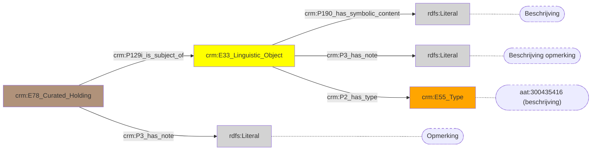

```mermaid
graph LR
style 3f58940a-18f2-11ef-b125-960002548b4f fill:#B0927A
style 60d718fb-18f2-11ef-8f7c-960002548b4f fill:#ffff00
style 60d71ec4-18f2-11ef-a1b6-960002548b4f fill:#D3D3D3
style 60d72295-18f2-11ef-8b21-960002548b4f fill:#D3D3D3
style 60d72546-18f2-11ef-aba6-960002548b4f fill:#ffa500
style a22d8d79-18f2-11ef-97d7-960002548b4f fill:#D3D3D3
3f58940a-18f2-11ef-b125-960002548b4f["crm:E78_Curated_Holding"]-->|"crm:P3_has_note"|a22d8d79-18f2-11ef-97d7-960002548b4f(rdfs:Literal)
60d718fb-18f2-11ef-8f7c-960002548b4f["crm:E33_Linguistic_Object"]-->|"crm:P190_has_symbolic_content"|60d72295-18f2-11ef-8b21-960002548b4f(rdfs:Literal)
60d718fb-18f2-11ef-8f7c-960002548b4f["crm:E33_Linguistic_Object"]-->|"crm:P3_has_note"|60d71ec4-18f2-11ef-a1b6-960002548b4f(rdfs:Literal)
style a22d8d79-18f2-11ef-97d7-960002548b4f_s stroke-dasharray: 5
style 60d72295-18f2-11ef-8b21-960002548b4f_s stroke-dasharray: 5
style 60d72546-18f2-11ef-aba6-960002548b4f_s stroke-dasharray: 5
style 60d71ec4-18f2-11ef-a1b6-960002548b4f_s stroke-dasharray: 5
a22d8d79-18f2-11ef-97d7-960002548b4f["rdfs:Literal"]-.-a22d8d79-18f2-11ef-97d7-960002548b4f_s(["Opmerking"])
60d72295-18f2-11ef-8b21-960002548b4f["rdfs:Literal"]-.-60d72295-18f2-11ef-8b21-960002548b4f_s(["Beschrijving"])
60d72546-18f2-11ef-aba6-960002548b4f["crm:E55_Type"]-.-60d72546-18f2-11ef-aba6-960002548b4f_s(["aat:300435416 (beschrijving)"])
60d71ec4-18f2-11ef-a1b6-960002548b4f["rdfs:Literal"]-.-60d71ec4-18f2-11ef-a1b6-960002548b4f_s(["Beschrijving opmerking"])
3f58940a-18f2-11ef-b125-960002548b4f["crm:E78_Curated_Holding"]-->|"crm:P129i_is_subject_of"|60d718fb-18f2-11ef-8f7c-960002548b4f["crm:E33_Linguistic_Object"]
60d718fb-18f2-11ef-8f7c-960002548b4f["crm:E33_Linguistic_Object"]-->|"crm:P2_has_type"|60d72546-18f2-11ef-aba6-960002548b4f["crm:E55_Type"]
```
