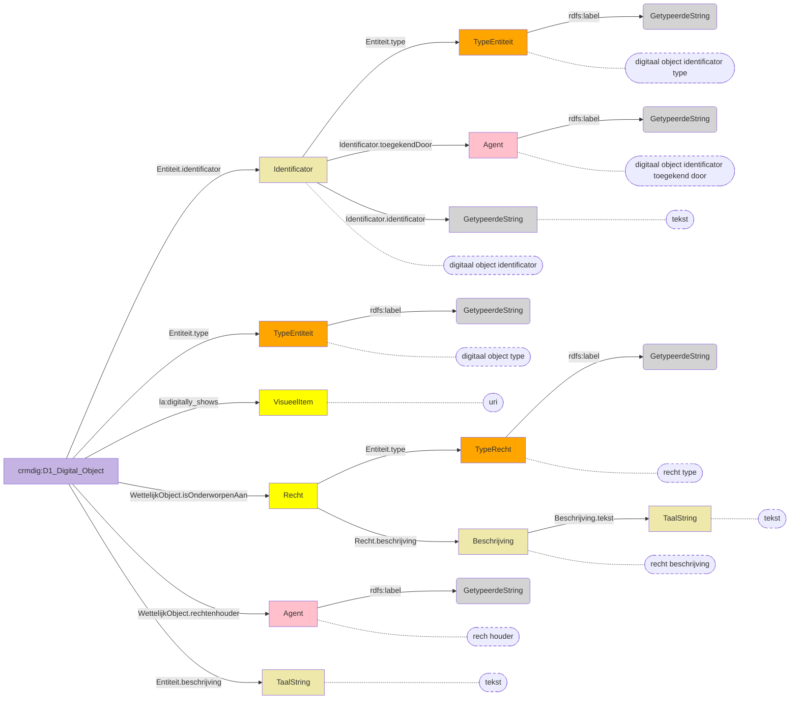

```mermaid
graph LR
15[Recht]-->|Entiteit.type|18[TypeRecht]
15[Recht]-->|Recht.beschrijving|16[Beschrijving]
5[crmdig:D1_Digital_Object]-->|Entiteit.identificator|7[Identificator]
5[crmdig:D1_Digital_Object]-->|Entiteit.type|13[TypeEntiteit]
5[crmdig:D1_Digital_Object]-->|la:digitally_shows|221[VisueelItem]
5[crmdig:D1_Digital_Object]-->|WettelijkObject.isOnderworpenAan|15[Recht]
5[crmdig:D1_Digital_Object]-->|WettelijkObject.rechtenhouder|20[Agent]
7[Identificator]-->|Entiteit.type|8[TypeEntiteit]
7[Identificator]-->|Identificator.toegekendDoor|11[Agent]
11[Agent]-->|rdfs:label|12(GetypeerdeString)
13[TypeEntiteit]-->|rdfs:label|14(GetypeerdeString)
16[Beschrijving]-->|Beschrijving.tekst|17(TaalString)
18[TypeRecht]-->|rdfs:label|19(GetypeerdeString)
20[Agent]-->|rdfs:label|21(GetypeerdeString)
5[crmdig:D1_Digital_Object]-->|Entiteit.beschrijving|6(TaalString)
7[Identificator]-->|Identificator.identificator|10(GetypeerdeString)
8[TypeEntiteit]-->|rdfs:label|9(GetypeerdeString)
style 18_s stroke-dasharray: 5
style 16_s stroke-dasharray: 5
style 17_s stroke-dasharray: 5
style 6_s stroke-dasharray: 5
style 7_s stroke-dasharray: 5
style 13_s stroke-dasharray: 5
style 221_s stroke-dasharray: 5
style 20_s stroke-dasharray: 5
style 8_s stroke-dasharray: 5
style 10_s stroke-dasharray: 5
style 11_s stroke-dasharray: 5
18[TypeRecht]-.-18_s([recht type])
16[Beschrijving]-.-16_s([recht beschrijving])
17[TaalString]-.-17_s([tekst])
6[TaalString]-.-6_s([tekst])
7[Identificator]-.-7_s([digitaal object identificator])
13[TypeEntiteit]-.-13_s([digitaal object type])
221[VisueelItem]-.-221_s([uri])
20[Agent]-.-20_s([rech houder])
8[TypeEntiteit]-.-8_s([digitaal object identificator type])
10[GetypeerdeString]-.-10_s([tekst])
11[Agent]-.-11_s([digitaal object identificator toegekend door])
style 10 fill:#D3D3D3
style 11 fill:#ffc0cb
style 12 fill:#D3D3D3
style 13 fill:#ffa500
style 14 fill:#D3D3D3
style 15 fill:#ffff00
style 16 fill:#EEE8AA
style 17 fill:#EEE8AA
style 18 fill:#ffa500
style 19 fill:#D3D3D3
style 20 fill:#ffc0cb
style 21 fill:#D3D3D3
style 221 fill:#ffff00
style 5 fill:#C5B4E3
style 6 fill:#EEE8AA
style 7 fill:#EEE8AA
style 8 fill:#ffa500
style 9 fill:#D3D3D3
```
