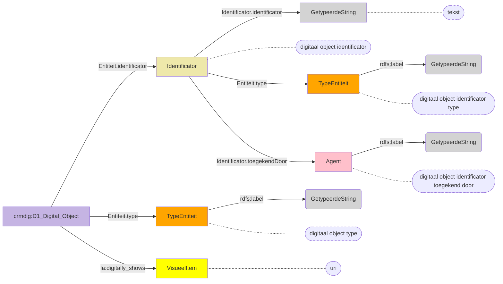

```mermaid
graph LR
11[Agent]-->|rdfs:label|12(GetypeerdeString)
13[TypeEntiteit]-->|rdfs:label|14(GetypeerdeString)
7[Identificator]-->|Identificator.identificator|10(GetypeerdeString)
8[TypeEntiteit]-->|rdfs:label|9(GetypeerdeString)
7[Identificator]-.-7_s([digitaal object identificator])
13[TypeEntiteit]-.-13_s([digitaal object type])
221[VisueelItem]-.-221_s([uri])
8[TypeEntiteit]-.-8_s([digitaal object identificator type])
10[GetypeerdeString]-.-10_s([tekst])
11[Agent]-.-11_s([digitaal object identificator toegekend door])
style 7_s stroke-dasharray: 5
style 13_s stroke-dasharray: 5
style 221_s stroke-dasharray: 5
style 8_s stroke-dasharray: 5
style 10_s stroke-dasharray: 5
style 11_s stroke-dasharray: 5
5[crmdig:D1_Digital_Object]-->|Entiteit.identificator|7[Identificator]
5[crmdig:D1_Digital_Object]-->|Entiteit.type|13[TypeEntiteit]
5[crmdig:D1_Digital_Object]-->|la:digitally_shows|221[VisueelItem]
7[Identificator]-->|Entiteit.type|8[TypeEntiteit]
7[Identificator]-->|Identificator.toegekendDoor|11[Agent]
style 10 fill:#D3D3D3
style 11 fill:#ffc0cb
style 12 fill:#D3D3D3
style 13 fill:#ffa500
style 14 fill:#D3D3D3
style 221 fill:#ffff00
style 5 fill:#C5B4E3
style 7 fill:#EEE8AA
style 8 fill:#ffa500
style 9 fill:#D3D3D3
```
