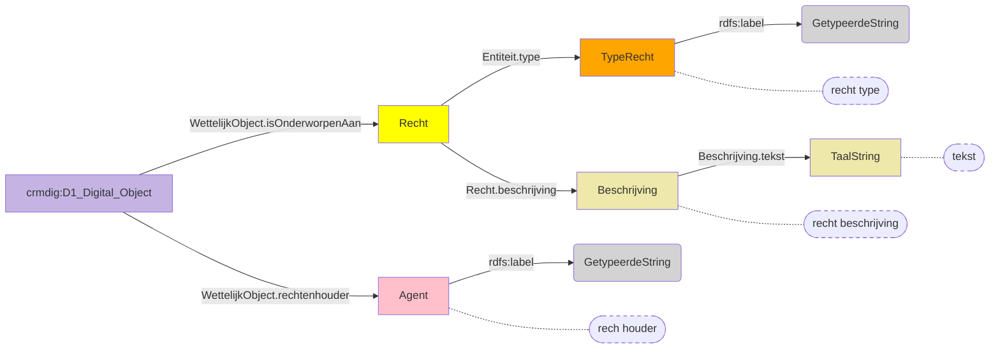

```mermaid
graph LR
16[Beschrijving]-->|Beschrijving.tekst|17(TaalString)
18[TypeRecht]-->|rdfs:label|19(GetypeerdeString)
20[Agent]-->|rdfs:label|21(GetypeerdeString)
15[Recht]-->|Entiteit.type|18[TypeRecht]
15[Recht]-->|Recht.beschrijving|16[Beschrijving]
5[crmdig:D1_Digital_Object]-->|WettelijkObject.isOnderworpenAan|15[Recht]
5[crmdig:D1_Digital_Object]-->|WettelijkObject.rechtenhouder|20[Agent]
style 18_s stroke-dasharray: 5
style 16_s stroke-dasharray: 5
style 17_s stroke-dasharray: 5
style 20_s stroke-dasharray: 5
18[TypeRecht]-.-18_s([recht type])
16[Beschrijving]-.-16_s([recht beschrijving])
17[TaalString]-.-17_s([tekst])
20[Agent]-.-20_s([rech houder])
style 15 fill:#ffff00
style 16 fill:#EEE8AA
style 17 fill:#EEE8AA
style 18 fill:#ffa500
style 19 fill:#D3D3D3
style 20 fill:#ffc0cb
style 21 fill:#D3D3D3
style 5 fill:#C5B4E3
```
