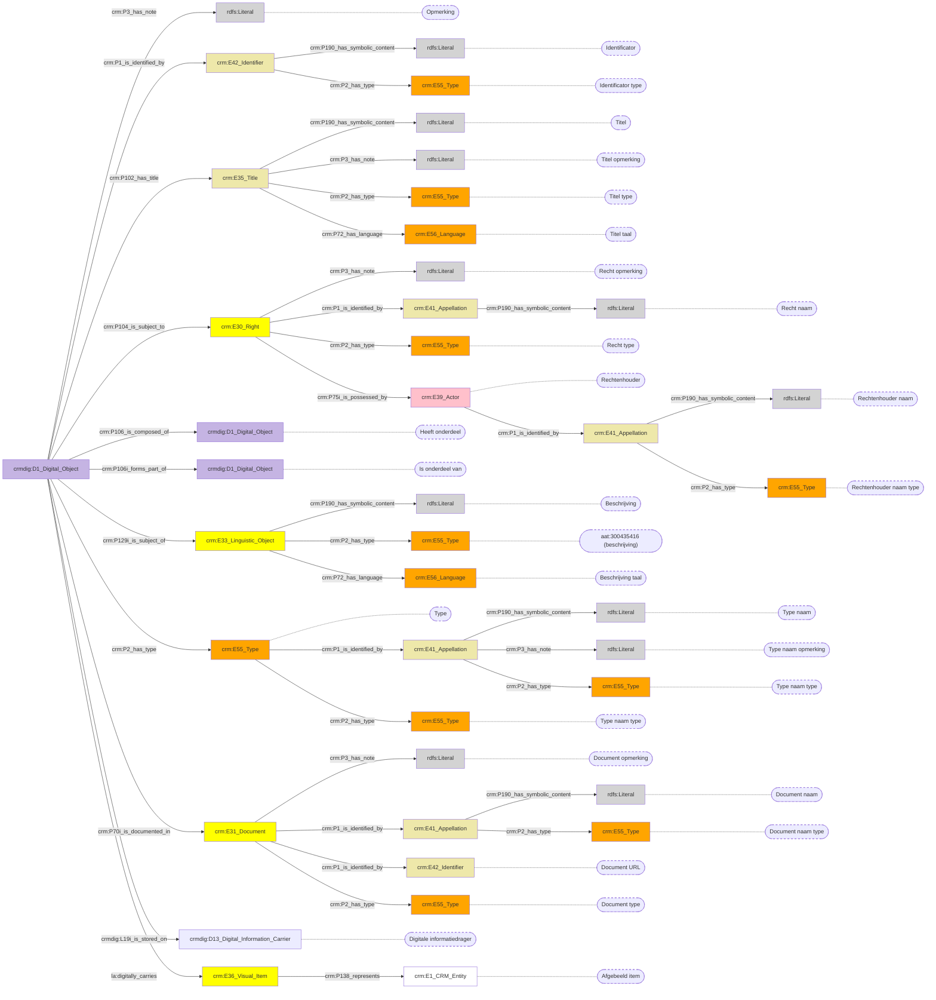

```mermaid
graph LR
style 015cd780-44e6-11ef-85a7-960002548b4f fill:#EEE8AA
style 015cdfd0-44e6-11ef-884b-960002548b4f fill:#D3D3D3
style 015ce2c7-44e6-11ef-b606-960002548b4f fill:#ffa500
style 015ce42f-44e6-11ef-aef4-960002548b4f fill:#D3D3D3
style 015ce616-44e6-11ef-9fbd-960002548b4f fill:#ffa500
style 09a8b8cd-3915-11ef-99eb-960002548b4f fill:#ffa500
style 09a8be6b-3915-11ef-8480-960002548b4f fill:#ffa500
style 09a8c27c-3915-11ef-bcfe-960002548b4f fill:#EEE8AA
style 09a8c64d-3915-11ef-ae4c-960002548b4f fill:#ffff00
style 09a8ca26-3915-11ef-9c46-960002548b4f fill:#D3D3D3
style 09a8ccc6-3915-11ef-8ef3-960002548b4f fill:#D3D3D3
style 09a8cef4-3915-11ef-80d7-960002548b4f fill:#EEE8AA
style 18458e43-4443-11ef-a2db-960002548b4f fill:#C5B4E3
style 42224a4d-4443-11ef-9b4a-960002548b4f fill:#C5B4E3
style 8fd5a5a9-44eb-11ef-8c5b-960002548b4f fill:#EEE8AA
style 8fd5a9c4-44eb-11ef-98bb-960002548b4f fill:#D3D3D3
style 8fd5ab2c-44eb-11ef-a9ce-960002548b4f fill:#D3D3D3
style 8fd5ac54-44eb-11ef-87ed-960002548b4f fill:#ffa500
style ad7f9832-04fa-11ee-9497-96a6d2455259 fill:#EEE8AA
style ad7fa020-04fa-11ee-9497-96a6d2455259 fill:#ffff00
style ad7fa3fe-04fa-11ee-9497-96a6d2455259 fill:#ffa500
style ad7fa7aa-04fa-11ee-9497-96a6d2455259 fill:#ffff00
style ad7fab56-04fa-11ee-9497-96a6d2455259 fill:#ffff00
style ad7fb196-04fa-11ee-9497-96a6d2455259 fill:#D3D3D3
style ad7fb2a4-04fa-11ee-9497-96a6d2455259 fill:#ffa500
style ad7fb3a8-04fa-11ee-9497-96a6d2455259 fill:#C5B4E3
style ad7fb48e-04fa-11ee-9497-96a6d2455259 fill:#ffffff
style ad7fb5ba-04fa-11ee-9497-96a6d2455259 fill:#D3D3D3
style ad7fb7ea-04fa-11ee-9497-96a6d2455259 fill:#ffa500
style ad7fb9fc-04fa-11ee-9497-96a6d2455259 fill:#ffa500
style ad7fbb14-04fa-11ee-9497-96a6d2455259 fill:#ffa500
style ad7fbe3e-04fa-11ee-9497-96a6d2455259 fill:#ffa500
style ad7fbf56-04fa-11ee-9497-96a6d2455259 fill:#D3D3D3
style ad7fc17c-04fa-11ee-9497-96a6d2455259 fill:#ffc0cb
style ad7fc398-04fa-11ee-9497-96a6d2455259 fill:#EEE8AA
style ad7fc49c-04fa-11ee-9497-96a6d2455259 fill:#D3D3D3
style ad7fc7b2-04fa-11ee-9497-96a6d2455259 fill:#D3D3D3
style ad7fc8ac-04fa-11ee-9497-96a6d2455259 fill:#EEE8AA
style ba1444e7-44eb-11ef-b56c-960002548b4f fill:#D3D3D3
style dd0dfa04-b08b-11ee-a0af-960002548b4f fill:#ffa500
015cd780-44e6-11ef-85a7-960002548b4f["crm:E35_Title"]-->|"crm:P190_has_symbolic_content"|015ce42f-44e6-11ef-aef4-960002548b4f(rdfs:Literal)
015cd780-44e6-11ef-85a7-960002548b4f["crm:E35_Title"]-->|"crm:P3_has_note"|015cdfd0-44e6-11ef-884b-960002548b4f(rdfs:Literal)
09a8c27c-3915-11ef-bcfe-960002548b4f["crm:E41_Appellation"]-->|"crm:P190_has_symbolic_content"|09a8ca26-3915-11ef-9c46-960002548b4f(rdfs:Literal)
09a8c64d-3915-11ef-ae4c-960002548b4f["crm:E31_Document"]-->|"crm:P3_has_note"|09a8ccc6-3915-11ef-8ef3-960002548b4f(rdfs:Literal)
8fd5a5a9-44eb-11ef-8c5b-960002548b4f["crm:E41_Appellation"]-->|"crm:P190_has_symbolic_content"|8fd5ab2c-44eb-11ef-a9ce-960002548b4f(rdfs:Literal)
8fd5a5a9-44eb-11ef-8c5b-960002548b4f["crm:E41_Appellation"]-->|"crm:P3_has_note"|8fd5a9c4-44eb-11ef-98bb-960002548b4f(rdfs:Literal)
ad7f9832-04fa-11ee-9497-96a6d2455259["crm:E42_Identifier"]-->|"crm:P190_has_symbolic_content"|ad7fb196-04fa-11ee-9497-96a6d2455259(rdfs:Literal)
ad7fa020-04fa-11ee-9497-96a6d2455259["crm:E33_Linguistic_Object"]-->|"crm:P190_has_symbolic_content"|ad7fb5ba-04fa-11ee-9497-96a6d2455259(rdfs:Literal)
ad7fab56-04fa-11ee-9497-96a6d2455259["crm:E30_Right"]-->|"crm:P3_has_note"|ad7fc7b2-04fa-11ee-9497-96a6d2455259(rdfs:Literal)
ad7fb3a8-04fa-11ee-9497-96a6d2455259["crmdig:D1_Digital_Object"]-->|"crm:P3_has_note"|ba1444e7-44eb-11ef-b56c-960002548b4f(rdfs:Literal)
ad7fc398-04fa-11ee-9497-96a6d2455259["crm:E41_Appellation"]-->|"crm:P190_has_symbolic_content"|ad7fc49c-04fa-11ee-9497-96a6d2455259(rdfs:Literal)
ad7fc8ac-04fa-11ee-9497-96a6d2455259["crm:E41_Appellation"]-->|"crm:P190_has_symbolic_content"|ad7fbf56-04fa-11ee-9497-96a6d2455259(rdfs:Literal)
015ce42f-44e6-11ef-aef4-960002548b4f["rdfs:Literal"]-.-015ce42f-44e6-11ef-aef4-960002548b4f_s(["Titel"])
015ce2c7-44e6-11ef-b606-960002548b4f["crm:E55_Type"]-.-015ce2c7-44e6-11ef-b606-960002548b4f_s(["Titel type"])
015cdfd0-44e6-11ef-884b-960002548b4f["rdfs:Literal"]-.-015cdfd0-44e6-11ef-884b-960002548b4f_s(["Titel opmerking"])
015ce616-44e6-11ef-9fbd-960002548b4f["crm:E56_Language"]-.-015ce616-44e6-11ef-9fbd-960002548b4f_s(["Titel taal"])
09a8ca26-3915-11ef-9c46-960002548b4f["rdfs:Literal"]-.-09a8ca26-3915-11ef-9c46-960002548b4f_s(["Document naam"])
09a8b8cd-3915-11ef-99eb-960002548b4f["crm:E55_Type"]-.-09a8b8cd-3915-11ef-99eb-960002548b4f_s(["Document naam type"])
09a8cef4-3915-11ef-80d7-960002548b4f["crm:E42_Identifier"]-.-09a8cef4-3915-11ef-80d7-960002548b4f_s(["Document URL"])
09a8be6b-3915-11ef-8480-960002548b4f["crm:E55_Type"]-.-09a8be6b-3915-11ef-8480-960002548b4f_s(["Document type"])
09a8ccc6-3915-11ef-8ef3-960002548b4f["rdfs:Literal"]-.-09a8ccc6-3915-11ef-8ef3-960002548b4f_s(["Document opmerking"])
8fd5ab2c-44eb-11ef-a9ce-960002548b4f["rdfs:Literal"]-.-8fd5ab2c-44eb-11ef-a9ce-960002548b4f_s(["Type naam"])
8fd5ac54-44eb-11ef-87ed-960002548b4f["crm:E55_Type"]-.-8fd5ac54-44eb-11ef-87ed-960002548b4f_s(["Type naam type"])
8fd5a9c4-44eb-11ef-98bb-960002548b4f["rdfs:Literal"]-.-8fd5a9c4-44eb-11ef-98bb-960002548b4f_s(["Type naam opmerking"])
ad7fb196-04fa-11ee-9497-96a6d2455259["rdfs:Literal"]-.-ad7fb196-04fa-11ee-9497-96a6d2455259_s(["Identificator"])
ad7fb2a4-04fa-11ee-9497-96a6d2455259["crm:E55_Type"]-.-ad7fb2a4-04fa-11ee-9497-96a6d2455259_s(["Identificator type"])
ad7fb5ba-04fa-11ee-9497-96a6d2455259["rdfs:Literal"]-.-ad7fb5ba-04fa-11ee-9497-96a6d2455259_s(["Beschrijving"])
ad7fb7ea-04fa-11ee-9497-96a6d2455259["crm:E55_Type"]-.-ad7fb7ea-04fa-11ee-9497-96a6d2455259_s(["aat:300435416 (beschrijving)"])
ad7fb9fc-04fa-11ee-9497-96a6d2455259["crm:E56_Language"]-.-ad7fb9fc-04fa-11ee-9497-96a6d2455259_s(["Beschrijving taal"])
ad7fbb14-04fa-11ee-9497-96a6d2455259["crm:E55_Type"]-.-ad7fbb14-04fa-11ee-9497-96a6d2455259_s(["Type naam type"])
ad7fb48e-04fa-11ee-9497-96a6d2455259["crm:E1_CRM_Entity"]-.-ad7fb48e-04fa-11ee-9497-96a6d2455259_s(["Afgebeeld item"])
dd0dfa04-b08b-11ee-a0af-960002548b4f["crm:E55_Type"]-.-dd0dfa04-b08b-11ee-a0af-960002548b4f_s(["Recht type"])
ad7fc7b2-04fa-11ee-9497-96a6d2455259["rdfs:Literal"]-.-ad7fc7b2-04fa-11ee-9497-96a6d2455259_s(["Recht opmerking"])
ad7fc17c-04fa-11ee-9497-96a6d2455259["crm:E39_Actor"]-.-ad7fc17c-04fa-11ee-9497-96a6d2455259_s(["Rechtenhouder"])
18458e43-4443-11ef-a2db-960002548b4f["crmdig:D1_Digital_Object"]-.-18458e43-4443-11ef-a2db-960002548b4f_s(["Heeft onderdeel"])
42224a4d-4443-11ef-9b4a-960002548b4f["crmdig:D1_Digital_Object"]-.-42224a4d-4443-11ef-9b4a-960002548b4f_s(["Is onderdeel van"])
ad7fa3fe-04fa-11ee-9497-96a6d2455259["crm:E55_Type"]-.-ad7fa3fe-04fa-11ee-9497-96a6d2455259_s(["Type"])
ba1444e7-44eb-11ef-b56c-960002548b4f["rdfs:Literal"]-.-ba1444e7-44eb-11ef-b56c-960002548b4f_s(["Opmerking"])
20c867d7-3915-11ef-8cbf-960002548b4f["crmdig:D13_Digital_Information_Carrier"]-.-20c867d7-3915-11ef-8cbf-960002548b4f_s(["Digitale informatiedrager"])
ad7fc49c-04fa-11ee-9497-96a6d2455259["rdfs:Literal"]-.-ad7fc49c-04fa-11ee-9497-96a6d2455259_s(["Recht naam"])
ad7fbf56-04fa-11ee-9497-96a6d2455259["rdfs:Literal"]-.-ad7fbf56-04fa-11ee-9497-96a6d2455259_s(["Rechtenhouder naam"])
ad7fbe3e-04fa-11ee-9497-96a6d2455259["crm:E55_Type"]-.-ad7fbe3e-04fa-11ee-9497-96a6d2455259_s(["Rechtenhouder naam type"])
015cd780-44e6-11ef-85a7-960002548b4f["crm:E35_Title"]-->|"crm:P2_has_type"|015ce2c7-44e6-11ef-b606-960002548b4f["crm:E55_Type"]
015cd780-44e6-11ef-85a7-960002548b4f["crm:E35_Title"]-->|"crm:P72_has_language"|015ce616-44e6-11ef-9fbd-960002548b4f["crm:E56_Language"]
09a8c27c-3915-11ef-bcfe-960002548b4f["crm:E41_Appellation"]-->|"crm:P2_has_type"|09a8b8cd-3915-11ef-99eb-960002548b4f["crm:E55_Type"]
09a8c64d-3915-11ef-ae4c-960002548b4f["crm:E31_Document"]-->|"crm:P1_is_identified_by"|09a8c27c-3915-11ef-bcfe-960002548b4f["crm:E41_Appellation"]
09a8c64d-3915-11ef-ae4c-960002548b4f["crm:E31_Document"]-->|"crm:P1_is_identified_by"|09a8cef4-3915-11ef-80d7-960002548b4f["crm:E42_Identifier"]
09a8c64d-3915-11ef-ae4c-960002548b4f["crm:E31_Document"]-->|"crm:P2_has_type"|09a8be6b-3915-11ef-8480-960002548b4f["crm:E55_Type"]
8fd5a5a9-44eb-11ef-8c5b-960002548b4f["crm:E41_Appellation"]-->|"crm:P2_has_type"|8fd5ac54-44eb-11ef-87ed-960002548b4f["crm:E55_Type"]
ad7f9832-04fa-11ee-9497-96a6d2455259["crm:E42_Identifier"]-->|"crm:P2_has_type"|ad7fb2a4-04fa-11ee-9497-96a6d2455259["crm:E55_Type"]
ad7fa020-04fa-11ee-9497-96a6d2455259["crm:E33_Linguistic_Object"]-->|"crm:P2_has_type"|ad7fb7ea-04fa-11ee-9497-96a6d2455259["crm:E55_Type"]
ad7fa020-04fa-11ee-9497-96a6d2455259["crm:E33_Linguistic_Object"]-->|"crm:P72_has_language"|ad7fb9fc-04fa-11ee-9497-96a6d2455259["crm:E56_Language"]
ad7fa3fe-04fa-11ee-9497-96a6d2455259["crm:E55_Type"]-->|"crm:P1_is_identified_by"|8fd5a5a9-44eb-11ef-8c5b-960002548b4f["crm:E41_Appellation"]
ad7fa3fe-04fa-11ee-9497-96a6d2455259["crm:E55_Type"]-->|"crm:P2_has_type"|ad7fbb14-04fa-11ee-9497-96a6d2455259["crm:E55_Type"]
ad7fa7aa-04fa-11ee-9497-96a6d2455259["crm:E36_Visual_Item"]-->|"crm:P138_represents"|ad7fb48e-04fa-11ee-9497-96a6d2455259["crm:E1_CRM_Entity"]
ad7fab56-04fa-11ee-9497-96a6d2455259["crm:E30_Right"]-->|"crm:P1_is_identified_by"|ad7fc398-04fa-11ee-9497-96a6d2455259["crm:E41_Appellation"]
ad7fab56-04fa-11ee-9497-96a6d2455259["crm:E30_Right"]-->|"crm:P2_has_type"|dd0dfa04-b08b-11ee-a0af-960002548b4f["crm:E55_Type"]
ad7fab56-04fa-11ee-9497-96a6d2455259["crm:E30_Right"]-->|"crm:P75i_is_possessed_by"|ad7fc17c-04fa-11ee-9497-96a6d2455259["crm:E39_Actor"]
ad7fb3a8-04fa-11ee-9497-96a6d2455259["crmdig:D1_Digital_Object"]-->|"crm:P1_is_identified_by"|ad7f9832-04fa-11ee-9497-96a6d2455259["crm:E42_Identifier"]
ad7fb3a8-04fa-11ee-9497-96a6d2455259["crmdig:D1_Digital_Object"]-->|"crm:P102_has_title"|015cd780-44e6-11ef-85a7-960002548b4f["crm:E35_Title"]
ad7fb3a8-04fa-11ee-9497-96a6d2455259["crmdig:D1_Digital_Object"]-->|"crm:P104_is_subject_to"|ad7fab56-04fa-11ee-9497-96a6d2455259["crm:E30_Right"]
ad7fb3a8-04fa-11ee-9497-96a6d2455259["crmdig:D1_Digital_Object"]-->|"crm:P106_is_composed_of"|18458e43-4443-11ef-a2db-960002548b4f["crmdig:D1_Digital_Object"]
ad7fb3a8-04fa-11ee-9497-96a6d2455259["crmdig:D1_Digital_Object"]-->|"crm:P106i_forms_part_of"|42224a4d-4443-11ef-9b4a-960002548b4f["crmdig:D1_Digital_Object"]
ad7fb3a8-04fa-11ee-9497-96a6d2455259["crmdig:D1_Digital_Object"]-->|"crm:P129i_is_subject_of"|ad7fa020-04fa-11ee-9497-96a6d2455259["crm:E33_Linguistic_Object"]
ad7fb3a8-04fa-11ee-9497-96a6d2455259["crmdig:D1_Digital_Object"]-->|"crm:P2_has_type"|ad7fa3fe-04fa-11ee-9497-96a6d2455259["crm:E55_Type"]
ad7fb3a8-04fa-11ee-9497-96a6d2455259["crmdig:D1_Digital_Object"]-->|"crm:P70i_is_documented_in"|09a8c64d-3915-11ef-ae4c-960002548b4f["crm:E31_Document"]
ad7fb3a8-04fa-11ee-9497-96a6d2455259["crmdig:D1_Digital_Object"]-->|"crmdig:L19i_is_stored_on"|20c867d7-3915-11ef-8cbf-960002548b4f["crmdig:D13_Digital_Information_Carrier"]
ad7fb3a8-04fa-11ee-9497-96a6d2455259["crmdig:D1_Digital_Object"]-->|"la:digitally_carries"|ad7fa7aa-04fa-11ee-9497-96a6d2455259["crm:E36_Visual_Item"]
ad7fc17c-04fa-11ee-9497-96a6d2455259["crm:E39_Actor"]-->|"crm:P1_is_identified_by"|ad7fc8ac-04fa-11ee-9497-96a6d2455259["crm:E41_Appellation"]
ad7fc8ac-04fa-11ee-9497-96a6d2455259["crm:E41_Appellation"]-->|"crm:P2_has_type"|ad7fbe3e-04fa-11ee-9497-96a6d2455259["crm:E55_Type"]
style 015ce42f-44e6-11ef-aef4-960002548b4f_s stroke-dasharray: 5
style 015ce2c7-44e6-11ef-b606-960002548b4f_s stroke-dasharray: 5
style 015cdfd0-44e6-11ef-884b-960002548b4f_s stroke-dasharray: 5
style 015ce616-44e6-11ef-9fbd-960002548b4f_s stroke-dasharray: 5
style 09a8ca26-3915-11ef-9c46-960002548b4f_s stroke-dasharray: 5
style 09a8b8cd-3915-11ef-99eb-960002548b4f_s stroke-dasharray: 5
style 09a8cef4-3915-11ef-80d7-960002548b4f_s stroke-dasharray: 5
style 09a8be6b-3915-11ef-8480-960002548b4f_s stroke-dasharray: 5
style 09a8ccc6-3915-11ef-8ef3-960002548b4f_s stroke-dasharray: 5
style 8fd5ab2c-44eb-11ef-a9ce-960002548b4f_s stroke-dasharray: 5
style 8fd5ac54-44eb-11ef-87ed-960002548b4f_s stroke-dasharray: 5
style 8fd5a9c4-44eb-11ef-98bb-960002548b4f_s stroke-dasharray: 5
style ad7fb196-04fa-11ee-9497-96a6d2455259_s stroke-dasharray: 5
style ad7fb2a4-04fa-11ee-9497-96a6d2455259_s stroke-dasharray: 5
style ad7fb5ba-04fa-11ee-9497-96a6d2455259_s stroke-dasharray: 5
style ad7fb7ea-04fa-11ee-9497-96a6d2455259_s stroke-dasharray: 5
style ad7fb9fc-04fa-11ee-9497-96a6d2455259_s stroke-dasharray: 5
style ad7fbb14-04fa-11ee-9497-96a6d2455259_s stroke-dasharray: 5
style ad7fb48e-04fa-11ee-9497-96a6d2455259_s stroke-dasharray: 5
style dd0dfa04-b08b-11ee-a0af-960002548b4f_s stroke-dasharray: 5
style ad7fc7b2-04fa-11ee-9497-96a6d2455259_s stroke-dasharray: 5
style ad7fc17c-04fa-11ee-9497-96a6d2455259_s stroke-dasharray: 5
style 18458e43-4443-11ef-a2db-960002548b4f_s stroke-dasharray: 5
style 42224a4d-4443-11ef-9b4a-960002548b4f_s stroke-dasharray: 5
style ad7fa3fe-04fa-11ee-9497-96a6d2455259_s stroke-dasharray: 5
style ba1444e7-44eb-11ef-b56c-960002548b4f_s stroke-dasharray: 5
style 20c867d7-3915-11ef-8cbf-960002548b4f_s stroke-dasharray: 5
style ad7fc49c-04fa-11ee-9497-96a6d2455259_s stroke-dasharray: 5
style ad7fbf56-04fa-11ee-9497-96a6d2455259_s stroke-dasharray: 5
style ad7fbe3e-04fa-11ee-9497-96a6d2455259_s stroke-dasharray: 5
```
