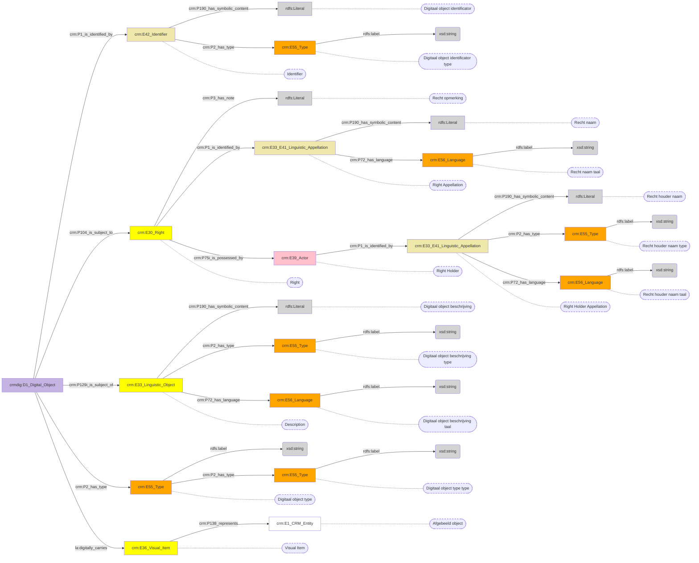

```mermaid
graph LR
ad7f9832-04fa-11ee-9497-96a6d2455259["crm:E42_Identifier"]-->|"crm:P190_has_symbolic_content"|ad7fb196-04fa-11ee-9497-96a6d2455259(rdfs:Literal)
ad7fa020-04fa-11ee-9497-96a6d2455259["crm:E33_Linguistic_Object"]-->|"crm:P190_has_symbolic_content"|ad7fb5ba-04fa-11ee-9497-96a6d2455259(rdfs:Literal)
ad7fa3fe-04fa-11ee-9497-96a6d2455259["crm:E55_Type"]-->|"rdfs:label"|ad7fbd30-04fa-11ee-9497-96a6d2455259(xsd:string)
ad7fab56-04fa-11ee-9497-96a6d2455259["crm:E30_Right"]-->|"crm:P3_has_note"|ad7fc7b2-04fa-11ee-9497-96a6d2455259(rdfs:Literal)
ad7faeda-04fa-11ee-9497-96a6d2455259["crm:E56_Language"]-->|"rdfs:label"|ad7fc28a-04fa-11ee-9497-96a6d2455259(xsd:string)
ad7fb2a4-04fa-11ee-9497-96a6d2455259["crm:E55_Type"]-->|"rdfs:label"|ad7fb074-04fa-11ee-9497-96a6d2455259(xsd:string)
ad7fb7ea-04fa-11ee-9497-96a6d2455259["crm:E55_Type"]-->|"rdfs:label"|ad7fb6d2-04fa-11ee-9497-96a6d2455259(xsd:string)
ad7fb9fc-04fa-11ee-9497-96a6d2455259["crm:E56_Language"]-->|"rdfs:label"|ad7fb8ee-04fa-11ee-9497-96a6d2455259(xsd:string)
ad7fbb14-04fa-11ee-9497-96a6d2455259["crm:E55_Type"]-->|"rdfs:label"|ad7fbc18-04fa-11ee-9497-96a6d2455259(xsd:string)
ad7fbe3e-04fa-11ee-9497-96a6d2455259["crm:E55_Type"]-->|"rdfs:label"|ad7fc05a-04fa-11ee-9497-96a6d2455259(xsd:string)
ad7fc398-04fa-11ee-9497-96a6d2455259["crm:E33_E41_Linguistic_Appellation"]-->|"crm:P190_has_symbolic_content"|ad7fc49c-04fa-11ee-9497-96a6d2455259(rdfs:Literal)
ad7fc5a0-04fa-11ee-9497-96a6d2455259["crm:E56_Language"]-->|"rdfs:label"|ad7fc6a4-04fa-11ee-9497-96a6d2455259(xsd:string)
ad7fc8ac-04fa-11ee-9497-96a6d2455259["crm:E33_E41_Linguistic_Appellation"]-->|"crm:P190_has_symbolic_content"|ad7fbf56-04fa-11ee-9497-96a6d2455259(rdfs:Literal)
ad7f9832-04fa-11ee-9497-96a6d2455259["crm:E42_Identifier"]-->|"crm:P2_has_type"|ad7fb2a4-04fa-11ee-9497-96a6d2455259["crm:E55_Type"]
ad7fa020-04fa-11ee-9497-96a6d2455259["crm:E33_Linguistic_Object"]-->|"crm:P2_has_type"|ad7fb7ea-04fa-11ee-9497-96a6d2455259["crm:E55_Type"]
ad7fa020-04fa-11ee-9497-96a6d2455259["crm:E33_Linguistic_Object"]-->|"crm:P72_has_language"|ad7fb9fc-04fa-11ee-9497-96a6d2455259["crm:E56_Language"]
ad7fa3fe-04fa-11ee-9497-96a6d2455259["crm:E55_Type"]-->|"crm:P2_has_type"|ad7fbb14-04fa-11ee-9497-96a6d2455259["crm:E55_Type"]
ad7fa7aa-04fa-11ee-9497-96a6d2455259["crm:E36_Visual_Item"]-->|"crm:P138_represents"|ad7fb48e-04fa-11ee-9497-96a6d2455259["crm:E1_CRM_Entity"]
ad7fab56-04fa-11ee-9497-96a6d2455259["crm:E30_Right"]-->|"crm:P1_is_identified_by"|ad7fc398-04fa-11ee-9497-96a6d2455259["crm:E33_E41_Linguistic_Appellation"]
ad7fab56-04fa-11ee-9497-96a6d2455259["crm:E30_Right"]-->|"crm:P75i_is_possessed_by"|ad7fc17c-04fa-11ee-9497-96a6d2455259["crm:E39_Actor"]
ad7fb3a8-04fa-11ee-9497-96a6d2455259["crmdig:D1_Digital_Object"]-->|"crm:P1_is_identified_by"|ad7f9832-04fa-11ee-9497-96a6d2455259["crm:E42_Identifier"]
ad7fb3a8-04fa-11ee-9497-96a6d2455259["crmdig:D1_Digital_Object"]-->|"crm:P104_is_subject_to"|ad7fab56-04fa-11ee-9497-96a6d2455259["crm:E30_Right"]
ad7fb3a8-04fa-11ee-9497-96a6d2455259["crmdig:D1_Digital_Object"]-->|"crm:P129i_is_subject_of"|ad7fa020-04fa-11ee-9497-96a6d2455259["crm:E33_Linguistic_Object"]
ad7fb3a8-04fa-11ee-9497-96a6d2455259["crmdig:D1_Digital_Object"]-->|"crm:P2_has_type"|ad7fa3fe-04fa-11ee-9497-96a6d2455259["crm:E55_Type"]
ad7fb3a8-04fa-11ee-9497-96a6d2455259["crmdig:D1_Digital_Object"]-->|"la:digitally_carries"|ad7fa7aa-04fa-11ee-9497-96a6d2455259["crm:E36_Visual_Item"]
ad7fc17c-04fa-11ee-9497-96a6d2455259["crm:E39_Actor"]-->|"crm:P1_is_identified_by"|ad7fc8ac-04fa-11ee-9497-96a6d2455259["crm:E33_E41_Linguistic_Appellation"]
ad7fc398-04fa-11ee-9497-96a6d2455259["crm:E33_E41_Linguistic_Appellation"]-->|"crm:P72_has_language"|ad7fc5a0-04fa-11ee-9497-96a6d2455259["crm:E56_Language"]
ad7fc8ac-04fa-11ee-9497-96a6d2455259["crm:E33_E41_Linguistic_Appellation"]-->|"crm:P2_has_type"|ad7fbe3e-04fa-11ee-9497-96a6d2455259["crm:E55_Type"]
ad7fc8ac-04fa-11ee-9497-96a6d2455259["crm:E33_E41_Linguistic_Appellation"]-->|"crm:P72_has_language"|ad7faeda-04fa-11ee-9497-96a6d2455259["crm:E56_Language"]
style ad7fb196-04fa-11ee-9497-96a6d2455259_s stroke-dasharray: 5
style ad7fb2a4-04fa-11ee-9497-96a6d2455259_s stroke-dasharray: 5
style ad7fb5ba-04fa-11ee-9497-96a6d2455259_s stroke-dasharray: 5
style ad7fb7ea-04fa-11ee-9497-96a6d2455259_s stroke-dasharray: 5
style ad7fb9fc-04fa-11ee-9497-96a6d2455259_s stroke-dasharray: 5
style ad7fbb14-04fa-11ee-9497-96a6d2455259_s stroke-dasharray: 5
style ad7fb48e-04fa-11ee-9497-96a6d2455259_s stroke-dasharray: 5
style ad7fc398-04fa-11ee-9497-96a6d2455259_s stroke-dasharray: 5
style ad7fc7b2-04fa-11ee-9497-96a6d2455259_s stroke-dasharray: 5
style ad7fc17c-04fa-11ee-9497-96a6d2455259_s stroke-dasharray: 5
style ad7f9832-04fa-11ee-9497-96a6d2455259_s stroke-dasharray: 5
style ad7fab56-04fa-11ee-9497-96a6d2455259_s stroke-dasharray: 5
style ad7fa020-04fa-11ee-9497-96a6d2455259_s stroke-dasharray: 5
style ad7fa3fe-04fa-11ee-9497-96a6d2455259_s stroke-dasharray: 5
style ad7fa7aa-04fa-11ee-9497-96a6d2455259_s stroke-dasharray: 5
style ad7fc8ac-04fa-11ee-9497-96a6d2455259_s stroke-dasharray: 5
style ad7fc49c-04fa-11ee-9497-96a6d2455259_s stroke-dasharray: 5
style ad7fc5a0-04fa-11ee-9497-96a6d2455259_s stroke-dasharray: 5
style ad7fbf56-04fa-11ee-9497-96a6d2455259_s stroke-dasharray: 5
style ad7fbe3e-04fa-11ee-9497-96a6d2455259_s stroke-dasharray: 5
style ad7faeda-04fa-11ee-9497-96a6d2455259_s stroke-dasharray: 5
ad7fb196-04fa-11ee-9497-96a6d2455259["rdfs:Literal"]-.-ad7fb196-04fa-11ee-9497-96a6d2455259_s(["Digitaal object identificator"])
ad7fb2a4-04fa-11ee-9497-96a6d2455259["crm:E55_Type"]-.-ad7fb2a4-04fa-11ee-9497-96a6d2455259_s(["Digitaal object identificator type"])
ad7fb5ba-04fa-11ee-9497-96a6d2455259["rdfs:Literal"]-.-ad7fb5ba-04fa-11ee-9497-96a6d2455259_s(["Digitaal object beschrijving"])
ad7fb7ea-04fa-11ee-9497-96a6d2455259["crm:E55_Type"]-.-ad7fb7ea-04fa-11ee-9497-96a6d2455259_s(["Digitaal object beschrijving type"])
ad7fb9fc-04fa-11ee-9497-96a6d2455259["crm:E56_Language"]-.-ad7fb9fc-04fa-11ee-9497-96a6d2455259_s(["Digitaal object beschrijving taal"])
ad7fbb14-04fa-11ee-9497-96a6d2455259["crm:E55_Type"]-.-ad7fbb14-04fa-11ee-9497-96a6d2455259_s(["Digitaal object type type"])
ad7fb48e-04fa-11ee-9497-96a6d2455259["crm:E1_CRM_Entity"]-.-ad7fb48e-04fa-11ee-9497-96a6d2455259_s(["Afgebeeld object"])
ad7fc398-04fa-11ee-9497-96a6d2455259["crm:E33_E41_Linguistic_Appellation"]-.-ad7fc398-04fa-11ee-9497-96a6d2455259_s(["Right Appellation"])
ad7fc7b2-04fa-11ee-9497-96a6d2455259["rdfs:Literal"]-.-ad7fc7b2-04fa-11ee-9497-96a6d2455259_s(["Recht opmerking"])
ad7fc17c-04fa-11ee-9497-96a6d2455259["crm:E39_Actor"]-.-ad7fc17c-04fa-11ee-9497-96a6d2455259_s(["Right Holder"])
ad7f9832-04fa-11ee-9497-96a6d2455259["crm:E42_Identifier"]-.-ad7f9832-04fa-11ee-9497-96a6d2455259_s(["Identifier"])
ad7fab56-04fa-11ee-9497-96a6d2455259["crm:E30_Right"]-.-ad7fab56-04fa-11ee-9497-96a6d2455259_s(["Right"])
ad7fa020-04fa-11ee-9497-96a6d2455259["crm:E33_Linguistic_Object"]-.-ad7fa020-04fa-11ee-9497-96a6d2455259_s(["Description"])
ad7fa3fe-04fa-11ee-9497-96a6d2455259["crm:E55_Type"]-.-ad7fa3fe-04fa-11ee-9497-96a6d2455259_s(["Digitaal object type"])
ad7fa7aa-04fa-11ee-9497-96a6d2455259["crm:E36_Visual_Item"]-.-ad7fa7aa-04fa-11ee-9497-96a6d2455259_s(["Visual Item"])
ad7fc8ac-04fa-11ee-9497-96a6d2455259["crm:E33_E41_Linguistic_Appellation"]-.-ad7fc8ac-04fa-11ee-9497-96a6d2455259_s(["Right Holder Appellation"])
ad7fc49c-04fa-11ee-9497-96a6d2455259["rdfs:Literal"]-.-ad7fc49c-04fa-11ee-9497-96a6d2455259_s(["Recht naam"])
ad7fc5a0-04fa-11ee-9497-96a6d2455259["crm:E56_Language"]-.-ad7fc5a0-04fa-11ee-9497-96a6d2455259_s(["Recht naam taal"])
ad7fbf56-04fa-11ee-9497-96a6d2455259["rdfs:Literal"]-.-ad7fbf56-04fa-11ee-9497-96a6d2455259_s(["Recht houder naam"])
ad7fbe3e-04fa-11ee-9497-96a6d2455259["crm:E55_Type"]-.-ad7fbe3e-04fa-11ee-9497-96a6d2455259_s(["Recht houder naam type"])
ad7faeda-04fa-11ee-9497-96a6d2455259["crm:E56_Language"]-.-ad7faeda-04fa-11ee-9497-96a6d2455259_s(["Recht houder naam taal"])
style ad7f9832-04fa-11ee-9497-96a6d2455259 fill:#EEE8AA
style ad7fa020-04fa-11ee-9497-96a6d2455259 fill:#ffff00
style ad7fa3fe-04fa-11ee-9497-96a6d2455259 fill:#ffa500
style ad7fa7aa-04fa-11ee-9497-96a6d2455259 fill:#ffff00
style ad7fab56-04fa-11ee-9497-96a6d2455259 fill:#ffff00
style ad7faeda-04fa-11ee-9497-96a6d2455259 fill:#ffa500
style ad7fb074-04fa-11ee-9497-96a6d2455259 fill:#D3D3D3
style ad7fb196-04fa-11ee-9497-96a6d2455259 fill:#D3D3D3
style ad7fb2a4-04fa-11ee-9497-96a6d2455259 fill:#ffa500
style ad7fb3a8-04fa-11ee-9497-96a6d2455259 fill:#C5B4E3
style ad7fb48e-04fa-11ee-9497-96a6d2455259 fill:#ffffff
style ad7fb5ba-04fa-11ee-9497-96a6d2455259 fill:#D3D3D3
style ad7fb6d2-04fa-11ee-9497-96a6d2455259 fill:#D3D3D3
style ad7fb7ea-04fa-11ee-9497-96a6d2455259 fill:#ffa500
style ad7fb8ee-04fa-11ee-9497-96a6d2455259 fill:#D3D3D3
style ad7fb9fc-04fa-11ee-9497-96a6d2455259 fill:#ffa500
style ad7fbb14-04fa-11ee-9497-96a6d2455259 fill:#ffa500
style ad7fbc18-04fa-11ee-9497-96a6d2455259 fill:#D3D3D3
style ad7fbd30-04fa-11ee-9497-96a6d2455259 fill:#D3D3D3
style ad7fbe3e-04fa-11ee-9497-96a6d2455259 fill:#ffa500
style ad7fbf56-04fa-11ee-9497-96a6d2455259 fill:#D3D3D3
style ad7fc05a-04fa-11ee-9497-96a6d2455259 fill:#D3D3D3
style ad7fc17c-04fa-11ee-9497-96a6d2455259 fill:#ffc0cb
style ad7fc28a-04fa-11ee-9497-96a6d2455259 fill:#D3D3D3
style ad7fc398-04fa-11ee-9497-96a6d2455259 fill:#EEE8AA
style ad7fc49c-04fa-11ee-9497-96a6d2455259 fill:#D3D3D3
style ad7fc5a0-04fa-11ee-9497-96a6d2455259 fill:#ffa500
style ad7fc6a4-04fa-11ee-9497-96a6d2455259 fill:#D3D3D3
style ad7fc7b2-04fa-11ee-9497-96a6d2455259 fill:#D3D3D3
style ad7fc8ac-04fa-11ee-9497-96a6d2455259 fill:#EEE8AA
```
