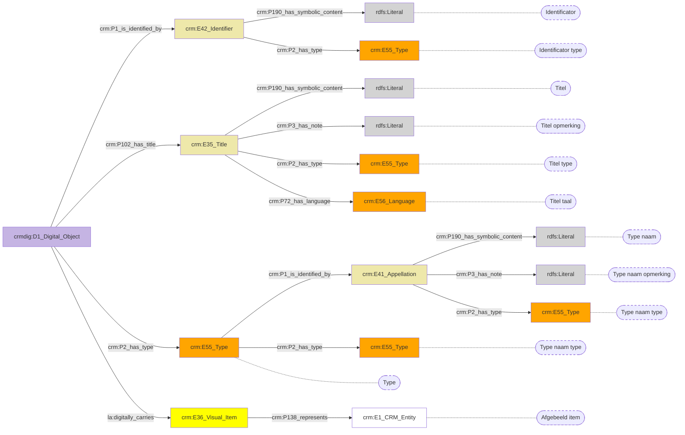

```mermaid
graph LR
style 015cd780-44e6-11ef-85a7-960002548b4f fill:#EEE8AA
style 015cdfd0-44e6-11ef-884b-960002548b4f fill:#D3D3D3
style 015ce2c7-44e6-11ef-b606-960002548b4f fill:#ffa500
style 015ce42f-44e6-11ef-aef4-960002548b4f fill:#D3D3D3
style 015ce616-44e6-11ef-9fbd-960002548b4f fill:#ffa500
style 8fd5a5a9-44eb-11ef-8c5b-960002548b4f fill:#EEE8AA
style 8fd5a9c4-44eb-11ef-98bb-960002548b4f fill:#D3D3D3
style 8fd5ab2c-44eb-11ef-a9ce-960002548b4f fill:#D3D3D3
style 8fd5ac54-44eb-11ef-87ed-960002548b4f fill:#ffa500
style ad7f9832-04fa-11ee-9497-96a6d2455259 fill:#EEE8AA
style ad7fa3fe-04fa-11ee-9497-96a6d2455259 fill:#ffa500
style ad7fa7aa-04fa-11ee-9497-96a6d2455259 fill:#ffff00
style ad7fb196-04fa-11ee-9497-96a6d2455259 fill:#D3D3D3
style ad7fb2a4-04fa-11ee-9497-96a6d2455259 fill:#ffa500
style ad7fb3a8-04fa-11ee-9497-96a6d2455259 fill:#C5B4E3
style ad7fb48e-04fa-11ee-9497-96a6d2455259 fill:#ffffff
style ad7fbb14-04fa-11ee-9497-96a6d2455259 fill:#ffa500
015cd780-44e6-11ef-85a7-960002548b4f["crm:E35_Title"]-->|"crm:P190_has_symbolic_content"|015ce42f-44e6-11ef-aef4-960002548b4f(rdfs:Literal)
015cd780-44e6-11ef-85a7-960002548b4f["crm:E35_Title"]-->|"crm:P3_has_note"|015cdfd0-44e6-11ef-884b-960002548b4f(rdfs:Literal)
8fd5a5a9-44eb-11ef-8c5b-960002548b4f["crm:E41_Appellation"]-->|"crm:P190_has_symbolic_content"|8fd5ab2c-44eb-11ef-a9ce-960002548b4f(rdfs:Literal)
8fd5a5a9-44eb-11ef-8c5b-960002548b4f["crm:E41_Appellation"]-->|"crm:P3_has_note"|8fd5a9c4-44eb-11ef-98bb-960002548b4f(rdfs:Literal)
ad7f9832-04fa-11ee-9497-96a6d2455259["crm:E42_Identifier"]-->|"crm:P190_has_symbolic_content"|ad7fb196-04fa-11ee-9497-96a6d2455259(rdfs:Literal)
015cd780-44e6-11ef-85a7-960002548b4f["crm:E35_Title"]-->|"crm:P2_has_type"|015ce2c7-44e6-11ef-b606-960002548b4f["crm:E55_Type"]
015cd780-44e6-11ef-85a7-960002548b4f["crm:E35_Title"]-->|"crm:P72_has_language"|015ce616-44e6-11ef-9fbd-960002548b4f["crm:E56_Language"]
8fd5a5a9-44eb-11ef-8c5b-960002548b4f["crm:E41_Appellation"]-->|"crm:P2_has_type"|8fd5ac54-44eb-11ef-87ed-960002548b4f["crm:E55_Type"]
ad7f9832-04fa-11ee-9497-96a6d2455259["crm:E42_Identifier"]-->|"crm:P2_has_type"|ad7fb2a4-04fa-11ee-9497-96a6d2455259["crm:E55_Type"]
ad7fa3fe-04fa-11ee-9497-96a6d2455259["crm:E55_Type"]-->|"crm:P1_is_identified_by"|8fd5a5a9-44eb-11ef-8c5b-960002548b4f["crm:E41_Appellation"]
ad7fa3fe-04fa-11ee-9497-96a6d2455259["crm:E55_Type"]-->|"crm:P2_has_type"|ad7fbb14-04fa-11ee-9497-96a6d2455259["crm:E55_Type"]
ad7fa7aa-04fa-11ee-9497-96a6d2455259["crm:E36_Visual_Item"]-->|"crm:P138_represents"|ad7fb48e-04fa-11ee-9497-96a6d2455259["crm:E1_CRM_Entity"]
ad7fb3a8-04fa-11ee-9497-96a6d2455259["crmdig:D1_Digital_Object"]-->|"crm:P1_is_identified_by"|ad7f9832-04fa-11ee-9497-96a6d2455259["crm:E42_Identifier"]
ad7fb3a8-04fa-11ee-9497-96a6d2455259["crmdig:D1_Digital_Object"]-->|"crm:P102_has_title"|015cd780-44e6-11ef-85a7-960002548b4f["crm:E35_Title"]
ad7fb3a8-04fa-11ee-9497-96a6d2455259["crmdig:D1_Digital_Object"]-->|"crm:P2_has_type"|ad7fa3fe-04fa-11ee-9497-96a6d2455259["crm:E55_Type"]
ad7fb3a8-04fa-11ee-9497-96a6d2455259["crmdig:D1_Digital_Object"]-->|"la:digitally_carries"|ad7fa7aa-04fa-11ee-9497-96a6d2455259["crm:E36_Visual_Item"]
015ce42f-44e6-11ef-aef4-960002548b4f["rdfs:Literal"]-.-015ce42f-44e6-11ef-aef4-960002548b4f_s(["Titel"])
015ce2c7-44e6-11ef-b606-960002548b4f["crm:E55_Type"]-.-015ce2c7-44e6-11ef-b606-960002548b4f_s(["Titel type"])
015cdfd0-44e6-11ef-884b-960002548b4f["rdfs:Literal"]-.-015cdfd0-44e6-11ef-884b-960002548b4f_s(["Titel opmerking"])
015ce616-44e6-11ef-9fbd-960002548b4f["crm:E56_Language"]-.-015ce616-44e6-11ef-9fbd-960002548b4f_s(["Titel taal"])
8fd5ab2c-44eb-11ef-a9ce-960002548b4f["rdfs:Literal"]-.-8fd5ab2c-44eb-11ef-a9ce-960002548b4f_s(["Type naam"])
8fd5ac54-44eb-11ef-87ed-960002548b4f["crm:E55_Type"]-.-8fd5ac54-44eb-11ef-87ed-960002548b4f_s(["Type naam type"])
8fd5a9c4-44eb-11ef-98bb-960002548b4f["rdfs:Literal"]-.-8fd5a9c4-44eb-11ef-98bb-960002548b4f_s(["Type naam opmerking"])
ad7fb196-04fa-11ee-9497-96a6d2455259["rdfs:Literal"]-.-ad7fb196-04fa-11ee-9497-96a6d2455259_s(["Identificator"])
ad7fb2a4-04fa-11ee-9497-96a6d2455259["crm:E55_Type"]-.-ad7fb2a4-04fa-11ee-9497-96a6d2455259_s(["Identificator type"])
ad7fbb14-04fa-11ee-9497-96a6d2455259["crm:E55_Type"]-.-ad7fbb14-04fa-11ee-9497-96a6d2455259_s(["Type naam type"])
ad7fb48e-04fa-11ee-9497-96a6d2455259["crm:E1_CRM_Entity"]-.-ad7fb48e-04fa-11ee-9497-96a6d2455259_s(["Afgebeeld item"])
ad7fa3fe-04fa-11ee-9497-96a6d2455259["crm:E55_Type"]-.-ad7fa3fe-04fa-11ee-9497-96a6d2455259_s(["Type"])
style 015ce42f-44e6-11ef-aef4-960002548b4f_s stroke-dasharray: 5
style 015ce2c7-44e6-11ef-b606-960002548b4f_s stroke-dasharray: 5
style 015cdfd0-44e6-11ef-884b-960002548b4f_s stroke-dasharray: 5
style 015ce616-44e6-11ef-9fbd-960002548b4f_s stroke-dasharray: 5
style 8fd5ab2c-44eb-11ef-a9ce-960002548b4f_s stroke-dasharray: 5
style 8fd5ac54-44eb-11ef-87ed-960002548b4f_s stroke-dasharray: 5
style 8fd5a9c4-44eb-11ef-98bb-960002548b4f_s stroke-dasharray: 5
style ad7fb196-04fa-11ee-9497-96a6d2455259_s stroke-dasharray: 5
style ad7fb2a4-04fa-11ee-9497-96a6d2455259_s stroke-dasharray: 5
style ad7fbb14-04fa-11ee-9497-96a6d2455259_s stroke-dasharray: 5
style ad7fb48e-04fa-11ee-9497-96a6d2455259_s stroke-dasharray: 5
style ad7fa3fe-04fa-11ee-9497-96a6d2455259_s stroke-dasharray: 5
```
