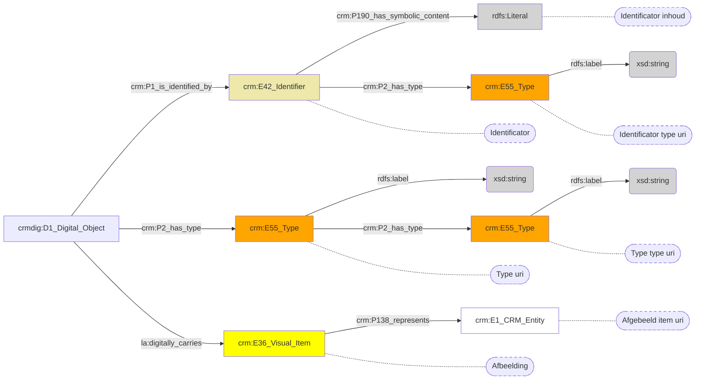

```mermaid
graph LR
ad7f9832-04fa-11ee-9497-96a6d2455259["crm:E42_Identifier"]-->|"crm:P190_has_symbolic_content"|ad7fb196-04fa-11ee-9497-96a6d2455259(rdfs:Literal)
ad7fa3fe-04fa-11ee-9497-96a6d2455259["crm:E55_Type"]-->|"rdfs:label"|ad7fbd30-04fa-11ee-9497-96a6d2455259(xsd:string)
ad7fb2a4-04fa-11ee-9497-96a6d2455259["crm:E55_Type"]-->|"rdfs:label"|ad7fb074-04fa-11ee-9497-96a6d2455259(xsd:string)
ad7fbb14-04fa-11ee-9497-96a6d2455259["crm:E55_Type"]-->|"rdfs:label"|ad7fbc18-04fa-11ee-9497-96a6d2455259(xsd:string)
ad7f9832-04fa-11ee-9497-96a6d2455259["crm:E42_Identifier"]-->|"crm:P2_has_type"|ad7fb2a4-04fa-11ee-9497-96a6d2455259["crm:E55_Type"]
ad7fa3fe-04fa-11ee-9497-96a6d2455259["crm:E55_Type"]-->|"crm:P2_has_type"|ad7fbb14-04fa-11ee-9497-96a6d2455259["crm:E55_Type"]
ad7fa7aa-04fa-11ee-9497-96a6d2455259["crm:E36_Visual_Item"]-->|"crm:P138_represents"|ad7fb48e-04fa-11ee-9497-96a6d2455259["crm:E1_CRM_Entity"]
ad7fb3a8-04fa-11ee-9497-96a6d2455259["crmdig:D1_Digital_Object"]-->|"crm:P1_is_identified_by"|ad7f9832-04fa-11ee-9497-96a6d2455259["crm:E42_Identifier"]
ad7fb3a8-04fa-11ee-9497-96a6d2455259["crmdig:D1_Digital_Object"]-->|"crm:P2_has_type"|ad7fa3fe-04fa-11ee-9497-96a6d2455259["crm:E55_Type"]
ad7fb3a8-04fa-11ee-9497-96a6d2455259["crmdig:D1_Digital_Object"]-->|"la:digitally_carries"|ad7fa7aa-04fa-11ee-9497-96a6d2455259["crm:E36_Visual_Item"]
style ad7fb196-04fa-11ee-9497-96a6d2455259_s stroke-dasharray: 5
style ad7fb2a4-04fa-11ee-9497-96a6d2455259_s stroke-dasharray: 5
style ad7fbb14-04fa-11ee-9497-96a6d2455259_s stroke-dasharray: 5
style ad7fb48e-04fa-11ee-9497-96a6d2455259_s stroke-dasharray: 5
style ad7f9832-04fa-11ee-9497-96a6d2455259_s stroke-dasharray: 5
style ad7fa3fe-04fa-11ee-9497-96a6d2455259_s stroke-dasharray: 5
style ad7fa7aa-04fa-11ee-9497-96a6d2455259_s stroke-dasharray: 5
ad7fb196-04fa-11ee-9497-96a6d2455259["rdfs:Literal"]-.-ad7fb196-04fa-11ee-9497-96a6d2455259_s(["Identificator inhoud"])
ad7fb2a4-04fa-11ee-9497-96a6d2455259["crm:E55_Type"]-.-ad7fb2a4-04fa-11ee-9497-96a6d2455259_s(["Identificator type uri"])
ad7fbb14-04fa-11ee-9497-96a6d2455259["crm:E55_Type"]-.-ad7fbb14-04fa-11ee-9497-96a6d2455259_s(["Type type uri"])
ad7fb48e-04fa-11ee-9497-96a6d2455259["crm:E1_CRM_Entity"]-.-ad7fb48e-04fa-11ee-9497-96a6d2455259_s(["Afgebeeld item uri"])
ad7f9832-04fa-11ee-9497-96a6d2455259["crm:E42_Identifier"]-.-ad7f9832-04fa-11ee-9497-96a6d2455259_s(["Identificator"])
ad7fa3fe-04fa-11ee-9497-96a6d2455259["crm:E55_Type"]-.-ad7fa3fe-04fa-11ee-9497-96a6d2455259_s(["Type uri"])
ad7fa7aa-04fa-11ee-9497-96a6d2455259["crm:E36_Visual_Item"]-.-ad7fa7aa-04fa-11ee-9497-96a6d2455259_s(["Afbeelding"])
style ad7f9832-04fa-11ee-9497-96a6d2455259 fill:#EEE8AA
style ad7fa3fe-04fa-11ee-9497-96a6d2455259 fill:#ffa500
style ad7fa7aa-04fa-11ee-9497-96a6d2455259 fill:#ffff00
style ad7fb074-04fa-11ee-9497-96a6d2455259 fill:#D3D3D3
style ad7fb196-04fa-11ee-9497-96a6d2455259 fill:#D3D3D3
style ad7fb2a4-04fa-11ee-9497-96a6d2455259 fill:#ffa500
style ad7fb48e-04fa-11ee-9497-96a6d2455259 fill:#ffffff
style ad7fbb14-04fa-11ee-9497-96a6d2455259 fill:#ffa500
style ad7fbc18-04fa-11ee-9497-96a6d2455259 fill:#D3D3D3
style ad7fbd30-04fa-11ee-9497-96a6d2455259 fill:#D3D3D3
```
