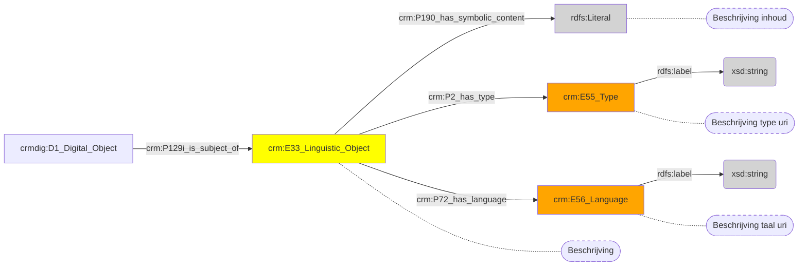

```mermaid
graph LR
ad7fa020-04fa-11ee-9497-96a6d2455259["crm:E33_Linguistic_Object"]-->|"crm:P190_has_symbolic_content"|ad7fb5ba-04fa-11ee-9497-96a6d2455259(rdfs:Literal)
ad7fb7ea-04fa-11ee-9497-96a6d2455259["crm:E55_Type"]-->|"rdfs:label"|ad7fb6d2-04fa-11ee-9497-96a6d2455259(xsd:string)
ad7fb9fc-04fa-11ee-9497-96a6d2455259["crm:E56_Language"]-->|"rdfs:label"|ad7fb8ee-04fa-11ee-9497-96a6d2455259(xsd:string)
ad7fa020-04fa-11ee-9497-96a6d2455259["crm:E33_Linguistic_Object"]-->|"crm:P2_has_type"|ad7fb7ea-04fa-11ee-9497-96a6d2455259["crm:E55_Type"]
ad7fa020-04fa-11ee-9497-96a6d2455259["crm:E33_Linguistic_Object"]-->|"crm:P72_has_language"|ad7fb9fc-04fa-11ee-9497-96a6d2455259["crm:E56_Language"]
ad7fb3a8-04fa-11ee-9497-96a6d2455259["crmdig:D1_Digital_Object"]-->|"crm:P129i_is_subject_of"|ad7fa020-04fa-11ee-9497-96a6d2455259["crm:E33_Linguistic_Object"]
style ad7fb5ba-04fa-11ee-9497-96a6d2455259_s stroke-dasharray: 5
style ad7fb7ea-04fa-11ee-9497-96a6d2455259_s stroke-dasharray: 5
style ad7fb9fc-04fa-11ee-9497-96a6d2455259_s stroke-dasharray: 5
style ad7fa020-04fa-11ee-9497-96a6d2455259_s stroke-dasharray: 5
ad7fb5ba-04fa-11ee-9497-96a6d2455259["rdfs:Literal"]-.-ad7fb5ba-04fa-11ee-9497-96a6d2455259_s(["Beschrijving inhoud"])
ad7fb7ea-04fa-11ee-9497-96a6d2455259["crm:E55_Type"]-.-ad7fb7ea-04fa-11ee-9497-96a6d2455259_s(["Beschrijving type uri"])
ad7fb9fc-04fa-11ee-9497-96a6d2455259["crm:E56_Language"]-.-ad7fb9fc-04fa-11ee-9497-96a6d2455259_s(["Beschrijving taal uri"])
ad7fa020-04fa-11ee-9497-96a6d2455259["crm:E33_Linguistic_Object"]-.-ad7fa020-04fa-11ee-9497-96a6d2455259_s(["Beschrijving"])
style ad7fa020-04fa-11ee-9497-96a6d2455259 fill:#ffff00
style ad7fb5ba-04fa-11ee-9497-96a6d2455259 fill:#D3D3D3
style ad7fb6d2-04fa-11ee-9497-96a6d2455259 fill:#D3D3D3
style ad7fb7ea-04fa-11ee-9497-96a6d2455259 fill:#ffa500
style ad7fb8ee-04fa-11ee-9497-96a6d2455259 fill:#D3D3D3
style ad7fb9fc-04fa-11ee-9497-96a6d2455259 fill:#ffa500
```
