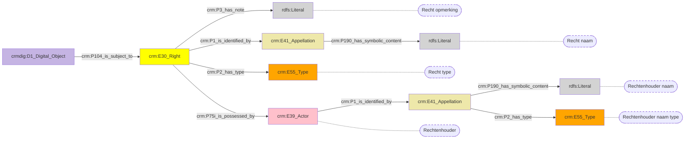

```mermaid
graph LR
style ad7fab56-04fa-11ee-9497-96a6d2455259 fill:#ffff00
style ad7fb3a8-04fa-11ee-9497-96a6d2455259 fill:#C5B4E3
style ad7fbe3e-04fa-11ee-9497-96a6d2455259 fill:#ffa500
style ad7fbf56-04fa-11ee-9497-96a6d2455259 fill:#D3D3D3
style ad7fc17c-04fa-11ee-9497-96a6d2455259 fill:#ffc0cb
style ad7fc398-04fa-11ee-9497-96a6d2455259 fill:#EEE8AA
style ad7fc49c-04fa-11ee-9497-96a6d2455259 fill:#D3D3D3
style ad7fc7b2-04fa-11ee-9497-96a6d2455259 fill:#D3D3D3
style ad7fc8ac-04fa-11ee-9497-96a6d2455259 fill:#EEE8AA
style dd0dfa04-b08b-11ee-a0af-960002548b4f fill:#ffa500
ad7fab56-04fa-11ee-9497-96a6d2455259["crm:E30_Right"]-->|"crm:P3_has_note"|ad7fc7b2-04fa-11ee-9497-96a6d2455259(rdfs:Literal)
ad7fc398-04fa-11ee-9497-96a6d2455259["crm:E41_Appellation"]-->|"crm:P190_has_symbolic_content"|ad7fc49c-04fa-11ee-9497-96a6d2455259(rdfs:Literal)
ad7fc8ac-04fa-11ee-9497-96a6d2455259["crm:E41_Appellation"]-->|"crm:P190_has_symbolic_content"|ad7fbf56-04fa-11ee-9497-96a6d2455259(rdfs:Literal)
style dd0dfa04-b08b-11ee-a0af-960002548b4f_s stroke-dasharray: 5
style ad7fc7b2-04fa-11ee-9497-96a6d2455259_s stroke-dasharray: 5
style ad7fc17c-04fa-11ee-9497-96a6d2455259_s stroke-dasharray: 5
style ad7fc49c-04fa-11ee-9497-96a6d2455259_s stroke-dasharray: 5
style ad7fbf56-04fa-11ee-9497-96a6d2455259_s stroke-dasharray: 5
style ad7fbe3e-04fa-11ee-9497-96a6d2455259_s stroke-dasharray: 5
ad7fab56-04fa-11ee-9497-96a6d2455259["crm:E30_Right"]-->|"crm:P1_is_identified_by"|ad7fc398-04fa-11ee-9497-96a6d2455259["crm:E41_Appellation"]
ad7fab56-04fa-11ee-9497-96a6d2455259["crm:E30_Right"]-->|"crm:P2_has_type"|dd0dfa04-b08b-11ee-a0af-960002548b4f["crm:E55_Type"]
ad7fab56-04fa-11ee-9497-96a6d2455259["crm:E30_Right"]-->|"crm:P75i_is_possessed_by"|ad7fc17c-04fa-11ee-9497-96a6d2455259["crm:E39_Actor"]
ad7fb3a8-04fa-11ee-9497-96a6d2455259["crmdig:D1_Digital_Object"]-->|"crm:P104_is_subject_to"|ad7fab56-04fa-11ee-9497-96a6d2455259["crm:E30_Right"]
ad7fc17c-04fa-11ee-9497-96a6d2455259["crm:E39_Actor"]-->|"crm:P1_is_identified_by"|ad7fc8ac-04fa-11ee-9497-96a6d2455259["crm:E41_Appellation"]
ad7fc8ac-04fa-11ee-9497-96a6d2455259["crm:E41_Appellation"]-->|"crm:P2_has_type"|ad7fbe3e-04fa-11ee-9497-96a6d2455259["crm:E55_Type"]
dd0dfa04-b08b-11ee-a0af-960002548b4f["crm:E55_Type"]-.-dd0dfa04-b08b-11ee-a0af-960002548b4f_s(["Recht type"])
ad7fc7b2-04fa-11ee-9497-96a6d2455259["rdfs:Literal"]-.-ad7fc7b2-04fa-11ee-9497-96a6d2455259_s(["Recht opmerking"])
ad7fc17c-04fa-11ee-9497-96a6d2455259["crm:E39_Actor"]-.-ad7fc17c-04fa-11ee-9497-96a6d2455259_s(["Rechtenhouder"])
ad7fc49c-04fa-11ee-9497-96a6d2455259["rdfs:Literal"]-.-ad7fc49c-04fa-11ee-9497-96a6d2455259_s(["Recht naam"])
ad7fbf56-04fa-11ee-9497-96a6d2455259["rdfs:Literal"]-.-ad7fbf56-04fa-11ee-9497-96a6d2455259_s(["Rechtenhouder naam"])
ad7fbe3e-04fa-11ee-9497-96a6d2455259["crm:E55_Type"]-.-ad7fbe3e-04fa-11ee-9497-96a6d2455259_s(["Rechtenhouder naam type"])
```
