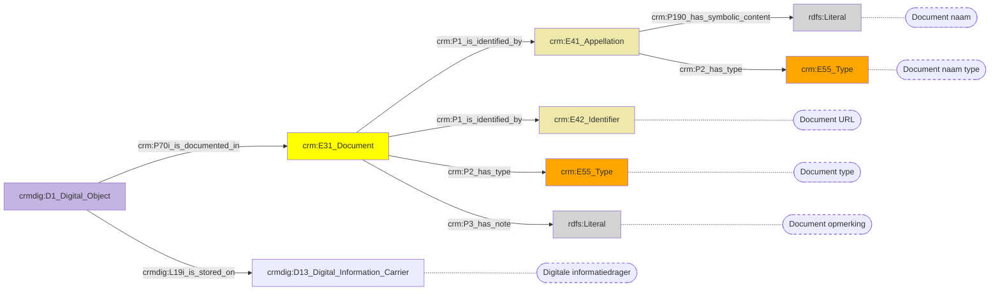

```mermaid
graph LR
style 09a8b8cd-3915-11ef-99eb-960002548b4f fill:#ffa500
style 09a8be6b-3915-11ef-8480-960002548b4f fill:#ffa500
style 09a8c27c-3915-11ef-bcfe-960002548b4f fill:#EEE8AA
style 09a8c64d-3915-11ef-ae4c-960002548b4f fill:#ffff00
style 09a8ca26-3915-11ef-9c46-960002548b4f fill:#D3D3D3
style 09a8ccc6-3915-11ef-8ef3-960002548b4f fill:#D3D3D3
style 09a8cef4-3915-11ef-80d7-960002548b4f fill:#EEE8AA
style ad7fb3a8-04fa-11ee-9497-96a6d2455259 fill:#C5B4E3
09a8c27c-3915-11ef-bcfe-960002548b4f["crm:E41_Appellation"]-->|"crm:P190_has_symbolic_content"|09a8ca26-3915-11ef-9c46-960002548b4f(rdfs:Literal)
09a8c64d-3915-11ef-ae4c-960002548b4f["crm:E31_Document"]-->|"crm:P3_has_note"|09a8ccc6-3915-11ef-8ef3-960002548b4f(rdfs:Literal)
style 09a8ca26-3915-11ef-9c46-960002548b4f_s stroke-dasharray: 5
style 09a8b8cd-3915-11ef-99eb-960002548b4f_s stroke-dasharray: 5
style 09a8cef4-3915-11ef-80d7-960002548b4f_s stroke-dasharray: 5
style 09a8be6b-3915-11ef-8480-960002548b4f_s stroke-dasharray: 5
style 09a8ccc6-3915-11ef-8ef3-960002548b4f_s stroke-dasharray: 5
style 20c867d7-3915-11ef-8cbf-960002548b4f_s stroke-dasharray: 5
09a8c27c-3915-11ef-bcfe-960002548b4f["crm:E41_Appellation"]-->|"crm:P2_has_type"|09a8b8cd-3915-11ef-99eb-960002548b4f["crm:E55_Type"]
09a8c64d-3915-11ef-ae4c-960002548b4f["crm:E31_Document"]-->|"crm:P1_is_identified_by"|09a8c27c-3915-11ef-bcfe-960002548b4f["crm:E41_Appellation"]
09a8c64d-3915-11ef-ae4c-960002548b4f["crm:E31_Document"]-->|"crm:P1_is_identified_by"|09a8cef4-3915-11ef-80d7-960002548b4f["crm:E42_Identifier"]
09a8c64d-3915-11ef-ae4c-960002548b4f["crm:E31_Document"]-->|"crm:P2_has_type"|09a8be6b-3915-11ef-8480-960002548b4f["crm:E55_Type"]
ad7fb3a8-04fa-11ee-9497-96a6d2455259["crmdig:D1_Digital_Object"]-->|"crm:P70i_is_documented_in"|09a8c64d-3915-11ef-ae4c-960002548b4f["crm:E31_Document"]
ad7fb3a8-04fa-11ee-9497-96a6d2455259["crmdig:D1_Digital_Object"]-->|"crmdig:L19i_is_stored_on"|20c867d7-3915-11ef-8cbf-960002548b4f["crmdig:D13_Digital_Information_Carrier"]
09a8ca26-3915-11ef-9c46-960002548b4f["rdfs:Literal"]-.-09a8ca26-3915-11ef-9c46-960002548b4f_s(["Document naam"])
09a8b8cd-3915-11ef-99eb-960002548b4f["crm:E55_Type"]-.-09a8b8cd-3915-11ef-99eb-960002548b4f_s(["Document naam type"])
09a8cef4-3915-11ef-80d7-960002548b4f["crm:E42_Identifier"]-.-09a8cef4-3915-11ef-80d7-960002548b4f_s(["Document URL"])
09a8be6b-3915-11ef-8480-960002548b4f["crm:E55_Type"]-.-09a8be6b-3915-11ef-8480-960002548b4f_s(["Document type"])
09a8ccc6-3915-11ef-8ef3-960002548b4f["rdfs:Literal"]-.-09a8ccc6-3915-11ef-8ef3-960002548b4f_s(["Document opmerking"])
20c867d7-3915-11ef-8cbf-960002548b4f["crmdig:D13_Digital_Information_Carrier"]-.-20c867d7-3915-11ef-8cbf-960002548b4f_s(["Digitale informatiedrager"])
```
