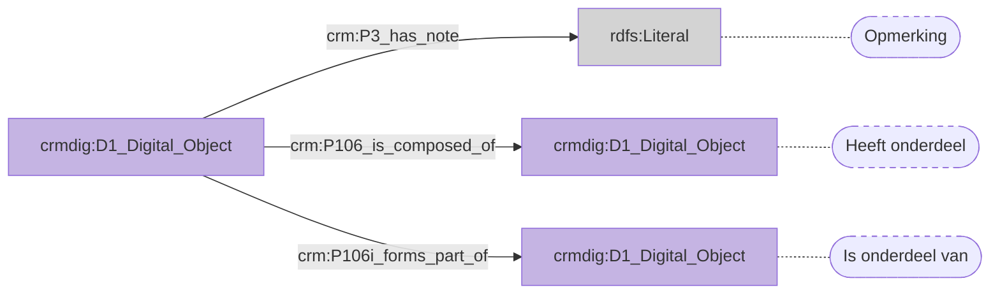

```mermaid
graph LR
style 18458e43-4443-11ef-a2db-960002548b4f fill:#C5B4E3
style 42224a4d-4443-11ef-9b4a-960002548b4f fill:#C5B4E3
style ad7fb3a8-04fa-11ee-9497-96a6d2455259 fill:#C5B4E3
style ba1444e7-44eb-11ef-b56c-960002548b4f fill:#D3D3D3
ad7fb3a8-04fa-11ee-9497-96a6d2455259["crmdig:D1_Digital_Object"]-->|"crm:P3_has_note"|ba1444e7-44eb-11ef-b56c-960002548b4f(rdfs:Literal)
style 18458e43-4443-11ef-a2db-960002548b4f_s stroke-dasharray: 5
style 42224a4d-4443-11ef-9b4a-960002548b4f_s stroke-dasharray: 5
style ba1444e7-44eb-11ef-b56c-960002548b4f_s stroke-dasharray: 5
18458e43-4443-11ef-a2db-960002548b4f["crmdig:D1_Digital_Object"]-.-18458e43-4443-11ef-a2db-960002548b4f_s(["Heeft onderdeel"])
42224a4d-4443-11ef-9b4a-960002548b4f["crmdig:D1_Digital_Object"]-.-42224a4d-4443-11ef-9b4a-960002548b4f_s(["Is onderdeel van"])
ba1444e7-44eb-11ef-b56c-960002548b4f["rdfs:Literal"]-.-ba1444e7-44eb-11ef-b56c-960002548b4f_s(["Opmerking"])
ad7fb3a8-04fa-11ee-9497-96a6d2455259["crmdig:D1_Digital_Object"]-->|"crm:P106_is_composed_of"|18458e43-4443-11ef-a2db-960002548b4f["crmdig:D1_Digital_Object"]
ad7fb3a8-04fa-11ee-9497-96a6d2455259["crmdig:D1_Digital_Object"]-->|"crm:P106i_forms_part_of"|42224a4d-4443-11ef-9b4a-960002548b4f["crmdig:D1_Digital_Object"]
```
