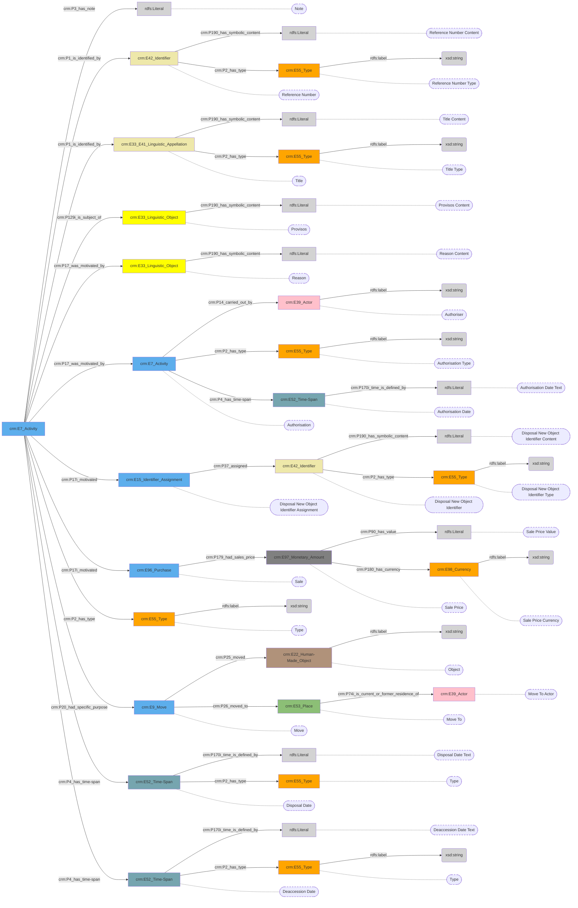

```mermaid
graph LR
227c23dd-eb7f-11ee-b15c-960002548b4f["crm:E33_Linguistic_Object"]-->|"crm:P190_has_symbolic_content"|4087d6cd-eb7f-11ee-a124-960002548b4f(rdfs:Literal)
25e0f1a2-eb7c-11ee-9932-960002548b4f["crm:E55_Type"]-->|"rdfs:label"|3b4632a2-eb7c-11ee-a461-960002548b4f(xsd:string)
2da39faf-f0d6-11ee-8121-960002548b4f["crm:E22_Human-Made_Object"]-->|"rdfs:label"|5c0b6519-f0d6-11ee-b1e0-960002548b4f(xsd:string)
37c9e77d-eb7b-11ee-9bda-960002548b4f["crm:E7_Activity"]-->|"crm:P3_has_note"|9e353957-eb7d-11ee-af45-960002548b4f(rdfs:Literal)
3e7bc1cf-f0d3-11ee-aae0-960002548b4f["crm:E98_Currency"]-->|"rdfs:label"|85f7a160-f0d3-11ee-9a38-960002548b4f(xsd:string)
460edb8e-f0d7-11ee-89ee-960002548b4f["crm:E55_Type"]-->|"rdfs:label"|55571685-f0d7-11ee-a75b-960002548b4f(xsd:string)
592ad868-eb7c-11ee-a949-960002548b4f["crm:E33_Linguistic_Object"]-->|"crm:P190_has_symbolic_content"|791975ea-eb7c-11ee-ba65-960002548b4f(rdfs:Literal)
694ec0a1-f0d7-11ee-bf1e-960002548b4f["crm:E52_Time-Span"]-->|"crm:P170i_time_is_defined_by"|879a1b0e-f0d7-11ee-a235-960002548b4f(rdfs:Literal)
7c393b6a-eb7b-11ee-833b-960002548b4f["crm:E42_Identifier"]-->|"crm:P190_has_symbolic_content"|be12b154-eb7b-11ee-a7bd-960002548b4f(rdfs:Literal)
8bad65ad-f0d0-11ee-bd15-960002548b4f["crm:E55_Type"]-->|"rdfs:label"|9bcda25c-f0d0-11ee-b396-960002548b4f(xsd:string)
a69e3805-f0d0-11ee-a031-960002548b4f["crm:E52_Time-Span"]-->|"crm:P170i_time_is_defined_by"|b523bf02-f0d0-11ee-b16b-960002548b4f(rdfs:Literal)
aab97b9a-eb7b-11ee-85ec-960002548b4f["crm:E55_Type"]-->|"rdfs:label"|aab98349-eb7b-11ee-9df5-960002548b4f(xsd:string)
b19ad6fe-f0cf-11ee-8d89-960002548b4f["crm:E42_Identifier"]-->|"crm:P190_has_symbolic_content"|d170b363-f0cf-11ee-ae1a-960002548b4f(rdfs:Literal)
c2af5d46-eb7c-11ee-bcf0-960002548b4f["crm:E55_Type"]-->|"rdfs:label"|df40f259-eb7c-11ee-a14f-960002548b4f(xsd:string)
cd464b8f-f0d0-11ee-94e9-960002548b4f["crm:E39_Actor"]-->|"rdfs:label"|843031ec-f1b9-11ee-b0aa-960002548b4f(xsd:string)
cd8aacdc-f0d2-11ee-89df-960002548b4f["crm:E97_Monetary_Amount"]-->|"crm:P90_has_value"|612b8bb2-f0d3-11ee-b034-960002548b4f(rdfs:Literal)
e5ac573a-f0cf-11ee-9fff-960002548b4f["crm:E55_Type"]-->|"rdfs:label"|14ab6db8-f0d0-11ee-80ba-960002548b4f(xsd:string)
ecb70c7f-eb7b-11ee-afa8-960002548b4f["crm:E33_E41_Linguistic_Appellation"]-->|"crm:P190_has_symbolic_content"|153cd9c6-eb7c-11ee-9e5c-960002548b4f(rdfs:Literal)
f72e4f14-f0ce-11ee-b6b8-960002548b4f["crm:E52_Time-Span"]-->|"crm:P170i_time_is_defined_by"|0e7a37be-f0cf-11ee-b726-960002548b4f(rdfs:Literal)
37c9e77d-eb7b-11ee-9bda-960002548b4f["crm:E7_Activity"]-->|"crm:P1_is_identified_by"|7c393b6a-eb7b-11ee-833b-960002548b4f["crm:E42_Identifier"]
37c9e77d-eb7b-11ee-9bda-960002548b4f["crm:E7_Activity"]-->|"crm:P1_is_identified_by"|ecb70c7f-eb7b-11ee-afa8-960002548b4f["crm:E33_E41_Linguistic_Appellation"]
37c9e77d-eb7b-11ee-9bda-960002548b4f["crm:E7_Activity"]-->|"crm:P129i_is_subject_of"|227c23dd-eb7f-11ee-b15c-960002548b4f["crm:E33_Linguistic_Object"]
37c9e77d-eb7b-11ee-9bda-960002548b4f["crm:E7_Activity"]-->|"crm:P17_was_motivated_by"|592ad868-eb7c-11ee-a949-960002548b4f["crm:E33_Linguistic_Object"]
37c9e77d-eb7b-11ee-9bda-960002548b4f["crm:E7_Activity"]-->|"crm:P17_was_motivated_by"|6e067e3a-f0d0-11ee-ba2a-960002548b4f["crm:E7_Activity"]
37c9e77d-eb7b-11ee-9bda-960002548b4f["crm:E7_Activity"]-->|"crm:P17i_motivated"|8cd0ce58-f0cf-11ee-8c2c-960002548b4f["crm:E15_Identifier_Assignment"]
37c9e77d-eb7b-11ee-9bda-960002548b4f["crm:E7_Activity"]-->|"crm:P17i_motivated"|9180d193-f0d1-11ee-b313-960002548b4f["crm:E96_Purchase"]
37c9e77d-eb7b-11ee-9bda-960002548b4f["crm:E7_Activity"]-->|"crm:P2_has_type"|c2af5d46-eb7c-11ee-bcf0-960002548b4f["crm:E55_Type"]
37c9e77d-eb7b-11ee-9bda-960002548b4f["crm:E7_Activity"]-->|"crm:P20_had_specific_purpose"|450e05d6-f0d5-11ee-a174-960002548b4f["crm:E9_Move"]
37c9e77d-eb7b-11ee-9bda-960002548b4f["crm:E7_Activity"]-->|"crm:P4_has_time-span"|694ec0a1-f0d7-11ee-bf1e-960002548b4f["crm:E52_Time-Span"]
37c9e77d-eb7b-11ee-9bda-960002548b4f["crm:E7_Activity"]-->|"crm:P4_has_time-span"|f72e4f14-f0ce-11ee-b6b8-960002548b4f["crm:E52_Time-Span"]
450e05d6-f0d5-11ee-a174-960002548b4f["crm:E9_Move"]-->|"crm:P25_moved"|2da39faf-f0d6-11ee-8121-960002548b4f["crm:E22_Human-Made_Object"]
450e05d6-f0d5-11ee-a174-960002548b4f["crm:E9_Move"]-->|"crm:P26_moved_to"|afe82460-f0d5-11ee-b83d-960002548b4f["crm:E53_Place"]
694ec0a1-f0d7-11ee-bf1e-960002548b4f["crm:E52_Time-Span"]-->|"crm:P2_has_type"|7b63c770-f0d7-11ee-80f3-960002548b4f["crm:E55_Type"]
6e067e3a-f0d0-11ee-ba2a-960002548b4f["crm:E7_Activity"]-->|"crm:P14_carried_out_by"|cd464b8f-f0d0-11ee-94e9-960002548b4f["crm:E39_Actor"]
6e067e3a-f0d0-11ee-ba2a-960002548b4f["crm:E7_Activity"]-->|"crm:P2_has_type"|8bad65ad-f0d0-11ee-bd15-960002548b4f["crm:E55_Type"]
6e067e3a-f0d0-11ee-ba2a-960002548b4f["crm:E7_Activity"]-->|"crm:P4_has_time-span"|a69e3805-f0d0-11ee-a031-960002548b4f["crm:E52_Time-Span"]
7c393b6a-eb7b-11ee-833b-960002548b4f["crm:E42_Identifier"]-->|"crm:P2_has_type"|aab97b9a-eb7b-11ee-85ec-960002548b4f["crm:E55_Type"]
8cd0ce58-f0cf-11ee-8c2c-960002548b4f["crm:E15_Identifier_Assignment"]-->|"crm:P37_assigned"|b19ad6fe-f0cf-11ee-8d89-960002548b4f["crm:E42_Identifier"]
9180d193-f0d1-11ee-b313-960002548b4f["crm:E96_Purchase"]-->|"crm:P179_had_sales_price"|cd8aacdc-f0d2-11ee-89df-960002548b4f["crm:E97_Monetary_Amount"]
afe82460-f0d5-11ee-b83d-960002548b4f["crm:E53_Place"]-->|"crm:P74i_is_current_or_former_residence_of"|ff3663e7-f0d5-11ee-858b-960002548b4f["crm:E39_Actor"]
b19ad6fe-f0cf-11ee-8d89-960002548b4f["crm:E42_Identifier"]-->|"crm:P2_has_type"|e5ac573a-f0cf-11ee-9fff-960002548b4f["crm:E55_Type"]
cd8aacdc-f0d2-11ee-89df-960002548b4f["crm:E97_Monetary_Amount"]-->|"crm:P180_has_currency"|3e7bc1cf-f0d3-11ee-aae0-960002548b4f["crm:E98_Currency"]
ecb70c7f-eb7b-11ee-afa8-960002548b4f["crm:E33_E41_Linguistic_Appellation"]-->|"crm:P2_has_type"|25e0f1a2-eb7c-11ee-9932-960002548b4f["crm:E55_Type"]
f72e4f14-f0ce-11ee-b6b8-960002548b4f["crm:E52_Time-Span"]-->|"crm:P2_has_type"|460edb8e-f0d7-11ee-89ee-960002548b4f["crm:E55_Type"]
4087d6cd-eb7f-11ee-a124-960002548b4f["rdfs:Literal"]-.-4087d6cd-eb7f-11ee-a124-960002548b4f_s(["Provisos Content"])
7c393b6a-eb7b-11ee-833b-960002548b4f["crm:E42_Identifier"]-.-7c393b6a-eb7b-11ee-833b-960002548b4f_s(["Reference Number"])
ecb70c7f-eb7b-11ee-afa8-960002548b4f["crm:E33_E41_Linguistic_Appellation"]-.-ecb70c7f-eb7b-11ee-afa8-960002548b4f_s(["Title"])
227c23dd-eb7f-11ee-b15c-960002548b4f["crm:E33_Linguistic_Object"]-.-227c23dd-eb7f-11ee-b15c-960002548b4f_s(["Provisos"])
592ad868-eb7c-11ee-a949-960002548b4f["crm:E33_Linguistic_Object"]-.-592ad868-eb7c-11ee-a949-960002548b4f_s(["Reason"])
6e067e3a-f0d0-11ee-ba2a-960002548b4f["crm:E7_Activity"]-.-6e067e3a-f0d0-11ee-ba2a-960002548b4f_s(["Authorisation"])
8cd0ce58-f0cf-11ee-8c2c-960002548b4f["crm:E15_Identifier_Assignment"]-.-8cd0ce58-f0cf-11ee-8c2c-960002548b4f_s(["Disposal New Object Identifier Assignment"])
9180d193-f0d1-11ee-b313-960002548b4f["crm:E96_Purchase"]-.-9180d193-f0d1-11ee-b313-960002548b4f_s(["Sale"])
c2af5d46-eb7c-11ee-bcf0-960002548b4f["crm:E55_Type"]-.-c2af5d46-eb7c-11ee-bcf0-960002548b4f_s(["Type"])
450e05d6-f0d5-11ee-a174-960002548b4f["crm:E9_Move"]-.-450e05d6-f0d5-11ee-a174-960002548b4f_s(["Move"])
9e353957-eb7d-11ee-af45-960002548b4f["rdfs:Literal"]-.-9e353957-eb7d-11ee-af45-960002548b4f_s(["Note"])
694ec0a1-f0d7-11ee-bf1e-960002548b4f["crm:E52_Time-Span"]-.-694ec0a1-f0d7-11ee-bf1e-960002548b4f_s(["Disposal Date"])
f72e4f14-f0ce-11ee-b6b8-960002548b4f["crm:E52_Time-Span"]-.-f72e4f14-f0ce-11ee-b6b8-960002548b4f_s(["Deaccession Date"])
2da39faf-f0d6-11ee-8121-960002548b4f["crm:E22_Human-Made_Object"]-.-2da39faf-f0d6-11ee-8121-960002548b4f_s(["Object"])
afe82460-f0d5-11ee-b83d-960002548b4f["crm:E53_Place"]-.-afe82460-f0d5-11ee-b83d-960002548b4f_s(["Move To"])
791975ea-eb7c-11ee-ba65-960002548b4f["rdfs:Literal"]-.-791975ea-eb7c-11ee-ba65-960002548b4f_s(["Reason Content"])
879a1b0e-f0d7-11ee-a235-960002548b4f["rdfs:Literal"]-.-879a1b0e-f0d7-11ee-a235-960002548b4f_s(["Disposal Date Text"])
7b63c770-f0d7-11ee-80f3-960002548b4f["crm:E55_Type"]-.-7b63c770-f0d7-11ee-80f3-960002548b4f_s(["Type"])
cd464b8f-f0d0-11ee-94e9-960002548b4f["crm:E39_Actor"]-.-cd464b8f-f0d0-11ee-94e9-960002548b4f_s(["Authoriser"])
8bad65ad-f0d0-11ee-bd15-960002548b4f["crm:E55_Type"]-.-8bad65ad-f0d0-11ee-bd15-960002548b4f_s(["Authorisation Type"])
a69e3805-f0d0-11ee-a031-960002548b4f["crm:E52_Time-Span"]-.-a69e3805-f0d0-11ee-a031-960002548b4f_s(["Authorisation Date"])
be12b154-eb7b-11ee-a7bd-960002548b4f["rdfs:Literal"]-.-be12b154-eb7b-11ee-a7bd-960002548b4f_s(["Reference Number Content"])
aab97b9a-eb7b-11ee-85ec-960002548b4f["crm:E55_Type"]-.-aab97b9a-eb7b-11ee-85ec-960002548b4f_s(["Reference Number Type"])
b19ad6fe-f0cf-11ee-8d89-960002548b4f["crm:E42_Identifier"]-.-b19ad6fe-f0cf-11ee-8d89-960002548b4f_s(["Disposal New Object Identifier"])
cd8aacdc-f0d2-11ee-89df-960002548b4f["crm:E97_Monetary_Amount"]-.-cd8aacdc-f0d2-11ee-89df-960002548b4f_s(["Sale Price"])
b523bf02-f0d0-11ee-b16b-960002548b4f["rdfs:Literal"]-.-b523bf02-f0d0-11ee-b16b-960002548b4f_s(["Authorisation Date Text"])
ff3663e7-f0d5-11ee-858b-960002548b4f["crm:E39_Actor"]-.-ff3663e7-f0d5-11ee-858b-960002548b4f_s(["Move To Actor"])
d170b363-f0cf-11ee-ae1a-960002548b4f["rdfs:Literal"]-.-d170b363-f0cf-11ee-ae1a-960002548b4f_s(["Disposal New Object Identifier Content"])
e5ac573a-f0cf-11ee-9fff-960002548b4f["crm:E55_Type"]-.-e5ac573a-f0cf-11ee-9fff-960002548b4f_s(["Disposal New Object Identifier Type"])
3e7bc1cf-f0d3-11ee-aae0-960002548b4f["crm:E98_Currency"]-.-3e7bc1cf-f0d3-11ee-aae0-960002548b4f_s(["Sale Price Currency"])
612b8bb2-f0d3-11ee-b034-960002548b4f["rdfs:Literal"]-.-612b8bb2-f0d3-11ee-b034-960002548b4f_s(["Sale Price Value"])
153cd9c6-eb7c-11ee-9e5c-960002548b4f["rdfs:Literal"]-.-153cd9c6-eb7c-11ee-9e5c-960002548b4f_s(["Title Content"])
25e0f1a2-eb7c-11ee-9932-960002548b4f["crm:E55_Type"]-.-25e0f1a2-eb7c-11ee-9932-960002548b4f_s(["Title Type"])
0e7a37be-f0cf-11ee-b726-960002548b4f["rdfs:Literal"]-.-0e7a37be-f0cf-11ee-b726-960002548b4f_s(["Deaccession Date Text"])
460edb8e-f0d7-11ee-89ee-960002548b4f["crm:E55_Type"]-.-460edb8e-f0d7-11ee-89ee-960002548b4f_s(["Type"])
style 4087d6cd-eb7f-11ee-a124-960002548b4f_s stroke-dasharray: 5
style 7c393b6a-eb7b-11ee-833b-960002548b4f_s stroke-dasharray: 5
style ecb70c7f-eb7b-11ee-afa8-960002548b4f_s stroke-dasharray: 5
style 227c23dd-eb7f-11ee-b15c-960002548b4f_s stroke-dasharray: 5
style 592ad868-eb7c-11ee-a949-960002548b4f_s stroke-dasharray: 5
style 6e067e3a-f0d0-11ee-ba2a-960002548b4f_s stroke-dasharray: 5
style 8cd0ce58-f0cf-11ee-8c2c-960002548b4f_s stroke-dasharray: 5
style 9180d193-f0d1-11ee-b313-960002548b4f_s stroke-dasharray: 5
style c2af5d46-eb7c-11ee-bcf0-960002548b4f_s stroke-dasharray: 5
style 450e05d6-f0d5-11ee-a174-960002548b4f_s stroke-dasharray: 5
style 9e353957-eb7d-11ee-af45-960002548b4f_s stroke-dasharray: 5
style 694ec0a1-f0d7-11ee-bf1e-960002548b4f_s stroke-dasharray: 5
style f72e4f14-f0ce-11ee-b6b8-960002548b4f_s stroke-dasharray: 5
style 2da39faf-f0d6-11ee-8121-960002548b4f_s stroke-dasharray: 5
style afe82460-f0d5-11ee-b83d-960002548b4f_s stroke-dasharray: 5
style 791975ea-eb7c-11ee-ba65-960002548b4f_s stroke-dasharray: 5
style 879a1b0e-f0d7-11ee-a235-960002548b4f_s stroke-dasharray: 5
style 7b63c770-f0d7-11ee-80f3-960002548b4f_s stroke-dasharray: 5
style cd464b8f-f0d0-11ee-94e9-960002548b4f_s stroke-dasharray: 5
style 8bad65ad-f0d0-11ee-bd15-960002548b4f_s stroke-dasharray: 5
style a69e3805-f0d0-11ee-a031-960002548b4f_s stroke-dasharray: 5
style be12b154-eb7b-11ee-a7bd-960002548b4f_s stroke-dasharray: 5
style aab97b9a-eb7b-11ee-85ec-960002548b4f_s stroke-dasharray: 5
style b19ad6fe-f0cf-11ee-8d89-960002548b4f_s stroke-dasharray: 5
style cd8aacdc-f0d2-11ee-89df-960002548b4f_s stroke-dasharray: 5
style b523bf02-f0d0-11ee-b16b-960002548b4f_s stroke-dasharray: 5
style ff3663e7-f0d5-11ee-858b-960002548b4f_s stroke-dasharray: 5
style d170b363-f0cf-11ee-ae1a-960002548b4f_s stroke-dasharray: 5
style e5ac573a-f0cf-11ee-9fff-960002548b4f_s stroke-dasharray: 5
style 3e7bc1cf-f0d3-11ee-aae0-960002548b4f_s stroke-dasharray: 5
style 612b8bb2-f0d3-11ee-b034-960002548b4f_s stroke-dasharray: 5
style 153cd9c6-eb7c-11ee-9e5c-960002548b4f_s stroke-dasharray: 5
style 25e0f1a2-eb7c-11ee-9932-960002548b4f_s stroke-dasharray: 5
style 0e7a37be-f0cf-11ee-b726-960002548b4f_s stroke-dasharray: 5
style 460edb8e-f0d7-11ee-89ee-960002548b4f_s stroke-dasharray: 5
style 0e7a37be-f0cf-11ee-b726-960002548b4f fill:#D3D3D3
style 14ab6db8-f0d0-11ee-80ba-960002548b4f fill:#D3D3D3
style 153cd9c6-eb7c-11ee-9e5c-960002548b4f fill:#D3D3D3
style 227c23dd-eb7f-11ee-b15c-960002548b4f fill:#ffff00
style 25e0f1a2-eb7c-11ee-9932-960002548b4f fill:#ffa500
style 2da39faf-f0d6-11ee-8121-960002548b4f fill:#B0927A
style 37c9e77d-eb7b-11ee-9bda-960002548b4f fill:#5DAEEC
style 3b4632a2-eb7c-11ee-a461-960002548b4f fill:#D3D3D3
style 3e7bc1cf-f0d3-11ee-aae0-960002548b4f fill:#ffa500
style 4087d6cd-eb7f-11ee-a124-960002548b4f fill:#D3D3D3
style 450e05d6-f0d5-11ee-a174-960002548b4f fill:#5DAEEC
style 460edb8e-f0d7-11ee-89ee-960002548b4f fill:#ffa500
style 55571685-f0d7-11ee-a75b-960002548b4f fill:#D3D3D3
style 592ad868-eb7c-11ee-a949-960002548b4f fill:#ffff00
style 5c0b6519-f0d6-11ee-b1e0-960002548b4f fill:#D3D3D3
style 612b8bb2-f0d3-11ee-b034-960002548b4f fill:#D3D3D3
style 694ec0a1-f0d7-11ee-bf1e-960002548b4f fill:#76A5AF
style 6e067e3a-f0d0-11ee-ba2a-960002548b4f fill:#5DAEEC
style 791975ea-eb7c-11ee-ba65-960002548b4f fill:#D3D3D3
style 7b63c770-f0d7-11ee-80f3-960002548b4f fill:#ffa500
style 7c393b6a-eb7b-11ee-833b-960002548b4f fill:#EEE8AA
style 843031ec-f1b9-11ee-b0aa-960002548b4f fill:#D3D3D3
style 85f7a160-f0d3-11ee-9a38-960002548b4f fill:#D3D3D3
style 879a1b0e-f0d7-11ee-a235-960002548b4f fill:#D3D3D3
style 8bad65ad-f0d0-11ee-bd15-960002548b4f fill:#ffa500
style 8cd0ce58-f0cf-11ee-8c2c-960002548b4f fill:#5DAEEC
style 9180d193-f0d1-11ee-b313-960002548b4f fill:#5DAEEC
style 9bcda25c-f0d0-11ee-b396-960002548b4f fill:#D3D3D3
style 9e353957-eb7d-11ee-af45-960002548b4f fill:#D3D3D3
style a69e3805-f0d0-11ee-a031-960002548b4f fill:#76A5AF
style aab97b9a-eb7b-11ee-85ec-960002548b4f fill:#ffa500
style aab98349-eb7b-11ee-9df5-960002548b4f fill:#D3D3D3
style afe82460-f0d5-11ee-b83d-960002548b4f fill:#8CBF76
style b19ad6fe-f0cf-11ee-8d89-960002548b4f fill:#EEE8AA
style b523bf02-f0d0-11ee-b16b-960002548b4f fill:#D3D3D3
style be12b154-eb7b-11ee-a7bd-960002548b4f fill:#D3D3D3
style c2af5d46-eb7c-11ee-bcf0-960002548b4f fill:#ffa500
style cd464b8f-f0d0-11ee-94e9-960002548b4f fill:#ffc0cb
style cd8aacdc-f0d2-11ee-89df-960002548b4f fill:#808080
style d170b363-f0cf-11ee-ae1a-960002548b4f fill:#D3D3D3
style df40f259-eb7c-11ee-a14f-960002548b4f fill:#D3D3D3
style e5ac573a-f0cf-11ee-9fff-960002548b4f fill:#ffa500
style ecb70c7f-eb7b-11ee-afa8-960002548b4f fill:#EEE8AA
style f72e4f14-f0ce-11ee-b6b8-960002548b4f fill:#76A5AF
style ff3663e7-f0d5-11ee-858b-960002548b4f fill:#ffc0cb
```
