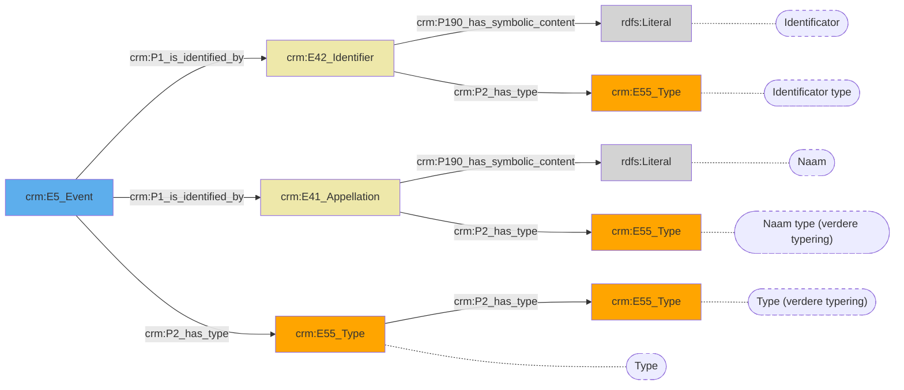

```mermaid
graph LR
style 7f1b4f56-18f1-11ef-a93b-960002548b4f fill:#5DAEEC
style cece316b-18f1-11ef-b3cd-960002548b4f fill:#EEE8AA
style cece3863-18f1-11ef-982b-960002548b4f fill:#D3D3D3
style cece39c2-18f1-11ef-a3b5-960002548b4f fill:#ffa500
style db07e3fb-18f1-11ef-acc8-960002548b4f fill:#EEE8AA
style db07e8f2-18f1-11ef-8b23-960002548b4f fill:#ffa500
style db07ebac-18f1-11ef-a8e0-960002548b4f fill:#D3D3D3
style f9a2bb79-18f1-11ef-a600-960002548b4f fill:#ffa500
style f9a2c0a9-18f1-11ef-bc17-960002548b4f fill:#ffa500
cece316b-18f1-11ef-b3cd-960002548b4f["crm:E42_Identifier"]-->|"crm:P190_has_symbolic_content"|cece3863-18f1-11ef-982b-960002548b4f(rdfs:Literal)
db07e3fb-18f1-11ef-acc8-960002548b4f["crm:E41_Appellation"]-->|"crm:P190_has_symbolic_content"|db07ebac-18f1-11ef-a8e0-960002548b4f(rdfs:Literal)
style f9a2bb79-18f1-11ef-a600-960002548b4f_s stroke-dasharray: 5
style cece3863-18f1-11ef-982b-960002548b4f_s stroke-dasharray: 5
style cece39c2-18f1-11ef-a3b5-960002548b4f_s stroke-dasharray: 5
style db07ebac-18f1-11ef-a8e0-960002548b4f_s stroke-dasharray: 5
style db07e8f2-18f1-11ef-8b23-960002548b4f_s stroke-dasharray: 5
style f9a2c0a9-18f1-11ef-bc17-960002548b4f_s stroke-dasharray: 5
f9a2bb79-18f1-11ef-a600-960002548b4f["crm:E55_Type"]-.-f9a2bb79-18f1-11ef-a600-960002548b4f_s(["Type"])
cece3863-18f1-11ef-982b-960002548b4f["rdfs:Literal"]-.-cece3863-18f1-11ef-982b-960002548b4f_s(["Identificator"])
cece39c2-18f1-11ef-a3b5-960002548b4f["crm:E55_Type"]-.-cece39c2-18f1-11ef-a3b5-960002548b4f_s(["Identificator type"])
db07ebac-18f1-11ef-a8e0-960002548b4f["rdfs:Literal"]-.-db07ebac-18f1-11ef-a8e0-960002548b4f_s(["Naam"])
db07e8f2-18f1-11ef-8b23-960002548b4f["crm:E55_Type"]-.-db07e8f2-18f1-11ef-8b23-960002548b4f_s(["Naam type (verdere typering)"])
f9a2c0a9-18f1-11ef-bc17-960002548b4f["crm:E55_Type"]-.-f9a2c0a9-18f1-11ef-bc17-960002548b4f_s(["Type (verdere typering)"])
7f1b4f56-18f1-11ef-a93b-960002548b4f["crm:E5_Event"]-->|"crm:P1_is_identified_by"|cece316b-18f1-11ef-b3cd-960002548b4f["crm:E42_Identifier"]
7f1b4f56-18f1-11ef-a93b-960002548b4f["crm:E5_Event"]-->|"crm:P1_is_identified_by"|db07e3fb-18f1-11ef-acc8-960002548b4f["crm:E41_Appellation"]
7f1b4f56-18f1-11ef-a93b-960002548b4f["crm:E5_Event"]-->|"crm:P2_has_type"|f9a2bb79-18f1-11ef-a600-960002548b4f["crm:E55_Type"]
cece316b-18f1-11ef-b3cd-960002548b4f["crm:E42_Identifier"]-->|"crm:P2_has_type"|cece39c2-18f1-11ef-a3b5-960002548b4f["crm:E55_Type"]
db07e3fb-18f1-11ef-acc8-960002548b4f["crm:E41_Appellation"]-->|"crm:P2_has_type"|db07e8f2-18f1-11ef-8b23-960002548b4f["crm:E55_Type"]
f9a2bb79-18f1-11ef-a600-960002548b4f["crm:E55_Type"]-->|"crm:P2_has_type"|f9a2c0a9-18f1-11ef-bc17-960002548b4f["crm:E55_Type"]
```
