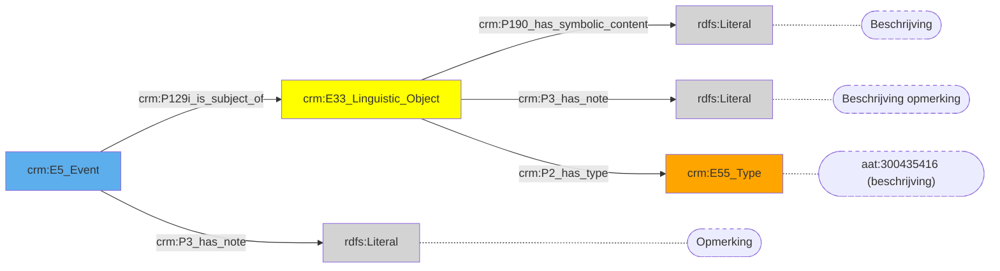

```mermaid
graph LR
style 7f1b4f56-18f1-11ef-a93b-960002548b4f fill:#5DAEEC
style a8a9791f-18f1-11ef-8dab-960002548b4f fill:#ffff00
style a8a97e50-18f1-11ef-95d0-960002548b4f fill:#D3D3D3
style a8a98224-18f1-11ef-895a-960002548b4f fill:#D3D3D3
style a8a9851f-18f1-11ef-8acc-960002548b4f fill:#ffa500
style e9a42cc7-18f1-11ef-b315-960002548b4f fill:#D3D3D3
7f1b4f56-18f1-11ef-a93b-960002548b4f["crm:E5_Event"]-->|"crm:P3_has_note"|e9a42cc7-18f1-11ef-b315-960002548b4f(rdfs:Literal)
a8a9791f-18f1-11ef-8dab-960002548b4f["crm:E33_Linguistic_Object"]-->|"crm:P190_has_symbolic_content"|a8a98224-18f1-11ef-895a-960002548b4f(rdfs:Literal)
a8a9791f-18f1-11ef-8dab-960002548b4f["crm:E33_Linguistic_Object"]-->|"crm:P3_has_note"|a8a97e50-18f1-11ef-95d0-960002548b4f(rdfs:Literal)
style e9a42cc7-18f1-11ef-b315-960002548b4f_s stroke-dasharray: 5
style a8a98224-18f1-11ef-895a-960002548b4f_s stroke-dasharray: 5
style a8a9851f-18f1-11ef-8acc-960002548b4f_s stroke-dasharray: 5
style a8a97e50-18f1-11ef-95d0-960002548b4f_s stroke-dasharray: 5
e9a42cc7-18f1-11ef-b315-960002548b4f["rdfs:Literal"]-.-e9a42cc7-18f1-11ef-b315-960002548b4f_s(["Opmerking"])
a8a98224-18f1-11ef-895a-960002548b4f["rdfs:Literal"]-.-a8a98224-18f1-11ef-895a-960002548b4f_s(["Beschrijving"])
a8a9851f-18f1-11ef-8acc-960002548b4f["crm:E55_Type"]-.-a8a9851f-18f1-11ef-8acc-960002548b4f_s(["aat:300435416 (beschrijving)"])
a8a97e50-18f1-11ef-95d0-960002548b4f["rdfs:Literal"]-.-a8a97e50-18f1-11ef-95d0-960002548b4f_s(["Beschrijving opmerking"])
7f1b4f56-18f1-11ef-a93b-960002548b4f["crm:E5_Event"]-->|"crm:P129i_is_subject_of"|a8a9791f-18f1-11ef-8dab-960002548b4f["crm:E33_Linguistic_Object"]
a8a9791f-18f1-11ef-8dab-960002548b4f["crm:E33_Linguistic_Object"]-->|"crm:P2_has_type"|a8a9851f-18f1-11ef-8acc-960002548b4f["crm:E55_Type"]
```
