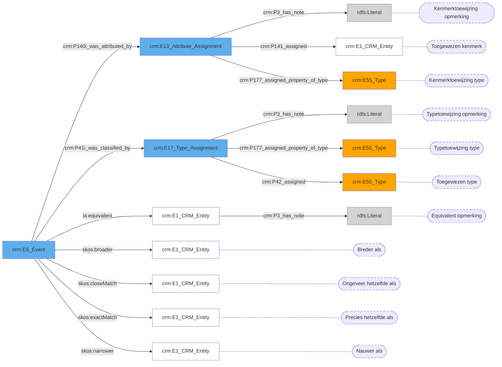

```mermaid
graph LR
style 0462902c-1dad-11ef-8013-960002548b4f fill:#ffffff
style 0a154223-18f2-11ef-abcc-960002548b4f fill:#5DAEEC
style 0a15472e-18f2-11ef-96b8-960002548b4f fill:#ffa500
style 0a1548b7-18f2-11ef-8f90-960002548b4f fill:#ffa500
style 0a154c2b-18f2-11ef-b8a6-960002548b4f fill:#D3D3D3
style 7f1b4f56-18f1-11ef-a93b-960002548b4f fill:#5DAEEC
style 9a61a738-18f1-11ef-8656-960002548b4f fill:#5DAEEC
style 9a61ac51-18f1-11ef-8a72-960002548b4f fill:#ffa500
style 9a61ae00-18f1-11ef-ad02-960002548b4f fill:#ffffff
style 9a61af40-18f1-11ef-83b6-960002548b4f fill:#D3D3D3
style bea5f4eb-18f1-11ef-9f1c-960002548b4f fill:#ffffff
style bea5fa09-18f1-11ef-82a7-960002548b4f fill:#D3D3D3
style ec25be52-1dac-11ef-8987-960002548b4f fill:#ffffff
style f9a2199b-1dac-11ef-bd4c-960002548b4f fill:#ffffff
style fed0af6d-1dac-11ef-83ce-960002548b4f fill:#ffffff
0a154223-18f2-11ef-abcc-960002548b4f["crm:E17_Type_Assignment"]-->|"crm:P3_has_note"|0a154c2b-18f2-11ef-b8a6-960002548b4f(rdfs:Literal)
9a61a738-18f1-11ef-8656-960002548b4f["crm:E13_Attribute_Assignment"]-->|"crm:P3_has_note"|9a61af40-18f1-11ef-83b6-960002548b4f(rdfs:Literal)
bea5f4eb-18f1-11ef-9f1c-960002548b4f["crm:E1_CRM_Entity"]-->|"crm:P3_has_note"|bea5fa09-18f1-11ef-82a7-960002548b4f(rdfs:Literal)
style 0a15472e-18f2-11ef-96b8-960002548b4f_s stroke-dasharray: 5
style 0a154c2b-18f2-11ef-b8a6-960002548b4f_s stroke-dasharray: 5
style 0a1548b7-18f2-11ef-8f90-960002548b4f_s stroke-dasharray: 5
style ec25be52-1dac-11ef-8987-960002548b4f_s stroke-dasharray: 5
style f9a2199b-1dac-11ef-bd4c-960002548b4f_s stroke-dasharray: 5
style fed0af6d-1dac-11ef-83ce-960002548b4f_s stroke-dasharray: 5
style 0462902c-1dad-11ef-8013-960002548b4f_s stroke-dasharray: 5
style 9a61ae00-18f1-11ef-ad02-960002548b4f_s stroke-dasharray: 5
style 9a61ac51-18f1-11ef-8a72-960002548b4f_s stroke-dasharray: 5
style 9a61af40-18f1-11ef-83b6-960002548b4f_s stroke-dasharray: 5
style bea5fa09-18f1-11ef-82a7-960002548b4f_s stroke-dasharray: 5
0a15472e-18f2-11ef-96b8-960002548b4f["crm:E55_Type"]-.-0a15472e-18f2-11ef-96b8-960002548b4f_s(["Typetoewijzing type"])
0a154c2b-18f2-11ef-b8a6-960002548b4f["rdfs:Literal"]-.-0a154c2b-18f2-11ef-b8a6-960002548b4f_s(["Typetoewijzing opmerking"])
0a1548b7-18f2-11ef-8f90-960002548b4f["crm:E55_Type"]-.-0a1548b7-18f2-11ef-8f90-960002548b4f_s(["Toegewezen type"])
ec25be52-1dac-11ef-8987-960002548b4f["crm:E1_CRM_Entity"]-.-ec25be52-1dac-11ef-8987-960002548b4f_s(["Breder als"])
f9a2199b-1dac-11ef-bd4c-960002548b4f["crm:E1_CRM_Entity"]-.-f9a2199b-1dac-11ef-bd4c-960002548b4f_s(["Ongeveer hetzelfde als"])
fed0af6d-1dac-11ef-83ce-960002548b4f["crm:E1_CRM_Entity"]-.-fed0af6d-1dac-11ef-83ce-960002548b4f_s(["Precies hetzelfde als"])
0462902c-1dad-11ef-8013-960002548b4f["crm:E1_CRM_Entity"]-.-0462902c-1dad-11ef-8013-960002548b4f_s(["Nauwer als"])
9a61ae00-18f1-11ef-ad02-960002548b4f["crm:E1_CRM_Entity"]-.-9a61ae00-18f1-11ef-ad02-960002548b4f_s(["Toegewezen kenmerk"])
9a61ac51-18f1-11ef-8a72-960002548b4f["crm:E55_Type"]-.-9a61ac51-18f1-11ef-8a72-960002548b4f_s(["Kenmerktoewijzing type"])
9a61af40-18f1-11ef-83b6-960002548b4f["rdfs:Literal"]-.-9a61af40-18f1-11ef-83b6-960002548b4f_s(["Kenmerktoewijzing opmerking"])
bea5fa09-18f1-11ef-82a7-960002548b4f["rdfs:Literal"]-.-bea5fa09-18f1-11ef-82a7-960002548b4f_s(["Equivalent opmerking"])
0a154223-18f2-11ef-abcc-960002548b4f["crm:E17_Type_Assignment"]-->|"crm:P177_assigned_property_of_type"|0a15472e-18f2-11ef-96b8-960002548b4f["crm:E55_Type"]
0a154223-18f2-11ef-abcc-960002548b4f["crm:E17_Type_Assignment"]-->|"crm:P42_assigned"|0a1548b7-18f2-11ef-8f90-960002548b4f["crm:E55_Type"]
7f1b4f56-18f1-11ef-a93b-960002548b4f["crm:E5_Event"]-->|"crm:P140i_was_attributed_by"|9a61a738-18f1-11ef-8656-960002548b4f["crm:E13_Attribute_Assignment"]
7f1b4f56-18f1-11ef-a93b-960002548b4f["crm:E5_Event"]-->|"crm:P41i_was_classified_by"|0a154223-18f2-11ef-abcc-960002548b4f["crm:E17_Type_Assignment"]
7f1b4f56-18f1-11ef-a93b-960002548b4f["crm:E5_Event"]-->|"skos:broader"|ec25be52-1dac-11ef-8987-960002548b4f["crm:E1_CRM_Entity"]
7f1b4f56-18f1-11ef-a93b-960002548b4f["crm:E5_Event"]-->|"skos:closeMatch"|f9a2199b-1dac-11ef-bd4c-960002548b4f["crm:E1_CRM_Entity"]
7f1b4f56-18f1-11ef-a93b-960002548b4f["crm:E5_Event"]-->|"skos:exactMatch"|fed0af6d-1dac-11ef-83ce-960002548b4f["crm:E1_CRM_Entity"]
7f1b4f56-18f1-11ef-a93b-960002548b4f["crm:E5_Event"]-->|"skos:narrower"|0462902c-1dad-11ef-8013-960002548b4f["crm:E1_CRM_Entity"]
7f1b4f56-18f1-11ef-a93b-960002548b4f["crm:E5_Event"]-->|"la:equivalent"|bea5f4eb-18f1-11ef-9f1c-960002548b4f["crm:E1_CRM_Entity"]
9a61a738-18f1-11ef-8656-960002548b4f["crm:E13_Attribute_Assignment"]-->|"crm:P141_assigned"|9a61ae00-18f1-11ef-ad02-960002548b4f["crm:E1_CRM_Entity"]
9a61a738-18f1-11ef-8656-960002548b4f["crm:E13_Attribute_Assignment"]-->|"crm:P177_assigned_property_of_type"|9a61ac51-18f1-11ef-8a72-960002548b4f["crm:E55_Type"]
```
