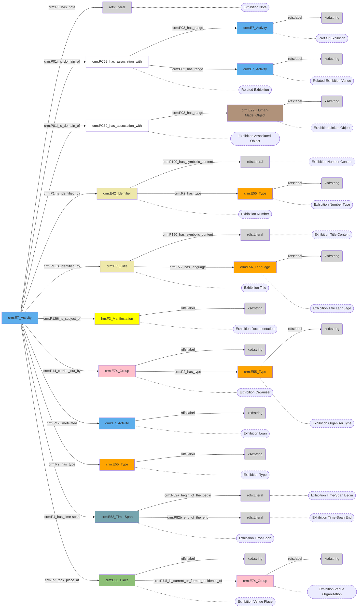

```mermaid
graph LR
00535d95-cb21-11ee-bbb2-960002548b4f["crm:E22_Human-Made_Object"]-->|"rdfs:label"|3e2f9307-cb39-11ee-bd88-960002548b4f(xsd:string)
06fe9bf8-cb29-11ee-aa0b-960002548b4f["crm:E7_Activity"]-->|"rdfs:label"|69771f95-cb29-11ee-a50a-960002548b4f(xsd:string)
1bebb8ee-cb33-11ee-9c67-960002548b4f["crm:E42_Identifier"]-->|"crm:P190_has_symbolic_content"|43d0ddd1-cb33-11ee-bca6-960002548b4f(rdfs:Literal)
20cdc89b-cb2a-11ee-8cab-960002548b4f["crm:E7_Activity"]-->|"rdfs:label"|731b0b40-cb32-11ee-a0ad-960002548b4f(xsd:string)
2fcbd84f-cb28-11ee-b8a4-960002548b4f["crm:E7_Activity"]-->|"rdfs:label"|6ca89778-cb28-11ee-882c-960002548b4f(xsd:string)
30e52da3-cb22-11ee-a5cb-960002548b4f["crm:E55_Type"]-->|"rdfs:label"|4a854190-cb22-11ee-b977-960002548b4f(xsd:string)
5e31804f-cb20-11ee-bc4a-960002548b4f["crm:E53_Place"]-->|"rdfs:label"|9de69c2a-cb20-11ee-8a2b-960002548b4f(xsd:string)
706d2871-cb1f-11ee-be14-960002548b4f["crm:E35_Title"]-->|"crm:P190_has_symbolic_content"|c5202e09-cb1f-11ee-b28f-960002548b4f(rdfs:Literal)
9a844085-cb1e-11ee-9a65-960002548b4f["crm:E7_Activity"]-->|"crm:P3_has_note"|f97b60e6-cb29-11ee-85e3-960002548b4f(rdfs:Literal)
af9064e0-cb21-11ee-92f8-960002548b4f["crm:E55_Type"]-->|"rdfs:label"|cf9dc779-cb38-11ee-a875-960002548b4f(xsd:string)
ce25176f-e046-11ee-be49-960002548b4f["crm:E55_Type"]-->|"rdfs:label"|e53b66d3-e046-11ee-8f73-960002548b4f(xsd:string)
d2ed034e-cb21-11ee-b26f-960002548b4f["crm:E74_Group"]-->|"rdfs:label"|1f617313-cb22-11ee-a619-960002548b4f(xsd:string)
d5597544-cb36-11ee-b7ee-960002548b4f["lrm:F3_Manifestation"]-->|"rdfs:label"|e31ca1de-cb37-11ee-9017-960002548b4f(xsd:string)
d685b642-cb34-11ee-b1d9-960002548b4f["crm:E74_Group"]-->|"rdfs:label"|66843922-cb36-11ee-881f-960002548b4f(xsd:string)
e4805c3e-cb38-11ee-8dea-960002548b4f["crm:E56_Language"]-->|"rdfs:label"|1f3497b0-cb39-11ee-9b07-960002548b4f(xsd:string)
fb049cdc-cb1f-11ee-99a5-960002548b4f["crm:E52_Time-Span"]-->|"crm:P82a_begin_of_the_begin"|17d24b9b-cb20-11ee-b02e-960002548b4f(rdfs:Literal)
fb049cdc-cb1f-11ee-99a5-960002548b4f["crm:E52_Time-Span"]-->|"crm:P82b_end_of_the_end"|44d4775e-cb20-11ee-ae3d-960002548b4f(rdfs:Literal)
1bebb8ee-cb33-11ee-9c67-960002548b4f["crm:E42_Identifier"]-->|"crm:P2_has_type"|ce25176f-e046-11ee-be49-960002548b4f["crm:E55_Type"]
5e31804f-cb20-11ee-bc4a-960002548b4f["crm:E53_Place"]-->|"crm:P74i_is_current_or_former_residence_of"|d685b642-cb34-11ee-b1d9-960002548b4f["crm:E74_Group"]
706d2871-cb1f-11ee-be14-960002548b4f["crm:E35_Title"]-->|"crm:P72_has_language"|e4805c3e-cb38-11ee-8dea-960002548b4f["crm:E56_Language"]
9a844085-cb1e-11ee-9a65-960002548b4f["crm:E7_Activity"]-->|"crm:P01i_is_domain_of"|b7b7c7e2-cb27-11ee-b38b-960002548b4f["crm:PC69_has_association_with"]
9a844085-cb1e-11ee-9a65-960002548b4f["crm:E7_Activity"]-->|"crm:P01i_is_domain_of"|c81fb98a-cb20-11ee-9607-960002548b4f["crm:PC69_has_association_with"]
9a844085-cb1e-11ee-9a65-960002548b4f["crm:E7_Activity"]-->|"crm:P1_is_identified_by"|1bebb8ee-cb33-11ee-9c67-960002548b4f["crm:E42_Identifier"]
9a844085-cb1e-11ee-9a65-960002548b4f["crm:E7_Activity"]-->|"crm:P1_is_identified_by"|706d2871-cb1f-11ee-be14-960002548b4f["crm:E35_Title"]
9a844085-cb1e-11ee-9a65-960002548b4f["crm:E7_Activity"]-->|"crm:P129i_is_subject_of"|d5597544-cb36-11ee-b7ee-960002548b4f["lrm:F3_Manifestation"]
9a844085-cb1e-11ee-9a65-960002548b4f["crm:E7_Activity"]-->|"crm:P14_carried_out_by"|d2ed034e-cb21-11ee-b26f-960002548b4f["crm:E74_Group"]
9a844085-cb1e-11ee-9a65-960002548b4f["crm:E7_Activity"]-->|"crm:P17i_motivated"|20cdc89b-cb2a-11ee-8cab-960002548b4f["crm:E7_Activity"]
9a844085-cb1e-11ee-9a65-960002548b4f["crm:E7_Activity"]-->|"crm:P2_has_type"|af9064e0-cb21-11ee-92f8-960002548b4f["crm:E55_Type"]
9a844085-cb1e-11ee-9a65-960002548b4f["crm:E7_Activity"]-->|"crm:P4_has_time-span"|fb049cdc-cb1f-11ee-99a5-960002548b4f["crm:E52_Time-Span"]
9a844085-cb1e-11ee-9a65-960002548b4f["crm:E7_Activity"]-->|"crm:P7_took_place_at"|5e31804f-cb20-11ee-bc4a-960002548b4f["crm:E53_Place"]
b7b7c7e2-cb27-11ee-b38b-960002548b4f["crm:PC69_has_association_with"]-->|"crm:P02_has_range"|06fe9bf8-cb29-11ee-aa0b-960002548b4f["crm:E7_Activity"]
b7b7c7e2-cb27-11ee-b38b-960002548b4f["crm:PC69_has_association_with"]-->|"crm:P02_has_range"|2fcbd84f-cb28-11ee-b8a4-960002548b4f["crm:E7_Activity"]
c81fb98a-cb20-11ee-9607-960002548b4f["crm:PC69_has_association_with"]-->|"crm:P02_has_range"|00535d95-cb21-11ee-bbb2-960002548b4f["crm:E22_Human-Made_Object"]
d2ed034e-cb21-11ee-b26f-960002548b4f["crm:E74_Group"]-->|"crm:P2_has_type"|30e52da3-cb22-11ee-a5cb-960002548b4f["crm:E55_Type"]
style 43d0ddd1-cb33-11ee-bca6-960002548b4f_s stroke-dasharray: 5
style ce25176f-e046-11ee-be49-960002548b4f_s stroke-dasharray: 5
style d685b642-cb34-11ee-b1d9-960002548b4f_s stroke-dasharray: 5
style c5202e09-cb1f-11ee-b28f-960002548b4f_s stroke-dasharray: 5
style e4805c3e-cb38-11ee-8dea-960002548b4f_s stroke-dasharray: 5
style b7b7c7e2-cb27-11ee-b38b-960002548b4f_s stroke-dasharray: 5
style c81fb98a-cb20-11ee-9607-960002548b4f_s stroke-dasharray: 5
style 1bebb8ee-cb33-11ee-9c67-960002548b4f_s stroke-dasharray: 5
style 706d2871-cb1f-11ee-be14-960002548b4f_s stroke-dasharray: 5
style d5597544-cb36-11ee-b7ee-960002548b4f_s stroke-dasharray: 5
style d2ed034e-cb21-11ee-b26f-960002548b4f_s stroke-dasharray: 5
style 20cdc89b-cb2a-11ee-8cab-960002548b4f_s stroke-dasharray: 5
style af9064e0-cb21-11ee-92f8-960002548b4f_s stroke-dasharray: 5
style f97b60e6-cb29-11ee-85e3-960002548b4f_s stroke-dasharray: 5
style fb049cdc-cb1f-11ee-99a5-960002548b4f_s stroke-dasharray: 5
style 5e31804f-cb20-11ee-bc4a-960002548b4f_s stroke-dasharray: 5
style 06fe9bf8-cb29-11ee-aa0b-960002548b4f_s stroke-dasharray: 5
style 2fcbd84f-cb28-11ee-b8a4-960002548b4f_s stroke-dasharray: 5
style 00535d95-cb21-11ee-bbb2-960002548b4f_s stroke-dasharray: 5
style 30e52da3-cb22-11ee-a5cb-960002548b4f_s stroke-dasharray: 5
style 17d24b9b-cb20-11ee-b02e-960002548b4f_s stroke-dasharray: 5
style 44d4775e-cb20-11ee-ae3d-960002548b4f_s stroke-dasharray: 5
43d0ddd1-cb33-11ee-bca6-960002548b4f["rdfs:Literal"]-.-43d0ddd1-cb33-11ee-bca6-960002548b4f_s(["Exhibition Number Content"])
ce25176f-e046-11ee-be49-960002548b4f["crm:E55_Type"]-.-ce25176f-e046-11ee-be49-960002548b4f_s(["Exhibition Number Type"])
d685b642-cb34-11ee-b1d9-960002548b4f["crm:E74_Group"]-.-d685b642-cb34-11ee-b1d9-960002548b4f_s(["Exhibition Venue Organisation"])
c5202e09-cb1f-11ee-b28f-960002548b4f["rdfs:Literal"]-.-c5202e09-cb1f-11ee-b28f-960002548b4f_s(["Exhibition Title Content"])
e4805c3e-cb38-11ee-8dea-960002548b4f["crm:E56_Language"]-.-e4805c3e-cb38-11ee-8dea-960002548b4f_s(["Exhibition Title Language"])
b7b7c7e2-cb27-11ee-b38b-960002548b4f["crm:PC69_has_association_with"]-.-b7b7c7e2-cb27-11ee-b38b-960002548b4f_s(["Related Exhibition"])
c81fb98a-cb20-11ee-9607-960002548b4f["crm:PC69_has_association_with"]-.-c81fb98a-cb20-11ee-9607-960002548b4f_s(["Exhibition Associated Object"])
1bebb8ee-cb33-11ee-9c67-960002548b4f["crm:E42_Identifier"]-.-1bebb8ee-cb33-11ee-9c67-960002548b4f_s(["Exhibition Number"])
706d2871-cb1f-11ee-be14-960002548b4f["crm:E35_Title"]-.-706d2871-cb1f-11ee-be14-960002548b4f_s(["Exhibition Title"])
d5597544-cb36-11ee-b7ee-960002548b4f["lrm:F3_Manifestation"]-.-d5597544-cb36-11ee-b7ee-960002548b4f_s(["Exhibition Documentation"])
d2ed034e-cb21-11ee-b26f-960002548b4f["crm:E74_Group"]-.-d2ed034e-cb21-11ee-b26f-960002548b4f_s(["Exhibition Organiser"])
20cdc89b-cb2a-11ee-8cab-960002548b4f["crm:E7_Activity"]-.-20cdc89b-cb2a-11ee-8cab-960002548b4f_s(["Exhibition Loan"])
af9064e0-cb21-11ee-92f8-960002548b4f["crm:E55_Type"]-.-af9064e0-cb21-11ee-92f8-960002548b4f_s(["Exhibition Type"])
f97b60e6-cb29-11ee-85e3-960002548b4f["rdfs:Literal"]-.-f97b60e6-cb29-11ee-85e3-960002548b4f_s(["Exhibition Note"])
fb049cdc-cb1f-11ee-99a5-960002548b4f["crm:E52_Time-Span"]-.-fb049cdc-cb1f-11ee-99a5-960002548b4f_s(["Exhibition Time-Span"])
5e31804f-cb20-11ee-bc4a-960002548b4f["crm:E53_Place"]-.-5e31804f-cb20-11ee-bc4a-960002548b4f_s(["Exhibition Venue Place"])
06fe9bf8-cb29-11ee-aa0b-960002548b4f["crm:E7_Activity"]-.-06fe9bf8-cb29-11ee-aa0b-960002548b4f_s(["Part Of Exhibition"])
2fcbd84f-cb28-11ee-b8a4-960002548b4f["crm:E7_Activity"]-.-2fcbd84f-cb28-11ee-b8a4-960002548b4f_s(["Related Exhibition Venue"])
00535d95-cb21-11ee-bbb2-960002548b4f["crm:E22_Human-Made_Object"]-.-00535d95-cb21-11ee-bbb2-960002548b4f_s(["Exhibition Linked Object"])
30e52da3-cb22-11ee-a5cb-960002548b4f["crm:E55_Type"]-.-30e52da3-cb22-11ee-a5cb-960002548b4f_s(["Exhibition Organiser Type"])
17d24b9b-cb20-11ee-b02e-960002548b4f["rdfs:Literal"]-.-17d24b9b-cb20-11ee-b02e-960002548b4f_s(["Exhibition Time-Span Begin"])
44d4775e-cb20-11ee-ae3d-960002548b4f["rdfs:Literal"]-.-44d4775e-cb20-11ee-ae3d-960002548b4f_s(["Exhibition Time-Span End"])
style 00535d95-cb21-11ee-bbb2-960002548b4f fill:#B0927A
style 06fe9bf8-cb29-11ee-aa0b-960002548b4f fill:#5DAEEC
style 17d24b9b-cb20-11ee-b02e-960002548b4f fill:#D3D3D3
style 1bebb8ee-cb33-11ee-9c67-960002548b4f fill:#EEE8AA
style 1f3497b0-cb39-11ee-9b07-960002548b4f fill:#D3D3D3
style 1f617313-cb22-11ee-a619-960002548b4f fill:#D3D3D3
style 20cdc89b-cb2a-11ee-8cab-960002548b4f fill:#5DAEEC
style 2fcbd84f-cb28-11ee-b8a4-960002548b4f fill:#5DAEEC
style 30e52da3-cb22-11ee-a5cb-960002548b4f fill:#ffa500
style 3e2f9307-cb39-11ee-bd88-960002548b4f fill:#D3D3D3
style 43d0ddd1-cb33-11ee-bca6-960002548b4f fill:#D3D3D3
style 44d4775e-cb20-11ee-ae3d-960002548b4f fill:#D3D3D3
style 4a854190-cb22-11ee-b977-960002548b4f fill:#D3D3D3
style 5e31804f-cb20-11ee-bc4a-960002548b4f fill:#8CBF76
style 66843922-cb36-11ee-881f-960002548b4f fill:#D3D3D3
style 69771f95-cb29-11ee-a50a-960002548b4f fill:#D3D3D3
style 6ca89778-cb28-11ee-882c-960002548b4f fill:#D3D3D3
style 706d2871-cb1f-11ee-be14-960002548b4f fill:#EEE8AA
style 731b0b40-cb32-11ee-a0ad-960002548b4f fill:#D3D3D3
style 9a844085-cb1e-11ee-9a65-960002548b4f fill:#5DAEEC
style 9de69c2a-cb20-11ee-8a2b-960002548b4f fill:#D3D3D3
style af9064e0-cb21-11ee-92f8-960002548b4f fill:#ffa500
style b7b7c7e2-cb27-11ee-b38b-960002548b4f fill:#ffffff
style c5202e09-cb1f-11ee-b28f-960002548b4f fill:#D3D3D3
style c81fb98a-cb20-11ee-9607-960002548b4f fill:#ffffff
style ce25176f-e046-11ee-be49-960002548b4f fill:#ffa500
style cf9dc779-cb38-11ee-a875-960002548b4f fill:#D3D3D3
style d2ed034e-cb21-11ee-b26f-960002548b4f fill:#ffc0cb
style d5597544-cb36-11ee-b7ee-960002548b4f fill:#ffff00
style d685b642-cb34-11ee-b1d9-960002548b4f fill:#ffc0cb
style e31ca1de-cb37-11ee-9017-960002548b4f fill:#D3D3D3
style e4805c3e-cb38-11ee-8dea-960002548b4f fill:#ffa500
style e53b66d3-e046-11ee-8f73-960002548b4f fill:#D3D3D3
style f97b60e6-cb29-11ee-85e3-960002548b4f fill:#D3D3D3
style fb049cdc-cb1f-11ee-99a5-960002548b4f fill:#76A5AF
```
